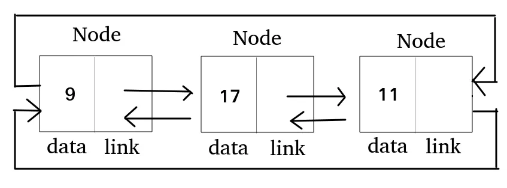
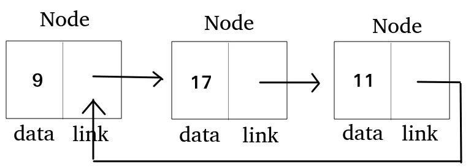

## 리스트

리스트는 내부적으로 노드라는 요소를 통해 데이터를 저장, 각 노드는 데이터와 다음 노드를 가르키는 참조로 구정되어 있어 연속적이지 않은 메모리 공간에 데이터를 효율적을 저장 가능케 함

즉, 노드는 데이터 하나와 다음 노드를 가리키는 연결 정보를 갖고 있는 작은 박스

</br>

> 장점
> 
- 크기의 제약 없이 데이터를 추가, 삭제

</br>
</br>

## 배열 리스트

배열 기반의 동적 자료구조
요소들을 연속된 메모리 공간에 저장하며 배열 크기를 자동으로 확장하면서 데이터를 관리

> 데이터 구조
> 

```tsx
class ArrayList {
  private data: number[] = [];
  private size: number = 0;

  // 리스트가 비었는지 확인 메소드
  isEmpty() { ... }

  // 현재 저장된 요소 개수 반환 메소드
  getSize() { ... }

  // 전체 요소 출력 메소드
  print() { ... }

  // 맨 뒤에 값 추가 메소드
  push(value: number) { ... }

  // 맨 앞에 값 추가 메소드
  unshift(value: number) { ... }

  // 중간 삽입 메소드
  insertAt(index: number, value: number) { ... }

  // 맨 뒤 값 삭제 메소드
  pop() { ... }

  // 맨 앞 값 삭제 메소드
  shift() { ... }

  // 중간 삭제 메소드
  removeAt(index: number) { ... }

  // 인덱스로 값 가져오는 메소드
  get(index: number): number { ... }

  // 특정 값이 있는지 확인 메소드
  contains(value: number): boolean { ... }
}
```

</br>
</br>

> 메소드 구현
> 

```tsx
// isEmpty
isEmpty() {
  return this.size === 0;
}

// getSize
getSize() {
  return this.size;
}

// print
print() {
  if (this.isEmpty()) {
    console.log('[]');
    return;
  }
  console.log(this.data.slice(0, this.size));
}

// push
push(value: number) {
  this.data[this.size] = value;
  this.size++;
}

// unshift
unshift(value: number) {
  for (let i = this.size; i > 0; i--) {
    this.data[i] = this.data[i - 1];
  }
  this.data[0] = value;
  this.size++;
}

// insertAt
insertAt(index: number, value: number) {
  if (index < 0 || index > this.size) {
    console.log('index error!');
    return;
  }

  for (let i = this.size; i > index; i--) {
    this.data[i] = this.data[i - 1];
  }

  this.data[index] = value;
  this.size++;
}

// pop
pop() {
  if (this.isEmpty()) {
    console.log('list is empty!');
    return;
  }
  this.size--;
  this.data.length = this.size; // 마지막 요소 제거
}

// shift
shift() {
  if (this.isEmpty()) {
    console.log('list is empty!');
    return;
  }

  for (let i = 0; i < this.size - 1; i++) {
    this.data[i] = this.data[i + 1];
  }

  this.size--;
  this.data.length = this.size;
}

// removeAt
removeAt(index: number) {
  if (index < 0 || index >= this.size) {
    console.log('index error!');
    return;
  }

  for (let i = index; i < this.size - 1; i++) {
    this.data[i] = this.data[i + 1];
  }

  this.size--;
  this.data.length = this.size;
}

// get
get(index: number): number {
  if (index < 0 || index >= this.size) {
    throw new Error('index error!');
  }
  return this.data[index];
}

// contains
contains(value: number): boolean {
  for (let i = 0; i < this.size; i++) {
    if (this.data[i] === value) return true;
  }
  return false;
}
```

</br>
</br>

## 연결 리스트

연결 리스트는 메모리 상으로 인접하지 않은 데이터들을 연결

다음 노드의 위치를 잃어버린다면, 데이터 손실 발생


</br>

> 데이터 노드 구현
> 

```tsx
class Node {
	item: number;
	next: Node | null = null;
	
	// 값을 초기화해주는 생성자
	constructor(item: number) {
		this.item = item;
	}
}
```

- **`item: number;`**: 노드가 가지고 있는 실제 값 (숫자 하나)
- **`next: Node | null = null;`**: 다음 노드를 가리키는 포인터 (없으면 null)

</br>


> 데이터 노드 구현 예시
> 

```tsx
const node1 = new Node(10); // 10이라는 값을 가진 사람
const node2 = new Node(20); // 20이라는 값을 가진 사람

node1.next = node2; // node1이 node2를 가리킴

node1 → node2 → null
```

</br>

> 연결 리스트 틀
> 

```tsx
class linkedList {
    private head: Node = null;
    private length: number = 0;

		// 연결 리스트를 순회, 노드의 데이터 출력 메소드
    traverse() {
    	...
    }

		// 연결 리스트 맨 끝에, 새로운 노드 추가 메서드
    append(node: Node) {
    	...
    }
	
		// 연결 리스트 중간에, 새로운 노드 추가 메서드
    insertAt(idx: number, node: Node) {
    	...
    }

		// 연결 리스트 중간에, 특정 노드 삭제 메서드
    deleteAt(idx: number) {
    	...
    }
```

- 단방향 연결 리스트 객체는 head와 length를 가짐
- head는 처음 노드, length는 노드의 갯수

</br>

> 메소드 구현
> 

```tsx
// traverse
traverse() {
  let current = this.head;
  let result = "";

  while (current) {
    result += current.item + " -> ";
    current = current.next;
  }

  result += "null";

  console.log(result);
}

// append
append(node: Node) {
  let current = this.head;

  if (!current) {
    this.head = node;
    this.length += 1;

    return;
  }

  while (current.next) {
    current = current.next;
  }

  current.next = node;
  this.length += 1;
}

// insertAt
insertAt(idx: number, node: Node) {
  if (idx > this.length) {
    console.log("error!");
    return;
  }

  if (idx === 1) {
    node.next = this.head;
    this.head = node;
    this.length += 1;

    return;
  }

  let prev = null;
  let current = this.head;
  let currentIdx = 1;

  while (current.next && idx !== currentIdx) {
    prev = current;
    current = current.next;
    currentIdx += 1;
  }

  node.next = current;
  prev.next = node;
  this.length += 1;
}

// deleteAt
deleteAt(idx: number) {
  if (idx > this.length) {
    console.log("error!");
    return;
  }

  if (idx === 1) {
    this.head = this.head.next;
    this.length -= 1;

    return;
  }

  let prev = null;
  let current = this.head;
  let currentIdx = 1;

  while (current.next && idx !== currentIdx) {
    prev = current;
    current = current.next;
    currentIdx += 1;
  }

  prev.next = current.next;
  this.length -= 1;
}
```

</br>
</br>


## 이중 연결 리스트

메모리 상으로 인접하지 않은 데이터들을 연결하여 공간 효율성이 뛰어남



</br>

> 단방향 연결 리스트와의 차이점
> 
- 이전 노드 참조 가능
- 정, 역방향으로 모든 노드 순회 가능(prev 이용)
- 다음 노드의 위치를 잃어버려도, 이전 노드 기억시 데이터 손실 방지 가능

</br>

> 데이터 노드 구현
> 

```tsx
class Node {
    value: number;
    prev: Node | null = null;
    next: Node | null = null;

    constructor(value: number) {
      this.value = value;
    }
  }
```

- prev, next 프로퍼티가 존재
- value 프로퍼티로 데이터를 받음

</br>


> 연결 리스트 틀
> 

```tsx
class doublyLinkedList {
    private head: Node = null;
    private tail: Node = null;
    private size: number = 0;

		// 연결 리스트가 비어있는지 체크 메소드
    isEmpty() { ... }

		// 정방향 순회 메소드
    traverse() { ... }

		// 역방향 순회 메소드
    traverseBack() { ... }

		// 맨 앞 노드 추가 메소드
    insertFront(node: Node) { ... }

		// 맨 뒤 노드 추가 메소드
    insertBack(node: Node) { ... }

		// 인덱스 위치에 노드 추가 메소드
    insertAt(idx: number, node: Node) { ... }

		// 맨 앞 노드 삭제 메소드
    removeFront() { ... }

		// 맨 뒤 노드 삭제 메소드
    removeBack() { ... }

		// 인덱스 위치 노드 삭제 메소드
    removeAt(idx: number) { ... }
}
```

- head: 첫 노드를 참조
- tail: 마지막 노드를 참조
- size: 노드의 갯수

</br>

> 메소드 구현
> 

```tsx
// isEmpty
isEmpty() {
  return this.size === 0;
}

// traverse
traverse() {
    if (this.isEmpty()) {
        console.log("null");
        return;
    }

    let current = this.head;
    let result = current.value + "";

    while (current.next) {
        current = current.next;
        result += " <-> " + current.value;
    }

    result += " -> null";
    console.log(result);
}

// traverseBack
traverseBack() {
    if (this.isEmpty()) {
        console.log("null");
        return;
    }

    let current = this.tail;
    let result = current.value + "";

    while (current.prev) {
        current = current.prev;
        result += " <-> " + current.value;
    }

    result += " -> null";
    console.log(result);
}

// insertFront
insertFront(node: Node) {
    if (this.isEmpty()) {
        this.head = node;
        this.tail = node;
    } else {
        const secondNode = this.head;

        node.next = secondNode;
        secondNode.prev = node;

		this.head = node;
	}

	this.size++;
}

// insertBack
insertBack(node: Node) {
    if (this.isEmpty()) {
        this.head = node;
        this.tail = node;
    } else {
        const tailPrevNode = this.tail;

        tailPrevNode.next = node;
        node.prev = tailPrevNode;

        this.tail = node;
    }

	this.size++;
}

// insertAt
insertAt(idx: number, node: Node) {
    if (idx < 0 || idx > this.size) {
        console.log("index error!");
        return;
    }

    if (idx === 0) {
        this.insertFront(node);
        return;
    }

    if (idx === this.size) {
        this.insertBack(node);
        return;
    }

    // 중간노드 삽입
    let current = this.head;
    let currentIdx = 0;

    while (idx !== currentIdx) {
        current = current.next;
        currentIdx++;
    }

    node.next = current;
    node.prev = current.prev;
    current.prev.next = node;
    current.prev = node;

    this.size++;
}

// removeFront
removeFront() {
    if (this.isEmpty()) {
        console.log("list is empty!");
        return;
    }

    if (!this.head.next) {
        this.head = null;
        this.tail = null;
        this.size = 0;
    	return;
    }

    const secondNode = this.head.next;

    this.head = secondNode;
    secondNode.prev = null;

    this.size--;
}

// removeBack
removeBack() {
    if (this.isEmpty()) {
        console.log("list is empty!");
        return;
    }

    if (!this.tail.prev) {
        this.head = null;
        this.tail = null;
        this.size = 0;
	    return;
    }

    const tailPrevNode = this.tail.prev;

    this.tail = tailPrevNode;
    tailPrevNode.next = null;

    this.size--;
}

// removeAt
removeAt(idx: number) {
    if (idx < 0 || idx > this.size - 1) {
	    console.log("index error!");
    	return;
	}

    if (idx === 0) {
        this.removeFront();
        return;
    }

    if (idx === this.size - 1) {
        this.removeBack();
        return;
    }

    // 중간노드 제거
    let current = this.head;
    let currentIdx = 0;

    while (idx !== currentIdx) {
        current = current.next;
        currentIdx++;
    }

    current.prev.next = current.next;
    current.next.prev = current.prev;
    current.prev = null;
    current.next = null;

    this.size--;
}

```

</br>
</br>

## 원형 연결 리스트

마지막 노드의 next가 첫 번째 노드를 가리키는 구조

순환 형태로 연결, 끝이 없는 듯한 리스트를 만듬



</br>

> 단방향 연결 리스트와의 차이점
> 
- 끝에 도달해도 다시 처음으로 돌아갈 수 있음
- 순환 구조 덕분에 무한 루프형 탐색 구조 만들기 용이
- 주로 원형 큐ㅡ 버퍼 구조등에 활용

</br>

> 데이터 노드 구현
> 

```tsx
class Node {
  value: number;
  next: Node | null = null;

  constructor(value: number) {
    this.value = value;
  }
}
```

- value 프로퍼티로 값을 저장
- next는 다음 노드를 참조
    - 마지막 노드의 next는 다시 첫 번째 노드를 가리킴

> 연결 리스트 틀
> 

```tsx
class CircularLinkedList {
  private head: Node | null = null;
  private tail: Node | null = null;
  private size: number = 0;

  // 리스트가 비어있는지 확인
  isEmpty() { ... }

  // 전체 순회 (head → tail → 다시 head로)
  traverse(count: number) { ... }

  // 맨 앞 노드 추가
  insertFront(node: Node) { ... }

  // 맨 뒤 노드 추가
  insertBack(node: Node) { ... }

  // 맨 앞 노드 삭제
  removeFront() { ... }

  // 맨 뒤 노드 삭제
  removeBack() { ... }
}
```

- head: 첫 노드 참조
- tail: 마지막 노드 참조(tail.next는 항상 head)
- size: 노드 개수

</br>

> 메소드 구현
> 

```tsx
// isEmpty
isEmpty() {
  return this.size === 0;
}

// traverse
traverse(count: number = this.size) {
  if (this.isEmpty()) {
    console.log("null");
    return;
  }

  let current = this.head;
  let result = "";

  for (let i = 0; i < count; i++) {
    result += current.value + " -> ";
    current = current.next;
  }

  result += "(loop)";
  console.log(result);
}

// insertFront
insertFront(node: Node) {
  if (this.isEmpty()) {
    node.next = node; // 자기 자신을 가리킴
    this.head = node;
    this.tail = node;
  } else {
    node.next = this.head;
    this.tail.next = node;
    this.head = node;
  }

  this.size++;
}

// insertBack
insertBack(node: Node) {
  if (this.isEmpty()) {
    node.next = node;
    this.head = node;
    this.tail = node;
  } else {
    node.next = this.head;
    this.tail.next = node;
    this.tail = node;
  }

  this.size++;
}

// removeFront
removeFront() {
  if (this.isEmpty()) {
    console.log("list is empty!");
    return;
  }

  if (this.size === 1) {
    this.head = null;
    this.tail = null;
    this.size = 0;
    return;
  }

  this.head = this.head.next;
  this.tail.next = this.head;

  this.size--;
}

// removeBack
removeBack() {
  if (this.isEmpty()) {
    console.log("list is empty!");
    return;
  }

  if (this.size === 1) {
    this.head = null;
    this.tail = null;
    this.size = 0;
    return;
  }

  let current = this.head;

  // tail 앞 노드를 찾아야 함
  while (current.next !== this.tail) {
    current = current.next;
  }

  current.next = this.head;
  this.tail = current;

  this.size--;
}
```

</br>