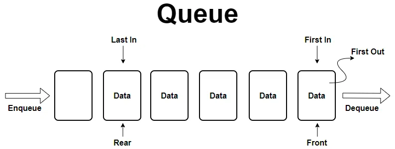
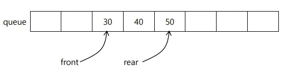
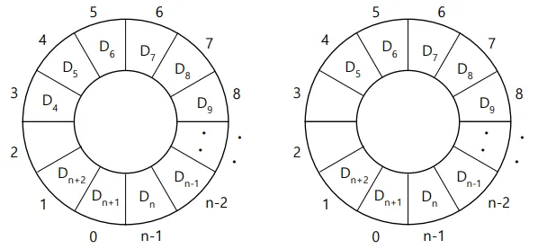

## 큐 - Queue

큐(Queue)는 선형 자료구조로, 데이터를 저장하고 검색하는 데 사용되는 중요한 자료구조입니다.

- **선입선출 (FIFO, First-In, First-Out):** 먼저 줄을 선(enqueue) 데이터가 먼저 처리(dequeue)되는 원칙입니다.

- **Elements:** 큐에 저장되는 실제 데이터 항목들로, 큐에 추가되거나 제거됩니다.
- **Front:** 큐의 시작 지점을 나타내는 포인터입니다.
- **Rear:** 큐의 끝 지점을 가리키는 포인터입니다.

 

> **큐는 왜 사용하는가?**
> 
- **너비 우선 탐색 (BFS, Breadth-First Search):** 그래프나 트리에서 시작 정점과 가까운 정점부터 순서대로 탐색할 때 사용됩니다. 방문할 정점을 큐에 넣고, 하나씩 꺼내면서 인접한 정점을 다시 큐에 넣는 방식으로 동작합니다.
- **버퍼링 (Buffering):** 유튜브 동영상을 스트리밍할 때, 네트워크로부터 받아온 데이터가 큐에 임시 저장되었다가 순서대로 플레이어에 전달됩니다. 이는 네트워크 속도 변화에 대응하여 부드러운 재생을 가능하게 합니다.
- **작업 스케줄링:** 운영체제에서 여러 프로세스들이 CPU를 사용하기 위해 대기할 때 큐를 사용하여 순서를 관리합니다. (e.g., Round-Robin 스케줄링

 

> **큐의 기본 동작**
> 
- **Enqueue:** 큐의 리어에 데이터를 추가합니다. 새로운 데이터가 큐의 가장 뒤에 추가됩니다.
- **Dequeue:** 큐의 프런트에서 데이터를 제거하고 반환합니다. 가장 먼저 추가된 데이터가 가장 먼저 제거됩니다.
- **Peek:** 큐의 프런트에서 데이터를 확인하지만 제거하지 않습니다.

 
 

### 배열 기반 큐 - Array-based-Queue

배열을 사용하여 큐(Queue) 자료구조를 구현한 형태입니다.

가장 기본적인 선형 큐와 그 단점을 보완한 원형 큐 방식으로 나눌 수 있습니다.

 
 

### 선형 큐 - Linear Queue

배열을 사용하여 큐를 구현한 형태입니다.

front는 큐의 시작을, rear는 큐의 끝을 가리키는 인덱스입니다.

하지만 데이터를 dequeue 할 때마다 모든 요소를 앞으로 한 칸씩 이동시켜야 하는 비효율이 발생할 수 있습니다.

 

> 단점
> 

dequeue 연산 시, 배열의 앞부분에 빈 공간이 생겨 메모리 낭비가 발생하고, 이를 해결하기 위해 데이터를 이동시키는 작업은 O(n)의 시간 복잡도를 가집니다.

 
 

### 연결 리스트 기반 큐 - Linked List-based Queue

연결 리스트를 사용하여 큐를 구현합니다.

리스트의 head를 큐의 front로, tail을 큐의 rear로 사용하여 데이터의 추가와 삭제를 효율적으로 관리합니다.

 

> 장점
> 

동적으로 크기가 조절되므로 큐의 크기 제한이 없습니다.

euqueue와 dequeue 모두 O(1)의 시간 복잡도를 가집니다.

 

> 단점
> 

배열 기반 구현보다 메모리 사용량이 많습니다.

 
 

### 원형 큐 - Circular Queue

선형 큐의 단점을 보완하기 위해 고안된 자료구조입니다.

배열의 처음과 끝이 연결되어 있다고 가정하여, rear가 배열의 끝에 도달하면 다시 배열의 처음(인덱스 0)으로 돌아옵니다.

이를 통해 dequeue로 인해 발생하는 빈 공간을 재사용할 수 있습니다.

 

> 장점
> 

배열의 공간을 효율적으로 사용할 수 있으며, enqueue와 dequeue 연산 모두 O(1)의 시간 복잡도를 가집니다.

 

> 구현
> 

front와 rear 포인터 외에, 큐가 가득 찼는지 비었는지를 구분하기 위한 추가적인 변수나 로직이 필요합니다.