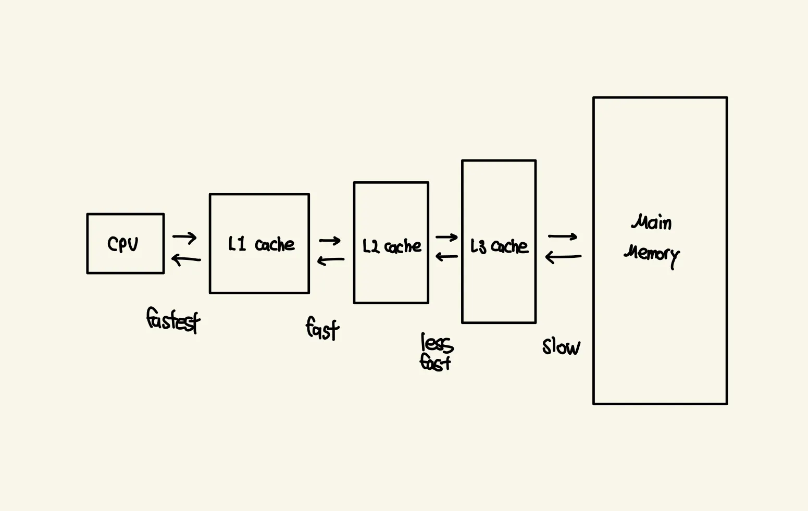
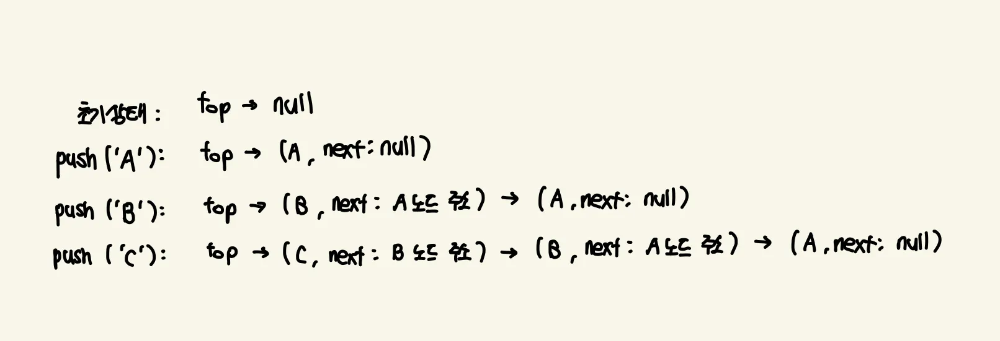

## 스택 - Stack

스택은 LIFO(Last-In, First-Out), 즉 마지막에 들어온 데이터가 가장 먼저 나가는 후입선출 원칙을 따르는 선형 자료구조입니다.

스택은 단순히 데이터를 쌓아 올리는 구조가 아니라, 데이터를 넣고 빼는 방식에 특별한 규칙, 즉 제약이 있는 자료구조입니다. 
이러한 제약 때문에 스택이 다른 자료구조(큐, 배열)와 구별되는 고유한 특징을 갖게 됩니다.

<br/>

> **후입 선출과 TOP**
> 

스택에서의 제약은 바로 “**데이터의 입출력이 오직 한 쪽 끝에서만 이루어져야 한다”**는 제약이 있습니다.
이 한쪽 끝을 TOP이라고 부릅니다.

- **후입 선출 (LIFO, Last-In, First-Out):** 이 제약 때문에 가장 마지막에 들어온(Push) 데이터가 항상 TOP에 위치하게 되고, 따라서 가장 먼저 나갈(Pop) 수밖에 없습니다.

<br/>

> **예시를 통해 알아보자**
> 
1. **데이터 1를 Push합니다.** 1는 스택의 바닥에 위치합니다. (TOP은 1를 가리킵니다)
2. **데이터 2를 Push합니다.** 2는 1 위에 쌓입니다. (TOP은 2를 가리킵니다)
3. **데이터 3을 Push합니다.** 3는 2 위에 쌓입니다. (TOP은 3을 가리킵니다)

현재 스택은 아래에서부터 1, 2, 3 순서로 쌓여있고, TOP은 3를 가리키고 있죠.

이러한 스택에서의 제약 때문에 TOP(해당 예시에서는 3을 가리킴)에서만 데이터를 뺼 수 있습니다.
따라서 가장 위에 있는 3이 먼저 POP됩니다.

<br/>

**LIFO 말고 FILO 라고도 하는데 뭐가 다른거야?**

스택은 FILO(First-In, Last-Out), 즉 “가장 먼저 들어온 것이, 가장 나중에 나간다”라고도 합니다.

두 용어는 완벽히 같은 원리를 설명합니다

<br/>

> **관점의 차이**
> 
- **LIFO (Last-In, First-Out):** "가장 마지막에 들어온 것이, 가장 먼저 나간다."
    - 이 표현은 데이터를 꺼내는 시점에 초점을 맞춥니다. 
    즉, "지금 당장 어떤 데이터를 처리할 수 있는가?"라는 질문에 "가장 최근에 넣은 것"이라고 답하는 관점입니다. 
    스택의 `pop()`이나 `peek()` 연산처럼, 실제 작업이 이루어지는 스택의 꼭대기(Top)에서 일어나는 일을 더 직관적으로 설명합니다.

- **FILO (First-In, Last-Out):** "가장 먼저 들어온 것이, 가장 나중에 나간다."
    - 이 표현은 데이터가 들어간 순서에 초점을 맞춥니다. 
    "가장 처음에 넣었던 데이터의 운명은 어떻게 되는가?"라는 질문에 "맨 마지막에 처리된다"라고 답하는 관점입니다. 
    이는 스택의 바닥(Bottom)에 있는 데이터의 운명을 설명하는 것으로, 당장의 작업보다는 데이터의 전체적인 생명 주기를 설명하는 느낌이 강합니다.

**프로그래밍에서는 지금 당장 처리할 데이터, 즉 스택의 Top에 있는 데이터에 관심이 있는 경우가 대부분이므로 LIFO의 관점이 더 실용적이고 직관적입니다.**


<br/>
<br/>

> **스택이 다른 자료구조와 구별되는 고유한 특징들**
> 
- **LIFO 원칙 준수**
    - 스택에 아무리 많은 데이터가 쌓여 있어도, Pop 연산은 항상 가장 마자막에 들어온 데이터를 제거합니다.
    다른 자료구조는 이런 강제적인 순서를 따르지 않습니다.
- **데이터 접근의 제한성**
    - 오직 TOP에 있는 데이터에만 직접 접근할 수 있습니다.
    스택 중간에 있는 데이터를 확인하거나 수정하려면, 그 위에 있는 모든 데이터를 Pop 해야만 합니다.
- **고유한 연산 이름과 의미**
    - 스택은 데이터를 넣는 것을 Push, 데이터를 빼는 것을 Pop이라고 부릅니다.
    또한 TOP의 데이터를 확인하는 Peek, 스택이 비어있는지 확인하는 isEmpty, 스택이 가득 찼는지 확인하는 isFull 등의 특정 연산을 가집니다.

<br/>

> **스택은 왜 사용하는가?**
> 

**되돌아가기 특성 때문에 스택은 다음과 같은 작업에 매우 유용합니다.**

- **함수 호출 스택 (Call Stack):** 프로그램에서 함수가 호출될 때마다 해당 함수의 정보(매개변수, 복귀 주소 등)가 스택에 쌓입니다. 함수 실행이 끝나면 스택에서 빠져나오며(pop) 이전 함수로 돌아갑니다.

함수 호출이 많아지면 스택이 가득 차 스택 오버플로우가 발생하게됩니다.

- **실행 취소 :** 문서 편집기에서 'Ctrl+Z'를 누를 때, 여러분이 했던 작업들이 스택에 저장되어 있다가 가장 마지막 작업부터 하나씩 pop 되어 취소되는 원리입니다.
- **웹 브라우저 뒤로 가기:** 방문한 페이지 주소가 스택에 push 됩니다. '뒤로 가기' 버튼은 스택에서 pop 하여 이전 페이지를 보여주는 것입니다.
- **수식 계산, 괄호 검사:** `(3 + 5) * 2` 와 같은 중위 표기법을 컴퓨터가 계산하기 쉬운 후위 표기법으로 바꿀 때나, `({[]})` 처럼 괄호의 짝이 맞는지 검사할 때 스택이 결정적인 역할을 합니다.

<br/>
<br/>

### 배열 기반 스택 - Array-based Stack

배열 기반 스택은 스택의 개념(LIFO)을 구현하기 위해 내부적으로 배열을 사용하여 메모리에 데이터가 연속적으로 저장되는 자료구조입니다.

가장 간단하고 직관적인 스택 구현 중 하나로 스택의 모든 데이터는 배열에 저장되며, 배열의 한 쪽 끝(보통 마지막 인덱스)을 스택의 TOP으로 활용합니다.

배열을 사용해서 스택을 구현할 때, 이 배열의 어느 쪽 끝을 스택의 TOP으로 삼을지 개발자가 정할 수 있습니다.

하지만 일반적으로 가장 효율적이고 직관적인 방법은 배열의 마지막 인덱스를 스택의 TOP으로 사용하는 것입니다.

<br/>

> **왜 배열의 마지막 인덱스를 TOP으로 쓸까?**
> 
- **효율성:** 만약 배열의 맨 앞(인덱스 0)을 TOP으로 사용한다면, 요소를 추가하거나 제거할 때마다 나머지 모든 요소들의 인덱스를 한 칸씩 밀거나 당겨야한다. 따라서 비효율적이다.
- **직관성:** 배열의 끝에 데이터를 쌓아 올린다는 개념이 스택의 쌓는 이미지와 잘 맞아떨어집니다.

<br/>

> **세부 연산**
> 
- **`push()`:** 스택의 가장 위에 새로운 데이터를 쌓는 연산입니다. 
배열 기반 스택에서는 내부적으로 배열의 **`push()`** 메서드를 호출해서 배열의 맨 끝에 새 요소를 추가합니다.
    - 일반적인 경우 배열을 선언할때 내부적으로 미리 충분한 공간을 확보해 두기 때문에, 새 요소를 추가하는데 드는 시간은 거의 일정합니다. 그렇기에 데이터의 양이 늘어나도 연산 시간이 거의 변하지 않기 때문에 O(1) 연산입니다.
- **`pop()`:** 스택의 가장 위에 있는 데이터를 꺼내고 스택에서 제거하는 연산입니다.
배열 기반 스택에서는 내부적으로 배열의 **`pop()`** 메서드를 호출해서 배열의 맨 끝 요소를 제거합니다.
    - 배열의 크기와 상관없이 맨 끝 요소의 데이터만 없애면 되기 때문에 데이터의 개수와는 상관없이 일정한 시간이 걸립니다. 동일하게 O(1) 연산입니다.
- **`peek()`:** 스택의 가장 위에 있는 데이터를 확인만 하고 제거하지는 않는 연산입니다.
    - **`peek()`** 연산도 **`pop()`** 연산과 마찬가지로 마지막 요소를 인덱스의 크기 상관없이 즉시 접근할 수 있습니다. 동일하게 O(1) 연산입니다.

<br/>


**배열 기반 push() 연산의 O(n) 비용 발생 과정**

배열을 생성할 때, 시스템은 미리 일정량의 메모리 공간을 할당합니다.
이 할당된 공간을 배열의 용량이라고 하고 push() 연산으로 데이터를 추가할때, 이 용량 안에서 데이터가 순차적으로 채워집니다.

<br/>

> **배열의 용량이 꽉 찼을 때의 예시**
> 

```jsx
[A, B, C, D]
```

크기가 4일 배열이 있다고 가정하겠습니다.

해당 배열에서 새로운 데이터 E를 넣고 싶지만 배열이 꽉 차 데이터를 넣을 수가 없습니다.

```jsx
[_, _, _, _, _, _, _, _]
```

이때, 시스템은 새로운 더 큰 배열을 할당 합니다.
현재 용량의 2배 혹은 1.5배 등 정해진 비율로 새로운 메모리 공간을 할당합니다.

```jsx
[A, B, C, D, E, _, _, _]
```

그 다음 기존 배열에 있던 모든 데이터를 새로 할당된 큰 배열로 하나씩 복사한 후 새로운 데이터 E를 추가합니다.

이처럼 기존 데이터를 모두 복사하는 과정 때문에 데이터의 개수(n)에 비례하는 시간이 걸리게 됩니다.
→ **O(n) 비용**이 발생

<br/>


> **메모리 관점**
> 

배열을 사용하여 스택을 구현하기 때문에 데이터들이 물리적으로 연속된 메모리 공간에 저장됩니다.

이는 CPU 캐시 효율성(Cache Locality)에 유리하여 접근 속도가 매우 빠를 수 있습니다.

<br/>

**배열 기반 스택과 캐시 효율성**

> CPU 캐시
> 

CPU 캐시는 컴퓨터 CPU 바로 옆에 있는 작고 매우 빠른 기억 장치를 말합니다.

CPU 캐시는 자주 사용될 것 같은 데이터를 미리 메인 메모리(RAM)에서 복사해서 보관해둬 CPU가 메인 메모리(RAM)까지 멀리가지 않고도 자주 쓰는 데이터를 빠르게 가져올 수 있도록 돕는 역할을 합니다.

<br/>

> **캐시 효율성이란?**
> 

캐시 효율성은 필요한 데이터가 CPU 캐시에 얼마나 잘 올라와서 사용될 수 있는지를 나타내는 척도입니다. 캐시 효율성이 높다는 것은 가까운 캐시에 있는 데이터를 바로 가져다 쓸 수 있어 전반적인 데이터 접근 속도가 매우 빨라진다는 것을 의미합니다.



> **배열 기반 스택**
> 

배열 기반 스택은 데이터들을 물리적으로 연속된 메모리 공간에 저장합니다.

CPU가 스택의 한 요소를 읽기 위해 메인 메모리에서 데이터를 가져올 때, 요소 하나만 가져오는 것이 아니라 주변의 연속된 메모리 블록 전체를 캐시에 함께 올려놓습니다.

덕분에, 스택의 push, pop, peek 연산처럼 연속적으로 인접한 데이터에 접근할 때, CPU는 이미 캐시에 올라와 있는 데이터를 바로 사용하여 전반적인 데이터 접근 속도를 매우 빠르게 만듭니다.


<br/>

> **장점**
> 
- **구현의 용이성:** 매우 직관적이고 코드가 간결합니다.
- **메모리 효율성:** 포인터 같은 부가 데이터가 없어 메모리 사용량이 적습니다.
- **접근 속도:** 캐시 효율로 인해 일반적으로 빠릅니다.

<br/>

> **단점**
> 
- **크기 재할당 비용:** 동적 배열이라도 크기 재할당 시 성능 저하가 발생할 수 있습니다.
- **스택 오버플로우(Stack overflow):** C++, Java 등에서 고정 크기 배열로 만들 경우, 크기를 초과하면 예외가 발생합니다.

<br/>
<br/>

### 연결 리스트 기반 스택 - Linked List-based Stack

연결 리스트를 사용하여 스택을 구현합니다.

각 데이터가 값(**`value`**)과 다음 노드를 가리키는 포인터(**`next`**)를 가진 노드(**`Node`**) 객체로 존재합니다.



스택의 **`top`**은 스택의 가장 위에 있는 노드를 가리키는 포인터로 항상 이 **`top`**이 가리키는 노드가 스택의 입구이자 출구입니다.

<br/>

> **세부 연산**
> 
- **`push(item)`:** 스택의 맨 위에 새로운 데이터를 추가하는 연산입니다. 연결 리스트에서는 항상 top이 가리키는 노드 바로 위에 새 노드를 삽입합니다.
- **`pop()` :** 스택의 맨 위에 있는 데이터를 제거하고 그 값을 반환하는 연산입니다. 연결 리스트에서는 top이 가리키는 노드를 제거합니다.
- **`peek() 또는 top()`:** 스택의 맨 위에 있는 데이터를 제거하지 않고 확인하는 연산입니다. 연결 리스트에서는 top이 가리키는 노드의 데이터를 단순히 읽어옵니다.
- **`isEmpty()`:** 스택이 비어 있는지를 확인하는 연산입니다. 연결 리스트에서는 top이 null인지 확인하여 스택의 공백 여부를 판단합니다.
- **`size()`:** 스택에 현재 들어 있는 데이터(노드)의 개수를 반환하는 연산입니다. 연결 리스트에서는 push/pop이 일어날 때마다 값을 증가/감소시켜 추적합니다.

<br/>

> **메모리 관점**
> 

데이터들이 메모리 여러 곳에 흩어져 있고, 포인터를 통해 논리적으로 연결됩니다. 

데이터 외에 **`next`** 포인터를 위한 추가 메모리 공간이 필요합니다.

<br/>

> **장점**
> 
- **동적 크기:** 메모리가 허용하는 한 계속해서 데이터를 추가할 수 있기에 스택 오버플로우가 없습니다.
- **일관된 성능:** 데이터 추가/삭제 시 크기 재할당 같은 예외적인 성능 저하 없이 항상 O(1)을 보장합니다.

<br/>

> **단점**
> 
- **메모리 오버헤드:** 모든 요소가 **`value`** 외에 **`next`** 포인터를 저장해야 하므로 배열보다 메모리를 더 사용합니다.
- **캐시 비효율:** 데이터가 메모리에 흩어져 있어 캐시 효율이 배열보다 떨어질 수 있습니다.