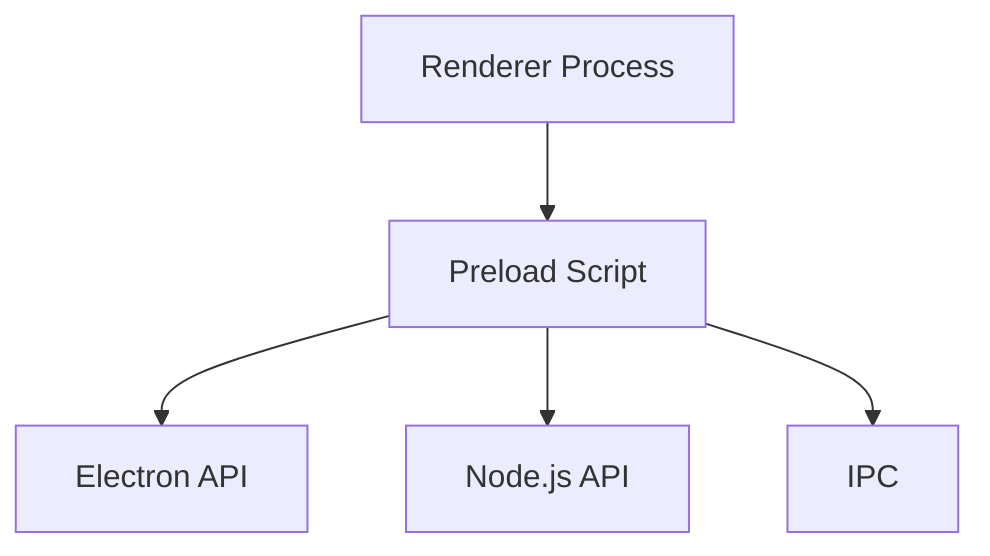
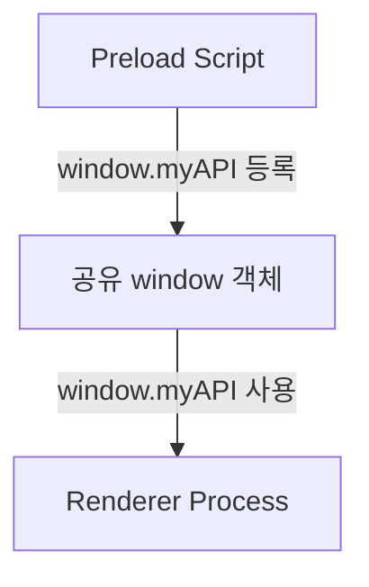
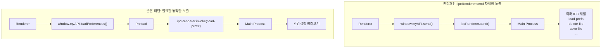

### Context Isolation이란?

Context Isolation은 Electron에서 Preload Script와 Electron 내부 로직이 로드된 웹사이트와 서로 다른 JavaScript 실행 컨텍스트에서 동작하도록 만드는 기능임

이 기능의 가장 중요한 목적은 보안으로 웹사이트가 Electron 내부 기능이나 Preload Script가 가지고 있는 강력한 API에 직접 접근하지 못하도록 막음

여기서 중요한 것은 `window` 객체임

<br/>

Context Isolation이 활성화되어 있으면 Preload Script가 바라보는 `window` 와 웹사이트의 JavaScript가 바라보는 `window` 는 논리적으로 서로 다른 객체임

Electron 12부터 Context Isolation이 기본 활성화되어 있으며, 모든 애플리케이션에 권장되는 보안 설정임

<br/>
<br/>

### Context Isolation이 필요한 이유

Electron의 Preload Script는 일반 웹 페이지보다 더 많은 권한을 가질 수 있음

Preload에서는 Electron API를 사용할 수 있으므로 다음과 같은 작업을 연결할 수 있음



<br/>

하지만 악성 웹 콘텐츠가 Preload에서 사용 가능한 강력한 API까지 마음대로 접근할 수 있다면 보안 문제가 발생함

그래서 Electron은 서로 다른 실행 컨텍스트를 사용하도록 함

<br/>

기존 Electron에서는 Context Isolation이 비활성화되어 있다면 Preload Script와 Renderer가 같은 `window` 객체를 공유했음

따라서 Preload에서 API를 직접 추가할 수 있었음

```tsx
window.myAPI = {
	doAThing: () => {}
}
```

<br/>

Renderer에서는 그대로 호출할 수 있었음

```tsx
window.myAPI.doAThing()
```

<br/>

그림으로 보면 다음과 같음



하지만 문제는 Preload와 웹 페이지가 동일한 JavaScript 전역 공간에 있다는 것임

즉 웹 페이지가 Preload가 노출한 객체를 직접 조작하거나 의도하지 않은 방식으로 접근할 가능성이 생김

<br/>

현재는 Context Isolation이 켜져있어 Preload에서 단순하게 작성하는 방식으로 API를 웹 페이지에 노출할 수 없음

```tsx
window.myAPI = {
	doAThing: () => {}
}
```

<br/>

대신 Electron의 `contextBridge` 를 사용해야함

```tsx
const { contextBridge } = require('electron')

contextBridge.exposeInMainWorld('myAPI', {
	doAThing: () => {}
})
```

<br/>

Renderer에서는 다음과 같이 사용함

```tsx
window.myAPI.doAThing()
```

즉 `contextBridge` 는 격리를 없애는 것이 아니라, 격리를 유지하면서 필요한 API만 선택적으로 전달하는 통로임

<br/>
<br/>

### contextBridge가 중요한 이유

Context Isolation을 켜고 `contextBridge` 를 사용하면 무조건 안전하다 생각할 수 있음

중요한건 어떤 API를 노출하느냐임

<br/>

다음 패턴이 대표적인 안티패턴임

→ Renderer에게 IPC 도구 자체를 줌

```tsx
contextBridge.exposeInMainWorld('myAPI', {
	send: ipcRenderer.send
})

// Renderer는 다음과 같이 사용
window.myAPI.send('어떤-채널', 어떤-데이터);
```

이렇게 하면 Renderer가 `ipcRenderer.send` 를 사실상 그대로 사용할 수 있음

따라서 단순히 ipcRenderer와 관련된 강력한 API 자체를 전부 노출하는 것은 피해야 함

<br/>

Electron 공식 문서에서는 IPC 메시지마다 별도의 명시적인 API를 만드는 것을 권장함

→ Renderer에게 특정 작업을 수행하는 함수만 줌

```tsx
contextBrdige.exposeInMainWorld('myAPI', {
	loadPreferences: () => ipcRenderer.invoke('load-prefs')
})

// Renderer는 다음과 같이 사용
window.myAPI.loadPreferences()
```

핵심은 권한을 그대로 전달하지 않고, 필요한 동작만 함수 형태로 감싸서 공개하는 것임

<br/>

둘의 차이를 그림으로 보면 다음과 같음



<br/>