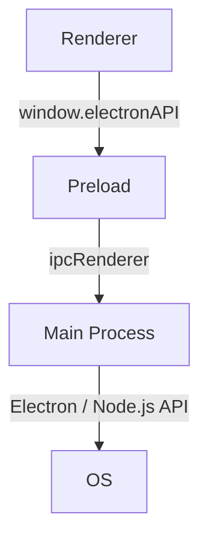
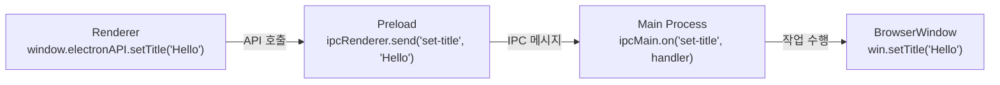
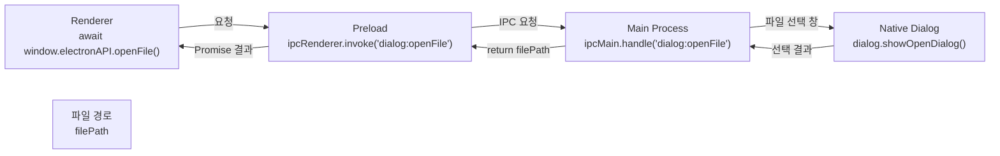
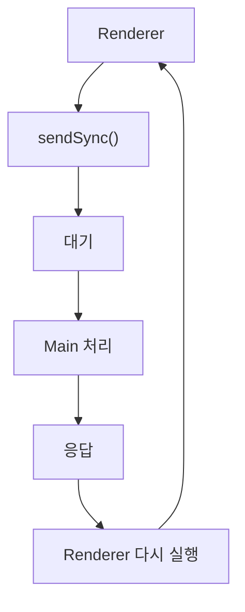
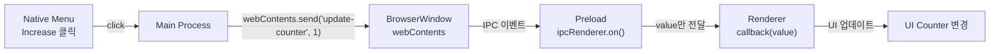

### IPC란?

Inter-Process Communication은 프로세스 간 통신을 말함

Electron에서는 Main Process와 Renderer Process가 서로 다른 책임을 가지고 있기 때문에, 이 둘 사이에서 데이터를 주고받아야 하는 경우가 많음

- Renderer의 UI에서 Native API 호출
- Renderer에서 파일 열기 요청
- Main Process의 메뉴에서 Renderer UI 변경
- Main Process에서 Rednerer로 이벤트 전달

이때 사용하는 핵심 수단이 IPC임

<br/>

Electron에서는 `ipcMain` 과 `ipcRenderer` 를 이용하여 개발자가 정의한 IPC channel을  통해 메시지를 주고받음

Channel 이름은 자유롭게 정의할 수 있고 양방향 통신에 사용할 수 있음

<br/>
<br/>

### IPC Channel

Electron의 IPC는 channel이라는 이름을 기준으로 동작함

```tsx
// 요청
ipcRenderer.send('set-title', title)

// 응답
ipcMain.on('set-title', handle)
```

Channel 이름에는 별도의 특별한 규칙은 없음

공식 문서의 `dialog:openFile` 처럼 `:` 를 사용해서 namespace처럼 구분하는 것도 가능함

→ 특별한 Electron 문법인 것은 아니며 가독성을 위한 이름 규칙임

<br/>
<br/>

### Context Isolation과 IPC

Renderer는 기본적으로 Node.js나 Electron의 모든 API에 직접 접근할 수 없음

따라서 일반적으로 다음 구조를 사용함



`contextBridge` 는 Renderer에 IPC 기능을 제한적으로 공개하는 역할을 함

<br/>
<br/>

### Renderer → Main 단방향 통신 패턴

다음 패턴의 전체적인 흐름은 다음과 같음



<br/>

가장 기본적인 IPC 패턴으로 Renderer가 Main에게 어떤 작업을 요청하지만 응답을 기다리지 않는 경우임

다음은 사용자가 입력한 제목으로 Electron 창의 제목을 변경하는 상황임

```tsx
// main.js
const { app, BrowserWindow, ipcMain } = require('electron');
const path = require('node:path');

function createWindow() {
  const win = new BrowserWindow({
    width: 800,
    height: 600,
    webPreferences: {
      preload: path.join(_dirname, 'preload.js'),
      contextIsolation: true,
      nodeIntegration: false
    }
  });
  
  win.loadFile('index.html');
}

function handleSetTitle(event, title) {
  const webContents = event.sender;
  const win = BrowserWindow.fromWebContents(webContents);
  
  win.setTitle(title);
}

app.whenReady().then(() => {
  ipcMain.on('set-title', handleSetTitle);
  
  createWindow();
});

app.on('window-all-close', () => {
  if (process.platform !== 'darwin') {
    app.quit();
  }
})
```

<br/>

Main에서는 다음과 같은 형태로 이벤트를 등록함

```tsx
ipcMain.on('set-title', handleSetTitle)
```

<br/>

핸들러에서는 다음 두 가지 정보를 받음

```tsx
function handleSetTitle(event, title) {
	// ...
}
```

`event` IPC 이벤트 정보이고, `title` 은 Renderer가 전달한 문자열임

<br/>

여기서 중요한 부분은 다음과 같음

```tsx
const webContents = event.sender
const win = BrowserWindow.fromWebContents(webContents)
```

- `event.sender`
    - 메시지를 보낸 Renderer의 `webContents` 를 얻을 수 있음
- `BrowserWindow.fromWebContents(webContents)`
    - `WebContents` 에 연결된 `BrowserWindow` 를 찾음

그 후 `win.setTitle(title)` 로 창 제목을 변경함

즉 IPC event에는 누가 메시지를 보냈는지 알 수 있는 정보도 포함되어 있음

<br/>

Renderer에서 Main으로 메시지를 보내려면 `ipcRenderer.send()` 가 필요함

하지만 Renderer는 직접 `ipcRenderer` 를 사용할 수 없기 때문에 Preload에서 제한된 API를 공개함

```tsx
// preload.js
const { contextBridge, ipcRenderer } = require('electron');

contextBridge.exposeInMainWorld('electronAPI', {
	setTitle: (title) => ipcRenderer.send('set-title', title)
})
```

Renderer에 IPC라는 권한을 주는 것이 아니라 setTitle이라는 특정 기능만 주는 것임

<br/>

위 코드는 좋은 패턴이지만 다음과 같은 코드는 안티 패턴임

```tsx
contextBridge.exposeInMainWorld('electronAPI', {
	send: ipcRenderer.send
})
```

Renderer가 임의의 channel에 임의의 데이터를 보낼 수 있음

<br/>

Renderer는 다음과 같이 `window.electronAPI.setTitle(title)` 만 호출하면 됨

```tsx
// renderer.js
const titleInput = document.getElementById('titleInput');
const setTitleButton = document.getElementById('setTitleButton');

setTitleButton.addEventListender('click', () => {
	const title = titleInput.value;
	
	window.electronAPI.setTitle(title);
});
```

<br/>
<br/>


### Renderer → Main 양방향 통신 패턴

다음 패턴의 전체적인 흐름은 다음과 같음



<br/>

Renderer가 Main에게 요청하고 결과를 받아야 하는 경우임

Native 파일 선택 창을 열고 사용자가 선택한 파일 경로를 다시 Renderer에 반환하는 상황임

```tsx
// main.js
const { app, BrowserWindow, ipcMain, dialog } = require('electron');
const path = require('node:path');

function createWindow() {
  const win = new BrowserWindow({
    width: 800,
    height: 600,
    webPreferences: {
      preload: path.join(_dirname, 'preload.js'),
      contextIsolation: true,
      nodeIntergration: false
    }
  });
  
  win.loadFile('index.html');
}

async function handleFileOpen() {
  const { canceled, filePaths } = await dialog.showOpenDialog();
  
  if (!canceled) {
    return filePaths[0]
  }
  
  return null;
}

app.whenReady().then(() => {
  ipcMain.handle('dialog:openFile', handleFileOpen);
  
  createWindow();
})
```

<br/>

Main에서는 다음과 같이 등록함

```tsx
ipcMain.handle('dialog:openFile', handleFileOpen)
```

<br/>

그리고 다음과 같이 핸들러를 실행함

```tsx
async function handleFileOpen() {
  const { canceled, filePaths } = await dialog.showOpenDialog()

  if (!canceled) {
    return filePaths[0]
  }
}
```

<br/>

Preload 코드는 다음과 같음

```tsx
// preload.js
const { contextBridge, ipcRenderer } = require('electron');

contextBridge.exposeInMainWorld('electronAPI, {
	openFile: () => {
		return ipcRenderer.invoke('dialog:openFile');
	}
});
```

이때 중요한 점은 `invoke()` 가 `Promise` 를 반환한다는 것임

<br/>

Renderer 코드는 다음과 같음

```tsx
// renderer.js
async function openFile() {
  const filePath = await window.electronAPI.openFile();

  console.log('선택한 파일:', filePath);
}

openFile();
```

`filePath` 에 `invoke()` 에서 반환 받은 `Promise` 를 받음

<br/>

만약 `ipcMain.handle()` 내부에서 오류가 발생하면 그 오류가 Renderer에 완전히 동일한 형태로 전달되는 것은 아님

Main의 오류는 IPC를 통해 직렬화되며, 원래 Error의 정보 가운데 Renderer에 전달되는 것은 `message` 속성 중심임

따라서 Main에서 발생하는 오류를 Renderer가 정교하게 처리해야 한다면 애플리케이션 수준에서 오류 정보를 명시적으로 반환하는 방식을 고려해야함

```tsx
return {
	success: false,
	error: '파일을 열 수 없습니다.;
}
```

<br/>

추가로 가능하면 `ipcRenderer.invoke()` 를 권장함

Electron 7 이전에는 `send()` + `event.reply()` 를 이용해 양방향 통신을 구현하였음

```tsx
// Renderer 쪽
ipcRenderer.send('asynchronous-message', 'ping')

// Main 쪽
ipcMain.on('asynchronous-message', (event, arg) => {
	event.reply('asynchronous-reply', 'pong')
})
```

<br/>

Renderer에서는 다음과 같이 listener를 등록해야함

```tsx
ipcRenderer.on('asynchronous-reply', (_event, arg) => {
	console.log(arg)
})
```

이 방식의 문제는 다음과 같음

- 요청과 응답을 별도의 이벤트로 관리해야함
- 요청이 많이 발생하면 어떤 응답이 어떤 요청에 대응하는지 애플리케이션 코드에서 직접 추척해야함

<br/>

또다른 Legacy 방식으로는 `ipcRenderer.sendSync()` 방식이 있었음

이 방식은 Main에 메시지를 보내고 동기적으로 응답이 돌아올 때까지 기다림

이 방식은 성능상의 이유로 피할 것을 권장하고 있음



동기 IPC 동안 Renderer Process가 응답을 받을 때까지 block되기 때문임

<br/>
<br/>

### Main → Renderer 반대 방향 패턴

다음 패턴의 전체적인 흐름은 다음과 같음



<br/>

Main에서 Renderer에 메시지를 보내려면 특정 Renderer를 지정해야함

```tsx
// main.ts
import { app, BrowserWindow, Menu } from 'electron'
import paht from 'node:path'

let mainWindow: BrowserWindow | null = null

function createWindow() {
  mainWindow = new BrowserWindow({
    width: 800,
    height: 600,
    webPreferences: {
      preload: path.join(_dirname, 'preload.js'),
      contextIsolation: true,
      nodeIntergration: false,
    }
  })
  
  mainWindow.loadFile('index.html')
  
  const menu = Menu.buildFronTemplate([
    {
      label: 'Counter',
      submenu: [
        {
          lable: 'Increase',
          click: () => {
            mainWindow?.webContents.send('update-counter', 1)
          }
        },
        {
          lable: 'Decrease',
          click: () => {
            mainWindow?.webContents.send('update-counter', -1)
          }
        }
      ]
    }
  ])
  
  Menu.setApplicationMenu(menu)
}

app.whenReady().then() => {
  createWindow()
  
  app.on('activate', () => {
    if (BrowserWindow.getAllWindows().length === 0) {
      createWindow()
    }
  })
}

app.on('window-all-closed', () => {
  if (process.platform !== 'darwin') {
    app.quit()
  }
})
```

<br/>

Electron에서는 해당 Renderer의 `WebContents` 인스턴스를 통해 메시지를 보냄

```tsx
mainWindow.webContents.send(...)
```

<br/>

Renderer가 Main에서 오는 이벤트를 받아야 하므로 Preload에서 listener API를 공개함

```tsx
// preload.js
contextBridge.exposeInMainWorld('electronAPI', {
  onUpdateCounter: (callback) =>
      ipcRenderer.on(
          'update-counter',
          (_event, value) => callback(value)
      )
})
```

마찬가지로 `ipcRenderer.on` 을 그대로 공개하지 않음

`event.sender` 를 통해 `ipcRenderer` 가 Renderer 쪽으로 노출되는 상황을 피하기 위해 사용자 정의 handler에서 필요한 인자만 callback에 전달해야함

<br/>

Renderer에서는 다음과 같은 형태로 사용함

```tsx
// renderer.js
window.electronAPI.onUpdateCounter((value) => {
  const oldValue = Number(counter.innerText)
  const newValue = oldValue + value
  
  counter.innerText = newValue.toString()
})
```

`onUpdateCounter` 함수에 callback로 전달함

<br/>
<br/>

### IPC에서 객체 전달

Electron은 프로세스 사이에서 객체를 전달할 때 HTML 표준의 Structured Clone Algorithm을 사용하여 객체를 직렬화함

따라서 모든 JavaScript 객체를 그대로 전달할 수 있는 것은 아님

<br/>

전달할 수 없는 대표적인 객체는 다음과 같음

- DOM 객체
    - `Element`
    - `Location`
    - `DOMMatrix`
- Node.js에서 C++ 클래스를 기반으로 하는 객체
    - `process.env`
    - 일부 Stream 관련 객체
- Electorn의 C++ 기반 객체
    - `WebContents`
    - `BrowserWindow`
    - `WebFrame`

<br/>

따라서 다음과 같은 설계를 피해야함

```tsx
ipcRenderer.invoke('something', browserWindow)
```

<br/>

위 방식 대신 필요한 데이터만 추출해서 전달해야함

```tsx
ipcRenderer.invoke('something', {
	windowId; 123,
	filePath: '/tmp/test.txt'
})
```

<br/>
<br/>

### 통신 API

| API | 반대편 | 방향 | 결과 | 사용 시점 |
| --- | --- | --- | --- | --- |
| `send()` | `on()` | Renderer → Main | ❌ | 결과가 필요 없는 요청 |
| `invoke()` | `handle()` | Renderer ↔ Main | ✅ Promise | 결과가 필요한 요청 |
| `webContents.send()` | `on()` | Main → Renderer | ❌ | Main에서 Renderer로 이벤트 전달 |
| `sendSync()` | `on()` | Renderer ↔ Main | ✅ 동기 | 레거시, 일반적으로 사용하지 않음 |

<br/>

지금까지 다룬 아키텍처 흐름을 정리하자면 다음과 같음

```mermaid
flowchart TB

    subgraph P1["1. Renderer → Main | 요청만"]
        R1["Renderer"]
        S1["ipcRenderer.send()"]
        M1["Main"]
        O1["작업 수행"]

        R1 --> S1
        S1 --> M1
        M1 --> O1
    end

    subgraph P2["2. Renderer → Main → Renderer | 요청 + 결과"]
        R2["Renderer"]
        I2["ipcRenderer.invoke()"]
        M2["Main"]
        H2["ipcMain.handle()"]
        O2["작업 수행"]
        Result2["결과 / Promise"]

        R2 --> I2
        I2 --> M2
        M2 --> H2
        H2 --> O2
        O2 --> Result2
        Result2 --> R2
    end

    subgraph P3["3. Main → Renderer | 이벤트 전달"]
        M3["Main"]
        W3["webContents.send()"]
        R3["Renderer"]
        L3["Renderer listener"]

        M3 --> W3
        W3 --> R3
        R3 --> L3
    end

    subgraph P4["4. Renderer → Main → Renderer | 동기 통신"]
        R4["Renderer"]
        S4["ipcRenderer.sendSync()"]
        M4["Main"]
        Ret4["event.returnValue"]
        R4B["Renderer 재개"]

        R4 --> S4
        S4 --> M4
        M4 --> Ret4
        Ret4 --> R4B
    end
```



<br/>