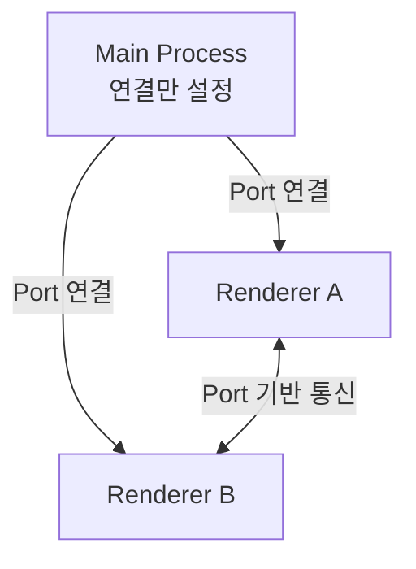
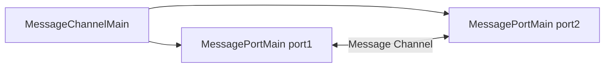
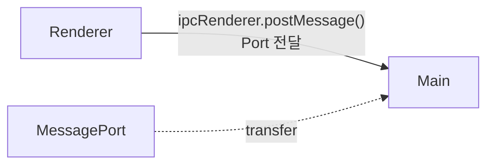
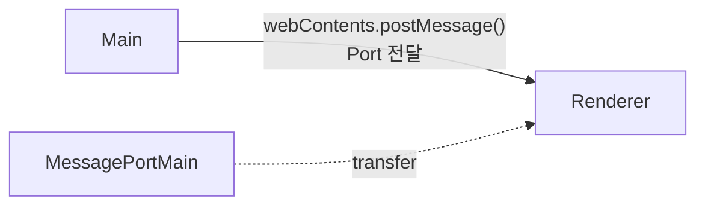
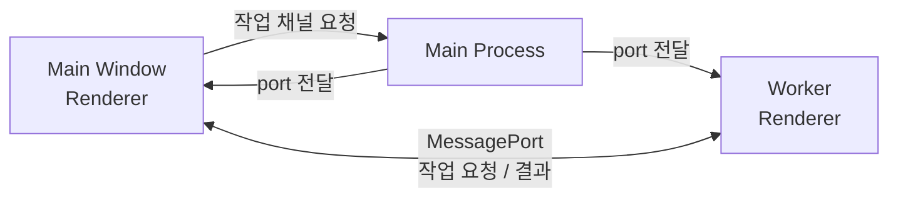
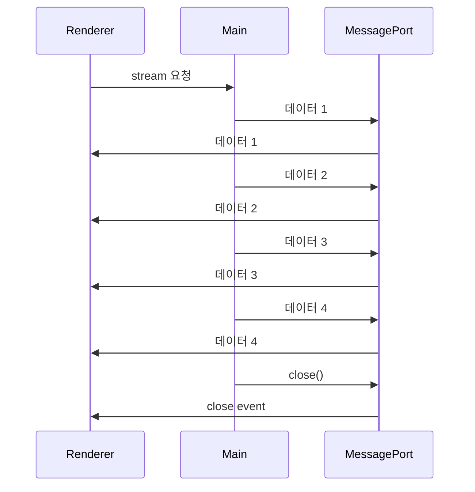
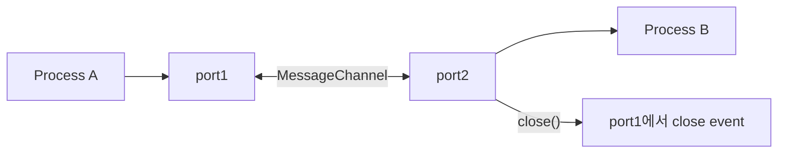

### MessagePort란?

Electron의 IPC에는 `ipcRenderer.send()` , `ipcMain.on()` 같은 기본 IPC 방식이 있음

하지만 애플리케이션이 커진다면 Renderer끼리 직접 통신하고 싶거나, 특정 통신 경로를 계속 유지하면서 많은 메시지를 주고받고 싶을 수 있음

이때 사용할 수 있는 것이 MessagePort임

<br/>

Electron의 MessagePort는 Chromium에서 제공하는 Web messageChannel, MessagePort API를 기반으로 함

이를 사용하면 두 개의 서로 다른 JavaScript context 또는 process 사이에 직접적인 메시지 통신 채널을 만들 수 있음

<br/>

MessageChannel을 생성하면 두 개의 MessagePort가 만들어짐

```tsx
const { port1, port2 } = new MessageChannel()
```

`port1` 과 `port2` 는 서로 연결되어 있음

<br/>

다음과 같이 한쪽에서 호출하면 반대쪽에서 메시지를 받을 수 있음

```tsx
port1.postMessage('hello')

port2.onmessage = (event) => {
	console.log(event.data)
}
```

<br/>
<br/>

### IPC와 MessagePort의 차이

일반 Electron IPC는 보통 Main Process를 중심으로 통신함

반면 MessagePort는 두 endpoint 사이에 전용 통신 채널을 만들어 지속적으로 사용할 수 있음

따라서 MessagePort는 단순한 Main에 요청 하나 보내기보다 독립적인 통신 채널을 구성할 때 적합함

<br/>

일반 IPC에서는 Renderer가 Main에 메시지를 보내고 Main이 다른 Renderer에 다시 메시지를 전달해야함

MessagePort를 사용하면 Main은 두 Renderer 사이의 초기 연결만 설정해주고 이후 통신은 독립적인 포트를 통해 수행할 수 있음



이렇게 하면 Main Process가 모든 메시지를 중계하는 구조를 피할 수 있음

<br/>

Renderer는 Chromium의 웹 페이지이기 때문에 Web API인 `MessageChannel` , `MessagePort` 를 그대로 사용할 수 있음

하지만 Main Process는 웹 페이지가 아니기에 DOM의 `MessageChannel` , `MessagePort` 를 그대로 사용할 수 없음

그래서 Electron이 Main Porcess용 API를 따로 제공함

<br/>

Electron 문서에서는 `MessageChannelMain` 이 Main Porcess에서 연결된 `MessagePortMain` 두 개를 생성하는 역할을 한다고 설명함

즉 Main에서 `new MessageChannelMain()` 을 호출하면 다음과 같이 만들어짐



만들어진 port를 Renderer로 보내면 됨

<br/>
<br/>

### Port를 어떻게 다른 Process로 넘기는가

여기서 `postMessage()` 가 다시 등장함

Electron에서는 Port를 전달할 때 `ipcRenderer.postMessage()` 또는 `webContents.postMesage()` 를 사용함

중요한 점은 일반 `ipcRenderer.send()` 나 `ipcRenderer.invoke()` 로 MessagePort를 전달할 수 없다는 것임

Port는 transferable object이기 때문에 `postMessage()` 계열 API를 사용해야함

<br/>

흐름은 다음과 같이 2가지 형태임





여기서 중요한 건 데이터를 복사해서 보내는 것이 아니라 Port라는 통신 endpoint를 다른 쪽으로 전달한다는 것임

Port가 전달된 뒤에는 Main을 거치지 않음

<br/>
<br/>

### 그러면 MessagePort는 언제 유용한가?

가장 이해하기 쉬운 것은 통신량이 많거나 지속적으로 데이터를 주고받는 경우임

예를 들어 메인 화면에서 Worker 역햘을 하는 별도의 Renderer가 있다고 가정할때 다음과 같음



처음에 Main이 연결을 만들어준 뒤에는 UI 와 Worker 사이에서만 작업 데이터가 오고감

즉 MessagePort는 Main을 거치지 않게 해서 중계 비용을 줄이는 구조임

<br/>

또 기존 IPC 방식을 사용한다면 데이터 10개를 보낼때 request-response 구조가 됨

하지만 MessagePort를 사용하면 하나의 요청에 대해 여러 개의 응답 데이터를 계속 전송할 수 있음



`MessageChannel` 은 요청마다 새로 만들어도 될 정도로 가볍고, 작업이 끝나면 Port를 닫아서 더 이상 데이터가 오지않는다는 것을 상대방에게 알려줄 수 있음

<br/>

Electron은 Web의 기본 `MessagePort` 에 `close` event를 추가했음



다른 쪽에 Port가 닫히면 `close` 이벤트가 발생함

또한 Port가 더 이상 참조되지 않아 GC되는 경우에도 닫힐 수 있음

<br/>
<br/>

### 메시지는 어떻게 전달되는가

`MessagePort` 를 통해 일반적인 serializable JavaScript 값을 전달할 수 있음

다음과 같은 데이터를 보낼 수 있음

```tsx
{
	type: "SCAN_RESULT",
	count: 10
}
```

따라서 `MessagePort` 는 message 데이터 전달과 다른 transferable object 전달까지 가능한 통신 endpoint라고 이해하면 됨

<br/>