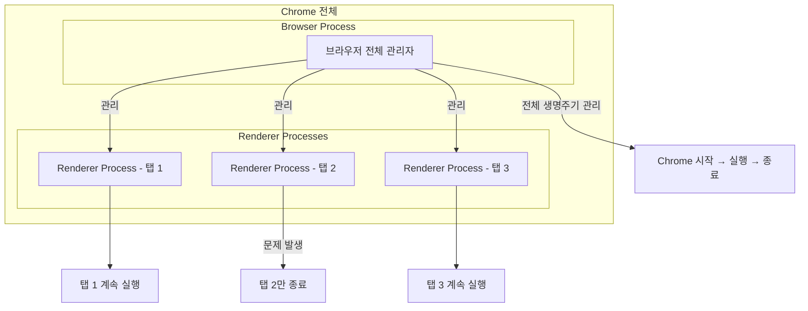
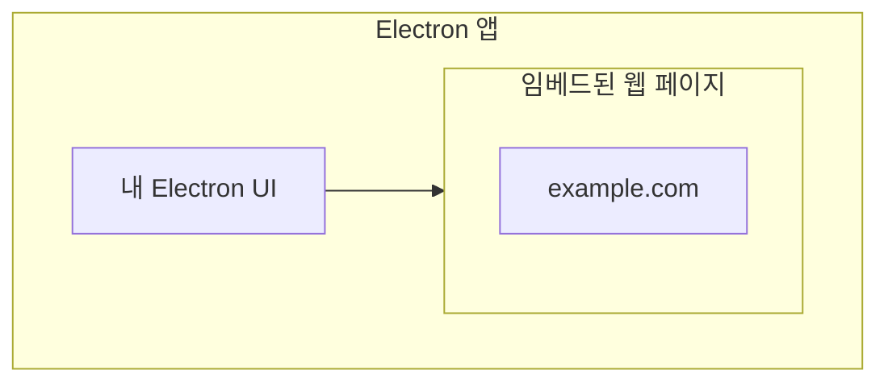
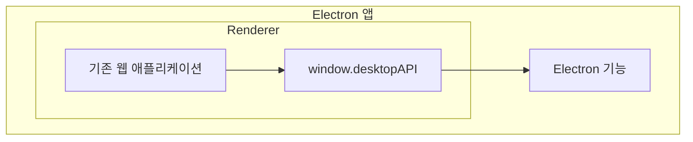

### Electron Process Model

Electron은 Chromium에서 사용하는 멀티 프로세스 아키텍처를 물려받았음

그렇기에 구조적으로 현대적인 웹 브라우저와 매우 유사함

<br/>

과거의 브라우저는 여러 개의 창이나 탭을 관리하고, 외부 확장 프로그램을 로드하는 등의 다양한 작업을 하나의 프로세스에서 모두 처리하는 경우가 많았음

이 방식은 열린 탭마다 별도의 프로세스를 생성하지 않아 오버헤드가 적다는 장점이 있었음

하지만 하나의 웹사이트에서 오류가 발생하거나 페이지가 멈추면 브라우저 전체에 영향을 줄 수 있었음

<br/>

Chrome 팀은 이 문제를 해결하고자 각 탭의 렌더링을 별도의 프로세스에서 수행하는 구조를 사용함

→ 전체 애플리케이션에 미치는 영향을 제한할 수 있음



Browser Process라는 중앙 관리자 프로세스가 이 Renderer Process들을 관리하면서 Chrome 전체의 실행과 종료를 담당함

<br/>

Electron도 거의 동일한 구조를 사용함

Electron 개발자가 주로 다루는 프로세스는 다음임

- Main Process
- Renderer Process

이는 Chrome의 Browser Process와 Renderer Process에 대응되는 구조임

<br/>
<br/>

### Main Process

Electron 애플리케이션에는 하나의 Main Process가 존재함

Main Porcess는 Electorn 애플리케이션의 진입점 역할을함

또한 Node.js 환경에서 실행되기 때문에 다음과 같은 기능을 사용할 수 있음

- require
- Node.js API
- Node.js 모듈

즉 Main Process는 단순한 UI 코드가 아니라 운영체제와 가까운 작업을 수행할 수 있는 핵심 프로세스임

<br/>
<br/>

### Window Management

Main Process의 가장 중요한 역할 가운데 하나는 애플리케이션 창을 생성하고 관리하는 것임

이를 위해 Electron의 `BrowserWindow` 모듈을 사용함

`BrowserWindow` 의 인스턴스 하나를 생성하면 하나의 애플리케이션 창이 만들어짐

이 창에서 실행되는 웹 페이지는 별도의 Renderer Process에서 로드됨

<br/>

다음과 같이 Main Process에서는 `webContetns` 객체를 이용해 해당 Renderer의 웹 콘텐츠와 상호작용할 수 있음

```tsx
const { BrowserWindow } = require('electron')

const win = new BrowserWindow({
  width: 800,
  height: 1500
})

win.loadURL('https://githun.com')

const contents = win.webContents

console.log(contents);
```

- `BrowserWindow`
    - 애플리케이션 창을 표현
- `webContents`
    - 애플리케이션 창에서 실행되는 웹 콘텐츠를 제어

`BrowserWindow` 는 Node.js의 `EventEmitter` 이기 때문에 창 최소화, 최대화 등 다양한 사용자 이벤트에 대한 핸들러를 등록할 수도 있음

→ `EventEmitter` 는 특정 이벤트가 발생했을 때 등록해 둔 함수를 실행해주는 객체임

`BrowserWindow` 인스턴스가 삭제되면 그에 대응하는 Renderer Process 역시 종료됨

<br/>

또한 `BrowserView` 같은 웹 임베드에도 별도의 Renderer Process가 생성될 수 있으며, 임베드된 웹 콘텐츠에 대한 `webContents` 도 접근할 수 있음



```tsx

```

즉 Electron 앱 자체가 웹 브라우저처럼 웹 콘텐츠를 자기 화면 내부에 포함해서 렌더링할 수 있다는 것임

<br/>
<br/>

### Application Lifecycle

Main Process는 Electron의 `app` 모듈을 통해 애플리케이션의 전체 생명주기도 관리함

`app` 모듈은 애플리케이션 동작을 제어하기 위한 다양한 이벤트와 메서드를 제공함

- 프로그램 종료
- macOS Dock 관련 동작 수정
- About 패널 표시
- 애플리케이션 상태 관리

<br/>

다음과 같이 macOS가 아닌 환경에서 열린 창이 모두 닫혔을 때 프로그램을 종료할 수 있음

```tsx
app.on('window-all-close', () => {
  if (process.platform !== 'darwin') app.quit()
})
```

즉 `app` 은 Electron 애플리케이션 자체의 lifecycle을 담당하고, `BrowserWindow` 는 개별 창의 lifecycle을 담당함

<br/>
<br/>

### Native APIs

Electron은 단순히 Chromium 화면을 감싸는 것에서 끝나지 않음

Main Process는 운영체제와 상호작용할 수 있는 Electron 전용 Native API도 제공함

다음과 같은 데스트톱 기능을 사용할 수 있음

- 메뉴
- 다이얼로그
- 시스템 트레이 아이콘

따라서 Electron에서 데스크톱 애플리케이션다운 기능을 구현할 때 Main Process가 중요한 역할을 함

<br/>
<br/>

### Renderer Process

열린 `BrowserWindow` 마다 별도의 Renderer Process가 생성됨

웹 임베드 역시  Renderer Process를 생성할 수 있음

Renderer의 핵심 역할은 이름 그대로 웹 콘텐츠를 렌더링하는 것임

따라서 Renderer에서 실행되는 코드는 기본적으로 웹 브라우저의 규칙을 따름

<br/>

즉 하나의 창 안에서 UI와 일반적인 애플리케이션 기능을 만들 떄는 웹 개발과 동일한 기술을 사용함

대표적으로 다음과 같이 사용함

- **HTML**
    - Renderer의 시작점
- **CSS**
    - UI 스타일링
- **JavaScript**
    - 실행 코드

<br/>

하지만 Renderer Process는 기본적으로 `require` 나 다른 Node.js API에 직접 접근할 수 없음

과거에는 Renderer를 완전한 Node.js 환경으로 실행하는 것이 가능했고 기본값이기도 했지만, 보안상의 이유로 비활성화됨

<br/>
<br/>

### Preload Scripts

Renderer에서 Node.js나 Electron의 Native 기능을 사용하기위해 Preload Script를 사용할 수 있음

Preload Script는 웹 콘텐츠가 로드되기 전에 Renderer Process에서 실행되는 코드임

Renderer와 동일한 프로세스에서 실행되지만 Node.js API에 접근할 수 있는 추가 권한을 가짐

<br/>

`BrowserWinodw` 를 생성할 때 `webPreferences.preload` 에 Preload Script를 지정할 수 있음

```tsx
const { BrowserWindow } = require('electron')

const win = new BrowserWindow({
  webPreferences: {
    preload: 'path/to/preload.js'
  }
})
```

즉 Main Process는 `BrowserWindow` 생성 → Renderer Process 생성 → Preload Script 실행 → 웹 페이지 실행 순서를 가짐

<br/>

Preload Script는 Renderer와 `window` 라는 전역 인터페이스를 공유함

그리고 Node.js API를 사용할 수 있기 때문에 Renderer에서 사용할 수 있는 사용자 정의 API를 만들어주는 역할을 할 수 있음

<br/>

하지만 여기서 중요한 보안 개념인 `contextIsolation` 이 등장함

Electorn에서는 `contextIsolation` 이 기본적으로 활성화되어 있기 때문에 Preload에서 다음과 같이 작성한다고 해서 직접 사용할 수 없음

```tsx
window.myAPI = {
	desktop: true
}
```

Renderer에서 접근하면 `undefined` 가 됨

<br/>
<br/>

### Context Isolation

Context Isolation은 Preload Script와 Renderer의 Main World를 서로 격리하는 기능임

목적은 Preload가 가진 권한 있는 API가 웹 콘텐츠의 JavaScript로 그대로 노출되는 것을 방지하는 것임

그래서 Elctron에서는 `contextBridge` 를 사용함

```tsx
const { contextBridge } = require('electron')

contextBridge.exposeInMainWorld('myAPI', {
  desktop: true
})
```

<br/>

Renderer에서는 다음과 같이 접근할 수 있음

```tsx
console.log(window.myAPI)  // { desktop: true }
```

<br/>

`contextBridge` 는 특히 두 가지 목적으로 매우 유용함

Renderer와 Main 사이에서 안전하게 필요한 기능만 연결해주는 것임

<br/>

첫 번째는 Renderer에 `ipcRenderer` 관련 헬퍼를 노출하는 것임

Renderer가 `fs` 같은 Node.js API를 직접 사용하는 것이 아니라, `contextBridge` 를 통해 필요한 기능만 API 형태로 제공받음

Renderer → IPC → Main

이렇게 하면 Renderer에서 IPC를 사용해 Main Process의 작업을 요청할 수 있음

<br/>

두 번째는 외부 웹 애플리케이션을 Electron 기능을 추가하는 것임

다음과 같이 기존 웹 애플리케이션은 원래 브라우저에서 실행되기 때문에 파일 시스템이나 OS 기능을 직접 사용할 수 없음



<br/>

`contextBridge` 를 사용하면 다음과 같이 Electron에서 제공할 기능만 `window` 에 노출할 수 있음

```tsx
window.desktopAPI.saveFile()
window.desktopAPI.showNotification()
window.desktopAPI.getAppVersion()
```

<br/>
<br/>

### Utility Process

Electron에서는 Main Process에서 여러 개의 자식 프로세스를 생성할 수도 있음

이를 위해 `UtilityProcess` API를 사용함

`UtilityProcess` 역시 Node.js 환경에서 실행되므로 Node.js API와 모듈을 사용할 수 있음

<br/>

이 프로세스는 다음과 같이 작접을 분리하는 데 사용할 수 있음

- 신뢰할 수 없는 서비스
- CPU를 많이 사용하는 작업
- 충돌 가능성이 높은 컴포넌트

기존에는 이런 작업을 Main Process에서 처리하거나 Node.js의 `child_process.fork()` 로 생성한 프로세스에서 처리할 수 있었음

<br/>

지금까지 다룬 내용을 정리한 흐름은 다음과 같음

```mermaid
flowchart TB
    subgraph ElectronApp["Electron App"]

        subgraph Main["Main Process"]
            Node["Node.js API"]
            Native["Electron Native API"]
            BW["BrowserWindow"]
            App["app"]
            UtilityCreate["Utility Process 생성"]
        end

        subgraph Renderer["Renderer Process"]
            HTML["HTML"]
            CSS["CSS"]
            JS["JavaScript"]
            UI["일반적인 웹 UI"]
        end

        subgraph Preload["Preload Script"]
            SameProcess["Renderer와 같은 프로세스"]
            NodeElectron["Node.js / Electron API 접근"]
            Bridge["contextBridge를 통한 API 노출"]
        end

        subgraph Utility["Utility Process"]
            UtilityNode["Node.js 환경"]
            CPU["CPU-intensive 작업"]
            Crash["crash-prone 작업"]
            MessagePort["MessagePort를 통한 통신"]
        end

        Main -->|"Renderer 생성 / 관리"| Renderer
        Renderer -->|"API 사용"| Preload
        Preload -->|"안전한 API 노출"| Renderer
        Main -->|"생성"| Utility
        Utility -->|"MessagePort"| Main
    end
```



<br/>