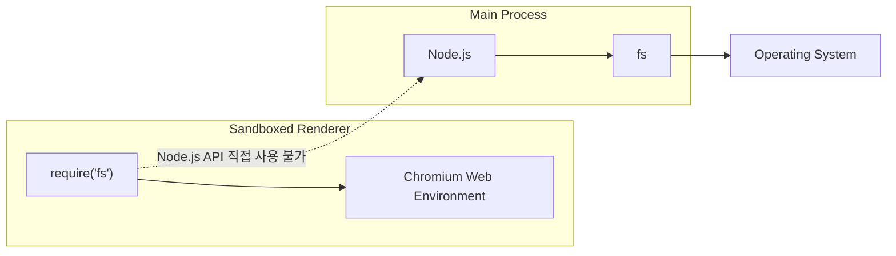
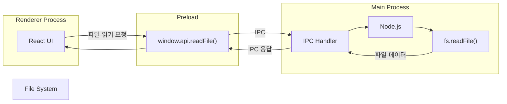
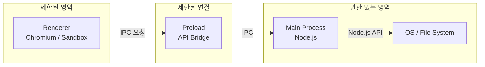
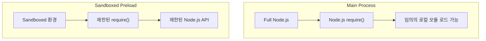
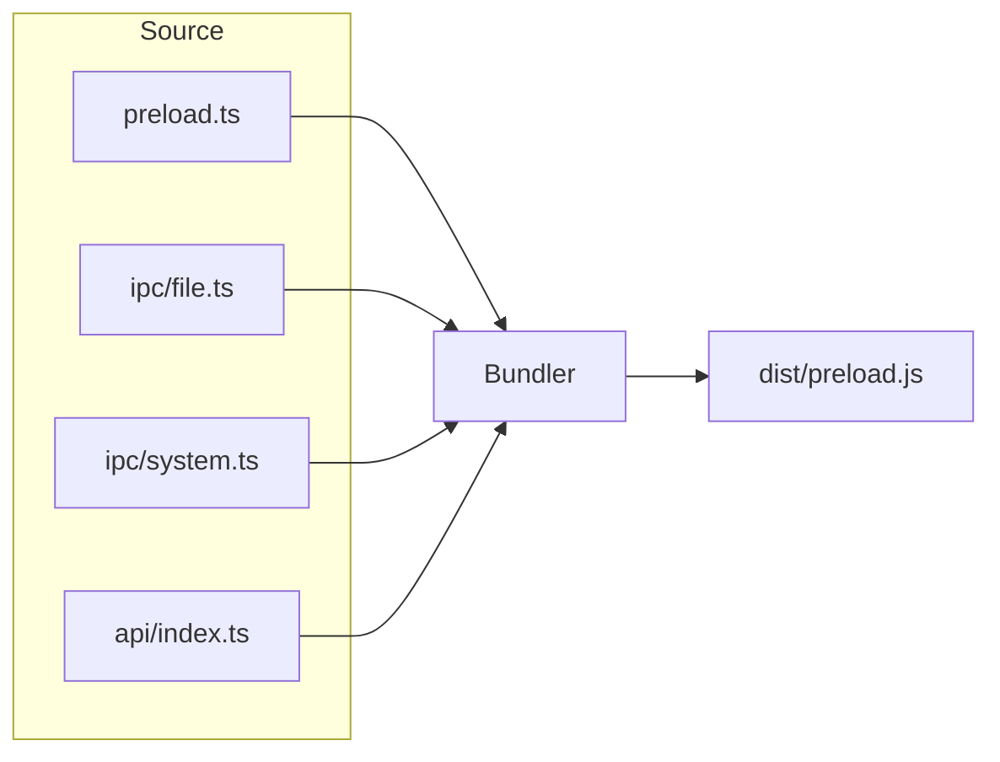
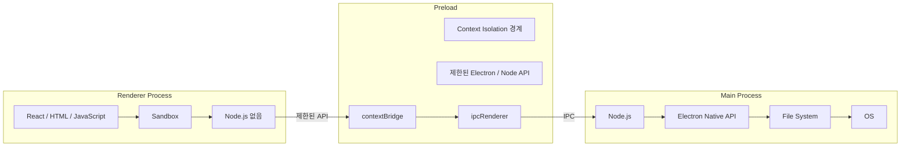

### **Process Sandboxing**

Electron은 Chromium의 프로세스 샌드박싱 기능을 사용함

샌드박싱의 핵심 목적은 악성 코드가 실행되더라도 해당 프로세스가 시스템 전체에 접근하지 못하도록 권한을 제한하는 것임

샌드박스된 프로세스는 시스템의 대부분의 리소스에 자유롭게 접근할 수 없고, 기본적으로 CPU와 메모리 사용 정도만 자유로움

즉 샌드박스 안에 있는 프로세스가 직접 위험한 작업을 수행하는 것이 아니라, 권한을 가진 다른 프로세스에게 작업을 위임하는 구조임

<br/>

Chromium에서는 Main Process를 제외한 대부분의 프로세스에 샌드박싱을 적용함

- Renderer Process
- Audio Service
- GPU Service
- Network Service

Electron도 Chromium 구조를 상당 부분 그대로 사용함

<br/>

Electron 20부터 Renderer Process의 sandbox가 별도의 설정 없이 기본적으로 활성화됨

따라서 최신 Electorn에서 일반적인 `BrowserWindow` Rnederer는 기본적으로 샌드박스 환경에서 실행됨

<br/>
<br/>

### Node.js Integration과 Sandbox의 관계

Electron에서는 Node.js Integration과 Renderer Sandbox가 강하게 연결되어 있음

Node.js Integration은 Electron에서 Node.js 기능을 사용할 수 있도록 연결하는 것임

```tsx
const win = new BrowserWindow({
  webPreferences: {
      nodeIntegration: true
  }
})
```

다음처럼 사용시 Renderer에서 Node.js 환경을 사용할 수 있게 되지만, 동시에 해당 Renderer의 샌드박스가 꺼짐

<br/>

따라서 최신 Electron에서 다음 세 개는 연결되어 있기에 같이 생각해야함

- Context Isolation
- Sandbox
- Node.js Integration

<br/>
<br/>

### 샌드박스된 Renderer의 동작

Renderer Process가 sandbox 상태라면 일반적인 Chromium Renderer와 유사하게 동작함

Sandbox된 Renderer에는 일반적인 Node.js 환경이 제공되지 않기 때문에 `fs` 를 직접 가져와 사용할 수 없음



Sandbox의 목적은 Renderer가 파일 시스템이나 운영체제에 직접 접근하지 못하도록 제한하는 것임

<br/>

Renderer가 파일을 읽어야 한다면 Renderer가 직접 파일을 읽는 것이 아니라 Main Process에게 요청함

이때 IPC가 사용됨



<br/>

따라서 전체적인 권한 구조는 다음과 같음



핵심은 Sandbox가 파일 접근 자체를 불가능하게 만드는 것이 아니라, Renderer가 파일 접근 권한을 직접 가지지 못하도록 만드는 것임

<br/>
<br/>

### Sandbox Preload의 require

Sandbox 환경의 Preload Script에는 Node.js의 일반적인 `require` 와 비슷하지만 기능이 제한된 polyfill `require` 가 제공됨

해당 `require` 는 모든 Node.js 모듈을 로드할 수 있는 것은 아니며 Electron 계열에서는 다음이 제공됨

- `contextBridge`
- `crashReporter`
- `ipcRenderer`
- `nativeImage`
- `webFrame`
- `webUtils`

<br/>

그림으로 보면 다음과 같음



따라서 Preload는 Renderer보다 훨씬 많은 기능을 사용할 수 있지만, 완전한 Node.js 환경은 아님

그렇기에 여러 개의 소스 파일을 실행 시점에 `require()` 로 가져오는 방식보다 미리 여러 파일을 하나의 Preload 파일로 묶어 놓는 방식을 사용함

여기서 Bundler가 등장함

<br/>

Webpack이나 Parcel 같은 Bundler는 애플리케이션을 실행할 때 모듈을 찾는 역할을 하는 것이 아니라, 빌드 시점에 여러 소스 파일을 하나의 JavaScript 파일로 묶어주는 역할을 함

다음 같은 구조에서

```bash
src/
├── preload.ts
├── ipc/
│   ├── file.ts
│   └── system.ts
└── api/
    └── index.ts
```

<br/>

`preload.ts` 는 다음처럼 작성함

```tsx
import { readFile } from "./ipc/file";
import { getSystemInfo } from "./ipc/system";
```

<br/>

그리고 Bundler가 이 파일들의 의존관계를 분석함



Bundler는 결과적으로 여러 파일의 코드를 하나의 `preload.js` 안에 포함시킴

따라서 Electron이 실행될 때 `preload.js` 가 다른 로컬 파일을 `require()` 해서 가져오는 것이 아니라 이미 빌드과정에서 필요한 코드가 `preload.js` 안에 들어가 있는 것임

<br/>
<br/>

### Sandbox만 켜면 완전히 안전한가?

Preload Script는 sandboxed Renderer보다 높은 권한을 가짐

따라서 Context Isolation을 사용하지 않으면 Preload의 권한 있는 API가 Renderer의 신뢰 할 수 없는 코드로 유출될 수 있음

<br/>

Context Isolation + Sandbox + IPC 구조를 합쳐서 보면 Electron의 보안 구조가 훨씬 명확해짐



<br/>
<br/>

### 전체 Renderer에 Sandbox 강제 적용

Electron에서는 `app.enableSandbox()` 를 사용하여 모든 Renderer에 대해 Sandbox를 강제로 활성화할 수 있음

```tsx
app.enableSandbox()

app.whenReady().then(() => {
  const win = new BrowserWindow()
  
  win.loadURL('https://google.com')
})
```

여기서 중요한 조건은 `app.enableSandbox()` 는 `ready` 이벤트가 발생하지 전에 호출해야함

전역적으로 활성화시 개별 `BrowserWindow` 에서 설정한 `sandbox: false` 는 무시됨

<br/>