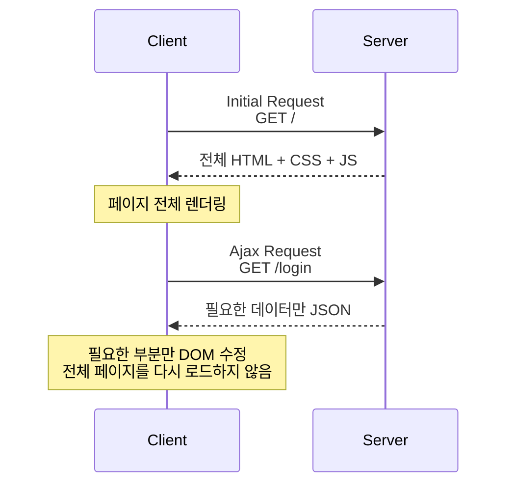

### Ajax란?

자바스크립트를 사용하여 브라우저가 서버에게 비동기 방식으로 데이터를 요청하고, 서버가 응답한 데이터를 수신하여 웹페이지를 동적으로 갱신하는 프로그래밍 방식을 말함

Ajax는 브라우저에서 제공하는 Web API `XMLHttpRequest` 객체를 기반으로 동작함

→ HTTP 비동기 통신을 위한 메서드와 프로퍼티를 제공

<br/>

기존에는 서버로부터 새로운 HTML을 전송받아 다시 렌더링하는 방식이었음

이는 변경할 필요도 없는 부분까지 다시 전송받아야한다는 문제가 존재함



Ajax는 서버로부터 웹페이지의 변경에 필요한 데이터만 비동기 방식으로 받아 이 문제를 해결할 수 있음

Ajax 통신에서는 주로 JSON 형식의 데이터를 사용하며, 서버는 필요한 데이터를 JSON 형태로 응답하고 클라이언트는 이를 JavaScript 객체로 변환하여 사용함

<br/>
<br/>

### JSON

JSON은 클라이언트와 서버 간의 HTTP 통신을 위한 텍스트 데이터 포맷임

특정 언어에 종속되지 않는 언어 독립형 데이터 포맷으로, 대부분의 프로그래밍 언어에서 사용할 수 있음

<br/>

JSON은 자바스크립트의 객체 리터럴과 유사하게 키와 값으로 구성된 순수한 텍스트임

JSON의 키는 다음과 같이 반드시 큰따옴표로 묶어야 함

```json
{
  "name": "Lee",
  "age": 20,
  "alive": true,
  "hobby": ["traveling", "tennis"]
}
```

<br/>
<br/>

### JSON.stringify

`JSON.stringify` 메서드는 객체를 JSON 포맷의 문자열로 변환함

클라이언트가 서버로 객체를 전송하려면 객체를 문자열화해야 하는데 이를 직렬화라 함

객체는 클라이언트의 메모리에 존재하므로 서버가 객체 자체를 직접전달받을 수 없기 때문임

<br/>

따라서 다음과 같이 `JSON.stringify` 메서드를 통해 전송할 수 있는 데이터 형식으로 변환해야 함

```tsx
const obj = {
  name: 'Lee',
  age: 20,
  alive: true,
  hobby: ['traveling', 'tennis']
}

const json = JSON.stringify(obj);

// 타입: string, 직렬화된 값: {"name":"Lee","age":20,"alive":true,"hobby":["traveling","tennis"]}
console.log(`타입: ${typeof json}, 직렬화된 값: ${json}`);
```

<br/>

`JSON.stringify` 의 세 번째 인자인 `space` 를 사용하면 JSON 문자열을 보기 좋게 들여쓸 수 있음

2를 넣게되면 들여쓰기할 공백의 개수가 2라는걸 의미함

```tsx
const obj = {
  name: 'Lee',
  age: 20,
  alive: true,
  hobby: ['traveling', 'tennis']
}

const prettyJson = JSON.stringify(obj, null, 2);
console.log(prettyJson);
/*
{
  "name": "Lee",
  "age": 20,
  "alive": true,
  "hobby": [
    "traveling",
    "tennis"
  ]
}
* */
```

두 번째 인자는 변환할 속성을 선택하거나 변환 함수를 지정할 때 사용하며, `null` 을 전달하면 모든 속성을 변환함

들여쓰기는 JSON 데이터의 구조를 사람이 읽기 쉽게 표현하기 위한 것으로, 실제 데이터의 의미나 전송 방식에는 영향을 주지 않음

<br/>

`JSON.stringify` 메서드는 객체뿐만 아니라 배열도 JSON 포맷의 문자열로 변환함

```tsx
const todos = [
  { id: 1, content: 'HTML', completed: false },
  { id: 1, content: 'CSS', completed: true },
  { id: 1, content: 'JavaScript', completed: false },
];

const json = JSON.stringify(todos, null, 2);
console.log(json);
/*
[
  {
    "id": 1,
    "content": "HTML",
    "completed": false
  },
  {
    "id": 1,
    "content": "CSS",
    "completed": true
  },
  {
    "id": 1,
    "content": "JavaScript",
    "completed": false
  }
]
 */
```

<br/>
<br/>

### JSON.parse

서버로부터 클라이언트에게 전송된 JSON 데이터는 문자열이기에 객체로서 사용하려면 JSON 포맷의 문자열을 객체화 즉, 역직렬화를 해야함

`JSON.parse` 메서드는 JSON 포맷의 문자열을 객체로 변환함

```tsx
const obj = {
  name: 'Lee',
  age: 20,
  alive: true,
  hobby: ['traveling', 'tennis']
}

const json = JSON.stringify(obj);

const parsed = JSON.parse(json);
console.log(parsed);
/*
{
  name: "Lee",
  age: 20,
  alive: true,
  hobby: [ "traveling", "tennis" ],
}
 */
```

<br/>

배열이 JSON 포맷의 문자열로 변환되어 있는 경우 `JSON.parse` 는 문자열을 배열 객체로 변환함

배열의 요소가 객체인 경우 배열의 요소까지 객체로 변환함

```tsx
const todos = [
  { id: 1, content: 'HTML', completed: false },
  { id: 1, content: 'CSS', completed: true },
  { id: 1, content: 'JavaScript', completed: false },
];

const json = JSON.stringify(todos);

const parse = JSON.parse(json);
console.log(parse);
/*
[
  {
    id: 1,
    content: "HTML",
    completed: false,
  }, {
    id: 1,
    content: "CSS",
    completed: true,
  }, {
    id: 1,
    content: "JavaScript",
    completed: false,
  }
]
 */
```

<br/>
<br/>

### XMLHttpRequest

위에서 설명했던 것처럼 자바스크립트를 사용하여 HTTP 요청을 전송하려면 `XMLHttpRequest` 객체를 사용함

Web API인 `XMLHttpRequest` 객체는 HTTP 요청 전송과 HTTP 응답 수신을 위한 다양한 메서드와 프로퍼티를 제공함

→ 현재는 뒤에 다룰 `fetch` 방식을 많이 사용함

<br/>

`XMLHttpsRequest` 객체는 `XMLHttpRequest` 생성자 함수를 호출하여 생성함

`XMLHttpRequest` 객체는 브라우저에서 제공하는 Web API이므로 브라우저 환경에서만 정상적으로 실행됨

```tsx
const xhr = new XHMLHttpRequest();
```

<br/>

HTTP 요청을 전송하는 경우 다음 순서를 따름

- `XMLHttpsRequest.prototype.open` 메서드로 HTTP 요청을 초기화함
- 필요에 따라 `XMLHttpsRequest.prototype.setRequestHeader` 메서드로 특정 HTTP 요청의 헤더 값을 설정함
- `XMLHttpsRequest.prototype.send` 메서드로 HTTP 요청을 전송함

<br/>

코드로 보면 다음과 같음

```tsx
// XMLHttpRequest 객체 생성
const xhr = new XMLHttpRequest();

// HTTP 요청 초기화
xhr.open('GET', '/users');

// HTTP 요청 헤더 설정
// 클라이언트가 서버로 전송할 데이터의 MIME 타입 지정
xhr.setRequestHeader('content-type', 'application/json');

// HTTP 요청 전송
xhr.send();
```

<br/>
<br/>

### XMLHttpRequest.prototype.open

`open` 메서드는 서버에 전송할 HTTP 요청을 초기화함.

→ 어떤 요청을 보낼지 설정하는 것을 의미

<br/>

`open` 메서드를 호출하는 방법은 다음과 같음

```tsx
xhr.open(method, url[, async])
```

- `method`
    - HTTP 요청 메서드
        - `GET`
        - `POST`
        - `PUT`
        - `DELETE`
- `url`
    - HTTP 요청을 전송할 URL
- `async`
    - 비동기 요청 여부
    - 기본값은 `true` 이며, 비동기 방식으로 동작함

<br/>
<br/>

### XMLHttpRequest.prototype.send

`send` 메서드는 `open` 메서드로 초기화된 HTTP 요청을 서버에 전송함

기본적으로 서버로 전송하는 데이터는 `GET` , `POST` 요청 메서드에 따라 전송 방식에 차이가 있음

```tsx
// GET
xhr.open('GET', '/users?name=LEE');
xhr.send();

// POST
xhr.open('POST', '/users');
xhr.send(JSON.stringify({
	name: 'LEE'
}));
```

`GET` 요청은 데이터를 URL의 Query String에 담아 전송하고, `POST` 요청은 데이터를 Request Body에 담아 전송함

<br/>
<br/>

### XMLHttpRequest.prototype.setRequestHeader

`setRequestHeader` 메서드는 특정 HTTP 요청의 헤더 값을 설정함

해당 메서드는 반드시 `open` 메서드를 호출한 이후에 호출해야함

<br/>

자주 사용하는 HTTP 요청 헤더는 다음과 같음

- `Content-type`
- `Accept`

<br/>

`Content-type` 은 요청 몸체에 담아 전송할 데이터의 MIME 타입의 정보를 표현함

MIME 타입은 데이터가 어떤 종류의 데이터인지 알려주는 형식 정보임

자주 사용되는 MIME 타입은 다음과 같음

- `text`
    - 사람이 읽을 수 있는 텍스트 데이터를 나타냄
    - 서브 타입
        - `text/plain`
            - 일반 텍스트
        - `text/html`
            - HTML 문서
        - `text/css`
            - CSS
        - `text/javascript`
            - JavaScript
- `application`
    - 특정 애플리케이션에서 처리하는 데이터 형식을 나타냄
    - 서브 타입
        - `application/json`
            - JSON 데이터
        - `application/x-www-form-urlencoded`
            - URL 인코딩된 Form 데이터
- `multipart`
    - 하나의 요청에 여러 종류의 데이터를 여러 부분으로 나누어 전송할 때 사용
    - 서브 타입
        - `multipart/form-data`
            - 텍스트와 파일 등의 데이터를 함께 전송할 때 사용

<br/>

`Accept` 은 HTTP 클라이언트가 서버에 요청할 때 서버가 응답할 데이터의 MIME 타입을 지정할 수 있음

```tsx
xhr.setRequestHeader('accept', 'application/json');
```

<br/>
<br/>

### HTTP 응답 처리

서버가 전송한 응답을 처리하려면 `XMLHttpRequest` 객체가 발생시키는 이벤트를 캐치해야함

HTTP 요청의 현재 상태를 나타내는 `readyState` 프로퍼티 값이 변경된 경우 발생하는 `readystatechange` 이벤트를 캐치하여 다음과 같이 HTTP 응답을 처리할 수 있음

```tsx
const xhr = new XMLHttpRequest();

xhr.open('GET', 'https://jsonplaceholder.typicode.com/todos/1');

xhr.send();

xhr.onreadystatechange = () => {
  if (xhr.readyState !== XMLHttpRequest.DONE) return;
  
  if (xhr.status === 200) {
    console.log(JSON.parse(xhr.response));
  } else {
    console.error('Error', xhr.status, xhr.statusText)
  }
}
```

`onreadystatechange` 이벤트 핸들러 프로퍼티에 할당한 이벤트 핸들러는 HTTP 요청의 현재 상태를 나타내는 `xhr.readyState` 가 `XMLHttpRequest.DONE` 인지 확인하여 서버의 응답이 완료되었는지 확인함

HTTP 요청에 대한 응답이 정상적으로 도착했다면 요청에 대한 응답 몸체를 나타내는 `xhr.response` 에서 서버가 전송한 데이터를 취득함

<br/>