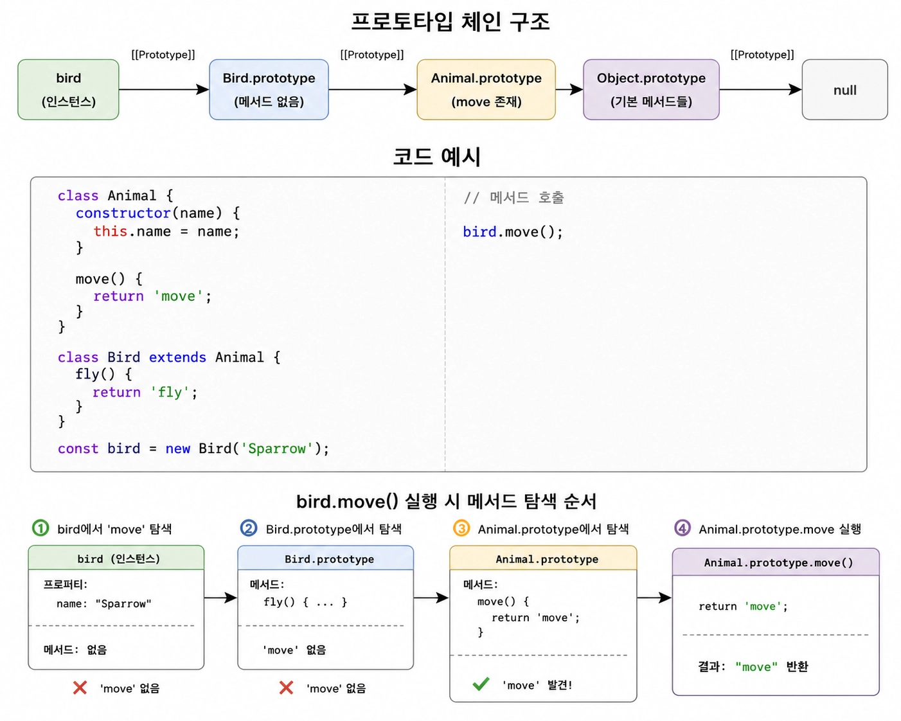
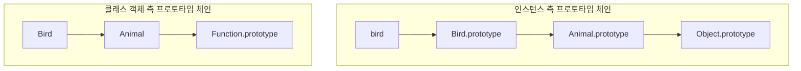
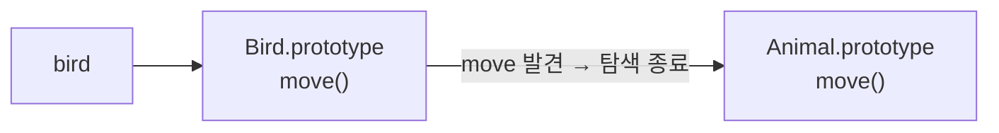
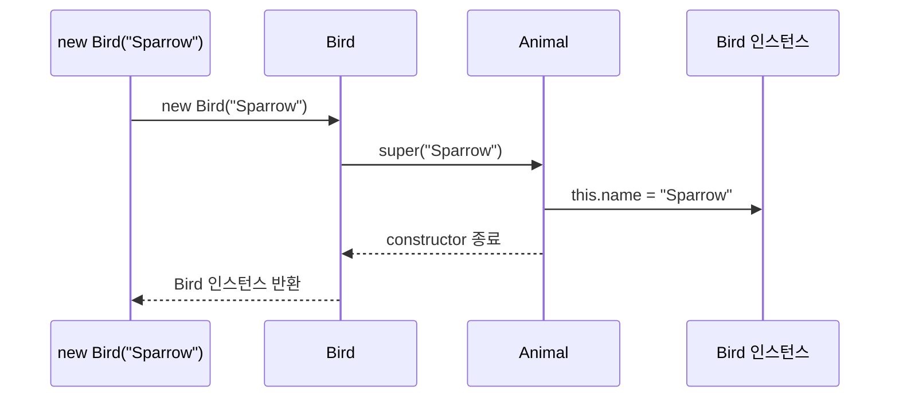

### 상속

프로토타입 기반 상속은 프로토타입 체인을 통해 다른 객체의 프로퍼티와 메서드를 사용할 수 있도록 하는 것임

반면 클래스의 상속은 기존 클래스를 기반으로 새로운 클래스를 확장하는 것임

```tsx
class Animal {
  constructor(name) {
    this.name = name;
  }

  move() {
    return 'move';
  }
}

class Bird extends Animal {
  fly() {
    return 'fly';
  }
}

const bird = new Bird('Kang');

bird.move();  // move
bird.fly();   // fly
```

`extends` 를 사용한다고 해서 `Animal` 의 코드가 `Bird` 내부로 복사되는 것은 아님

JavaScript 엔진은 `Bird` 와 `Animal` 사이의 프로토타입 관계를 연결하여 `Bird` 의 인스턴스가 `Animal` 의 기능을 사용할 수 있도록 함

<br/>

그림으로 보면 다음과 같음



즉, 클래스 상속은 코드를 복사하는 것이 아니라 프로토타입 체인을 연결하는 것으로 이해하는 것이 중요함

<br/>
<br/>

### extends 사용시 생성되는 두 개의 프로토타입 관계

`extends` 는 인스턴스 쪽과 클래스 객체 쪽에 서로 다른 두 개의 연결을 만듦



첫 번째 체인은 인스턴스가 부모 클래스의 프로토타입 메서드를 사용하기 위한 것임

두 번째 체인은 자식 클래스가 부모 클래스의 정적 프로퍼티와 정적 메서드를 사용하기 위한 것임

<br/>

`hello()` 는 `Bird` 에 직접 정의된 것이 아니기에 `Bird` 에서 찾지 못하면 클래스 객체의 프로토타입 체인을 따라 `Animal` 을 탐색하기 때문에 사용할 수 있음

```tsx
class Animal {
  static hello() {
    return 'Hello';
  }
}

class Bird extends Animal {}

Bird.hello();
```

즉, `extends` 는 단순히 인스턴스의 상속만 만드는 것이 아니라 클래스 객체 자체에도 상속 관계를 만듦

<br/>
<br/>

### super() 키워드

`super` 키워드는 자식 클래스에서 부모 클래스를 참조하기 위한 키워드임

사용 위치에 따라 의미가 달라짐

- `super()`
    - 부모 클래스와 `constructor` 를 호출함
- `super.method()`
    - 부모 클래스의 메서드를 호출함

그리고 정적 메서드 내부에서 사용하는 `super.method()` 는 부모 클래스의 정적 메서드를 호출함

<br/>

먼저, super를 자세하게 알아보자면 상속 관계의 자식 클래스가 `constructor` 를 직접 정의하면 부모 생성자를 호출하기 위해 `super()` 를 사용함

```tsx
class Animal {
  constructor(name) {
    this.name = name;
  }
}

class Bird extends Animal {
  constructor(name, wing) {
    super(name);
    this.wing = wing;
  }
}

const bird = new Bird("sparrow", 2);
```

`super(name)` 이 실행되면 부모 클래스의 `constructor` 가 실행되고 부모 생성자에서 `this.name` 이 초기화됨

그 다음 자식 생성자로 돌아와 `this.wing` 을 초기화함

<br/>

최종적으로 다음과 같이 하나의 `Bird` 인스턴스에 두 클래스의 초기화가 적용됨

```tsx
Bird {
	name: "Sparrow",
	wing: 2,
}
```

즉, 하나의 동일한 인스턴스를 부모 생성자와 자식 생성자가 순서대로 초기화하는 것임

<br/>
<br/>

### super() 이전에는 this를 사용할 수 없는 이유

다음 코드를 에러가 발생함

```tsx
class Animal {
  constructor(name) {
    this.name = name;
  }
}

class Bird extends Animal {
  constructor(name, wing) {
    this.wing = wing;

    super(name);
  }
}
```

상속받은 클래스의 생성자에서는 `super()` 를 호출하기 전까지 `this` 가 초기화되지 않음

<br/>

따라서 다음과 같이 `super()` 가 `this` 초기화보다 먼저 나와야함

```tsx
constructor(name, wing) {
  super(name);
  this.wing = wing;
}
```

따라서 `super()` 이전에 `this` 를 사용하면 에러가 발생함

중요한 것은 부모와 자식이 서로 다른 객체를 만드는 것이 아니라 하나의 인스턴스를 함께 초기화한다는 것임

<br/>
<br/>

### 오버라이딩

오버라이딩은 부모 클래스에서 정의한 메서드를 자식 클래스에서 같은 이름으로 다시 정의하는 것임

```tsx
class Animal {
  move() {
    return 'animal move';
  }
}

class Bird extends Animal {
  move() {
    return 'bird move';
  }
}

const bird = new Bird();

bird.move();  // bird move
```

다음 코드에서는 `Bird` 가 `move()` 를 다시 정의했기 때문에 출력 결과는 `bird move` 가 나옴

<br/>

이때 중요한 것은 부모의 `move()` 가 삭제되거나 복사되어 변경되는 것은 아님

`Bird.prototype` 에 새로운 `move()` 가 존재하기 때문에 메서드 탐색이 여기서 먼저 끝나는 것임



따라서 오버라이딩은 상속받은 기능을 완전히 덮어써서 없애는 것이 아니라, 자식 객체에서 같은 이름의 메서드를 먼저 발견하게 만드는 것으로 이해하는 것이 정확함

<br/>
<br/>

### 오버라이딩과 super.method()

오버라이딩을 하면서도 부모의 메서드를 사용하고 싶다면 `super.method()` 를 사용함

```tsx
class Animal {
  constructor(name) {
    this.name = name;
  }

  sayHi() {
    return `Hi ${this.name}`;
  }
}

class Bird extends Animal {
  sayHi() {
    return `${super.sayHi()}, I am a bird`;
  }
}

const bird = new Bird("Sparrow");

console.log(bird.sayHi());  // Hi Sparrow, I am a bird
```

여기서 `super.sayHi()` 는 부모 클래스인 `Animal` 의 `sayHi()` 를 호출함

그렇기에 부모 메서드 내부의 `this.name` 에서 `this` 는 현재 `Bird` 인스턴스를 가리킴

즉, 어느 메서드를 호출할지는 `super` 가 결정하고, 메서드 내부의 `this` 는 현재 인스턴스를 그대로 사용함

<br/>

그림으로 보면 다음과 같음



`extends` 로 만들어진 상속 클래스가 `constructor` 를 생략했을 떄의 클래스 문법 규칙에 따라 부모 생성자를 호출하는 것임

<br/>
<br/>

### 다형성

오버라이딩을 이해하면 다형성까지 자연스럽게 연결됨

```tsx
class Animal {
  sound() {
    return 'animal';
  }
}

class Dog extends Animal {
  sound() {
    return 'dog'
  }
}

class Cat extends Animal {
  sound() {
    return 'cat';
  }
}

function makeSound(animal) {
  return animal.sound();
}

makeSound(new Dog());
makeSound(new Cat());
```

`makeSound()` 함수는 객체가 `Dog` 인지 `Cat` 인지 알 필요가 없고 단순히 `animal.sound()` 만 호출 할 수 있게 됨

즉, 같은 메서드 호출이 실제 객체의 타입에 따라 다른 도작을 하는 것이 다형성임

오버라이딩은 JavaScript에서 다형성을 구현하는 대표적인 방법임

<br/>
<br/>

### 오버로딩

오버로딩은 같은 이름의 메서드를 매개변수의 개수나 타입을 다르게 하여 여러 개 정의하는 것임

예시로 Java에서는 다음과 같이 작성할 수 있음

```tsx
class Calculator {
	
	int add(int a, int b) {
		return a + b;
	}
	
	int add(int a, int b, int c) {
		return a + b + c;
	}
}

Calculator calc = new Calculator();

calc.add(1, 2);      // add(int, int)
calc.add(1, 2, 3);   // add(int, int, int)
```

따라서 호출할 때 전달한 인자에 따라 적절한 메서드가 선택됨

즉, 오버로딩의 핵심은 하나의 이름으로 여러 개의 메서드가 존재한다는 것임

<br/>

하지만 JavaScript는 전통적인 메서드 오버로딩을 지원하지 않음

```tsx
class Calculator {
	add(a, b) {
		return a + b;
	}
	
	add(a, b, c) {
		return a + b + c;
	}
}

const calculator = new Calculator()

console.log(calculator.add(2, 3));      // NaN
console.log(calculator.add(2, 3, 4));   // 9
```

위처럼 작성하면 두 개의 `add()` 가 존재하는 것이 아니라 뒤에서 정의한 `add()` 가 앞의 `add()` 를 덮어씀

`calculator.add(2, 3)` 는 매개변수를 3개 정의했는데 2개만 전달하면 나머지 매개변수는 `undefined` 가 되어 `2 + 3 + undefined` 가 되므로 `NaN` 이 반환됨

따라서 Java처럼 별도의 메서드로 만들어 인자에 따라 선택하는 방식의 오버로딩은 지원하지 않음

<br/>

하지만 TypeScript에서 옵서녈 파라미터 `?` 를 사용하여 오버로딩을 유사하게 구현 할 수 있음

```tsx
function add(a: number, b?: number) {
	if (b === undefined) {
		return a;
	}
	
	return a + b;
}

add(10);       // 10
add(10, 20);   // 30
```

이렇게 하면 `b` 를 전달해도 되고 생략해도 됨

즉, 서로 다른 인자 개수를 하나의 함수가 처리할 수 있음

<br/>