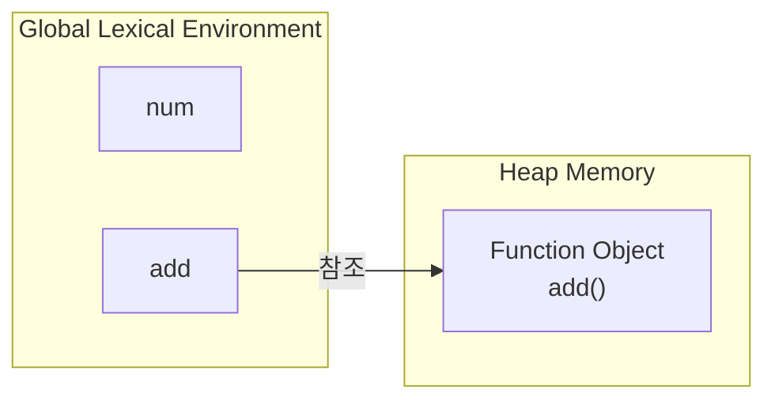
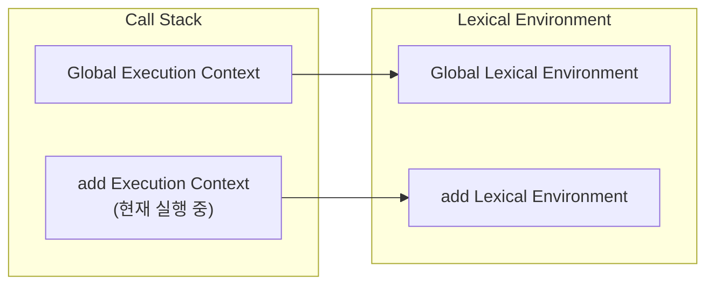

자바스크립트 엔진은 코드를 실행할 때 크게 런타임 이전과 런타임으로 나누어 처리함

### 런타임 이전

먼저 코드를 실행하지 않고 전체 코드를 한 번 분석함

이 과정에서 전역 코드를 실행하기 위한 Global Execution Context가 생성되며, Global Lexical Environment를 

</br>

Global Lexical Environment에는 전역에서 선언한 변수와 함수가 등록됨

함수에 대해서는 함수 객체를 생성하고 함수 이름과 함수 객체를 바인딩하는 작업만 수행할뿐 함수 내부의 코드는 실행하지 않음

```tsx
let num = 10;

function add(a, b) {
  let sum = a + b;
  return sum;
}
```

</br>

위 코드를 바탕으로 런타임 이전에는 다음과 같은 상태가 만들어짐



이 시점에는 `add` 함수 객체는 존재하지만, 함수 내부의 변수는 아직 존재하지 않음

함수 내부의 변수는 함수가 호출되기 전까지 생성되지 않음

</br>
</br>

### 런타임 이후

런타임이 시작되면 자바스크립트 엔진은 코드를 위에서 아래로 한 줄씩 실행함

변수에 값을 할당하고, 표현식을 평가하며, 함수를 호출하는 등의 작업이 이 단계에서 수행됨

```tsx
let num = 10;

add(1, 2);
```

다음 코드를 실행하면 `num` 에는 `10` 이 저장되고, `add()` 가 호출됨

</br>

함수가 호출되는 순간 새로운 Execution Context가 생성되어 Call Stack에 쌓임

그리고 생성된 Execution Context는 함수만의 Lexical Environment를 참조함



이때 함수 내부에서는 다음과 같은 작업이 수행됨

- 매개변수 `a` , `b` 가 전달받은 인수로 초기화됨
- `var` 변수는 `undefined` 로 초기화 됨
- `let` , `const` 변수는 식별자만 등록되고 TDZ에 있다가 선언문이 실행되면서 초기화 됨
- 이후 함수 본문의 코드가 위에서 아래로 실행됨

즉, 함수 호출시 런타임 이전 과정이 한 번 더 실행, Execution Context가 생성될 때마다 해당 과정이 존재함

</br>

```tsx
function add(a, b) {
	let sum = a + b;
	return sum;
}
```

`add(1, 2)` 를 호출하면 함수의 Lexical Environment에 값이 할당됨

함수 실행이 끝나면 반환값을 호출한 곳으로 전달하고, 해당 Execution Context는 Call Stack에서 제거됨

</br>

전체적인 흐름은 다음과 같음

