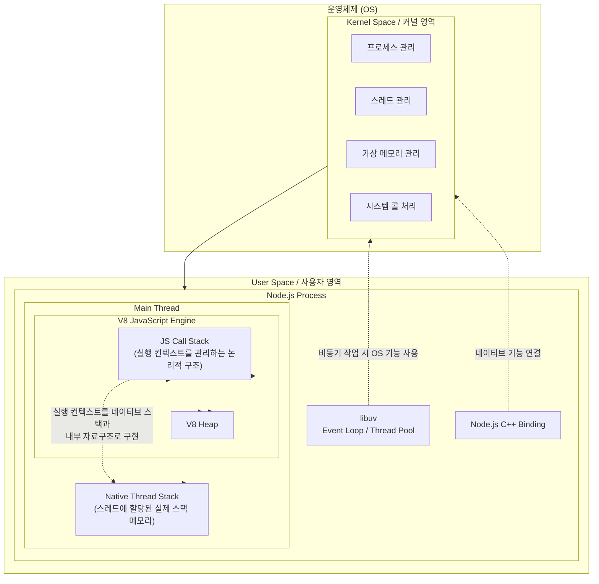
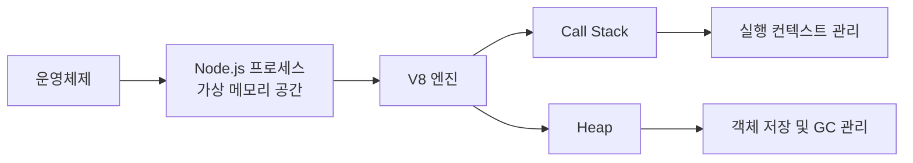
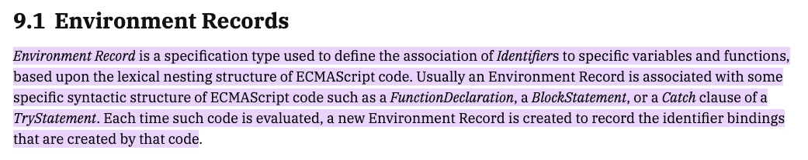
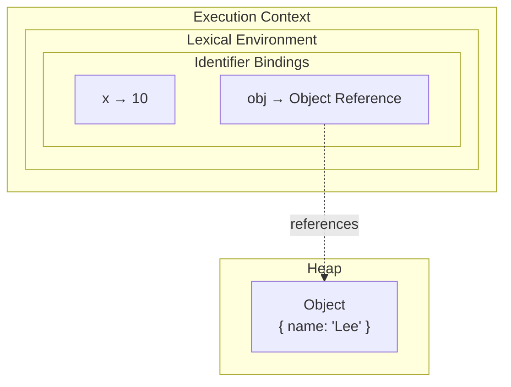
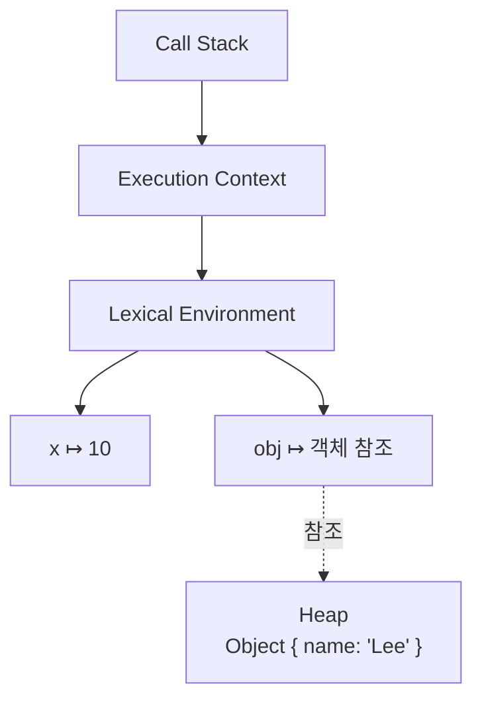

### 전체적인 흐름



운영체제는 Node.js 프로세스를 생성하고 하나의 가상 메모리 공간을 제공함

프로세스 안에는 메인 스레드가 존재하며, 운영체제는 각 스레드에 Native Thread Stack(실제 스택 메모리)을 할당함

Node.js에서 JavaScript를 실행하는 V8 엔진은 이 프로세스의 메모리 공간 안에서 JavaScript 실행을 관리하며, 크게 Call Stack과 Heap을 이용함

</br>
</br>

### 간소화 전체적인 흐름



Node.js 프로세스의 가상 메모리 공간 안에서 V8은 JavaScript 실행에 필요한 메모리를 관리함

</br>
</br>

### Call Stack

Call Stack은 실행 중인 실행 컨텍스트(Execution Context)를 LIFO(Last In First Out) 방식으로 관리하는 논리적인 실행 모델임

함수가 호출되면 새로운 실행 컨텍스트가 Call Stack에 push되고, 함수 실행이 종료되면 가장 위의 실행 컨텍스트가 pop 됨

각 실행 컨텍스트에는 다음과 같은 실행 정보가 포함됨

- 현재 실행 중인 함수
- Lexical Environment
- `this` 바인딩
- 외부 렉시컬 환경에 대한 참조

즉, Call Stack은 객체나 데이터를 저장하는 메모리 공간이 아니라 함수 실행 순서를 관리하는 논리적인 구조

</br>
</br>

### 그럼 변수는 어디에서 관리?

자주 오해하는 부분이지만 변수가 Call Stack에 저장되는 것은 아님



ECMAScript 명세에서는 변수를 실행 컨텍스트의 Lexical Environment에서 식별자와 값의 바인딩으로 관리한다고 정의함

MDM에서 정의한 바인딩은 프로그래밍 관점에서, 값과 식별자 사이의 연관 관계를 의미함

```jsx
function foo() {
    const x = 10;
    const obj = { name: "Lee" };
}
```



</br>
</br>

### 그럼 실제 메모리 저장은 어디에?

실제 저장 위치는 ECMAScript 명세가 아니라 V8 엔진의 구현에 의해 결정된다.

실행 컨텍스트에 포함된 변수와 실행 정보를 실제 메모리(네이티브 스택, CPU 레지스터, Heap 등)에 어떻게 배치할지는 V8 엔진이 결정함

</br>

```jsx
function foo() {
    const x = 10;
    const y = 20;
}
```

일반적인 지역 변수인 `x`, `y` 는 성능을 위해 네이티브 스택이나 CPU 레지스터에 저장되는 경우가 많음

</br>

다음 상황에서는 `count` 는 `inner` 가 계속 사용해야 하므로 함수가 종료되어도 사라질 수 없음

```jsx
function outer() {
    let count = 0;

    return function inner() {
        return ++count;
    };
}
```

이 경우 V8은 `count` 를 Heap의 Context Object에 저장하여 클로저가 계속 참조할 수 있도록 관리함

즉 저장 위치는 상황에 따라 달라질 수 있음

따라서 원시값은 항상 스택에 저장되고 객체는 힙에 저장된다는 설명은 이해를 돕기 위한 단순화된 모델일 뿐, 실제 V8의 구현과는 차이가 있음

</br>
</br>

### Heap

Heap은 객체, 배열, 함수 등 동적으로 생성되는 데이터를 저장하는 메모리 영역임

객체는 생성 시 필요한 크기만큼 메모리가 동적으로 할당됨

Heap에 저장된 객체는 더 이상 참조되지 않으면 GC가 회수함

Heap은 스택처럼 LIFO 구조를 따르지 않으며, 객체 생성과 삭제, GC의 압축(compaction) 등에 따라 메모리 배치가 계속 변경될 수 있음

</br>
</br>

### Call Stack과 Heap의 관계

Call Stack은 실행 흐름을 관리하고, Heap은 객체를 저장함

실행 컨텍스트의 Lexical Environment에서는 식별자와 값의 바인딩을 관리함

객체를 참조하는 변수는 이 바인딩을 통해 Heap에 있는 객체에 접근함



</br>