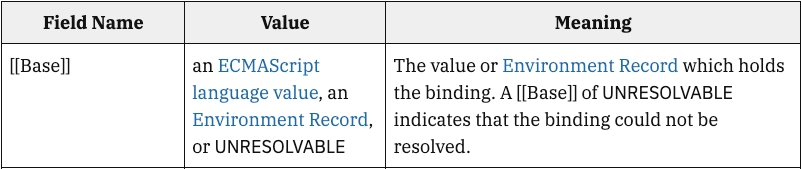
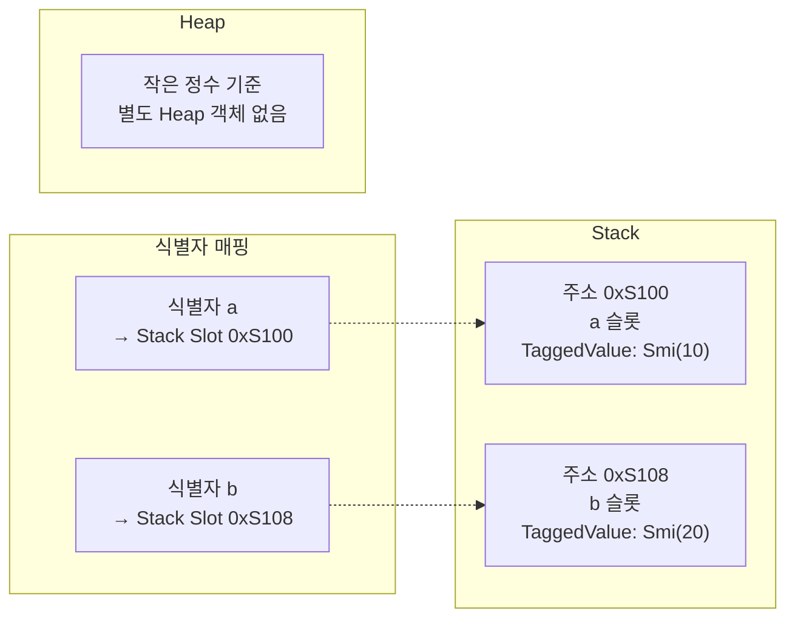
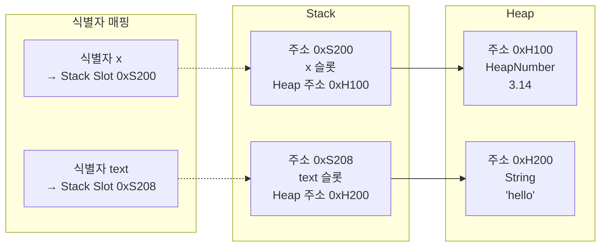
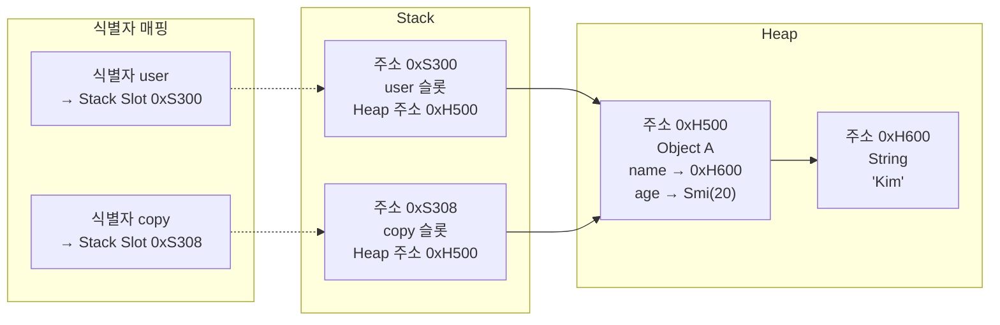
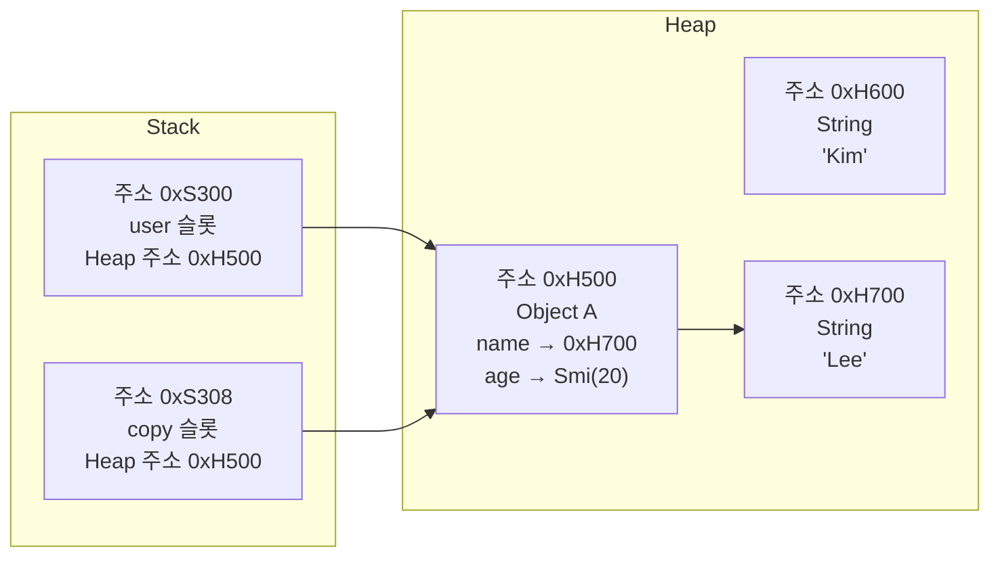

### 흔한 설명의 문제

객체는 힙에 저장, 원시값이 스택에 그대로 저장된다고 할때 다음 2가지의 문제가 생김

→ 메모리 할당 문제, 클로저의 문제

</br>
</br>

#### 메모리 할당 문제

스택에 어떤 값을 저장하기 위해서는 해당 값이 얼만큼의 크기를 가지고 있는지를 미리 알아야 함

→ 스택은 크기가 정해진 블록들을 미리 쌓아 두는 구조

하지만 Javascript는 동적 타입 언어이기 때문에 변수에 할당되는 값의 타입이 언제든지 바뀔 수 있음

또한 Javascript는 실행 컨텍스트 생성 시점에 모든 변수 선언을 최상단으로 끌어올리고 메모리 할당 작업을 하기 때문에 얼만큼의 메모리를 할당해야 하는지 아는 것은 더 힘들어짐

</br>
</br>

#### 클로저의 문제

스택에 저장된 값들은 원칙적으로 함수가 종료되어서 콜스택에서 사라짐과 동시에 없어져야 함

하지만 Javascript에는 클로저가 있기 때문에 함수가 종료되어도 함수 내부의 변수가 메모리에서 사라지지 않아야 하는 경우가 있음

```jsx
// 내부 익명 함수가 count를 참조
// makeCounter 함수는 그 함수를 반환해서 밖으로 내보내 버림
function makeCounter() {
  let count = 0;
  return function() {
    return count++;
  }
}

let counter = makeCounter();
// 내부에서 여전히 count 사용
counter();
```

`count` 를 포함하는 함수인 `makeCounter` 가 이미 콜스택에서 사라짐

→ 내부 변수인 `count` 는 스택의 어디에 남아있어야 하는가?

</br>
</br>

### ECMA-262 명세

모든 Javascript 구현체는 ECMA-262 명세를 따름

ECMA-262 명세는 직접 힙/스택을 설명하지 않고 Execution Context, Environment Record, Reference Record 같은 추상 개념을 통해 식별자 조회와 값 접근 과정을 설명함



`[[Base]]` 필드는 ECMAScript language value, Environment Record, UNRESOLVABLE 중 하나를 가리킴

ECMAScript language value가 값으로 undefined, Null, Boolean, String, Symbol, Number, Object가 이에 해당함

즉, 직접 값을 들고 있는 `[[Value]]` 필드 없이, `[[Base]]` 필드로만 간접적으로 접근함

</br>
</br>

### 저장

Javascript의 값 저장 위치는 명세가 아니라 엔진 구현에 의해 결정됨

실제 엔진은 값을 내부 표현(Tagged Value)으로 관리하며, 상황에 따라 힙에 저장하거나 스택 슬롯에 직접 표현하기도 함

#### 최적화 - 지역 변수

최신 Javascript 엔진들은 보통 함수의 지역 변수들을 스택에 저장함

→ 내부 값 표현을 스택 슬롯이나 레지스터에 저장할 수 있음

변수가 무엇을 가리키건 포인터 하나만큼의 메모리씩만 차지하고 있기에 메모리 할당에 대한 문제도 없고 속도도 빠르기 때문임

</br>
</br>

#### 최적화 - 정수

정수는 프로그램에서 너무 많이 쓰이기 때문에 보통 최신 엔진들은 일정 범위의 부호 있는 정수는 스택에 값 그대로 저장함

이외에도 함수의 호출이 많자여서 특정 부분의 코드가 최적화가 요구될 만큼 **HOT**해지면 ****객체의 특정 프로퍼티를 스택에 저장하는 등 엔진에서 다른 최적화를 하기도 함

</br>
</br>

### 메모리 관점 - 스택, 힙

예시 코드는 다음과 같음

```jsx
let a = 10;
let b = a;
b = 20;

let x = 3.14;
let text = "hello";

const user = {
  name: "Kim",
  age: 20,
};

const copy = user;
```

</br>
</br>

#### 아래 코드를 이해하기전 용어 정리

- **식별자**
    - 코드에 적은 이름
    - `a` , `b` , `user` , `copy`
- **스택 슬롯**
    - 함수 실행 중 지역 값을 저장하는 공간
        - 메모리의 한 칸
    - 식별자와 연결될 수 있음
    - 내부 값 표현이 들어감
- **내부 값 표현**
    - 작은 정수라면 `Smi(10)` 처럼 값 자체일 수 있음
    - 객체나 문자열이라면 Heap 주소일 수 있음
- **힙**
    - 객체, 문자열, 함수, 배열 같은 실제 데이터가 주로 저장되는 영역

</br>
</br>

#### 작은 정수 변수 - 최적화된 실제 엔진 관점



최적화를 위해 엔진이 `a` 라는 식별자를 특정 스택 슬롯에 매핑하고, 그 슬롯에 내부 값 표현이 들어감

</br>
</br>

#### 원시값이 힙을 참조하는 경우



소수, 문자열 같은 값은 힙에 있는 데이터를 참조하는 방식으로 관리될 수 있음

→ 스택 슬롯에 값 자체가 아니라 힙 주소가 들어감

</br>
</br>

#### 객체 선언 시 메모리 구조



객체는 보통 힙에 생성되고, 변수 슬롯에는 그 객체의 주소가 들어감

</br>
</br>

#### 객체 수정 시 메모리 구조

`copy` 객체에 `name` 프로퍼티를 `“Lee”` 로 변경

```mermaid
copy.name = "Lee";
```

</br>



`copy` 슬롯에 들어 있는 `0xH500` 을 따라가 `Heap 0xH500` 에 있는 객체의 `name` 프로퍼티를 수정함

</br>
</br>

### 결론

Javascript의 값 저장 위치는 명세가 아니라 엔진 구현이 결정함

객체는 거의 항상 Heap에 존재하고 원시값은 Heap에 있을 수도 있고 Stack 슬롯에 직접 표현될 수도 있음

따라서 원시값의 진짜값은 Heap에 있고 Stack에는 주소만 있다라고 일반화하면 안 됨