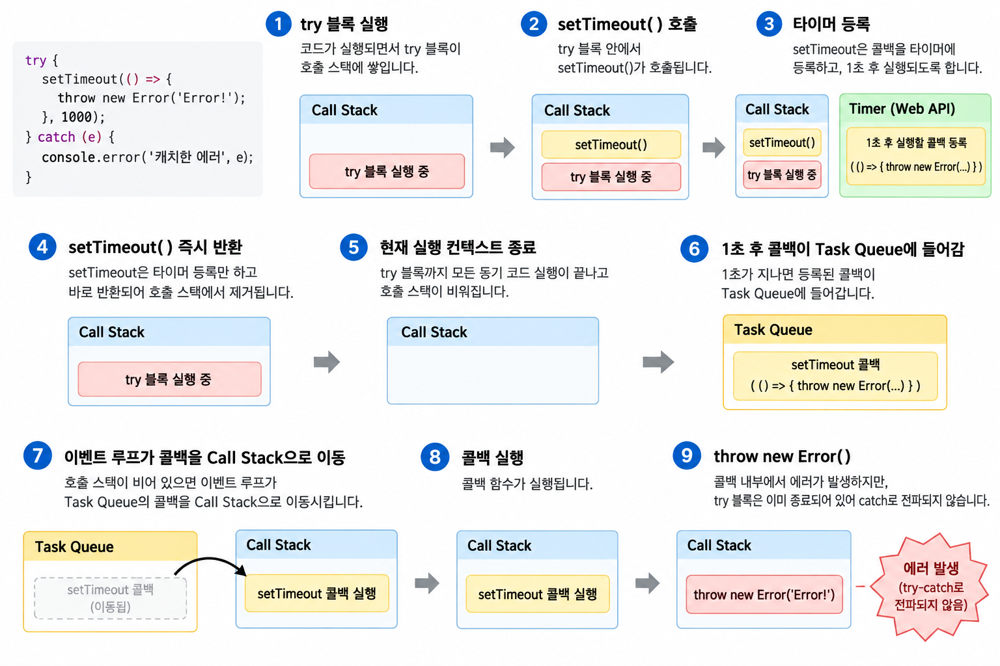
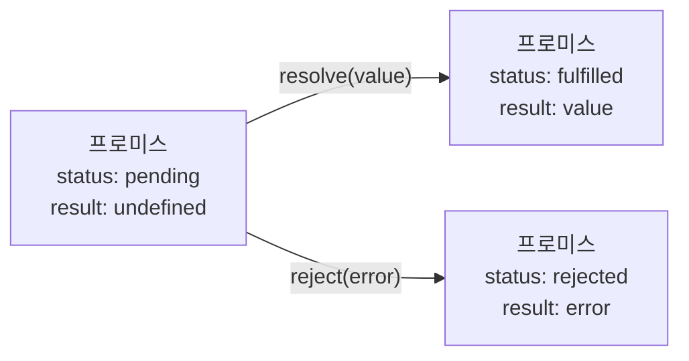
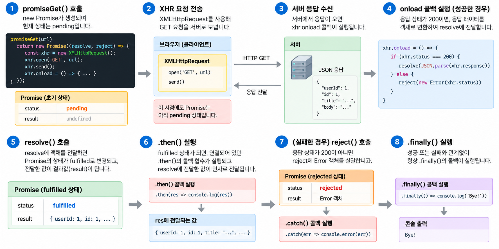

### 기존 비동기 처리를 위한 콜백 함수의 문제

자바스크립트는 비동기 처리를 위한 하나의 패턴으로 콜백 함수를 사용했음

해당 패턴은 콜백 헬로 인해 가독성이 나쁘고 비동기 처리 중 발생한 에러의 처리가 곤란하며 여려 개의 비동기 처리를 한 번에 처리하는 문제가 존재했음

→ 콜백 헬

<br/>

다음 코드는 콜백 헬을 보여주는 코드임

```tsx
get('/step1', a => {
  get(`/step2/${a}`, b => {
    get(`/step3/${b}`, c => {
      get(`/step4/${c}`, d => {
        console.log(d);
      })
    })
  })
})
```

<br/>

또 비동기 처리를 위한 콜백 패턴의 문제점 중에서 가장 심각한 것은 에러 처리가 힘들다는 점임

다음 코드에서 `setTimeout` 함수는 실행되어 콜 스택으로 푸쉬됨

`setTimeout` 는 비동기 함수이므로 즉시 종료되어 콜 스택에서 제거됨

```tsx
try {
  setTimeout(() => { throw new Error('Error!');}, 1000);
} catch (e) {
  console.error('캐치한 에러', e);
}
```

에러는 현재 실행 중인 호출 스택의 호출 관계를 따라 전파됨

하지만 `setTimeout` 에 전달된 콜백 함수는 `setTimeout` 이 종료된 이후 별도의 실행으로 호출됨

<br/>

그림으로 보면 다음과 같음



즉, `setTimeout` 의 콜백이 실행시점에는 `try` 코드가 콜 스택에 존재하지 않아 `try-catch` 까지 전파되지 않음

이를 극복하기 위해 ES6에서 Promise가 도입됨

<br/>
<br/>

### Promise의 생성

`Promise` 생성자 함수를 `new` 연산자와 함께 호출하면 `Promise` 객체를 생성함

`Promise` 생성자 함수는 비동기 처리를 수행할 콜백 함수를 인수로 전달받는데 이 콜백 함수는 `resolve` 와 `reject` 함수를 인수로 전달받음

```tsx
const promise = new Promise((resolve, reject) => {
  if (status === 200) {
    resolve('result');
  } else {
    reject('reject');
  }
})
```

`Promise` 생성자 함수가 인수로 전달받은 콜백 함수 내부에서 비동기 처리를 수행함

이때 비동기 처리 성공시 `resolve` 함수 호출, 실패 시 `reject` 함수를 호출함

<br/>

`Promise` 는 다음과 같이 현재 비동기 처리가 어떻게 진행되고 있는지를 나타내는 상태 정보를 가짐

- `pending`
    - 비동기 처리가 아직 수행되지 않은 상태
- `fulfilled`
    - 비동기 처리가 성공한 상태
- `rejected`
    - 비동기 처리가 실패된 상태

<br/>

그림으로 보면 다음과 같음



즉, `Promise` 는 비동기 처리 상태와 처리 결과를 관리하는 객체임

<br/>
<br/>

### Promise의 후속 처리 메서드

`Promise` 의 비동기 처리 상태가 변화하면 이에 따른 후속 처리가 필요함

이를 위해 `Promise` 는 후속 메서드 `then` , `catch` , `finally` 를 제공함

<br/>

먼저 `then` 메서드는 두 개의 콜백 함수를 인수로 전달받음

`then` 메서드는 언제나 `Promise` 를 반환하고, 콜백 함수가 `Promise` 가 아닌 값을 반환하면 그 값을 암묵적으로 `resolve` 또는 `rejected` 하여 `Promise` 를 생성해 반환함

```tsx
// fulfilled
new Promise(resolve => resolve('fulfilled'))
  .then(v => console.log(v), e => console.error(e));

// rejected
new Promise((_, reject) => reject(new Error('rejected')))
  .then(v => console.log(v), e => console.error(e));
```

첫 번째 콜백 함수는 `Promise` 가 `fulfilled` 상태가 되면 호출되어 `Promise` 의 비동기 처리 결과를 인수로 전달받음

두 번째 콜백 함수는 `Promise` 가 `rejected` 상태가 되면 호출되어 `Promise` 의 에러를 인수로 전달받음

<br/>

`catch` 메서드는 한 개 의 콜백 함수를 인수로 전달받음

`catch` 메서드의 콜백 함수는 `Promise` 가 `rejected` 상태인 경우만 호출됨

```tsx
new Promise((_, reject) => reject(new Error('rejected')))
  .catch(e => console.log(e))
```

`then` 메서드와 마찬가지로 언제나 `Promise` 를 반환함

<br/>

또 `catch` 메서드를 모든 `then` 메서드를 호출한 이후에 호출하면 비동기 처리에서 발생한 에러뿐만 아니라 `then` 메사드 내부에서 발생한 에러까지 모두 캐치할 수 있음

그렇기에 다음처럼 `then` 메서드에 두 번째 콜백 함수를 전달하는 것보다 `catch` 메서드를 사용하는게 에러 처리에 더 가독성이 좋고 명확함

```tsx
promiseGet('https://jsonplaceholder.typicode.com/todos/1')
	.then(res => console.log(res))
	.catch(err => console.err(err));
```

<br/>

`finally` 메서드는 한 개의 콜백 함수를 인수로 전달받음

`finally` 메서드의 콜백 함수는 `Promise` 의 성공 또는 실패와 상관없이 무조건 한 번 호출됨

```tsx
new Promise(() => {})
	.finally(() => console.log('finally')):
```

그렇기에 `Promise` 의 상태와 상관없이 공통적으로 수행해야 할 처리 내용이 있을 때 유용함

`then`/`catch` 메서드와 마찬가지로 언제나 `Promise` 를 반환함

<br/>

지금까지 다룬 후속처리 메서드를 한 번에 사용하면 다음과 같이 사용할 수 있음

```tsx
import { createLogger } from 'vite';

const promiseGet = (url) => {
  return new Promise((resolve, reject) => {
    const xhr = new XMLHttpRequest();
    xhr.open('GET', url);
    xhr.send();
    
    xhr.onload = () => {
      if (xhr.status === 200) {
        resolve(JSON.parse(xhr.response))
      } else {
        reject(new Error(xhr.status))
      }
    }
  })
}

promiseGet('https://jsonplaceholder.typicode.com/posts/1')
  .then(res => console.log(res))
  .catch(err => console.error(err))
  .finally(() => console.log('Bye!'))
```

여기서 `then` 의 `res` 는 `resolve()` 에 전달한 값이며, `Promise` 가 `fulfuilled` 되면 해당 값이 `then` 의 콜백 함수로 전달됨

<br/>

그림으로 보면 다음과 같은 순서로 실행됨



<br/>
<br/>

### 프로미스의 정적 메서드

`Promise` 는 주로 생성자 함수로 사용되지만 함수도 객체이므로 메서드를 가질 수 있음

`Promise` 는 5가지 정적 메서드를 제공함

<br/>

먼저 `Promise.all` 메서드는 여러 개의 비동기 처리를 모두 병렬 처리할 때 사용함

다음 코드는 비동기 처리를 순차적으로 처리하는 코드임

```tsx
const requestData1 = () =>
  new Promise(resolve => setTimeout(() => resolve(1), 3000));

const requestData2 = () =>
  new Promise((resolve) => setTimeout(() => resolve(1), 2000));

const requestData3 = () =>
  new Promise((resolve) => setTimeout(() => resolve(1), 1000));

const res = [];

requestData1()
  .then(data =>{
    res.push(data);
    return requestData2();
  })
  .then(data => {
    res.push(data);
    return requestData3();
  })
  .then(data => {
    res.push(data);
    console.log(res);
  })
  .catch(console.error)
```

다음 코드는 순차적으로 실행되기에 비동기 처리에 총 6초가 소요됨

<br/>

`Promise.all` 메서드를 사용하면 병렬로 처리할 수 있음

`Promise.all` 메서드는 `Promise` 를 요소로 갖는 배열 등의 이터러블을 인수로 전달받음

```tsx
const requestData1 = () =>
  new Promise(resolve => setTimeout(() => resolve(1), 3000));

const requestData2 = () =>
  new Promise((resolve) => setTimeout(() => resolve(1), 2000));

const requestData3 = () =>
  new Promise((resolve) => setTimeout(() => resolve(1), 1000));

Promise.all([requestData1(), requestData2(), requestData3()])
  .then(console.log)
  .catch(console.error)
```

전달받은 모든 `Promise` 가 모두 `fulfilled` 상태가 되면 모든 처리 결과를 배열에 저장해 새로운 프로미스를 반환함

만약 하나라도 `rejected` 상태가 되면 즉시 종료됨

<br/>

`Promise.race` 메서드는 가장 먼저 `fulfilled` 상태가 된 `Promise` 의 처리 결과를 `resolve` 하는 새로운 `Promise` 를 반환함

```tsx
Promise.race([
  new Promise((resolve) => setTimeout(() => resolve(1), 3000)),
  new Promise((resolve) => setTimeout(() => resolve(1), 2000)),
  new Promise((resolve) => setTimeout(() => resolve(1), 1000)),
])
  .then(console.log). // 3
  .catch(console.log)
```

<br/>

마지막으로 `Promise.allSettled` 메서드는 인수로 전달받은 모든 프로미스들의 처리 결과를 모두 가짐

```tsx
Promise.allSettled([
  new Promise(resolve => setTimeout(() => resolve(1), 2000)),
  new Promise((_, reject) => setTimeout(() => reject(new Error('Error!')), 1000))
]).then(console.log)
/*
[
  {status: "fulfilled", value: 1},
  {status: "rejected", reason: Error! at <anonymous>:3:54}
]
 */
```

<br/>

### fetch

`fetch` 함수는 `XMLHttpRequest` 객체와 마찬가지로 HTTP 요청 전송 기능을 제공하는 Web API임

`XMLHttpRequest` 방식보다 사용하기 간단하고 `Promise` 를 지원함

<br/>

`fetch` 함수에는 HTTP 요청을 전송할 URL과 HTTP 요청 메서드, HTTP 요청 헤더, 페이로드 등을 설정한 객체를 전달함

```tsx
const promise = fetch(url [, optuins])
```

`fetch` 함수는 HTTP 응답을 나타내는 `Response` 객체를 래핑한 `Promise` 객체를 반환함

<br/>

다음은 `fetch` 함수를 통해 HTTP 요청을 전송하는 예시 코드임

`fetch` 함수에 첫 번째 인수로 HTTP 요청을 전송할 URL과 두 번째 인수로 HTTP 요청 메서드, HTTP 요청 헤더, 페이로드 등을 설정한 객체를 전달함

```tsx
const request = {
  get(url) {
    return fetch(url);
  },
  post(url, payload) {
    return fetch(url, {
      method: 'POST',
      headers: { 'content-Type': 'application/json' },
      body: JSON.stringify(payload),
    });
  },
  patch(url, payload) {
    return fetch(url, {
      method: 'PATCH',
      headers: { 'content-Type': 'application/json'},
      body: JSON.stringify(payload)
    })
  },
  delete(url) {
    return fetch(url, { method: 'DELETE' })
  }
}
```

<br/>

다음과 같이 위 래퍼 객체를 통해 사용할 수 있음

```tsx
// GET
request.get('https://jsonplaceholder.typicode.com/todos/1')
  .then(response => response.json())
  .then(todos => console.log(todos))
  .catch(err => console.error(err));

// POST
request.post('https://jsonplaceholder.typicode.com/todos', {
  userId: 1,
  title: 'JavaScript',
  completed: false
}).then(response => response.json())
  .then(todos => console.log(todos))
  .catch(err => console.error(err))

// PATCH
request.patch('https://jsonplaceholder.typicode.com/todos/1', {
  completed: true
}).then(response => response.json())
  .then(todos => console.log(todos))
  .catch(err => console.error(err))

// DELETE
request.delete('https://jsonplaceholder.typicode.com/todos/1',)
  .then((response) => response.json())
  .then((todos) => console.log(todos))
  .catch((err) => console.error(err))
```

<br/>