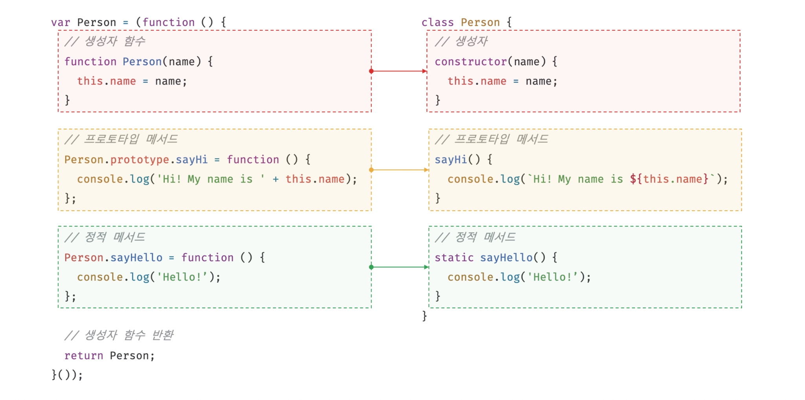
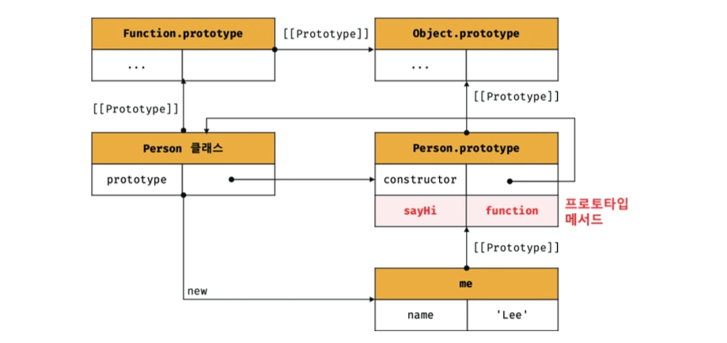
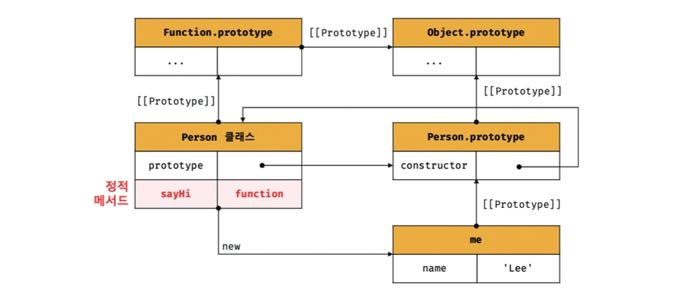
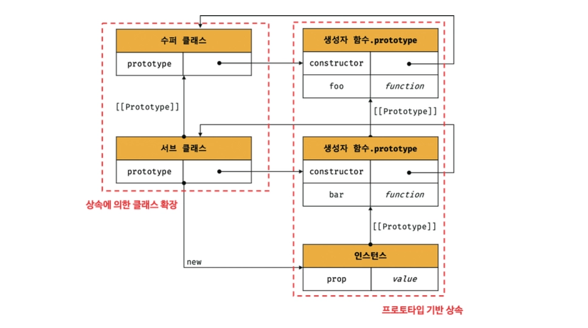
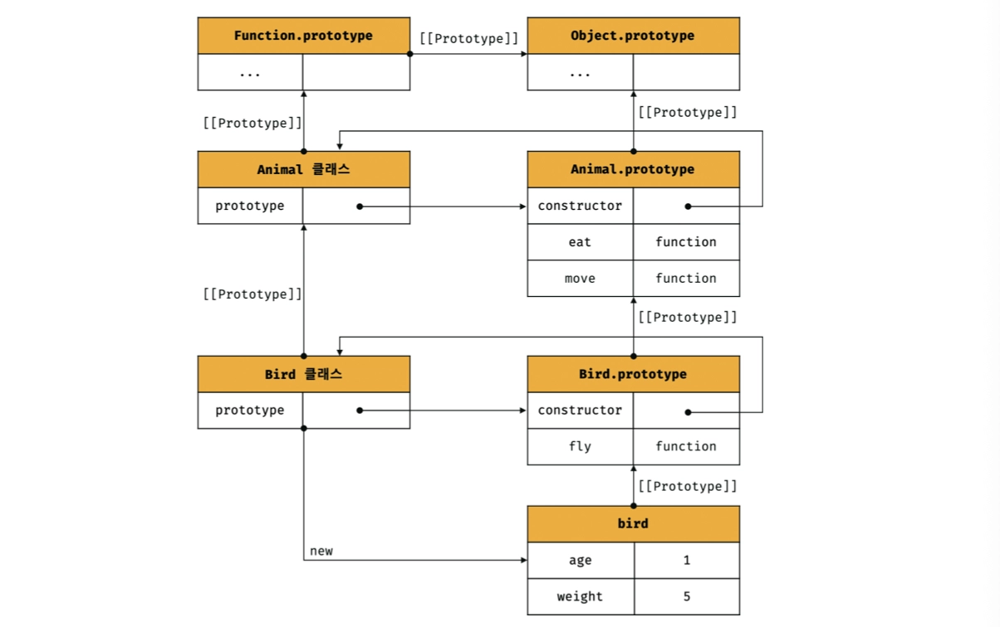
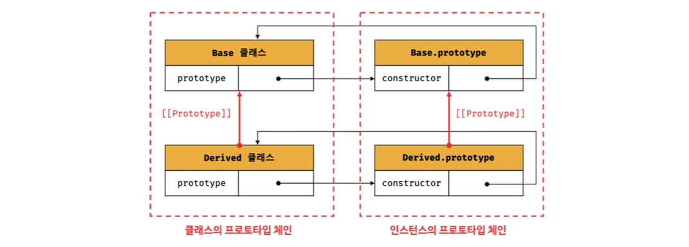

### 클래스란?

ES6에서 도입된 클래스는 기존 프로토타입 기반 객체지향 프로그래밍보다 자바나 C#과 같은 클래스 기반 객체지향 프로그래밍에 익숙한 프로그래머가 더운 빠르게 학습할 수 있도록 새로운 객체 생성 메커니즘을 제시함

클래스는 함수이며 기존 프로토타입 기반 패턴을 클래스 기반 패턴처럼 사용할 수 있도록 하는 문법적 설탕임

<br/>

클래스 생성자 함수와 매우 유사하게 동작하지만 다음과 같이 몇 가지 차이가 있음

- 클래스를 `new` 연산자 없이 호출하면 에러가 발생함
- 클래스는 상속을 지원하는 `extends` 와 `super` 키워드를 제공함
- 클래스는 호이스팅이 발생하지 않는 것처럼 동작함
- 클래스 내의 모든 코드에는 암묵적으로 strict mode가 지정되어 실행되며 해제할 수 없음
- 클래스의 constructor, 프로토타입 메서드, 정적 메서드는 모두 프로퍼티 어트리뷰트 `[[Enumerable]]` 의 값이 `false` 임

<br/>
<br/>

### 클래스 정의

클래스는 `class` 키워드를 사용하여 정의함

클래스 이름은 생성자 함수와 마찬가지로 파스칼 케이스를 사용하는 것이 일반적임

```tsx
class Person {}
```

<br/>

클래스를 표현식으로 정의할 수도 있음

→ 일급 객체라는 것을 의미함

그렇기에 클래스는 일급 객체로서 다음과 같은 특징을 가짐

- 무명의 리터럴로 생성할 수 있음
    - 런타임에 생성이 가능함
- 변수나 자료구조에 저장할 수 있음
- 함수의 매개변수에게 전달할 수 있음
- 함수의 반환값으로 사용할 수 있음

<br/>

클래스 몸체에는 0개 이상의 메서드만 정의할 수 있고 `constructor` , 프로토타입 메서드, 정적 메서드 세 가지가 있음

```tsx
class Person {
  // 생성자
  constructor(name) {
    this.name = name;
  }

  // 프로토타입 메서드
  sayHi() {
    console.log(`Hi! My name is ${this.name}`);
  }

  // 정적 메서드
  static sayHello() {
    console.log('Hello!');
  }
}

const me = new Person('Lee');

console.log(me.name);
me.sayHi();
Person.sayHello();
```

<br/>

클래스와 생성자 함수의 정의 방식을 비교해 보면 다음과 같음



<br/>
<br/>

### 클래스 호이스팅

클래스는 함수로 평가되기에 런타임 이전에 먼저 평가되어 함수 객체를 생성함

```tsx
class Person {};

console.log(typeof Person);  // function
```

이때 클래스가 평가되어 생성된 함수 객체는 생성자 함수로서 호출할 수 있는 constructor임

→ 함수 객체를 생성하는 시점에 프로토타입도 더불어 생성됨

<br/>

단, 클래스는 클래스 정의 이전에 참조할 수 없음

```tsx
console.log(typeof Person);

class Person {}  // ReferenceError: Cannot access 'Person' before initialization
```

클래스 선언문도 변수 선언, 함수 정의와 마찬가지로 호이스팅되지만 `let` , `const` 키워드로 선언한 변수처럼 호이스팅됨

→ TDZ에 빠짐

<br/>
<br/>

### 인스턴스 생성

클래스는 생성자 함수이기에 `new` 연산자와 함께 호출되어 인스턴스를 생성함

클래스는 인스턴스를 생성하는 것이 유일한 존재 이유이므로 반드시 `new` 연산자와 함께 호출해야함

```tsx
class Person {}

const me = Person();  // TypeError: Class constructor Person cannot be invoked without 'new'
```

<br/>
<br/>

### constructor

`constructor` 는 인스턴스를 생성하고 초기화하기 위한 특수한 메서드임

```tsx
class Person {
  constructor(name) {
    this.name = name;
  }
}
```

생성자 함수와 마찬가지로 `constructor` 내부의 `this` 는 클래스가 생성한 인스턴스를 가리킴

`constructor` 는 메서드로 해석되는 것이 아니라 클래스가 평가되어 생성한 함수 객체 코드의 일부가 됨

즉, 클래스 정의가 평가되면 `constructor` 의 기술된 동작을 하는 함수 객체가 생성됨

그렇기에 클래스 내에 최대 한 개만 존재할 수 있음

<br/>

또, `constructor` 는 생략할 수 있음

생략시 클래스에 빈 `constructor` 가 암묵적으로 정의됨

```tsx
class Person {}

// 다음과 같이 constructor가 암묵적으로 정의
class Person {
	constructor() {}
}

const me = new Person();
console.log(me);  // Person {}
```

`constructor` 를 생략하면 클래스는 빈 `constructor` 에 의해 빈 객체를 생성함

<br/>

프로퍼티가 추가되어 초기화된 인스턴스를 생성하려면 `constructor` 내부에서 `this` 에 인스턴스 프로퍼티를 추가해야함

```tsx
class Person {
  constructor() {
    this.name = 'Lee';
    this.address = 'Seoul'
  }
}

const me = new Person();
console.log(me);  // Person { name: 'Lee', address: 'Seoul' }
```

<br/>

만약 인스턴스를 생성할 때 클래스 외부에서 인스턴스 프로퍼티의 초기값을 전달하려면 `constructor` 에 매개변수를 선언하고 인스턴스를 생성할 때 초기값을 전달해야함

```tsx
class Person {
  constructor(name, address) {
    this.name = name;
    this.address = address;
  }
}

const me = new Person('Lee', 'Seoul');
console.log(me);
```

초기값은 `constructor` 의 매개변수에게 전달됨

따라서 인스턴스를 초기화하려면 `constructor` 를 생략해서는 안 됨

<br/>

또 기존에 살펴봤던 생성자 함수의 인스턴스 생성 과정에서 `new` 연산자와 함께 클래스가 호출되면 생성자 함수와 동일하게 암묵적으로 인스턴스를 반환하기 때문임

```tsx
class Person {
	constructor(name) 
		this.name = name;
	
		return {};
	}
}

const me = new Person('Lee');
console.log(me);  // {}
```

만약 `this` 가 아닌 다른 객체를 명시적으로 반환하면 인스턴스가 반환되지 못하고 `return` 문에 명시한 객체가 반환됨

하지만 명시적으로 원시값을 반환하면 원시값 반환은 무시되고 암묵적으로 `this` 가 반환됨

<br/>
<br/>

### 프로토타입 메서드

생성자 함수를 사용하여 인스턴스를 생성하는 경우 프로토타입 메서드를 생성하기 위해서는 다음과 같이 작성했음

```tsx
function Person(name) {
  this.name = name;
}

Person.prototype.sayHi = function() {
  console.log(`Hi! My name is ${this.name}`);
}

const me = new Person('Lee');
me.sayHi()  // Hi! My name is Lee
```

<br/>

하지만 클래스 몸체에서 정의한 메서드는 생성자 함수에 의한 객체 생성 방식과는 다르게 클래스의 `prototype` 프로퍼티에 메서드를 추가하지 않아도 기본적으로 프로토타입 메서드가 됨

```tsx
class Person {
  constructor(name) {
    this.name = name;
  }

  sayHi() {
    console.log(`Hi! My name is ${this.name}`);
  }
}

const me = new Person('Lee');
me.sayHi();
```

클래스가 생성한 인스턴스는 프로포타입 체인의 일원이 됨

<br/>

그림으로보면 다음과 같음



이처럼 클래스 몸체에서 정의한 메서드는 인스턴스의 프로토타입에 존재하는 프로토타입 메서드가 됨

<br/>
<br/>

### 정적 메서드

정적 메서드는 인스턴스를 생성하지 않아도 호출할 수 있는 메서드를 말함

생성자 함수의 경우 정적 메서드를 생성하기 위해서는 다음과 같이 명시적으로 생성자 함수에 메서드를 추가했음

```tsx
function Person(name) {
  this.name = name;
}

Person.sayHi = function() {
  console.log('Hi!');
}

Person.sayHi();
```

<br/>

클래스에서는 메서드에 `static` 키워드를 붙이면 정적 메서드가 됨

```tsx
class Person {
  constructor(name) {
    this.name = name;
  }

  static sayHi() {
    console.log('Hi!');
  }
}
```

<br/>

그림으로 보면 다음과 같음



정적 메서드는 클래스에 바인딩된 메서드가 되어 클래스 정의 이후 인스턴스를 생성하지 않아도 호출할 수 있음

하지만 정적 메서드가 바인딩된 클래스는 인스턴스의 프로토타입 체인상에 존재하지 않기 때문에 인스턴스로 정적 메서드를 호출할 수 없음

<br/>
<br/>

### 클래스 필드

클래스 필드는 인스턴스가 생성될 때 자동으로 추가되는 인스턴스 프로퍼티를 선언하는 문법임

```tsx
class Person {
  name = 'Lee';
  age = 20;
}

const me = new Person();
console.log(me);  // Person { name: 'Lee', age: 20 }
```

클래스 필드에 선언한 프로퍼티는 인스턴스가 생성될 때 자동으로 초기화되며, 별도로 `constructor` 내부에서 `this` 에 프로퍼티를 추가하지 않아도 됨

하지만 클래스 필드는 모든 인스턴스가 공통으로 가지는 기본값을 선언하는 용도로 사용하는 것이 적합함

<br/>

반면 인스턴스를 생성할 때마다 다른 초기값을 전달해야 하는 경우에는 `constructor` 에서 초기화해야 함

```tsx
class Person {
  name = '';

  constructor(name) {
    this.name = name;
  }
}

const me = new Person('Lee');
console.log(me);  // Person { name: 'Lee' }
```

이 경우 인스턴스 생성 과정은 다음과 같이 진행됨

- 빈 인스턴스가 생성됨
- 클래스 필드가 먼저 초기화됨
- `constructor` 가 실행되어 인스턴스를 초기화함

<br/>

따라서 클래스 필드와 `constructor` 에 동일한 프로퍼티를 정의하면 `constructor` 에서 대입한 값이 최종적으로 저장됨

```tsx
class Person {
  name = '';

  constructor(name) {
    this.name = name;
  }
}

const me = new Person('Lee');
console.log(me);  // Person { name: 'Lee' }
```

즉, 클래스 필드는 모든 인스턴스가 공통으로 가지는 기본 상태를 선언할 때 사용하고, `constructor` 는 인스턴스를 생성하면서 전달받은 값이나 초기화 로직을 수행할 때 사용하는 것이 일반적임

<br/>
<br/>

### private 필드 정의 제안

클래스는 생성자 함수와 마찬가지로 다른 클래스 기반 객체지향 언어에서는 지원하는 `private` , `public` , `protected` 키워드와 같은 접근 제한자를 지원하지 않음

즉, 언제나 `public` 임

하지만 현재는 다음과 같이 `private` 필드를 지원함

```tsx
class Person {
  #name = '';
  
  constructor(name) {
    this.#name = name;
  }
}

const me = new Person('Lee');

console.log(me.#name);
```

`private` 필드의 선두에 `#` 을 붙여주면 됨

<br/>

`private` 필드는 반드시 클래스 몸체에 정의해야하고 접근자 프로퍼티를 통해서만 간접적으로 접근할 수 있음

```tsx
class Person {
  #name = '';

  constructor(name) {
    this.#name = name;
  }

  get name() {
    return this.#name.trim();
  }
}

const me = new Person('Lee');
console.log(me.name);  // Lee
```

또, `private` 필드는 반드시 클래스 몸체에 정의해야하고 `constructor` 에 직접 정의하면 에러가 발생함

<br/>
<br/>

### 상속에 의한 클래스 확장

기존에 다뤘던 프로토타입 기반 상속은 프로토타입 체인을 통해 다른 객체의 자산을 상속받는 개념이지만 상속에 의한 클래스 확장은 기존 클래스를 상속받아 새로운 클래스를 확장하여 정의하는 것임



상속을 사용하면 상위 클래스의 속성을 그대로 사용하면서 자신만의 고유한 속성만 추가하여 확장할 수 있음

<br/>

다음은 상속을 통해 `Animal` 클래스를 확장한 `Bird` 클래스 예시 코드임

`extends` 키워드를 통해 다른 클래스를 확장할 수 있음

```tsx
class Animal {
  constructor(age, weight) {
    this.age = age;
    this.weight = weight;
  }

  eat() { return 'eat'}

  move() { return 'move'}
}

class Bird extends Animal {
  fly() { return 'fly'}
}

const bird = new Bird(1, 5)

console.log(bird);
console.log(bird instanceof Bird);
console.log(bird instanceof Animal);

console.log(bird.eat());
console.log(bird.move());
console.log(bird.fly());
```

상속을 통해 확장된 클래스를 서브클래스라고 부르고, 서브클래스에게 상속된 클래스를 수퍼클래스라 부름

→ `Animal` 은 수퍼클래스, `Bird` 는 서브클래스임

<br/>

그림으로 보면 다음과 같음



<br/>

수퍼클래스와 서브클래스는 인스턴스의 프로토타입 체인뿐 아니라 클래스 간의 프로토타입 체인도 생성함



이를 통해 프로토타입 메서드, 정적 메서드 모두 상속이 가능함

<br/>

또, `extends` 키워드 다음에는 `[[Construct]]` 내부 메서드를 갖는 함수 객체로 평가될 수 있는 모든 표현식을 사용할 수 있음

```tsx
function Base1() {}

class Base2 {}

let condition = true;

class Derived extends (condition ? Base1 : Base2) {}

const derived = new Derived();
console.log(derived);

console.log(derived instanceof Base1);
console.log(derived instanceof Base2);
```

이를 통해 동적으로 상속받을 대상을 결정할 수 있음

<br/>

앞서 클래스에서 `constructor` 를 생략하면 클래스에 비어 있는 `constructor` 가 암묵적으로 정의되었음

```tsx
class Base {}

class Derived extends Base {}
```

<br/>

위 예제의 클래스에는 다음과 같이 암묵적으로 `constructor` 가 정의됨

```tsx
class Base {
	constructor() {}
}

class Derived extends Base {
	constructor(...args) { super(...args) }
}

const derived = new Derived();
console.log(derived);  // Derived {}
```

`args` 는 `new` 연산자와 함께 클래스를 호출할 때 전달한 인수의 리스트임

이때, `super` 키워드는 함수처럼 호출할 수도 있고 `this` 와 같이 식별자처럼 참조할 수 있는 특수한 키워드임

<br/>

`super` 를 호출하면 수퍼클래스의 `constructor(super-constructor)` 를 호출함

→ `super` 는 반드시 서브클래스의 `constructor` 에서만 호출해야함

즉, 수퍼클래스의 `constructor` 내부에서 추가한 프로퍼티를 그대로 갖는 인스턴스를 생성함

그렇기에 수퍼클래스에서 추가한 프로퍼티와 서브클래스에서 추가한 프로퍼티를 갖는 인스턴스를 생성한다면 서브클래스의 `constructor` 를 생략할 수 없음

<br/>

그렇기에 `new` 연산자와 함께 서브클래스를 호출하면서 전달한 인수 중에서 수퍼클래스의 `constructor` 에 전달할 필요가 있는 인수는 서브클래스의 `constructor` 에서 호출하는 `super` 를 통해 전달함

```tsx
class Base {
  constructor(a, b) {
    this.a = a;
    this.b = b;
  }
}

class Derived extends Base {
  constructor(a, b, c) {
    super(a, b);
    this.c = c;
  }
}

const derived = new Derived(1, 2, 3);
console.log(derived);  // Derived { a: 1, b: 2, c: 3 }
```

<br/>

서브클래스에서 부모 메서드를 오버라이드(재정의)한 후, 그 메서드 내부에서 부모의 구현을 호출하려면 `super` 를 사용해야함

```tsx
class Base {
  constructor(name) {
    this.name = name;
  }
  
  sayHi() {
    return `Hi ! ${this.name}`;
  }
}

class Derived extends Base {
  sayHi() {
    return `${super.sayHi()}. how are you doing?`;
  }
}

const derived = new Derived('Lee');
console.log(derived.sayHi());
```

<br/>