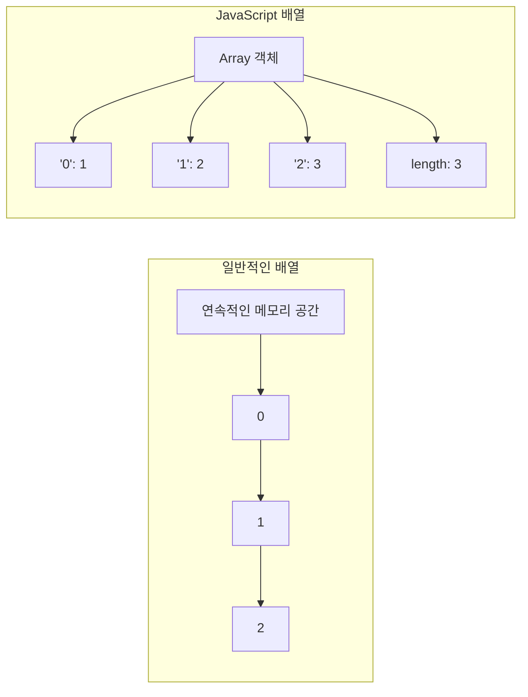

### 배열

배열은 여러 개의 값을 순차적으로 나열한 자료구조임

배열을 만드는 가장 쉬운 방법은 배열 리터럴을 사용하는 것임

```tsx
const arr = ['apple', 'banana', 'orange'];
```

배열이 가지고 있는 값을 요소라 부르고 자바스크립트의 모든 값이 요소가 될 수 있음

→ 객체, 함수 다 가능함

<br/>

요소에 접근할 때는 대괄호 표기법을 사용함

```tsx
arr[0];  // -> 'apple'
arr[1];  // -> 'banana'
arr[2];  // -> 'orange'
```

만약 존재하지 않는 요소에 접근하면 `undefined` 가 반환됨

→ 존재하지 않는 프로퍼티 키로 객체의 프로퍼티에 접근했을 때 `undefined` 를 반환하는 것과 같은 맥락

<br/>

또, 배열은 요소의 개수, 즉 배열의 길이를 나타내는 `length` 프로퍼티를 가짐

```tsx
arr.length  // -> 3
```

`length` 프로퍼티의 값은 배열에 요소를 추가하거나 삭제하면 자동 갱신됨

<br/>

`length` 프로퍼티 값은 요소의 개수, 즉 배열의 길이를 바탕으로 결정되지만 임의의 숫자 값을 명시적으로 할당할 수도 있음

```tsx
const arr = [1, 2, 3];
console.log(arr.length);  // 3

arr.push(4);
console.log(arr.length);  // 4

arr.pop();
console.log(arr.length);  // 3
```

<br/>

만약, 현재 `length` 프로퍼티 값보다 작은 숫자 값을 할당하면 배열의 길이가 줄어듬

```tsx
const arr = [1, 2, 3, 4, 5];

arr.length = 3;

console.log(arr);  // [ 1, 2, 3 ]
```

<br/>

하지만 현재 `length` 프로퍼티 값보다 큰 숫자 값을 할당하는 경우에는 `length` 프로퍼티 값은 변경되지만 실제로 배열의 길이가 늘어나지는 않음

```tsx
const arr = [1];

arr.length = 3;

console.log(arr.length);  // 3
console.log(arr);  // [ 1, <2 empty items> ]
```

해당 `<2 empty items>` 이 바로 뒤에서 다룰 희소 배열임

하지만 이는 좋은 방법은 아니므로 배열에는 같은 타입의 요소를 연속적으로 위치시키는 것이 최선임

<br/>

배열은 객체지만 일반 객체와는 구별되는 특징이 있음

- **객체**
    - 프로퍼티와 프로퍼티 값
    - 프로퍼티 키로 값의 참조를 함
    - `length` 프로퍼티 없음
- **배열**
    - 인덱스와 요소
    - 인덱스로 값의 참조를 함
    - `length` 프로퍼티 있음

<br/>

배열의 장점은 처음부터 순차적으로 요소에 접근할 수도 있고, 마지막부터 역순으로 요소에 접근할 수도 있으며, 특정 위치부터 순차적으로 요소에 접근할 수도 있음

```tsx
const arr = [1, 2, 3];

for (let i = 0; i < arr.length; i++) {
  console.log(arr[i]);
}
```

<br/>

또, 배열은 사실 객체이기 때문에 배열의 특정 요소를 삭제하기 위해 `delete` 연산자를 사용할 수 있음

```tsx
const arr = [1, 2, 3];

delete arr[1];
console.log(arr);  // [ 1, <1 empty item>, 3 ]
```

<br/>

위에 예시처럼 희소 배열을 만들지 않으면서 배열의 특정 요소를 완전히 삭제하려면 `Array.prototype.slice` 메서드를 사용해야함

```tsx
const arr = [1, 2, 3];

arr.splice(1, 1);
console.log(arr);  // [ 1, 3 ]
```

<br/>
<br/>

### 자바스크립트 배열은 배열이 아님

자료구조에서 말하는 배열은 동일한 크기의 메모리 공간이 빈틈없이 연속적으로 나열된 자료구조를 말함

따라서 인덱스를 이용하면 요소의 메모리 주소를 바로 계산할 수 있어 O(1)의 시간 복잡도로 요소에 접근할 수 있음



하지만 자바스크립트의 배열은 자료구조에서 말하는 일반적인 배열이 아니라 배열처럼 동작하도록 구현된 특수한 객체임

→ 배열의 인덱스가 프로퍼티 키, 요소는 프로퍼티 값임

<br/>

또 자바스크립트에서의 배열은 요소가 반드시 연속적으로 존재할 필요도 없음

```tsx
const arr = [];

arr[0] = 1;
arr[2] = 3;
```

이처럼 중간에 요소가 비어 있는 배열을 희소 배열이라고 함

즉, 자바스크립트 배열은 일반적인 배열이 아니라 배열의 동작을 구현한 특수한 객체이며, 인덱스를 이용한 빠른 접근과 베열의 편의 기능을 제공하는 자료구조라고 볼 수 있음

<br/>
<br/>

### 배열의 생성

`Object` 생성자 함수를 통해 객체를 생성할 수 있듯이 `Array` 생성자 함수를 통해 배열을 생성할 수도 있음

전달된 인수가 1개이고 숫자인 경우 `length` 프로퍼티 값이 인수인 배열을 생성하고 2개 이상이거나 숫자가 아닌 경우 인수를 요소로 갖는 배열을 생성함

```tsx
const arr1 = new Array(10);

console.log(arr1);  // [ <10 empty items> ]

const arr2 = new Array(1, 2, 3);

console.log(arr2);  // [ 1, 2, 3 ]
```

<br/>

`Array.of` 메서드는 전달된 인수를 요소로 갖는 배열을 생성함

`Array` 생성자 함수와 다르게 전달된 인수가 1개이고 숫자이더라도 인수를 요소로 갖는 배열을 생성함

```tsx
console.log(Array.of(1));  // [ 1 ]

console.log(Array.of(1, 2, 3));  // [ 1, 2, 3 ]

console.log(Array.of('string'));  // [ 'string' ]
```

<br/>

`Array.from` 메서드는 유사 배열 객체 또는 이터러블 객체를 인수로 전달받아 배열로 변환하여 반환함

```tsx
console.log(Array.from({ length: 2, 0: 'a', 1: 'b' }));  // [ 'a', 'b' ]

console.log(Array.from('Hello'));  // [ 'H', 'e', 'l', 'l', 'o' ]
```

<br/>
<br/>

### 배열 메서드

배열에는 원본 배열을 직접 변경하는 메서드와 원본 배열을 직접 변경하지 않고 새로운 배열을 생성하여 반환하는 메서드가 있음

```tsx
const arr = [1];

// 원본 배열 arr을 직접 변경
arr.push(2);
console.log(arr);  // [ 1, 2 ]

// 새로운 배열을 생성하여 반환함
const result = arr.concat(3);
console.log(arr);  // [ 1, 2 ]
console.log(result);  // [ 1, 2, 3 ]
```

원본 배열을 직접 변경하는 메서드는 외부 상태를 직접 변경하는 부수 효과가 있으므로 주의해야함

가급적 원본 배열을 직접 변경하지 않는 메서드를 사용해야함

<br/>

가장 먼저 알아볼 메서드는 `Array.prototype.includes` 임

해당 메서드는 원본 배열에서 인수로 전달된 요소를 검색하여 인덱스를 반환함

```tsx
const foods = ['apple', 'banana', 'orange'];

if (!foods.includes('orange')) {
  foods.push('orange');
} else {
  console.log(foods);
}
```

전달한 요소와 중복되는 요소가 여러 개 있다면 첫 번째로 검색된 요소의 인덱스를 반환하고 존재하지 않으면 `-1` 을 반환함

<br/>

그 다음은 `Array.prototype.push` 메서드임

해당 메서드는 인수로 전달받은 모든 값을 원본 배열의 마지막 요소로 추가하고 변경된 `length` 프로퍼티 값을 반환함

→ 직접 변경

```tsx
const arr = [1, 2];

let result = arr.push(3, 4);
console.log(result);  // 4

console.log(arr);  // [1, 2, 3, 4]
```

직접 변경하는 `push` 메서드보다는 스프레드 문법을 사용하는 편이 좋음

<br/>

`Array.prototype.pop` 메서드는 원본 배열에서 마지막 요소를 제거하고 제거한 요소를 반환함

마찬가지로 원본 배열을 직접 변경하고 빈 배열이라면 `undefined` 를 반환함

```tsx
const arr = [1, 2];

let result = arr.pop();
console.log(result);  // 2

console.log(arr);  // [1]
```

<br/>

`Array.prototype.unshif` 메서드는 인수로 전달받은 모든 값을 원본 배열의 선두에 요소로 추가하고 변경된 `length` 프로퍼티 값을 반환함

→ 원본 배열 직접 변경

```tsx
const arr = [1, 2];

let result = arr.unshift(3, 4);
console.log(result);  // 4

console.log(arr);  // [3, 4, 1, 2]
```

<br/>

`Array.prototype.shift` 메서드는 원본 배열에서 첫 번째 요소를 제거하고 제거한 요소를 반환함

→ 원본 배열 직접 변경

```tsx
const arr = [1, 2];

let result = arr.shift();
console.log(result);  // 1

console.log(arr);  //[2]
```

<br/>

`Array.prototype.concat` 메서드는 인수로 전달된 값들을 원본 배열의 마지막 요소로 추가한 새로운 배열을 반환함

인수로 전달한 값이 배열인 경우 배열을 해체하여 새로운 배열의 요소로 추가함

원본 배열을 변경시키지 않음

```tsx
const arr1 = [1, 2];
const arr2 = [3, 4];

let result = arr1.concat(arr2);
console.log(result);  // [ 1, 2, 3, 4 ]

result = arr1.concat(3);
console.log(result);  // [ 1, 2, 3 ]

result = arr1.concat(arr2, 5);
console.log(result);  // [ 1, 2, 3, 4, 5 ]

console.log(arr1);  // [ 1, 2 ]
```

<br/>

`Array.prototype.splice` 메서드는 원본 배열의 중간에 요소를 추가하거나 중간에 있는 요소를 제거할 수 있음

3개의 매개변수가 있으며 원본 배열을 직접 변경함

반환값으로는 삭제된 요소들을 담은 배열을 반환함

!image.png

- **start**
    - 시작 인덱스
    - -n이면 마지막에서 n번째 요소를 가리킴
- **deleteCount**
    - 제거할 요소의 개수
    - 0일때는 아무런 요소가 제거되지 않음
- **items**
    - 제거한 위치에 삽입할 요소들의 목록임

<br/>

`Array.prototype.slice` 메서드는 인수로 전달된 범위의 요소들을 복사하여 배열로 반환함

원본 배열은 변경되지 않음

```tsx
const arr= [1, 2, 3];

console.log(arr.slice(0, 1));  // [ 1 ]

console.log(arr.slice(1, 2));  // [ 2 ]

console.log(arr);  // [ 1, 2, 3 ]
```

첫 번째 인수로 전달받은 인덱스부터 두 번째 인수로 전달받은 인덱스 이전까지 요소들을 복사하여 배열로 반환함

두 번째 인수 생략시 첫 번째 인수로 전달받은 인덱스부터 모든 요소를 복사함

생성된 복사본은 얕은 복사를 통해 생성됨

<br/>

`Array.prototype.sort` 메서드는 배열의 요소를 정렬함

원본 배열을 직접 변경하며 정렬된 배열을 반환함

```tsx
const fruits = ['Banana', 'Orange', 'Apple'];
fruits.sort();

console.log(fruits);  // [ 'Apple', 'Banana', 'Orange' ]
```

기본적으로 오름차순으로 요소를 정렬하며 숫자는 유니코드로 비교하기에 정렬 순서를 정의하는 비교 함수를 인수로 전달해야함

<br/>

`Array.prototype.forEach` 메서드는 `for` 문을 대체할 수 있는 고차 함수임

자신의 내부에서 반복문을 실행함

```tsx
const number = [1, 2, 3];
const pows = [];

// 기존 for문 방식
for (let i = 0; i < number.length; i++) {
  pows.push(number[i] ** 2)
}

console.log(pows);

// forEach 방식
number.forEach(item => pows.push(item ** 2))

console.log(pows);
```

`numbers` 배열의 요소가 3개이므로 콜백 함수도 3번 호출됨

<br/>

`Array.prototype.map` 메서드는 자신을 호출한 배열의 모든 요소를 순회하면서 인수로 전달받은 콜백 함수를 반복 호출함

콜백 함수의 반환값들로 구성된 새로운 배열을 반환하고 원본 배열은 변경되지 않음

```tsx
const numbers = [1, 2, 3];

const result = numbers.map(item => item * 2);

console.log(result);
console.log(numbers);
```

<br/>

`Array.prototype.filter` 메서드는 자신을 호출한 배열의 모든 요소를 순회하면서 인수로 전달받은 콜백 함수를 반복 호출함

콜백 함수의 반환값이 `true` 인 요소로만 구성된 새로운 배열을 반환하기에 원본 배열은 변경되지 않음

```tsx
const numbers = [1, 2, 3, 4, 5];

const odds = numbers.filter(item => item % 2);
console.log(odds);
```

<br/>

`Array.prototype.find` 메서드는 자신을 호출한 배열의 요소를 순회하면서 인수로 전달된 콜백 함수를 호출하여 반환값이 `true` 인 첫 번째 요소를 반환함

→ 첫 번째 요소

```tsx
const users = [
  { id: 1, name: 'Lee' },
  { id: 2, name: 'Kim' },
  { id: 2, name: 'Choi' },
  { id: 3, name: 'Park' },
];

console.log(users.find(user => user.id === 2));  // { id: 2, name: 'Kim' }
```

<br/>

`Array.prototype.findIndex` 메서드는 자신을 호출한 배열의 요소를 순회하면서 인수로 전달된 콜백 함수를 호출하여 반환값이 `true` 인 첫 번째 요소의 인덱스를 반환함

→ 첫 번째 인덱스

```tsx
const users = [
  { id: 1, name: 'Lee' },
  { id: 2, name: 'Kim' },
  { id: 2, name: 'Choi' },
  { id: 3, name: 'Park' },
];

console.log(users.find((user) => user.id === 2));  // { id: 2, name: 'Kim' }
```

<br/>
<br/>

### 배열 메서드의 콜백 함수와 this

`forEach` , `map` , `filter` , `find` , `findIndex` 와 같은 배열 고차 함수는 콜백 함수를 전달받아 배열의 요소를 순회하면서 콜백 함수를 반복 호출함

이때 일부 배열 메서드는 콜백 함수 외에 두 번째 인수로 객체를 전달할 수 있으며, 이 객체는 콜백 함수 내부에서 `this` 가 가리키는 객체가 됨

<br/>

기본적인 형태는 다음과 같음

```tsx
array.forEach(callback, thisArg);

array.map(callback, thisArg);

array.filter(callback, thisArg);

array.find(callback, thisArg);

array.findIndex(callback, thisArg);
```

<br/>

예를 들어 다음과 같이 사용할 수 있음

```tsx
const numbers = [1, 2, 3];

const context = {
  multiplier: 10,
};

numbers.forEach(function(item) {
  console.log(item * this.multiplier);
}, context);  // 10 20 30
```

두 번째 인수로 전달한 `context` 가 `this` 가 되기 때문에 `this.multiplier` 는 `context.multiplier` 가 됨

<br/>

다만 화살표 함수는 `thisArg` 의 영향을 받지 않음

화살표 함수는 일반 함수와 달리 자신의 `this` 를 가지지 않고 외부 스코프의 `this` 를 그대로 사용하기 때문임

```tsx
numbers.map(function (item) {
  return item * this.multiplier;
}, context);
```

따라서 `thisArg` 를 이용해 콜백 함수 내부의 `this` 를 지정하려면 일반 함수를 사용해야 함

<br/>