### 노드

HTML 요소는 렌더링 엔진에 의해 파싱되어 DOM을 구성하는 요소 노드 객체로 변환됨


<br/>

HTML 요소의 어트리뷰트는 어트리뷰트 노드로, HTML 요소의 텍스트 콘텐츠는 텍스트 노드로 변환됨

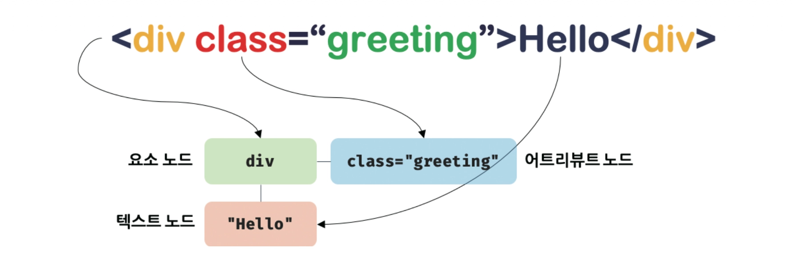

<br/>

HTML 문서는 HTML 요소들의 집합으로 이뤄지기에 중첩 관계에 의해 계층적인 부자 관계가 형성됨

이러한 HTML 요소 간의 부자 관계를 반영하여 HTML 문서의 구성 요소인 HTML 요소를 객체화한 모든 노드 객체들을 트리 자료로 구성함

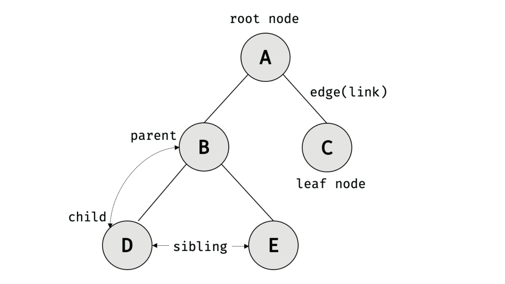

이러한 노드 객체들로 구성된 트리 자료구조를 DOM이라고 함

<br/>

다음 코드는 기본적인 html 예시임

```html
<!DOCTYPE html>
<html>
    <head>
        <meta charset="UTF-8">
        <link rel="stylesheet" href="style.css">
    </head>
    <body>
        <ul>
            <li id="apple">Apple</li>
            <li id="banana">Banana</li>
            <li id="orange">Orange</li>
        </ul>
        <script src="app.js"></script>
    </body>
</html>
```

<br/>

렌더링 엔진은 위 HTML 문서를 파싱하여 다음과 같이 DOM을 생성함

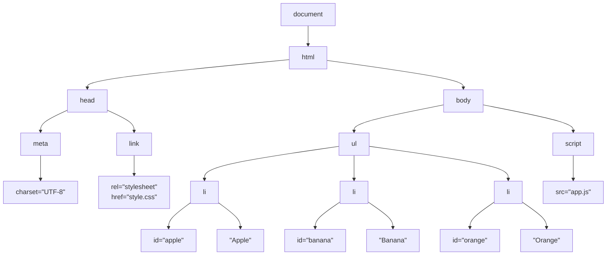

DOM의 최상위에는 `document` 노드가 존재하며, 그 아래에 HTML 문서의 최상위 요소인 `html` 요소 노드가 존재함

`html` 요소 아래에는 `head` 와 `body` 가 자식 노드로 연결되고, 다시 각 요소 내부에 존재하는 HTML 요소들이 자식 노드로 연결됨

<br/>

노드는 종류에 따라 역할이 다름

- **Document Node**
    - DOM 트리의 최상위에 존재하는 `document` 객체를 나타냄
    - HTML 문서 전체를 나타내며 DOM 트리에 접근하기 위한 진입점 역할을 담당함
- **Element Node**
    - HTML 요소를 나타내는 객체
    - 부모 자식 관계를 통해 HTML 문서의 구조를 표현함
- **Attribute Node**
    - HTML 요소의 어트리뷰트를 나타내는 객체
    - Element Node와 연결되어 있지만 자식 노드로 취급되지 않음
- **Text Node**
    - HTML 요소의 텍스트 콘텐츠를 나타내는 객체
    - Element Node의 자식 노드로 존재하며 별도의 자식 노드를 가질 수 없음

이외에도 HTML 주석의 나타내는 Comment Node, 여러 노드를 임시로 묶을 때 사용하는 DocumentFragment Node 등이 존재함

<br/>

노드 객체도 자바스크립트 객체이므로 프로토타입에 의한 상속 구조를 가짐

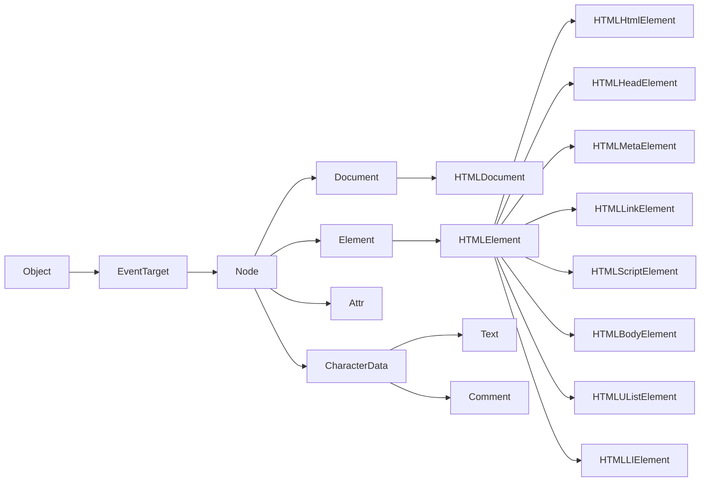

노드 객체는 노드의 종류에 따라 서로 다른 기능을 가지지만, 모든 노드 객체가 공통으로 사용하는 기능도 존재함

노드 객체는 `Object` , `EventTarget` , `Node` 등의 프로토타입 체인을 통해 공통 기능을 상속받으며, 요소 노드와 같이 특정 종류의 노드 객체는 추가적인 프로토타입을 통해 해당 노드에 필요한 기능을 제공받음

<br/>

`input` 요소를 나타내는 노드 객체는 다음과 같은 프로토타입 체인을 가짐

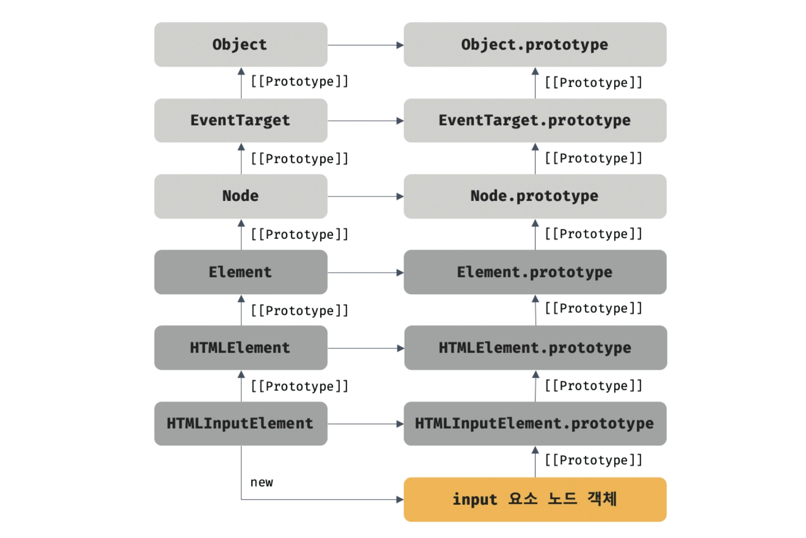

<br/>

그렇기에 `input` 요소 노드 객체에서 `EventTarget.prototype` 에 정의된 메서드 `addEventListener()` 를 호출할 수 있음

```tsx
const $input = document.querySelector('input');

$input.addEventListener('click', () => {
	console.log('click');
});
```

<br/>
<br/>

### DOM API

DOM은 HTML 문서의 계층적 구조와 정보를 표현하는 것뿐만 아니라, 이를 탐색하고 조작할 수 있는 프로퍼티와 메서드를 제공함

이처럼 DOM을 구성하는 노드 객체가 제공하는 프로퍼티와 메서드를 DOM API라고 함

<br/>
<br/>

### 요소 노드 취득

HTML 구조나 내용 또는 스타일 등을 동적으로 조작하려면 먼저 요소 노드를 취득해야함

`Document.prototype.getElementById` 메서드는 인수로 전달한 `id` 어트리뷰트 값을 갖는 하나의 요소 노드를 탐색하여 반환함

`id` 값은 HTML 문서 내에서 유일한 값이어야함

```html
<!DOCTYPE html>
<html>
    <body>
        <ul>
            <li id="apple">Apple</li>
            <li id="banana">Banana</li>
            <li id="orange">Orange</li>
        </ul>
        <script>
            const $elem = document.getElementById('banana');
            $elem.style.color = 'red';
        </script>
    </body>
</html>
```

`getElementById` 메서드는 `Document.prototype` 의 프로퍼티이므로 문서 노드인 `document` 를 통해 호출해야함

<br/>

HTML 요소에 `id` 어트리뷰트를 부여하면 `id` 값과 동일한 이름의 전역 변수가 암묵적으로 선언되고 해당 노드 객체가 할당되는 부수 효과가 있음

```html
<!DOCTYPE html>
<html>
    <body>
        <div id="foo"></div>
        <script>
            console.log(foo = document.getElementById('foo'));  // true

            delete foo;
            console.log(foo);  // <div id="foo"></div>
        </script>
    </body>
</html>
```

단, `id` 값과 동일한 이름의 전역 변수가 이미 선언되어 있으면 이 전역 변수에 노드 객체가 재할당되지 않음

<br/>

`Document.prototype.getElementsByTagName` 메서드는 인수로 전달한 태그 이름을 갖는 모든 요소 노드를 탐색하여 HTMLCollection 객체로 반환함

```tsx
const $list = document.getElementsByTagName('li');

console.log($list.length);  // 3
console.log($list[0]);      // <li id="apple">Apple</li>
```

<br/>

다음과 같이 사용할 수 있음

```tsx
const $li = document.getElementsByTagName('li');

for (const elem of $li) {
	elem.style.color = 'red';
}
```

<br/>

`Document.prototype.getElementsByClassName` 메서드는 인수로 전달한 `class` 어트리뷰트 값을 갖는 모든 요소 노드를 탐색하여 `HTMLCollection` 객체로 반환함

```html
<!DOCTYPE html>
<html>
    <body>
        <div class="box"></div>
        <div class="box"></div>
        <div class="text"></div>
        <script>
            const $boxes = document.getElementsByClassName('box');

            console.log($boxes.length);  // 2
        </script>
    </body>
</html>
```

<br/>

태그 이름이나 클래스 이름을 이용한 탐색보다 더 다양한 조건으로 요소를 선택하려면 CSS 선택자를 사용할 수 있음

CSS 선택자는 CSS에서 요소를 선택할 때 사용하는 문법으로 다음과 같이 사용할 수 있음

```css
/* 태그 선택자 */
li

/* 클래스 선택자 */
.box

/* ID 선택자 */
#banana

/* 속성 선택자 */
input[type="text"]

/* 자손 선택자 */
ul li
```

DOM에서는 이러한 CSS 선택자를 이용해 요소 노드를 취득할 수 있도록 `querySelector` 와 `querySelectorAll` 메서드를 제공함

<br/>

`Document.prototype.querySelector` 메서드는 인수로 전달한 CSS 선택자를 만족하는 하나의 요소 노드를 탐색하여 반환함

```tsx
const $banana = document.querySelector('#banana');

console.log($banana);  // <li id="banana">Banana</li>
```

<br/>

여러 요소가 CSS 선택자를 만족하더라도 첫 번째 요소만 반환함

```html
<!DOCTYPE html>
<html>
    <body>
        <ul>
            <li class="fruit">Apple</li>
            <li class="fruit">Banana</li>
            <li class="fruit">Orange</li>
        </ul>
        <script>
            const $fruit = document.querySelector('.fruit');

            console.log($fruit.textContent)  // Apple
        </script>
    </body>
</html>
```

<br/>

반면 `Document.prototype.querySelectorAll` 메서드는 인수로 전달한 CSS 선택자를 만족하는 모든 요소 노드를 탐색하여 NodeList 객체로 반환함

```html
<!DOCTYPE html>
<html>
    <body>
        <ul>
            <li class="fruit">Apple</li>
            <li class="fruit">Banana</li>
            <li class="fruit">Orange</li>
        </ul>
        <script>
            const $fruit = document.querySelectorAll('.fruit');

            console.log($fruit.length)  // 3
        </script>
    </body>
</html>
```

따라서 다음과 같이 여러 요소를 한 번에 조작할 수 있음

```html
<!DOCTYPE html>
<html>
    <body>
        <ul>
            <li class="fruit">Apple</li>
            <li class="fruit">Banana</li>
            <li class="fruit">Orange</li>
        </ul>
        <script>
            const $fruit = document.querySelectorAll('.fruit');

            $fruit.forEach(elem => {
                elem.style.color = 'red';
            })
        </script>
    </body>
</html>
```

<br/>
<br/>

### HTMLCollection과 NodeList

HTMLCollection과 NodeList는 모두 여러 개의 노드 객체를 담는 컬렉션 객체이며, 배열과 유사하게 인덱스로 각 노드에 접근할 수 있고 `for..of` 문을 상요하여 순회할 수 있음

하지만 두 객체의 가장 중요한 차이는 DOM의 변경 사항을 실시간으로 반영하는지 여부임

<br/>

`HTMLCollection` 은 기본적으로 live 객체이므로 컬렉션에 포함된 요소의 상태가 변경되면 그 변경 사항이 `HTMLCollection` 에 즉시 반영됨

```tsx
const #elems = document.getElementsByClassName('red);

$elems[0].className = 'blue';
```

<br/>

위에 코드는 다음과 같이 바뀜

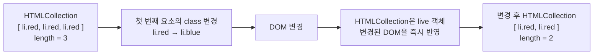

<br/>

실시간으로 바뀌기에 `HTMLCollection` 을 정방향으로 순회하며서 컬렉션의 요소를 변경하면 예상과 다른 결과가 발생할 수 있음

```tsx
const $elems = document.getElementsByClassName('red');

for (let i = 0; i < $elems.length; i++) {
    $elems[i].className = 'blue';
}
```

`#elems[0]` 의 클래스가 `blue` 로 변경되면 `HTMLCollectiion` 에서 실시간으로 제거되기에 두 번째 요소가 `$elems[0]` 으로 이동함

즉, live 객체를 순회하면서 DOM의 상태를 변경하면 컬렉션 자체의 길이와 인덱스가 실시간으로 변경될 수 있음

<br/>

반면 `querySelectorAll()` 이 반환하는 NodeList는 대부분 non-live 객체이므로 기존 NodeList의 내용은 자동으로 변경되지 않음

```tsx
const $elems = document.querySelectorAll('.red');

$elems.forEach(elem => {
    elem.className = 'blue';
});
```

따라서 `querySelectorAll()` 을 통해 여러 요소를 취득한 경우에는 `HTMLCollection` 보다 DOM을 변경하면서 순회하기에 상대적으로 안전함

다만 모든 NodeList가 non-live 인 것은 아니고 `Node.childNodes` 처럼 일부 DOM API가 반환하는 NodeList는 live 객체로 동작함

<br/>
<br/>

### 노드 탐색

요소 노드를 취득한 다음, 취득한 요소 노드를 기점으로 DOM 트리의 노드를 옮겨 다니며 부모, 형제, 자식 노드 등을 탐색해야 할 때가 있음

DOM 트리 상의 노드를 탐색할 수 있도록 `Node` , `Element` 인터페이스는 트리 탐색 프로퍼티를 제공함

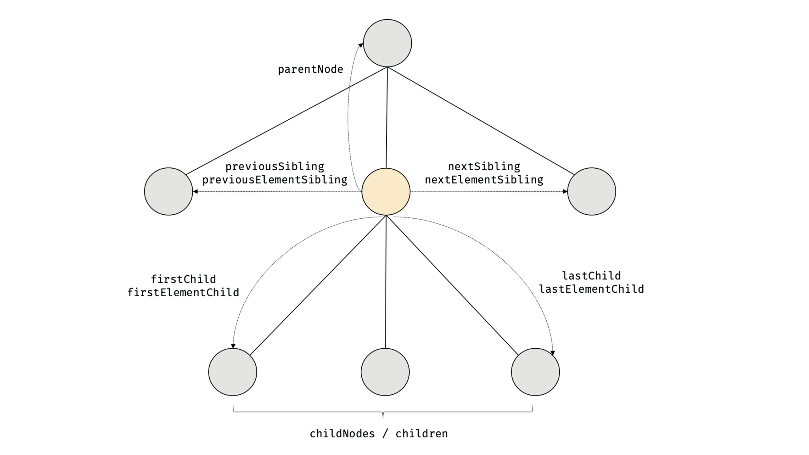

- `Node` 인터페이스
    - 모든 노드가 공통적으로 사용할 수 있는 노드 탐색 프로퍼티를 제공
    - `parentNode`
    - `previousSibling`
    - `firstChild`
    - `childNodes`
- `Element` 인터페이스
    - 요소 노드만을 대상으로 하는 탐색 프로퍼티를 추가로 제공
    - `previousElementSibling`
    - `nextElementSibling`
    - `children`

<br/>

다음과 같이 `fruits` 요소 노드를 취득한 경우 해당 노드를 기준으로 부모, 형제, 자식 노드 등에 접근할 수 있음

```html
<!DOCTYPE html>
<html>
    <body>
        <ul id="fruits">
            <li class="apple">Apple</li>
            <li class="banana">Banana</li>
            <li class="orange">Orange</li>
        </ul>
        <script>
            const $fruits = document.getElementById('fruits');

            console.log($fruits.childNodes);         // NodeList(7)
            console.log($fruits.children);           // HTMLCollection(3)
            console.log($fruits.firstChild);         // #text
            console.log($fruits.lastChild);          // #text
            console.log($fruits.firstElementChild);  // li.apple
            console.log($fruits.lastElementChild);   // li.orange
        </script>
    </body>
</html>
```

<br/>

노드 객체에 대한 정보를 취득할면 다음과 같음 노드 정보 프로퍼티를 사용함

```html
<!DOCTYPE html>
<html>
    <body>
        <div id="foo">Hello</div>

        <script>
            console.log(document.nodeType);  // 9
            console.log(document.nodeName);  // #document

            const $foo = document.getElementById('foo');
            console.log($foo.nodeType);  // 1
            console.log($foo.nodeName);  // DIV

            const $textNode = $foo.firstChild;
            console.log($textNode.nodeType);  // 3
            console.log($textNode.nodeName);  // #text
        </script>
    </body>
</html>
```

- `Node.prototype.nodeType`
    - 노드 객체의 종류를 나타내는 상수를 반환함
- `Node.prototype.nodeName`
    - 노드의 이름을 문자열로 반환함

<br/>
<br/>

### 요소 노드의 텍스트 조작

지금까지 살펴본 노드 탐색, 노드 정보 프로퍼티는 모두 읽기 전용 접근자 프로퍼티였음

`Node.prototype.nodeValue` 프로퍼티는 setter와 getter 모두 존재하는 접근자 프로퍼티임

노드 객체의 `nodeValue` 프로파티를 참조하면 노드 객체의 값인 텍스트 노드의 텍스트를 반환함

```html
<!DOCTYPE html>
<html>
    <body>
        <div id="foo">Hello</div>
    </body>
    <script>
        console.log(document.nodeValue);  // null

        const $foo = document.getElementById('foo');
        console.log($foo.nodeValue);      // null

        const $textNode = $foo.firstChild;
        console.log($textNode.nodeValue);  // Hello
    </script>
</html>
```

텍스트 노드의 `nodeValue` 프로퍼티를 참조할 때만 텍스트 노드의 값인 텍스트를 반환하기에 텍스트 노드가 아닌 노드 객체를 참조하는건 의미가 없음

<br/>

텍스트 노드의 `nodeValue` 프로퍼티에 값을 할당하면 텍스트 노드의 값, 즉 텍스트를 변경할 수 있음

다음과 같이 텍스트를 변경할 요소 노드를 취득한 다음 텍스트 노드는 요소 노드의 자식 노드이므로 `firstChild` 프로파티를 사용하여 탐색해야함

```html
<!DOCTYPE html>
<html>
    <body>
        <div id="foo">Hello</div>
    </body>
    <script>
        const $textNode = document.getElementById('foo').firstChild;
        
        $textNode.nodeValue = 'World';

        console.log($textNode.nodeValue);  // World
    </script>
</html>
```

<br/>

다음으로 `Node.prototype.textContent` 프로퍼티는 setter와 getter 모두 존재하는 접근자 프로퍼티로서 요소 노드의 텍스트와 모든 자손 노드의 텍스트를 모두 취득하거나 변경함

```html
<!DOCTYPE html>
<html>
    <body>
        <div id="foo">Hello <span>world!</span></div>
    </body>
    <script>
        console.log(document.getElementById('foo').textContent);  // Hello world!
    </script>
</html>
```

이때 HTML 마크업은 무시됨

<br/>

요소 노드의 `textContent` 프로퍼티에 문자열을 할당하면 요소 노드의 모든 자식 노드가 제거되고 할당한 문자열이 텍스트로 추가됨

마찬가지로 HTML 마크업이 무시되기에 다음과 같은 결과가 발생함

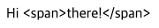

```html
<!DOCTYPE html>
<html>
    <body>
        <div id="foo">Hello <span>world!</span></div>
    </body>
    <script>
        document.getElementById('foo').textContent = 'Hi <span>there!</span>';
    </script>
</html>
```

`textContent` 프로퍼티와 유사한 동작을 하는 `innerText` 프로퍼티도 있지만 해당 프로퍼티는 CSS를 고려해야 하므로 느리고 CSS에 순종적임

<br/>
<br/>

### DOM 조작

DOM 조작에 의해 DOM에 새로운 노드가 추가되거나 삭제되면 리플로우와 리페인트가 발생하는 원인이 되므로 성능에 영향을 줌

`Element.prototype.innerHTML` 프로퍼티는 setter와 getter 모두 존재하는 접근자 프로퍼티로서 요소 노드의 HTML 마크업을 취득하거나 변경함

```html
<!DOCTYPE html>
<html>
    <body>
        <div id="foo">Hello <span>world!</span></div>
    </body>
    <script>
        // Hello <span>world!</span>
        console.log(document.getElementById('foo').innerHTML);
    </script>
</html>
```

`innerHTML` 프로퍼티는 요소 노드의 콘텐츠 영역 내에 포함된 모든 HTML 마크업을 문자열로 반환함

<br/>

반대로 `innerHTML` 에 HTML 마크업 문자열을 할당하면 문자열을 HTML로 파싱하여 새로운 DOM을 생성하고 요소 노드의 자식 노드로 반영함

```tsx
document.getElementById('foo').innterHTML = 'Hi <span>there!</span>';
```

<br/>

기존 DOM이 다음과 같이 변경됨

```tsx
// 기존 형태
<div id="foo">
	Hello
	<span>world!</span>
</div>

// 변경 형태
<div id="foo">
	Hi
	<span>there!</span>
</div>
```

단순히 문자열만 변경하는 것이 아니라 HTML 마크업 문자열을 파싱하여 실제 DOM 구조를 변경할 수 있음

<br/>

`innerHTML` 에 문자열을 할당하면 HTML 마크업으로 해석되기에 사용자로부터 입력받은 데이터를 검증하거나 처리하지 않고 그대로 넣으면 악성 코드를 실행할 수 있음

이와 같은 공격을 XSS라고 함

```tsx
<!DOCTYPE html>
<html>
    <body>
        <div id="foo">Hello</div>
        
        <script>
            const userInput = '';
            
            const element = document.getElementById('foo');
            
            element.innerHTML = userInput;
        </script>
    </body>
</html>
```

<br/>

위에 코드는 다음과 같이 만들어짐

```tsx
<div id="foo">
		
</div>
```

브라우저가 `src=”x”` 를 통해 이미지를 불러올때 존재하지 않아 오류가 발생하면 `onerror` 이벤트가 발생하게됨

만약 `userInput` 을 공격자가 원하는 HTML로 조작할 수 있다면 XSS 취약점이 발생할 수 있음

<br/>

React에서는 일반적인 JSX 렌더링이 HTML 문자열을 직접 파싱하지 않기 때문에 `innerHTML` 을 직접 사용하는 경우보다 XSS 위험이 줄어듦

```tsx
const userInput = '';

return <div>{userInput}</div>;
```

<br/>

하지만 HTML 문자열을 직접 삽입하기 위해 `dangerouslySetInnerHTML` 사용시 `innerHTML` 과 같은 XSS 위험이 다시 발생할 수 있음

```tsx
return (
    <div
        dangerouslySetInnerHTML={{ __html: userInput }}
    />
);
```

따라서 React가 XSS를 완전히 방지하는 것은 아님

기본적인 JSX 렌더링에서는 사용자 입력을 HTML로 해석하지 않기 때문에 XSS 위험이 줄어드는 것임

<br/>

`Element.prototype.insertAdjacentHTML(position, DOMString)` 메서드는 기존 요소를 제거하지 않으면서 위치를 지정해 새로운 요소를 삽입함

두 번째 인수로 전달한 `DOMString` 을 파싱하고 그 결과로 생성된 노드를 첫 번째 인수인 `position` 에 삽입하여 DOM에 반영함


`position` 에 전달할 수 있는 문자열은 4가지임

<br/>

다음과 같이 사용할 수 있음

```html
<!DOCTYPE html>
<html>
    <body>
        <div id="foo">text</div>

        <script>
            const $foo = document.getElementById('foo');

            $foo.insertAdjacentElement('beforebegin', '<p>beforebegin</p>');
            $foo.insertAdjacentElement('afterbegin', '<p>afterbegin</p>');
            $foo.insertAdjacentElement('beforeend', '<p>beforeend</p>');
            $foo.insertAdjacentElement('afterend', '<p>afterend</p>');
        </script>
    </body>
</html>
```

새롭게 삽입될 요소만을 파싱하여 자식 요소로 추가하므로 `innerHTML` 에 비해 효율적이고 빠름

<br/>

DOM은 노드를 직접 생성/삽입/삭제/치환하는 메서드도 제공함

`Document.prototype.createElement(tagName)` 메서드는 요소 노드를 생성하여 반환함

```tsx
const $li = document.createElement('li');
```

생성된 요소 노드는 기존 DOM에 추가되지 않고 홀로 존재하는 상태임

<br/>

`Document.prototype.createTextNode(text)` 메서드는 텍스트 노드를 생성하여 반환함

```tsx
const textNode = document.createTextNode('Banana');
```

마찬가지로 생성된 텍스트 노드는 기존 DOM에 추가되지 않고 홀로 존재함

<br/>

`Node.prototype.appendChild(childNode)` 메서드는 매개변수 `childNode` 에게 인수로 전달한 노드를 `appendChild` 메서드를 호출한 노드의 마지막 자식 노드로 축함

```tsx
$li.appendChild(textNode);
```

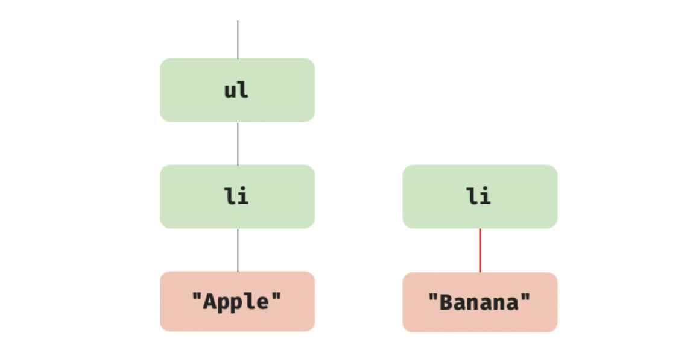

<br/>

이제 같은 메서드를 사용해서 텍스트 노드와 부자 관계로 연결한 요소 노드를 마지막 자식 요소로 추가하면 됨

```tsx
$fruits.appendCHild($li);
```

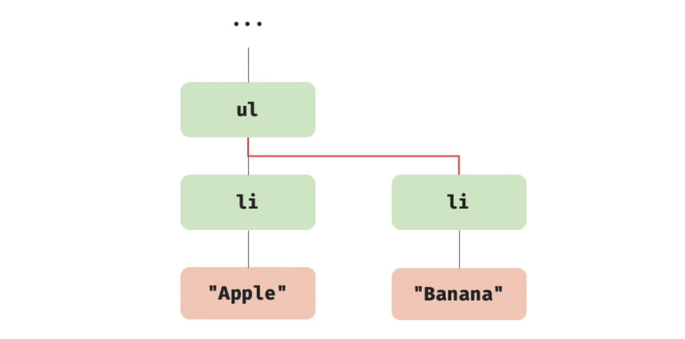

<br/>
<br/>

### 어트리뷰트

HTML 요소의 동작을 제어하기 위한 추가적인 정보를 제공하는 HTML 어트리뷰트는 다음과 같은 형식으로 정의함

```html
<input id="user" type="text" value="ungmo2">
```

- **어트리뷰트 이름**
    - `id`
    - `type`
    - `value`
- **어트리뷰트 값**
    - `user`
    - `text`
    - `ungmo2`

<br/>

어트리뷰트 이름은 다음과 같은 종류가 존재함

- **글로벌 어트리뷰트**
    - `id`
    - `class`
    - `style`
    - `title`
    - `lang`
    - `tabindex`
    - `draggable`
    - `hidden`
    - 등 ..
- **이벤트 핸들러 어트리뷰트**
    - onclick
    - `onchange`
    - `onfocus`
    - `onblur`
    - `oninput`
    - `onkeypress`
    - `onkeydown`
    - `onkeyup`
    - `onmouseover`
    - `onsubmit`
    - `onload`
    - 등..
- **한정적 어트리뷰트**
    - `input` 요소에만 사용할 수 있는 것들
        - `type`
        - `value`
        - `checked`

<br/>

이때 모든 어트리뷰트 노드의 참조는 유사 배열 객체이자 이터러블인 `NamedNodeMap` 객체에 담겨서 요소 노드의 `attributes` 프로퍼티에 저장됨

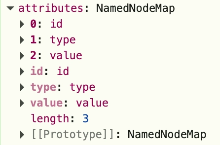

<br/>

HTML에서 작성한 `type` , `value` , `id` 같은 것은 HTML 어트리뷰트이고, JavaScript에서 다음처럼 접근하는 `input.type` , `input.value` , `input.id` 는 DOM 프로퍼티임

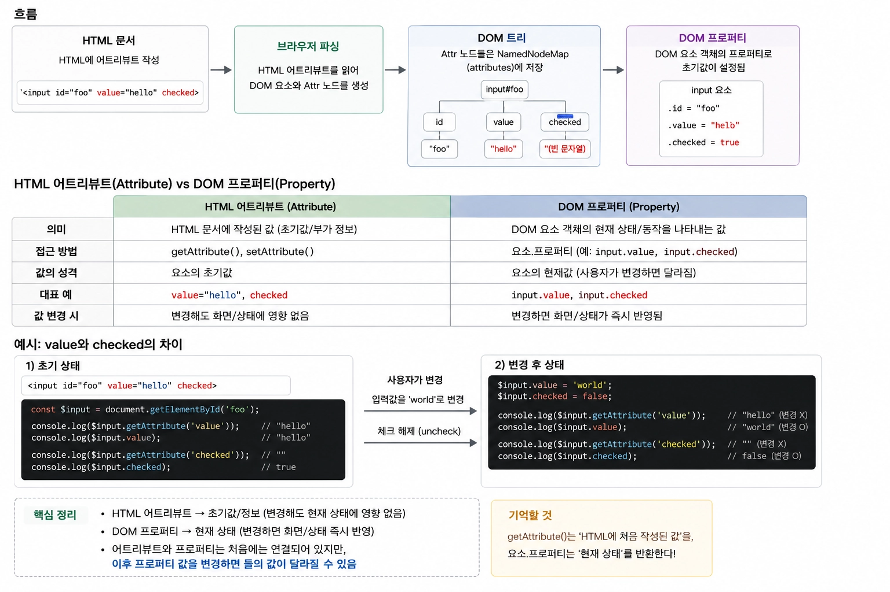

- **HTML Attribute**
    - HTML 문서에 작성된 값
    - 요소의 초기 상태나 부가 정보
- **DOM Property**
    - 브라우저가 생성한 요소 객체의 프로퍼티
    - 현재 DOM 요소의 상태나 동작을 표현

<br/>
<br/>

### 스타일

`HTMLElement.prototype.style` 프로퍼티는 setter와 getter 모두 존재하는 접근자 프로퍼티로서 요소 노드의 인라인 스타일을 취득하거나 추가 또는 변경함

```html
<!DOCTYPE html>
<html>
    <body>
        <div style="color: red">Hello World</div>
        <script>
            const $div = document.querySelector('div');

            console.log($div.style);
            
            $div.style.color = 'blue';
            
            $div.style.width = '100px';
            $div.style.height = '100px';
            $div.style.backgroundColor = 'yellow';
        </script>
    </body>
</html>
```

<br/>