### 브라우저의 렌더링 과정

브라우저는 다음과 같은 형태의 과정을 거쳐 렌더링을 수행함

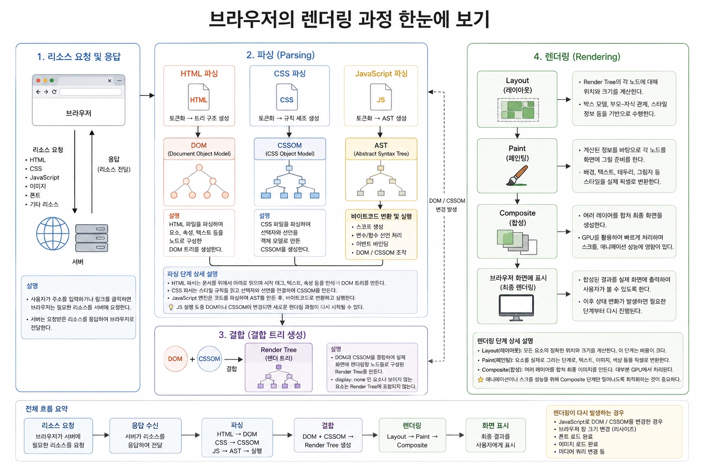

위 과정은 SSR과 CSR에 공통적으로 적용되는 기본적인 브라우저의 렌더링 과정임

<br/>

하지만 렌더링에 필요한 HTML이 생성되는 과정까지 자세하게 살펴보면 차이가 존재함

- **SSR**
    - 서버에서 React 등을 실행하여 화면에 필요한 HTML을 생성한 후 브라우저에 전달함
    - 브라우저는 전달받은 HTML을 파싱하여 DOM을 생성하고 화면에 렌더링함
- **CSR**
    - 서버에서는 최소한의 HTML인 `index.html` 과 JavaScript를 전달하고, 브라우저가 JS를 실행하여 화면에 필요한 UI를 생성함
    - 생성된 UI에 따라 DOM이 구성되고 화면에 렌더링됨

<br/>
<br/>

### 요청과 응답

브라우저의 핵심 기능은 필요한 리소스를 서버에 요청하고 서버로부터 응답 받아 브라우저에 시각적으로 렌더링하는 것임

→ 필요한 리소스는 모두 서버에 존재하므로

<br/>

서버에 요청을 전송하기 위해 브라우저는 주소창을 제공하여 주소창에 URL을 입력하면 DNS를 통해 IP 주소로 변환되어 해당 IP 주소를 갖는 서버에게 요청을 전송함

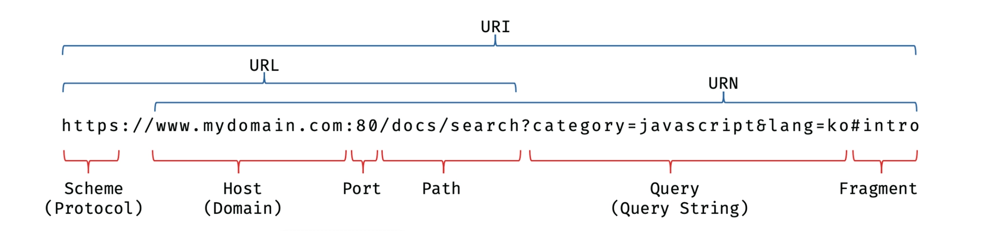

여기서 반드시 브라우저의 주소창을 통해 서버에게 요청할 수 있는 것은 아니며 JS를 통해 동적으로 요청할 수도 있음

<br/>

과정을 그림으로 보면 다음과 같음

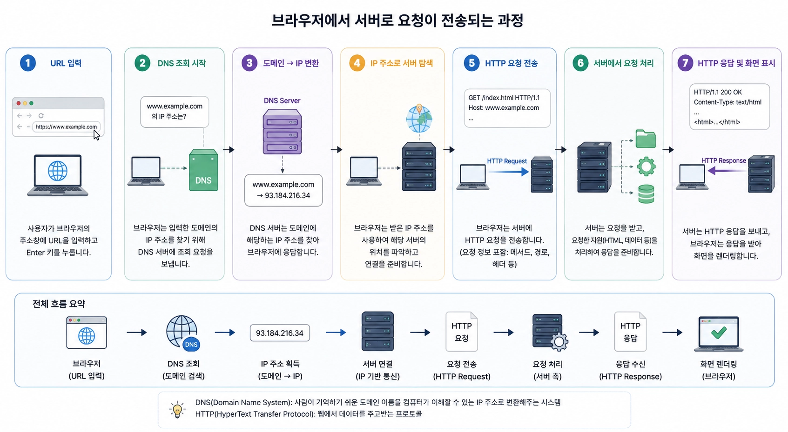

DNS는 Domain Name System의 약자로 도메인 이름을 IP 주소로 변환해주는 시스템을 말함

<br/>
<br/>

### HTTP

HTTP는 웹에서 브라우저와 서버가 통신하기 위한 프로토콜, 규약을 말함

HTTP는 웹의 발전에 따라 여러 버전으로 발전했으며, 현재 웹 환경에서는 HTTP/1.1, HTTP/2, HTTP/3가 사용되고 있음

각 버전은 기본적인 HTTP의 의미는 유지하면서도 브라우저와 서버가 데이터를 주고받는 방식과 네트워크 성능을 개선해 왔음

<br/>
<br/>

#### TCP와 UDP

HTTP의 대표적인 전송 프로토콜은 TCP와 UDP임

둘은 데이터를 전달하는 방식이 서로 다름

<br/>

TCP는 연결을 먼저 수립하고 데이터를 안정적으로 전달하는 방식임

TCP는 데이터가 손실되거나 순서가 뒤바뀌면 이를 확인하고 다시 전송하기 때문에 신뢰성 있는 데이터 전달이 가능함

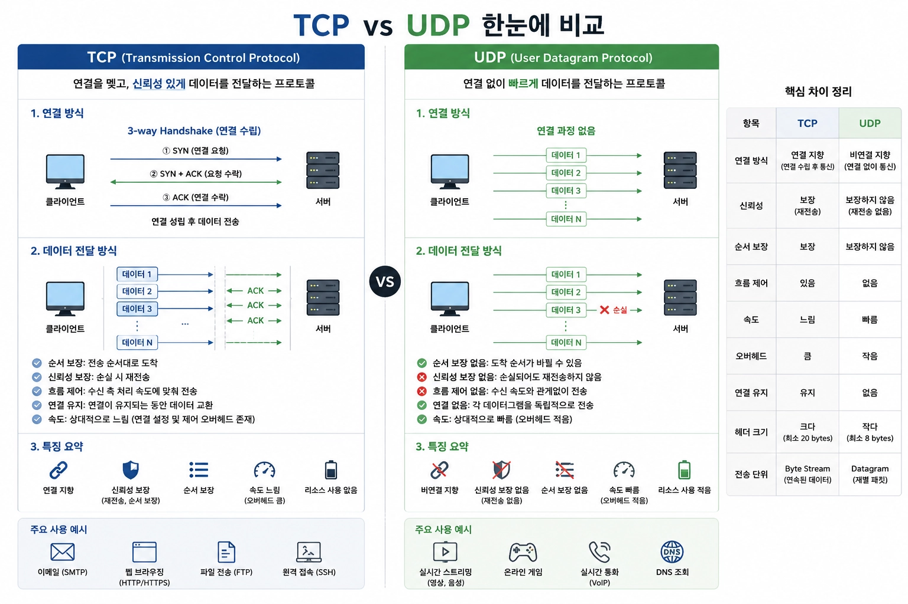

반면 UDP는 TCP처럼 연결을 먼저 수립하지 않고 데이터를 전달함

UDP 자체는 데이터가 정상적으로 도착했는지, 순서가 맞는지 등을 보장하지 않음

<br/>

#### HTTP/1.1

HTTP/1.1은 현재도 호환성을 위해 사용되지만, HTTP/2와 HTTP/3에 비해 요청을 처리하는 방식이 제한적임

기본적인 특징은 지속 연결임

HTTP/1.0에서는 일반적으로 하나의 요청/응답이 끝나면 TCP 연결을 종료하는 방식이었지만, HTTP/1.1에서는 하나의 TCP 연결을 유지하면서 여러 요청에 재사용할 수 있음

<br/>

그림으로 보면 다음과 같음

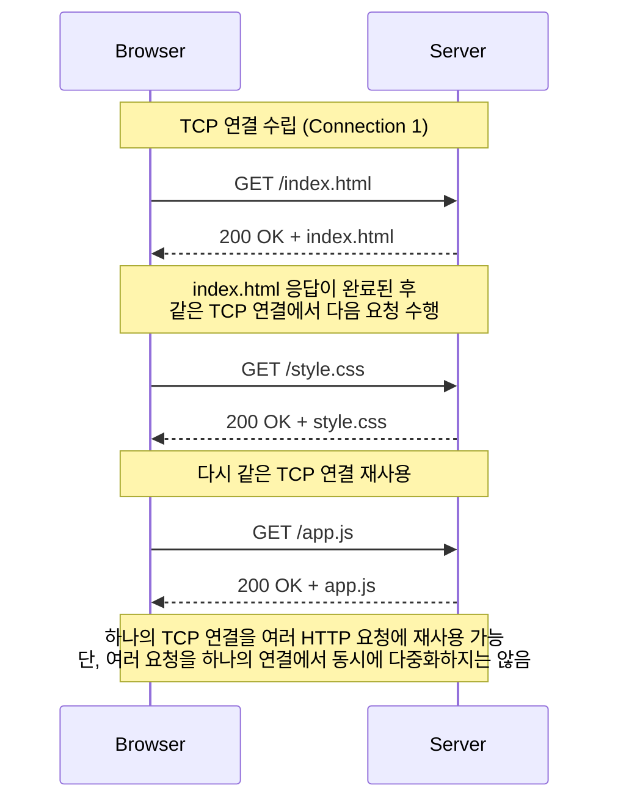

HTTP/1.1에서는 브라우저가 여러 리소스를 동시에 가져오기 위해 여러 TCP 연결을 사용하는 방식이 일반적이었음

<br/>

#### HTTP/2

HTTP/2는 HTTP/1.1의 가장 큰 문제 중 하나인 여러 리소스를 효율적으로 동시에 전송하기 어려운 문제를 해결하기 위해 등장함

핵심은 다중화임

HTTP/2에서는 하나의 TCP 연결 안에 여러 개의 Stream을 만들 수 있음

<br/>

그림으로 보면 다음과 같음

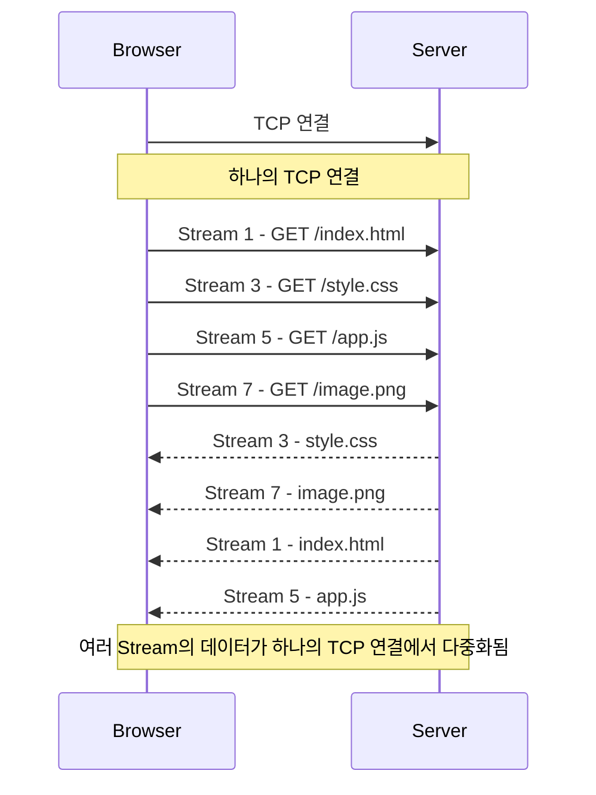

HTTP/2에서는 요청과 응답이 Stream 단위로 독립적으로 구분되고, 여러 Stream의 데이터가 하나의 TCP 연결에서 섞여 전송될 수 있음

<br/>

추가로 HTTP/2는 단순히 다중화뿐만아니라 다음도 추가가 됨

- **Binary Framing**
  - 
- **Header Compression**

<br/>
<br/>

하지만 이러한 해결책이 추가된 HTTP/2에서도 문제는 존재했음

HTTP 계층에서 여러 요청을 동시에 처리할 수 있게 했지만, 여전히 TCP 위에서 동작하기 때문에 TCP에서 패킷 손실이 발생하면 해당 TCP 연결의 여러 Stream이 영향을 받을 수 있음

→ 여러 Stream을 하나의 TCP 연결로 공유하기에

이 문제를 HTTP/3에서 해결함

<br/>
<br/>

#### HTTP/3

HTTP/3는 HTTP를 전달하는 전송 계층을 TCP에서 QUIC으로 변경하였음

QUIC은 UDP를 기반으로 하면서 TCP가 제공하던 신뢰성 있는 데이터 전달, 재전송, 순서 제어 등의 기능을 자체적으로 구현하고, 독립적인 Stream 관리와 같은 기능을 추가하여 TCP의 구조적 한계를 개선함

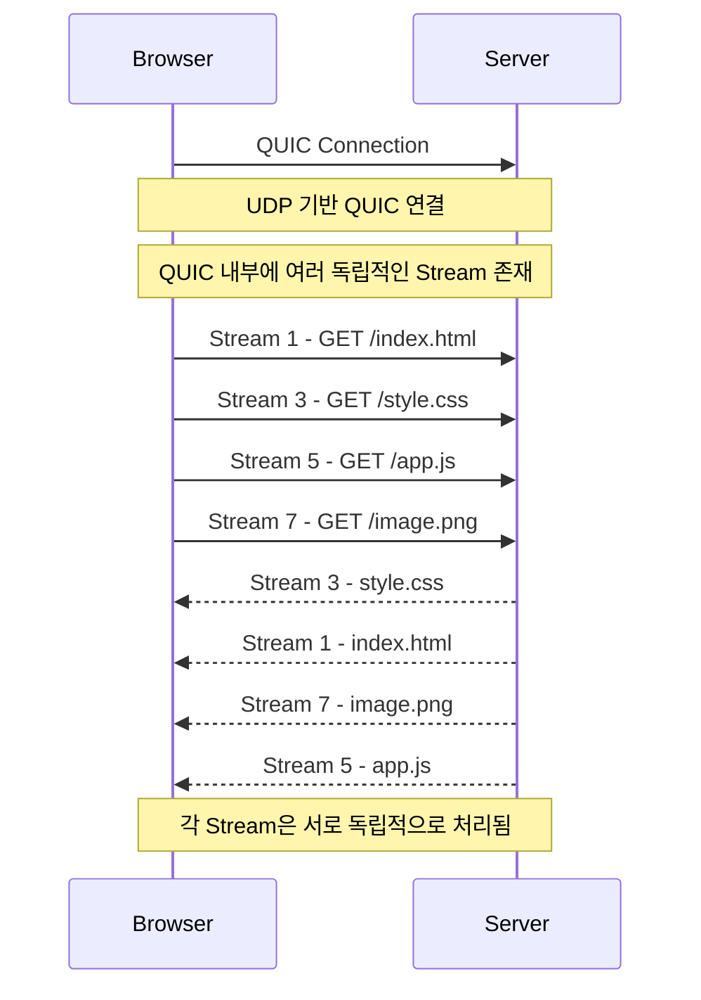

<br/>

지금까지 변화한 HTTP를 그림으로 보면 다음과 같음

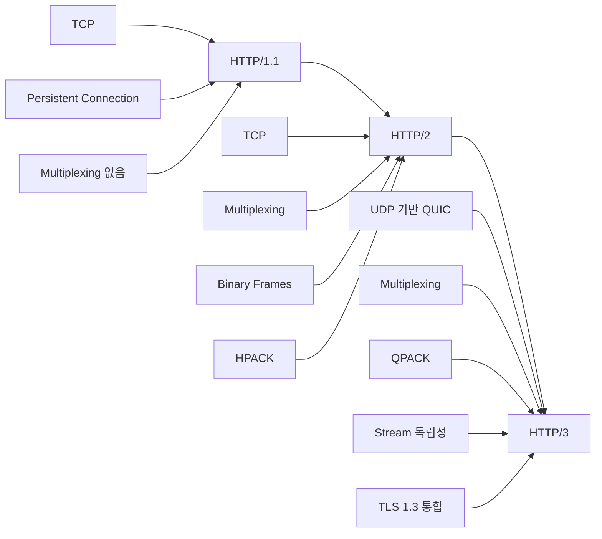

<br/>
<br/>

### REST API

HTTP를 이해했다면 실제 가장 많이 접하게 되는 것이 API 통신이며, 그중 대표적인 방식이 REST API임

REST(Representational State Transfer)는 웹에서 리소스를 어떻게 표현하고, 클라이언트와 서버가 어떻게 통신할 것인가에 대한 설계 원칙의 집합임

REST API는 URL을 통해 리소스를 표현하고, HTTP 메서드를 이용해 어떤 동작을 수행할지 구분함

```powershell
GET    /users       → 사용자 목록 조회
GET    /users/1     → 1번 사용자 조회
POST   /users       → 사용자 생성
PUT    /users/1     → 1번 사용자 전체 수정
PATCH  /users/1     → 1번 사용자 일부 수정
DELETE /users/1     → 1번 사용자 삭제
```

즉, HTTP는 통신 규칙, REST는 API를 어떤 구조로 설계할지에 대한 규칙임

<br/>

REST의 대표적인 제약 조건은 다음과 같음

- **Resource 중심**
    - URL이 행동이 아니라 리소스를 나타내야 함
    - `GET /getUser/1` → 잘못된 형태
    - `GET /users/1` → 좋은 형태
- **Stateless**
    - 서버가 클라이언트의 이전 요청 상태를 저장하지 않음
    - `GET /users/1` 해당 요청하나만 보고 서버가 처리 할 수 있어야함
- **Client-Server 분리**
    - 클라이언트와 서버가 서로의 내부 구현을 몰라도 API라는 인터페이스를 통해 통신할 수 있음
- **Uniform Interface**
    - 일관된 인터페이스를 사용함
    - 클라이언트가 서버 내부 구현을 알 필요 없이 정해진 방식으로 리소스를 조작할 수 있어야함
- **Cacheable**
    - HTTP의 캐싱 기능을 활용할 수 있음
- **Layered System**
    - 클라이언트는 중간에 어떤 서버나 시스템이 존재하는지 알 필요가 없음

<br/>
<br/>

### HTML 파싱과 DOM 생성

브라우저의 요청에 의해 서버가 응답한 HTML 문서는 문자열로 이루어진 순수한 텍스트임

브라우저에 시각적인 픽셀로 렌더링하려면 HTML 문서를 브라우저가 이해할 수 있는 자료구조로 변환하여 메모리에 저장해야함

<br/>

그림으로 보면 다음과 같음

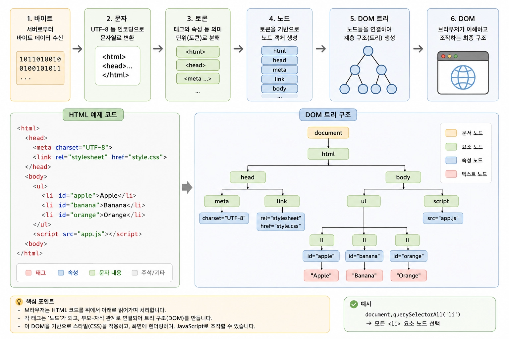

브라우저의 렌더링 엔진은 위 과정을 통해 응답받은 HTML 문서를 파싱하여 브라우저가 이해 할 수 있는 자료구조인 DOM(Document Object Model)을 생성함

즉, DOM은 HTML 문서를 파싱한 결과물임

<br/>
<br/>

### CSS 파싱과 CSSOM 생성

렌더링 엔진은 DOM을 생성해 나가다가 CSS를 로드하는 `link` 태그나 `style` 태그를 만나면 DOM 생성을 일시 중단함

그리고 각 태그의 지정된 CSS 파일을 서버에 요청하여 로드한 CSS 파일이나 `style` 태그 내의 CSS를 HTML과 동일한 파싱 과정을 거치며 해석하여 CSSOM을 생성함

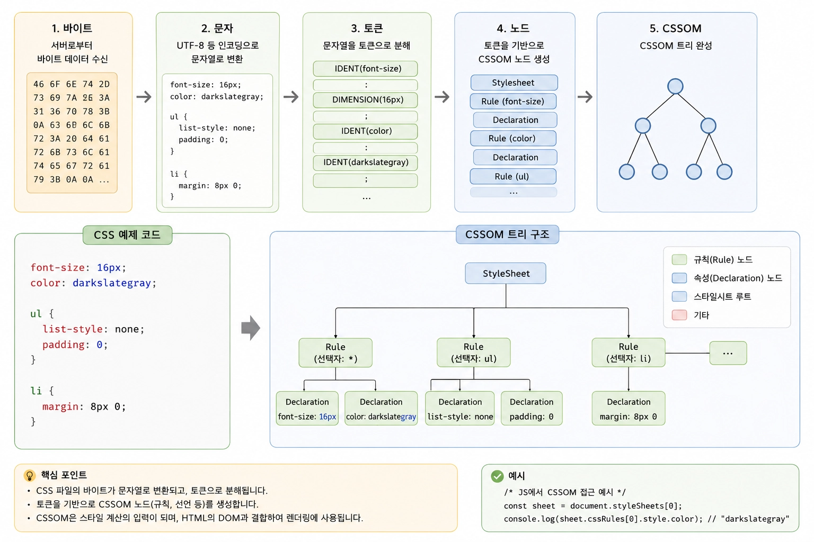

이후 CSS 파싱을 완료하면 HTML 파싱이 중단된 지점부터 다시 HTML을 파싱하기 시작하여 DOM 생성을 재개함

<br/>
<br/>

### 렌더 트리 생성

HTML 파싱을 통해 DOM이 생성되고 CSS 파싱을 통해 CSSOM이 생성되면 브라우저는 DOM과 CSSOM을 결합하여 실제 화면에 렌더링할 정보를 구성함

이때 생성되는 것이 렌더 트리임

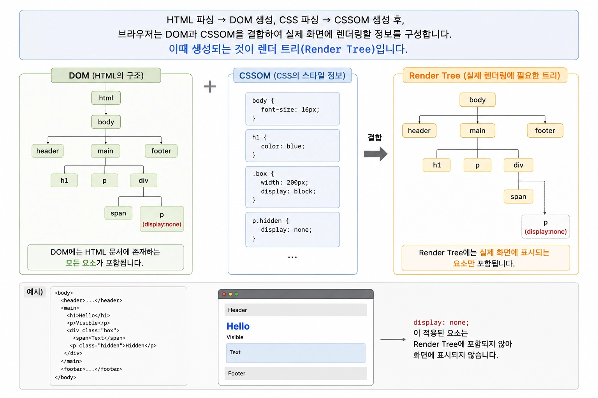

렌더 트리는 DOM과 CSSOM을 기반으로 실제로 화면에 표시할 요소와 각 요소에 적용할 스타일 정보를 결합한 트리를 말함

DOM에는 HTML 문서에 존재하는 모든 요소가 포함되지만, 렌더 트리에는 실제 렌더링에 필요한 요소만 포함됨

<br/>

렌더 트리가 생성되면 브라우저는 각 요소를 화면에 어디에 배치하고 얼마나 크게 표시할 것인지 계산함

이 과정을 Layout이라고 함

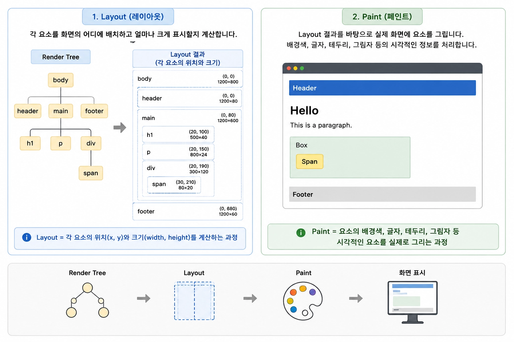

이후 브라우저는 Layout 결과를 바탕으로 실제 화면에 요소를 그리는데, 이 과정을 Paint라고 함

Paint에서는 요소의 배경색, 글자, 테두리, 그림자 등의 시각적인 정보를 실제로 그릴 수 있도록 처리함

<br/>
<br/>

### 리플로우와 리페인트

웹 페이지가 처음 렌더링된 이후에도 JS를 통해 DOM이나 CSS가 변경될 수 있음

이때 변경된 속성에 따라 브라우저는 이미 계산한 렌더링 정보를 다시 계산하거나 다시 그려야 함

<br/>

다음과 같이 JS를 통해 `width` 를 바꾼다면

```tsx
element.style.width = "500px";
```

`width` 는 요소의 크기에 영향을 주기 때문에 기존에 계산했던 Layout 결과를 다시 계산해야 함

이처럼 Layout에 영향을 주는 변경으로 인해 Layout을 다시 계산하는 과정을 리플로우라고 함

<br/>

반면 모든 CSS 변경이 리플로우를 발생시키는 것은 아님

다음과 같이 글자의 색상만 변경하는 경우 요소의 크기나 위치는 변경되지 않기 때문에 Layout을 다시 계산할 필요가 없음

```tsx
element.style.color = "red";
```

이처럼 Layout을 다시 계산하지 않고 변경된 시각적 정보를 다시 그리는 과정을 리페인트라고 함

일반적으로 리플로우가 발생하면 변경된 레이아웃을 화면에 반영하기 위해 리페인트도 함께 발생하기에 불필요한 리플로우는 렌더링 성능에 영향을 줄 수 있음

<br/>