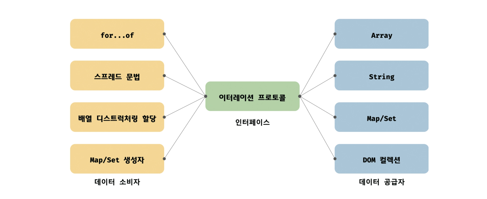
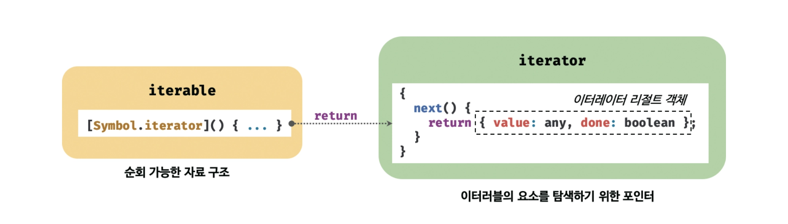

### 이터레이션 프로토콜

순회 가능한 데이터 자료구조를 만들기 위해 ECMAScript 사양에 정의하여 미리 약속한 규칙임

ES6 이전에는 통일된 규약 없이 각자 나름의 구조를 가지고 있었음

→ 각자의 순회 방식을 갖는다면 모든 순회 방식을 모두 지원해야함



이터레이션 프로토콜을 준수하도록 규정하면 이터레이션 프로토콜만 지원하도록 구현하면되어 효율적임

<br/>

이터레이션 프로토콜은 다음과 같이 나눠짐



- **이터러블 프로토콜**
    - `Symbol.iterator` 메서드를 통해 이터레이터를 반환해야 한다는 규칙
- **이터레이터 프로토콜**
    - `next()` 메서드를 통해 `{ value, done }` 형태의 이터레이터 리절트 객체를 반환해야 한다는 규칙

<br/>
<br/>

### 이터러블

이터러블은 `Symbol.iterator` 를 프로퍼티 키로 사용한 메서드를 직접 구현하거나 프로토타입 체인을 통해 상속받은 객체를 말함

`Symbol.iterator` 는 자바스크립트에서 객체를 어떤 방식으로 순회할지 정해놓은 표준화된 프로퍼티 키임

따라서 자바스크립트의 여러 기능은 객체가 배열인지, 문자열인지 등을 직접 확인하는 것이 아니라 `Symbol.iterator` 메서드를 호출하여 순회할 수 있는지 판단함

<br/>

자바스크립트는 다음과 같은 빌트인 이터러블을 제공함

- **Array**
- **String**
- **Map**
- **Set**
- **TypedArray**
- **arguments**
- **DOM collections**

<br/>

이터러블은 `for … of` 문으로 순회할 수 있으며 스프레드 문법과 배열 디스트럭처링 할당의 대상으로 사용할 수 있음

```tsx
const array = [1, 2, 3];

console.log(Symbol.iterator in array);

for (const item of array) {
  console.log(item);
}

console.log([...array]);
```

<br/>

반면 일반 객체는 기본적으로 `Symbol.iterator` 메서드를 구현하거나 상속받지 않기 때문에 이터러블이 아님

```tsx
const obj = { a: 1, b: 2};

console.log(Symbol.iterator in obj);  // false

for (const item of obj) {
  // TypeError: obj is not iterable
  console.log(item);
}

const [a, b] = obj;  // TypeError: obj is not iterable
```

<br/>
<br/>

### 이터레이터

이터러블의 `Symbol.iterator` 메서드를 호출하면 이터레이터 프로토콜을 준수한 이터레이터를 반환함

이터레이터는 `next()` 메서드를 가지먀, `next()` 를 호출할 때마다 이터러블의 요소를 순차적으로 하나씩 탐색함

```tsx
const array = [1, 2, 3];

const iterator = arraySymbol.iterator;

console.log('next' in iterator);
```

<br/>

`next()` 메서드를 호출하면 `{ value, done ]` 형태의 이터레이터 리절트 객체를 반환함

```tsx
const array = [1, 2, 3];

const iterator = arraySymbol.iterator;

console.log(iterator.next());  // { value: 1, done: false }
console.log(iterator.next());  // { value: 2, done: false }
console.log(iterator.next());  // { value: 3, done: false }
console.log(iterator.next());  // { value: undefined, done: true }
```

이터레이터 리절트 객체의 `value` 프로퍼티는 현재 순회 결과의 값을 나타내며, `done` 프로퍼티는 이터러블의 순회 완료 여부를 나타냄

<br/>
<br/>

### for … of 문

`for … of` 문은 이터러블을 순회하기 위한 문법임

내부적으로 이터러블의 `Symbol.iterator` 메서드를 호출하여 이터레이터를 얻고, 이터레이터의 `next()` 메서드를 반복적으로 호출하여 순회함

`next()` 가 반환한 이터레이터 리절트 객체의 `value` 프로퍼티를 `for … of` 문의 변수에 할당함

```tsx
for (const item of [1, 2, 3]) {
	console.log(item);  // 1 2 3
}
```

이때, `done` 프로퍼티 값이 `false` 이면 순회를 계속하고 `true` 이면 이터러블의 순회를 중단함

<br/>

`for … of` 문의 내부 동작을 `for` 문으로 표현하면 다음과 같음

```tsx
const iterable = [1, 2, 3];

const iterator = iterableSymbol.iterator;

for (;;) {
  const res = iterator.next();
  
  if (res.done) break;
  
  const item = res.value;
  console.log(item);
}
```

<br/>

일반 객체도 이터레이션 프로토콜을 준수하도록 구현하면 사용자 저으이 이터러블로 `for … of` 문을 사용 할 수 있음

```tsx
const fibonacci = {
  Symbol.iterator {
    let [pre, cur] = [0, 1];
    const max = 10;

    return {
      next() {
        [pre, cur] = [cur, pre + cur];
        return { value: cur, done: cur >= max };
      }
    }
  }
}

for (const num of fibonacci) {
  console.log(num);  // 1 2 3 5 8
}
```

<br/>