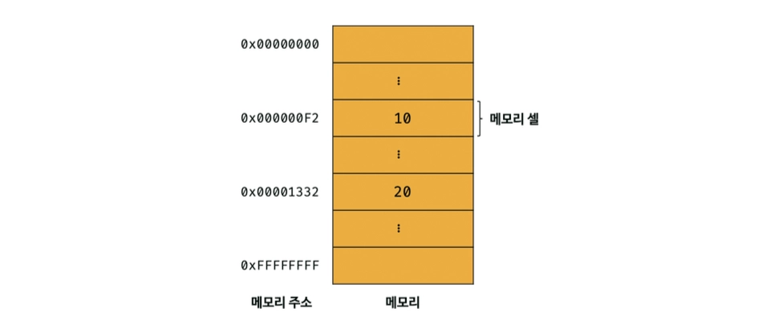
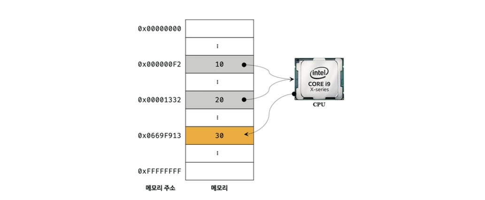
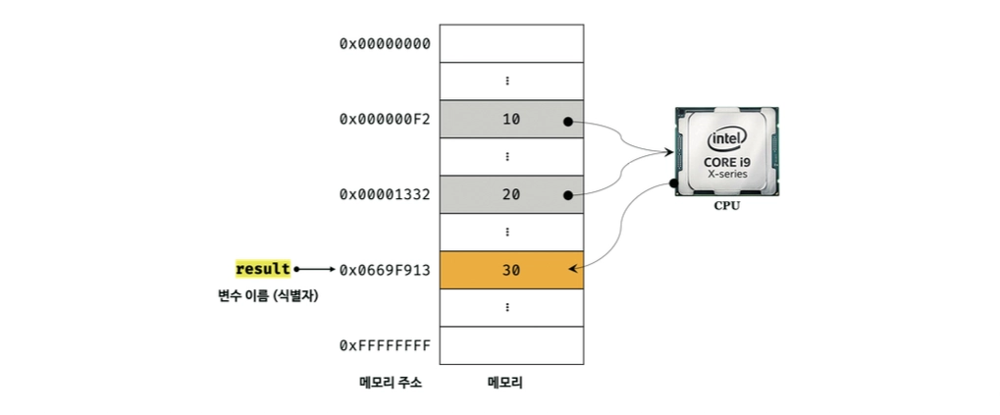
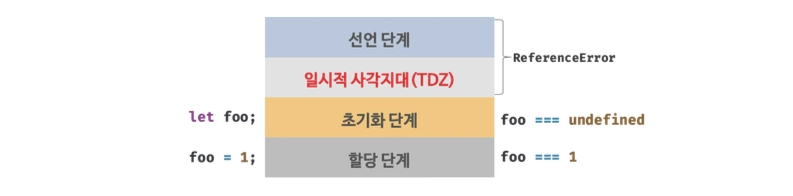
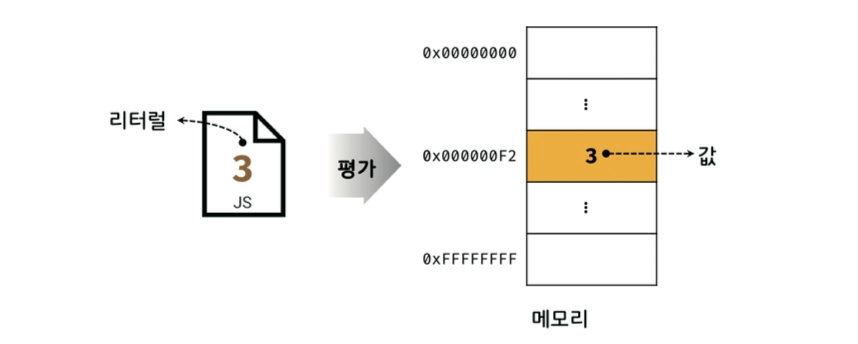
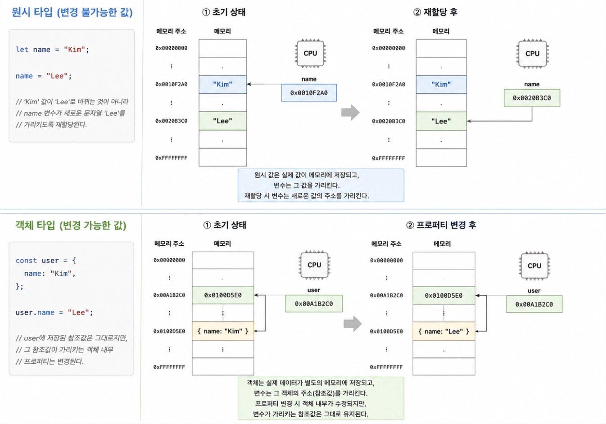

### 메모리

컴퓨터는 CPU를 사용해 연산하고, 메모리를 사용해 데이터를 기억함

메모리는 데이터를 저장할 수 있는 메모리 셀의 집합체임

메모리 셀 하나의 크기는 1바이트(8비트)이며, 컴퓨터는 메모리 셀의 크기, 즉 1바이트 단위로 데이터를 저장하거나 읽어 들임

!image.png

각 셀은 고유의 메모리 주소를 가짐

이 메모리 주소는 메모리 공간의 위치를 나타내며, 0부터 시작해서 메모리의 크기만큼 정수로 표현됨

→ 예를 들어, 4GB 메모리는 0부터 4,294,967,295(0x00000000 ~ 0xFFFFFFFF)까지의 메모리 주소를 가짐

</br>

연산 결과로 생성된 숫자 값은 다음 그림처럼 메모리 상의 임의의 위치에 저장됨

**값은 평가(식을 해석해서 값을 생성하거나 참조)되어 생성된 결과를 말함**

모든 값은 데이터 타입을 가지며, 메모리에 2진수, 즉 비트의 나열로 저장됨

!image.png

연산 결과 30을 재사용하려면 저장된 메모리 공간에 직접 접근해야함

하지만 메모리 주소를 통해 값에 직접 접근하는 것은 치명적 오류를 발생시킬 가능성이 매우 높음

이러한 문제점을 해결하고자 프로그래밍 언어는 기억하고 싶은 값을 메모리에 저장하고, 저장된 값을 읽어 들여 재사용하기 위해 변수라는 메커니즘을 제공함

</br>
</br>

### 변수

변수는 하나의 값을 저장하기 위해 확보한 메모리 공간 자체 또는 그 메모리 공간을 식별하기 위해 붙인 이름을 말함

값이 저장된 메모리 공간에 상징적인 이름을 붙인 것, 변수 이름을 식별자라고도 함

식별자는 네이밍 규칙을 준수하여 만들어야함

변수 이름은 실행 컨텍스트의 렉시컬 환경에 등록되고, 해당 이름을 통해 값이 저장된 메모리 공간을 참조함

!image.png

변수를 사용하면 메모리 공간에 저장된 값 30을 다시 읽어 들여 재사용할 수 있음

`result` 식별자는 메모리 주소 `0x669F013` 을 매핑하여 기억함

</br>

```jsx
// result에 30을 할당
let result = 10 + 20;

// result의 값을 참조
console.log(result);

// 오른쪽은 참조, 왼쪽은 할당
count = count + 1;
```

변수에 값을 저장하는 것을 할당이라 하고, 변수에 저장된 값을 읽어 들이는 것을 참조임

**→ 값의 할당은 런타임에 실행됨**

</br>

변수를 사용하려면 반드시 변수 선언이 반드시 필요함

→ 값을 저장하기 위한 메모리 공간을 확보하고 변수 이름과 확보된 메모리 공간의 주소를 연결해서 값을 저장할 수 있게 준비하는 과정임

변수 선언에 의해 확보된 메모리 공간은 확보가 해제되기 전까지 사용할 수 없어 안전하게 사용가능함

</br>
</br>

### var, let, const 키워드

자바스크립트에서 변수를 선언할 때는 `var` , `let` , `const` 키워드를 사용할 수 있음

```jsx
var eunhyeon;
let eunhyeon;
const eunhyeon;
```

</br>
</br>

#### var 키워드

`var` 키워드로 선언한 변수는 선언 단계와 초기화 단계가 동시에 진행됨

```jsx
console.log(score); // undefined

var score = 80;
```

따라서 코드상 선언문보다 먼저 변수에 접근해도 `ReferenceError` 가 발생하지 않고, 암묵적으로 할당된 `undefined` 가 반환됨

</br>

위의 코드를 더 자세하게 살펴본다면 다음과 비슷하게 동작한다고 볼 수 있음

```jsx
var score; // 선언 + undefined 초기화

console.log(score); // undefined

score = 80; // 값 할당
```

</br>

!image.png

즉, `var` 로 선언한 변수는 실행 컨텍스에 등록되는 시점에 `undefined` 로 초기화됨

</br>
</br>

#### let 키워드

`let` 키워드로 선언한 변수는 선언 단계와 초기화 단계가 분리되어 진행됨

변수 이름은 실행 컨텍스트에 먼저 등록되지만, 실제 초기화는 코드 실행 흐름이 선언문에 도달했을 때 이루어짐

```jsx
console.log(score); // ReferenceError

let score = 80;
```

`let` 변수는 선언문에 도달하기 전까지 초기화되지 않은 상태임

</br>

!image.png

이 구간에서는 변수에 접근할 수 없으며, 이를 일시적 사각지대라고함

</br>
</br>

#### const 키워드

`const` 키워드도 `let` 과 마찬가지로 선언 단계와 초기화 단계가 분리되어 있음

따라서 선언문 이전에 접근하면 `ReferenceError` 가 발생함

```jsx
console.log(score); // ReferenceError

const score = 80;
```

</br>

또한 `const` 는 선언과 동시에 반드시 값을 할당해야 함

```jsx
const score; // SyntaxError
```

</br>

`const` 는 한 번 값을 할당하면 재할당할 수 없음

```jsx
const score = 80;

score = 90; // TypeError
```

</br>

다만 객체나 배열을 `const` 로 선언했다고 해서 내부 값까지 변경할 수 없는 것은 아님

```jsx
const user = {
  name: "Kim",
};

user.name = "Lee"; // 가능
```

`const` 는 변수에 저장된 참조값의 재할당을 막는 것이지, 객체 내부 프로퍼티 변경까지 막는 것은 아님

</br>
</br>

### 변수 호이스팅

자바스크립트 엔진은 코드를 한 줄씩 실행하기 전에 먼저 소스코드를 평가함

이 평가 과정에서 변수 선언문을 먼저 찾아 변수 이름을 실행 컨텍스트에 등록함

```jsx
console.log(score); // undefined

var score = 80;
```

위 코드는 `console.log(score)` 가 `var score = 80` 보다 먼저 실행되었지만 `ReferenceError` 가 발생하지 않음

그 이유는 자바스크립트 엔진이 코드를 실행하기 전에 `var score` 선언을 먼저 처리하기 때문임

</br>

단계는 다음과 같음

- **소스코드 평가 단계**
    - `var score` 선언 발견
    - `score` 식별자를 실행 컨텍스트에 등록
    - `undefined` 로 초기화
- **소스코드 실행 단계**
    - `console.log(score)` 실행
    - `score` 는 이미 존재하므로 `undefined` 출력
    - `score = 80` 할당

</br>

다만 실제 코드가 물리적으로 위로 이동하는 것은 아님

자바스크립트 엔진이 실행 전에 선언을 먼저 처리하기 때문에, 개발자 입장에서는 선언문이 위로 끌어올려진 것처럼 보이는 것임

즉, 변수 호이스팅은 변수 선언이 코드 실행 전에 먼저 처리되어, 선언문보다 앞에서 변수에 접근할 수 있는 것처럼 보이는 현상임

</br>
</br>

### 가비지 콜렉터

자바스크립트는 개발자가 직접 메모리를 해제하지 않아도 되는 언어임

변수를 선언하고 값을 할당하면 필요한 메모리 공간이 확보되고, 더 이상 사용하지 않는 값은 자바스크립트 엔진이 자동으로 정리함

이때 더 이상 사용되지 않는 값을 찾아 메모리에서 제거하는 역할을 하는 것이 가비지 콜렉터임

</br>

다음과 같은 상황이 있다고 가정

```jsx
let user = {
  name: "Kim",
};

user = null;
```

처음에는 `user` 변수가 객체를 참조하고 있지만 `user = null;` 이 실행되면 `user` 는 더 이상 기존 객체를 참조하지 않음

`{ name: "Kim" }` 객체에 접근할 수 있는 방법이 없으므로, 해당 객체는 가비지 콜렉터의 정리 대상이 됨

</br>

가비지 콜렉터의 핵심 기준은 도달 가능성임

자바스크립트 엔진은 전역 객체, 현재 실행 중인 함수의 지역 변수, 클로저, 이벤트 리스너, 타이머 같은 기준점에서 참조를 따라가며 접근 가능한 값을 판단함

→ 기준점을 보통 `Root` 라고 함, 가비지 콜렉터에서 말하는 `Root` 는 가비지 컬렉션 탐색이 시작되는 기준점을 말함

</br>

```jsx
Root
 ↓
user
 ↓
{ name: "Kim" }
```

위처럼 `Root` 에서 객체까지 도달할 수 있으면 해당 객체는 메모리에 남음

</br>

```jsx
Root
 ↓
user
 ↓
null

{ name: "Kim" } // Root에서 도달 불가능
```

반대로 `Root` 에서 도달할 수 없으면 제거 대상이 됨

</br>

즉, 가비지 콜렉터는 필요 없어 보이는 값을 제거하는 것이 아니라, Root에서 더 이상 도달할 수 없는 값을 제거함

이 방식을 Mark and Sweep 방식이라고 함

→ Mark: Root에서 시작해 접근 가능한 값을 표시, Sweep: 표시되지 않은 값을 메모리에서 제거

그래서 메모리 누수는 더 이상 필요 없는 값인데도 참조가 남아 있어서 가비지 콜렉터가 제거하지 못할 때 발생함

</br>
</br>

### 리터럴

자바스크립트에서 값을 생성하는 가장 기본적인 방법은 리터럴임

!image.png

리터럴은 변수에 저장되기 전, 코드에 직접 작성한 값 자체, 고정된 값임

→ 값의 타입에 따라 숫자 리터럴, 문자열 리터럴, 불리언 리터럴, 객체 리터럴, 배열 리터럴 등으로 구분해서 부름

</br>

```jsx
10
"hello"
true
null
undefined
{
  name: "Kim"
}
[1, 2, 3]
function () {}
```

위 코드에서 `10`, `"hello"`, `true`, `{ name: "Kim" }`, `[1, 2, 3]` 모두 리터럴임

자바스크립트 엔진은 런타임에 리터럴을 평가해 값을 생성함

</br>
</br>

### 표현식과 문

자바스크립트 코드는 표현식과 문으로 구성됨

표현식은 값으로 평가될 수 있는 코드를 말함

아까 평가란 식을 해석해서 값을 생성하거나 참조하는 것을 의미한다고 했음

리터럴도 값으로 평가되기에 표현식이라 할 수 있음

</br>

다음은 표현식의 예시임

```jsx
// 10 + 20이 평가되어 숫자 값 30을 생성
10 + 20

// 문자열 리터럴값
"hello"

// 식별자 score가 참조하는 값을 평가함
score

// 100을 score 변수에 할당하고, 100이라는 값을 만듦
score = 100
```

즉, 위 코드는 모두 값으로 평가될 수 있으므로 표현식임

</br>

문은 프로그램을 구성하는 기본 단위이자 최소 실행 단위, 명령문이라고도 부름

→ 문의 집합으로 이뤄진 것이 프로그램, 문을 작성하고 순서에 맞게 나열하는 것이 프로그래밍

!image.png

문은 문법적으로 더 이상 나눌 수 없는 코드의 기본 요소인 토큰이 여러개 모여 구성됨

</br>

다음은 문의 예시임

```jsx
// 변수 score를 선언하고 100을 저장하라는 명렁문
let score = 100;

// 조건에 따라 검사하고 블록 내부 코드를 실행하라는 문
if (score > 50) {
  // score에 저장된 값을 콘솔에 출력하라는 문
  console.log(score);
}
```

위 코드에서 `let score = 100;`, `if (...) { ... }` 는 문임

문은 자바스크립트 엔진에게 어떤 동작을 수행하라고 지시하는 실행 단위임을 알 수 있음

→ 아까 말한 문은 명령문이라고 한 이유

</br>

표현식인 문과 표현식이 아닌 문은 구분할 수 있음

```jsx
// 할당 표현식
score = 100;

// 표현식인 문
score = 100;

// 표현식이 아닌 문
let score;
```

표현식은 문이 될 수 있지만, 모든 문이 표현식인 것은 아님

이때, 세미콜론은 문의 종료를 나타냄

</br>

쉽게 정리하자면 값(표현식)은 **평가** 결과가 하나의 값으로 나오는 코드이고, 문은 어떤 **동작을 수행**하기 위한 코드임

→ 더 쉽게 가자면 `console.log();` 안에 들어갈 수 있으면 표현식(정확한 표현은 아님)

</br>
</br>

### 데이터 타입

값은 데이터 타입을 가짐, 데이터 타입은 값의 종류를 의미함

자바스크립트의 데이터 타입은 크게 원시 타입과 객체 타입으로 나눌 수 있음

- **원시 타입**
    - `number`
    - `string`
    - `boolean`
    - `undefined`
    - `null`
    - `symbol` - ES6 추가
    - `bigint` - ES11 추가
- **객체 타입**
    - `Object`
        - `Array`
        - `Function`
        - `Date`
        - `Regexp`
        - `Map`
        - `Set`
        - `Error`
        - `Promise`
        - 사용자 정의 객체 등..

</br>

원시 타입의 값은 변경 불가능한 값임

```jsx
let name = "Kim";

name = "Lee";
```

위 코드에서 `Kim` 값 자체가 `Lee` 로 바뀌는 것이 아님

`name` 변수가 새로운 문자열 값 `Lee` 를 가리키도록 재할당되는 것임

</br>

객체 타입의 값은 변경 가능한 값임

```jsx
const user = {
  name: "Kim",
};

user.name = "Lee";
```

`user` 에 저장된 참조값은 그대로지만, 그 참조값이 가리키는 객체 내부 프로퍼티는 변경됨

원시 타입은 값 자체를 직접 다루고, 객체 타입은 객체가 저장된 메모리 공간을 참조하는 참조값을 통해 다룸

</br>

다음 이미지는 그 차이를 보여줌

!image.png

</br>
</br>

#### 데이터 타입이 필요한 이유

컴퓨터는 모든 데이터를 0과 1로 이루어진 2진수 형태로 저장함

하지만 메모리에 저장된 2진수만 보고는 그것이 숫자인지, 문자열인지, 불리언인지 알 수 없음

따라서 자바스크립트 엔진은 데이터를 올바르게 저장하고, 읽고, 해석하기 위해 데이터 타입 정보를 사용함

</br>

데이터 타입이 필요한 이유는 다음과 같음

- **값을 저장할 때 확보해야 하는 메모리 공간의 크기를 결정하기 위해 필요함**
- **값을 참조할 때 한 번에 읽어야 할 메모리 공간의 크기를 결정하기 위해 필요함**
- **메모리에서 읽어 들인 2진수를 어떤 값으로 해석할지 결정하기 위해 필요함**
- **타입에 맞는 연산을 수행하기 위해 필요함**
- **값의 특성에 맞는 메서드와 동작을 제공하기 위해 필요함**

</br>
</br>

#### number

자바스크립트에는 정수와 실수를 구분하는 별도의 타입이 없음

모든 숫자는 `number` 타입이며, 내부적으로 64비트 부동소수점 형식으로 처리됨

```jsx
let integer = 10;
let double = 10.12;
let negative = -20;
```

</br>

따라서 자바스크립트에서 `1`, `1.0`, `1.00`은 모두 같은 숫자 값으로 평가됨

```jsx
console.log(1 === 1.0); // true
```

</br>

숫자 타입에는 일반적인 숫자 외에도 특별한 값이 있음

```jsx
console.log(10 / 0); // Infinity
console.log(10 / -0); // -Infinity
console.log(1 * "hello"); // NaN
```

`Infinity` 는 양의 무한대, `-Infinity` 는 음의 무한대, `NaN` 은 산술 연산을 수행할 수 없음을 나타내는 값임

</br>
</br>

#### 부동소수점 문제

자바스크립트의 숫자는 64비트 부동소수점 형식으로 처리되기 때문에 일부 소수 계산에서 오차가 발생할 수 있음

```jsx
console.log(0.1 + 0.2); // 0.30000000000000004
console.log(0.1 + 0.2 === 0.3); // false
```

이는 자바스크립트만의 문제가 아니라, 부동소수점 방식으로 소수를 표현하는 대부분의 언어에서 발생할 수 있는 문제임

</br>

소수 계산을 비교할 때는 정확히 같은지를 직접 비교하기보다 허용 가능한 오차 범위를 두고 비교하는 방식이 안전함

```jsx
const result = 0.1 + 0.2;

console.log(Math.abs(result - 0.3) < Number.EPSILON); // true
```

</br>

금액처럼 정확한 계산이 중요한 경우에는 소수 단위로 계산하지 않고 정수 단위로 변환해서 계산하는 방식도 사용함

```jsx
const price = 0.1 * 100 + 0.2 * 100;

console.log(price / 100); // 0.3
```

자바스크립트 숫자는 부동소수점 방식으로 표현되므로 소수 계산에서 오차가 발생할 수 있고, 정확한 비교나 금액 계산에서는 오차를 고려해야 함

</br>
</br>

#### string

문자열 타입은 텍스트 데이터를 나타내는 타입임

문자열은 작은따옴표, 큰따옴표, 백틱으로 감싸서 표현할 수 있음

```jsx
let name1 = "Kim";
let name2 = 'Kim';
let name3 = `Kim`;
```

</br>

자바스크립트의 문자열은 원시 타입이며 변경 불가능한 값임

```jsx
let str = "hello";

str[0] = "H";

console.log(str); // hello
```

</br>

문자열 일부를 바꾸는 것처럼 보이는 작업은 기존 문자열을 변경하는 것이 아니라, 새로운 문자열을 만들어 다시 할당하는 방식으로 처리됨

```jsx
str = "Hello";

console.log(str); // Hello
```

</br>
</br>

#### Template Literal

템플릿 리터럴은 백틱을 사용해 문자열을 표현하는 방식임

일반 문자열보다 줄바꿈, 표현식 삽입, 문자열 조합을 더 편하게 처리할 수 있음

```jsx
const name = "Kim";
const age = 20;

const message = `이름은 ${name}이고, 나이는 ${age}살입니다.`;

console.log(message);
```

</br>

`${}` 안에는 값으로 평가될 수 있는 표현식을 넣을 수 있음

```jsx
const result = `10 + 20 = ${10 + 20}`;

console.log(result); // 10 + 20 = 30
```

</br>

또한 템플릿 리터럴은 줄바꿈을 그대로 표현할 수 있음

```jsx
const text = `첫 번째 줄
두 번째 줄
세 번째 줄`;
```

</br>
</br>

#### undefined

`undefined` 는 자바스크립트 엔진이 변수를 초기화할 때 사용하는 값임

개발자가 의도적으로 값이 없음을 표현할 때 `undefined` 를 직접 할당할 수도 있지만, 일반적으로 권장되지는 않음

```jsx
let value = undefined;
```

`undefined` 는 자바스크립트 엔진이 초기화되지 않은 상태를 나타내기 위해 사용하는 값으로 보는 것이 좋음

</br>
</br>

#### null

`null`은 값이 없다는 것을 개발자가 의도적으로 명시할 때 사용하는 값임

```jsx
let user = {
  name: "Kim",
};

user = null;
```

위 코드는 `user`가 더 이상 객체를 참조하지 않도록 의도적으로 참조를 끊은 것임

즉, `null`은 변수가 이전에 참조하던 값을 더 이상 참조하지 않겠다는 의미로 사용할 수 있음

`undefined` 는 자바스크립트 엔진이 초기화 과정에서 사용하는 값이고, `null` 은 개발자가 의도적으로 값이 없음을 나타낼 때 사용하는 값임

</br>
</br>

#### boolean

불리언 타입은 논리적 참과 거짓을 나타내는 타입으로 값은 `true` 와 `false` 두 가지뿐임

```jsx
let isLogin = true;
let isDeleted = false;
```

</br>

자바스크립트에서는 조건식에 불리언 값이 아닌 값이 들어와도 내부적으로 `true` 또는 `false` 로 변환하여 판단함

이때, `false` 처럼 평가되는 값을 Falsy 값, `true` 처럼 평가되는 값을 Truthy 값이라고 함

```jsx
if ("hello") {
  console.log("실행됨");
}

if (0) {
  console.log("실행 안 됨");
}

// 실행됨
```

대표적인 Falsy 값은 `false` , `0` , `""` , `null` , `undefined` , `NaN` 이며, 이를 제외한 대부분의 값은 Truthy 값으로 평가됨

</br>
</br>

### 동적 타입

자바스크립트는 동적 타입 언어임

변수를 선언할 때 타입을 미리 지정하지 않고, 할당되는 값에 따라 변수의 타입이 동적으로 결정됨

```jsx
let value = 10;
console.log(typeof value); // number

value = "hello";
console.log(typeof value); // string

value = true;
console.log(typeof value); // boolean
```

정확히는 변수 자체가 타입을 가지는 것이 아니라, 변수에 할당된 값이 타입을 가짐

따라서 하나의 변수에 다른 타입의 값을 다시 할당할 수 있음

</br>
</br>

### 정적 타입

정적 타입 언어는 변수를 선언할 때 변수의 타입을 미리 지정하고, 이후 해당 변수에는 지정한 타입의 값만 할당할 수 있는 언어임

```jsx
int score = 100;

score = "hello"; // 오류
```

정적 타입 언어에서는 컴파일 시점에 타입 검사를 수행할 수 있음

따라서 타입 오류를 실행 전에 발견하기 쉽고, 코드의 안정성을 높일 수 있음

</br>

TypeScript는 JavaScript에 정적 타입 시스템을 추가한 언어임

```jsx
let score: number = 100;

score = "hello"; // Type Error
```

</br>

### 강타입과 약타입

강타입과 약타입은 타입이 다른 값끼리 연산할 때, 언어가 타입 변환을 얼마나 엄격하게 처리하는지를 기준으로 구분함

자바스크립트는 비교적 약타입 언어에 가까움

타입이 다른 값이 연산에 사용되면 자바스크립트 엔진이 암묵적으로 타입을 변환하는 경우가 많음

```jsx
console.log("10" + 20); // "1020"
console.log("10" - 5); // 5
console.log(true + 1); // 2
```

`+` 연산자는 문자열이 포함되면 문자열 연결로 동작할 수 있음

반면 `-` 연산자는 문자열 연결이 아니라 숫자 연산이므로 `"10"`을 숫자 `10`으로 변환한 뒤 계산함

이처럼 자바스크립트는 타입 변환이 자동으로 일어나는 경우가 많아 편리하지만, 예측하기 어려운 결과를 만들 수도 있음

</br>

따라서 자바스크립트에서는 암묵적 타입 변환에 의존하기보다 명시적으로 변환하는 것이 안전함

```jsx
const input = "10";

const number = Number(input);

console.log(number + 20); // 30
```

</br>