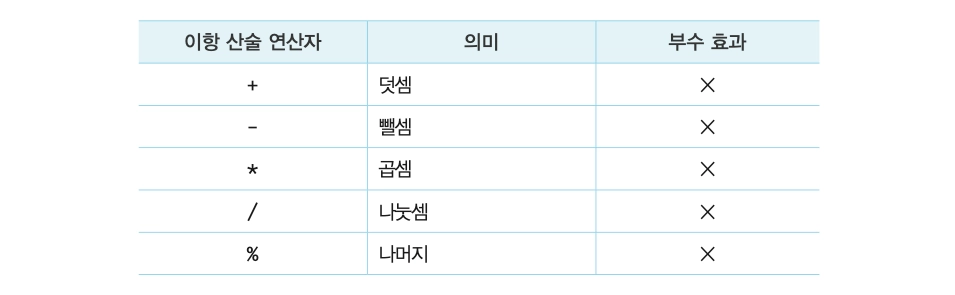
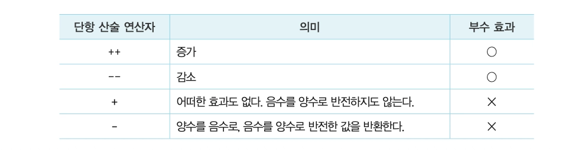
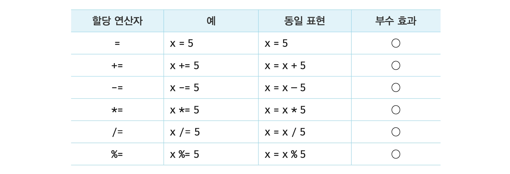
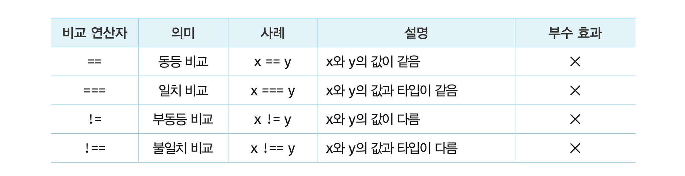
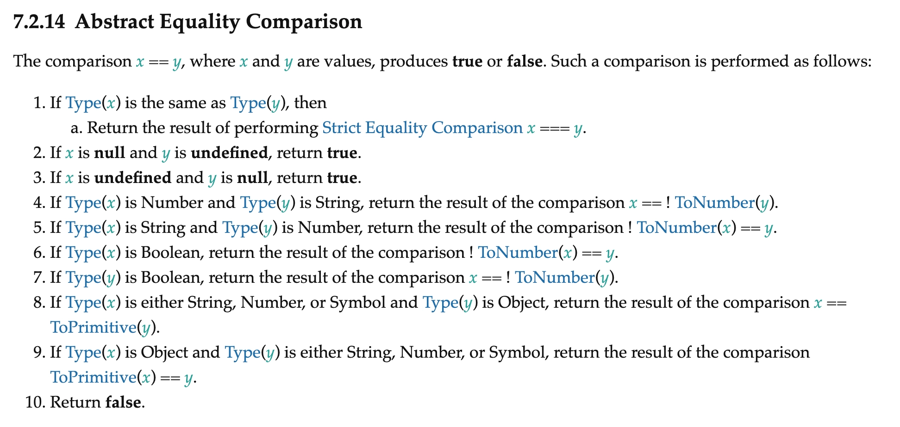

### 연산자

연산자는 하나 이상의 표현식을 대상으로 산술, 할당, 비교, 논리, 타입, 지수 연산등을 수행해 하나의 값을 만듦

연산의 대상은 피연산자라고 하며 값으로 평가될 수 있는 표현식이어야 함

그리고 피연산자와 연산자의 조합으로 이뤄진 연산자 표현식도 값으로 평가될 수 있는 표현식임

</br>
</br>

### 산술 연산자

산술 연산자는 피연산자를 대상으로 수학적 계산을 수행해 새로운 숫자 값을 만듦

산술 연산이 불가능한 경우, NaN을 반환함

피연산자의 개수에 따라 이항 산술 연산자와 단항 산술 연산자로 구분할 수 있음

</br>
</br>

#### 이항 산술 연산자



이항 산술 연산자는 2개의 피연산자를 산술 연산하여 숫자 값을 만듦

→ 부수 효과 없음, 어떤 산술 연산을 해도 피연산자의 값이 바뀌는 경우는 없고 언제나 새로운 값을 만들 뿐임

부수효과는 코드가 값을 계산해 반환하는 것 외에 자신의 스코프 밖에 있는 상태를 변경하거나 외부 세계와 상화작용하는 것임

</br>
</br>

#### 단항 산술 연산자



단항 산술 연산자는 1개의 피연산자를 산술하여 숫자 값을 만듦

이때 단항 연산자는 피연산자를 숫자 타입으로 변환하여 반환 함

→ `var x = ‘1’;` 를 `console.log(+x);` 진행시 숫자값인 `1` 로 변환

</br>

증가/감소 연산자는 위치에 의미가 있음

- **앞에 위치**
    - 먼저 피연산자의 값을 증가/감소시킨 후, 다른 연산을 수행
- **뒤에 위치**
    - 먼저 다른 연산을 수행한 후, 피연산자의 값을 증가/감소

</br>

```jsx
let x = 5, result;

// 선할당 후증가
result = x++;
console.log(result, x);  // 5 6

// 선증가 후할당
result = ++x;
console.log(result, x);  // 7 7

// 선할당 후감소
result = x--;
console.log(result, x);  // 7 6

// 선감소 후할당
result == --x;
console.log(result, x);  // 5 5
```

이항 산술 연산자와는 달리 증가/감소 연산자는 부수효과가 있음

→ 피연산자의 값을 변경하는 암묵적 할당이 이뤄짐

</br>
</br>

#### 문자열 연결 연산자

`+` 연산자는 피연산자 중 하나 이상이 문자열인 경우 문자열 연결 연산자로 동작함

```jsx
'1' + 2; // -> '12'
1 + '2'; // -> '12'
```

위 예제를 보면 알 수 있듯이 자바스크립트 엔진은 암묵적으로 불리언 타입의 값인 `true` 를 숫자 타입인 `1` 로 타입을 강제로 변환한 후 연산을 수행

→ 이를 암묵적 타입 변환, 타입 강제 변환이라고 함

</br>
</br>

### 할당 연산자

할당 연산자는 우항에 있는 피연산자의 평가 결과를 좌항에 있는 변수에 할당함



할당 연산자는 좌항의 변수에 값을 할당하므로 변수 값이 변하는 부수 효과가 있음

→ `let str = ‘My name is ’;` 에서  `str += ‘Lee’;` 시 `console.log(str);` 은 `My name is Lee` 가 출력 됨

</br>

```jsx
let x;

console.log(x = 10);
```

할당문은 값으로 평가되는 표현식인 문으로서 할당된 값으로 평가됨

</br>

따라서 다음과 같이 할당문을 다른 변수에 할당할 수도 있음

```jsx
let a, b, c;

a = b = c = 0;

console.log(a, b, ,c);  // 0 0 0
```

이러한 특징을 활용해 여러 볍ㄴ수에 동일한 값을 연쇄 할당할 수 있음

</br>
</br>

### 비교 연산자

비교 연산자는 좌항과 우항의 피연산자를 비교한 다음 그 결과를 불리언 값으로 반환함

→ if 문이나 for 문과 같은 제어문의 조건식에서 주로 사용

</br>
</br>

#### 동등/일치 비교 연산자



동등 비교 연산자와 일치 비교 연산자는 좌항과 우항의 피연산자가 같은 값으로 평가되는지 비교해 불리언 값을 반환함

→ 둘의 차이는 비교하는 엄격성의 정도

</br>
</br>

#### 암묵적 타입 변환의 기준

공식적인 ECMAScript 사양 명세는 다음과 같음

</br>

동등 비교 연산자는 좌항과 우항의 피연산자를 비교할 때 먼저 암묵적 타입 변환을 통해 타입을 일치시킨 후 같은 값인지 비교함

→ 결과를 예측하기 어렵고 실수하기 쉬워, 일치 비교 연산자를 사용하는 것이 좋음



- 만약 `Type(x)`가 `Type(y)`와 같다면,
    - `x === y`에 대한 엄격 동등 비교의 결과를 반환한다.
- 만약 `x`가 `null`이고 `y`가 `undefined`라면, `true`를 반환한다.
- 만약 `x`가 `undefined`이고 `y`가 `null`이라면, `true`를 반환한다.
- 만약 `Type(x)`가 `Number`이고 `Type(y)`가 `String`이라면,`x == ToNumber(y)` 비교 결과를 반환한다.
- 만약 `Type(x)`가 `String`이고 `Type(y)`가 `Number`라면,`ToNumber(x) == y` 비교 결과를 반환한다.
- 만약 `Type(x)`가 `Boolean`이라면,`ToNumber(x) == y` 비교 결과를 반환한다.
- 만약 `Type(y)`가 `Boolean`이라면,`x == ToNumber(y)` 비교 결과를 반환한다.
- 만약 `Type(x)`가 `String`, `Number`, 또는 `Symbol` 중 하나이고 `Type(y)`가 `Object`라면,`x == ToPrimitive(y)` 비교 결과를 반환한다.
- 만약 `Type(x)`가 `Object`이고 `Type(y)`가 `String`, `Number`, 또는 `Symbol` 중 하나라면,`ToPrimitive(x) == y` 비교 결과를 반환한다.
- 위 조건에 모두 해당하지 않으면 `false`를 반환한다.

</br>

일치 비교 연산자는 좌항과 우항의 피연산자가 타입도 같고 값도 같은 경우에 한하여 `true` 를 반환함

→ 암묵적 타입 변환을 하지 않고 값을 비교함

일치 비교 연산자에서 주의할 것은 `NaN` 임

```jsx
NaN === NaN;  // false
```

`NaN` 은 자신과 일치하지 않는 유일한 값이기에 숫자가 `NaN` 인지 조사하려면 빌트인 함수 `isNaN` 을 사용해야함

</br>

```jsx
0 === -0; // -> true
0 == -0;  // -> true
```

숫자 0은 양, 음 상관없이 비교하면 `true` 를 반환함

</br>

```jsx
-0 === +0;            // -> true
Object.is(-0, +0);    // -> false

NaN === NaN;          // -> false
Object.is(NaN, NaN);  // -> true
```

ES6에서 도입된 `Object.is` 메서드를 사용하면 정확한 비교 결과를 확인할 수 있음

</br>
</br>

### 삼항 조건 연산자


삼항 조건 연산자는 조건식의 평가 결과에 따라 반환할 값을 결정함

자바스크립트의 유일한 삼항 연산자이며, 부수 효과는 없음

</br>

삼항 조건 연산자를 `if else` 문으로도 사용할 수 있음

```jsx
// 삼항 조건 연산자 사용시
let x = 2;

let result = x % 2 ? '홀수' : '짝수';

console.log(result);

// if else 문을 사용시
let x = 2, result;

if (x % 2) result = '홀수';
else       result = '짝수';

console.log(result);
```

하지만 삼항 조건 연산자 표현식은 값처럼 사용할 수 있지만 `if else` 문은 값처럼 사용할 수 있음

→ 삼항 조건 연산자 표현식은 값으로 평가할 수 있는 표현식인 문임

조건에 따라 수행해야 할 문이 하나가 아니라 여러 개라면 `if else` 문의 가독성이 더 좋음

</br>
</br>

### 논리 연산자

논리 연산자 `||` 와 `&&` 는 Boolean 값을 반환하지 않고, 피연산자 중 하나를 그대로 반환함

- `||`
    - 왼쪽이 truthy → 왼쪽 값 반환 (오른쪽 평가 안 함)
    - 왼쪽이 falsy → 오른쪽 값 반환
- `&&`
    - 왼쪽이 falsy → 왼쪽 값 반환
    - 왼쪽이 truthy → 오른쪽 값 반환

</br>
</br>

```jsx
console.log(true || true);    // true
console.log(true || false);   // true
console.log(false || true);   // true
console.log(false || false);  // false

console.log(true && true);    // true
console.log(true && false);   // false
console.log(false && true);   // false
console.log(false && false);  // false
 
console.log(!true);           // false
console.log(!false);          // true

console.log(!0);              // true
console.log(!'Hello');        // false

// 단축 평가
console.log('Cat' && 'Dog');  // Dog
console.log('Cat' || 'Dog');  // Cat
console.log('' && 'Dog');     // ''
console.log('' || 'Dog');     // Dog
```

다음처럼 피연산자가 반드시 불리언 값일 필요는 없음

→ 불리언 값이 아니면 불리언 타입으로 암묵적 타입 변환이 됨

</br>
</br>

### typeof 연산자

`typeof` 연산자는 피연산자의 데이터 타입을 문자열로 반환함

→ string, number, boolean, undefined, symbol, object, function 중 하나

```jsx
console.log(typeof null);        // ojbect

console.log(typeof undeclared);  // undefined
```

버그로 인해 `typeof` 연산자로 `null` 값을 연산해 보면 `object` 를 반환함

또, 선언하지 않은 식별자를 `typeof` 연산자로 연산해 보면 ReferenceError가 아니라 `undefined` 를 반환함

</br>
</br>

### 지수 연산자

ES7에서 도입된 지수 연산자는 좌항의 피연산자를 밑으로, 우항의 피연산자를 지수로 거듭 제곱하여 숫자 값을 반환함

```jsx
// 지수 연산자가 도입되기 이전에는 Math.pow 메서드를 사용했음
console.log(Math.pow(2, 2), 2.7);  // 6.498019170849885

// 지수 연산자 사용
console.log(2 ** 2 ** 2.7);          // 6.498019170849885
```

지수 연산자가 `Math.pow` 메서드보다 가독성이 좋음

</br>
</br>

### 제어문

제어문은 조건에 따라 코드 블록을 실행하거나 반복 실행할 때 사용함

일반적으로 위에서 아래 방향으로 순차적으로 실행되는 코드의 실행 흐름을 인위적으로 제어할 수 있음

</br>
</br>

### 블록문

블록문은 한 쌍의 중괄호 `{}` 로 0개 이상의 문을 묶어 하나의 문처럼 취급하는 문임

```jsx
// 둘 다 블록문
{
}

{
	let foo = 10;
}
```

문의 끝에는 세미콜론은 붙이는 것이 일반적이지만 블록문은 언제나 문의 종료를 의미하는 자체 종결성을 갖기 때문에 블록문의 끝에는 세미콜론을 붙이지 않음

</br>
</br>

### 조건문

조건문은 주어진 조건식의 평가 결과에 따라 블록문의 실행을 결정함

→ 조건식은 불리언 값으로 평가될 수 있는 표현식

자바스크립트는 `if else` 문과 `switch` 문으로 두 가지 조건문을 제공함

</br>
</br>

#### if else 문

`if else` 문은 주어진 조건식의 평가 결과에 따라 실행할 코드 블록을 결정함

```jsx
if (조건식) {
	// 참일때 실행
} else {
	// 거짓일때 실행
}

// 조건식을 추가하고 싶을때
if (조건식1) {
	// 조건식1이 참일때 실행
} else if (조건식2) {
	// 조건식2가 참일때 실행
} else {
	// 조건식1과 조건식2가 모두 거짓일때 실행
}
```

`true` 일 경우 `if` 문의 코드 블록이 실행되고, `flase` 일 경우 `else` 문의 코드 블록이 실행됨

`else if` 문과 `else` 문은 옵션으로 `else if` 문만 여러 번 사용할 수 있음

만약 코드 블록 내의 문이 하나뿐이라면 중괄호를 생략할 수 있음

</br>
</br>

#### switch 문

switch 문은 주어진 표현식을 평가하여 그 값과 일치하는 표현식을 갖는 `case` 문으로 실행 흐름을 옮김

`case` 문은 상황을 의미하는 표현식을 지정하고 그 뒤에 실행할 문들을 위치시킴

이때, `default` 문은 일치하는 `case` 문이 없다면 실행하는 문으로 선택사항임

</br>

```jsx
let month = 11;
let monthName;

switch (month)
	case 1: monthName = 'January';
		break;
	case 2: monthName = 'January';
		break;
  case 3: monthName = 'January';
		break;
	case 4: monthName = 'January';
		break;
	case 5: monthName = 'January';
		break;
	case 6: monthName = 'January';
		break;
	case 7: monthName = 'January';
		break;
	case 8: monthName = 'January';
		break;
	case 9: monthName = 'January';
		break;
  case 10: monthName = 'January';
		break;
	case 11: monthName = 'January';
		break;
	case 12: monthName = 'January';
		break;
	default: monthName = 'Invalid month';
}

console.log(montName);
```

`switch` 문은 `switch` 문이 끝날 때까지 이후의 모든 `case` 문과 `default` 문을 실행하기에 `break` 문으로 코드 블록에서 탈출해야함

</br>
</br>

### 반복문

반복문은 조건식의 평가 결과가 참인 경우 코드 블록을 실행함

그 후 조건식을 다시 평가하여 여전히 참인 경우 코드 블록을 다시 실행함

</br>
</br>

#### for 문

`for` 문은 조건식이 거짓으로 평가될 때까지 코드 블록을 반복 실행함

`for` 문의 변수 선언문, 조건식, 증감식은 모두 옵션으로 반드시 사용할 필요는 없음

→ 어떤 식도 선언하지 않으면 무한루프가 됨

```jsx
for (let i = 0; i < 2; i++) {
	console.log(i);
}
```

- `i` 의 `0` 을 할당후 `i < 2` 조건식을 평가
- `true` 이므로 블록문 안에 있는 코드가 실행 됨
- 코드 블록의 실행이 종료되면 증감식 `i++` 가 실행되어 `i` 변수의 값이 `1` 이 됨
- `i = 1` 바탕으로 `i < 2` 조건식을 평가
- `true` 이므로 블록문 안에 있는 코드가 실행 됨
- 코드 블록의 실행이 종료되면 증감식 `i++` 가 실행되어 `i` 변수의 값이 `2` 가 됨
- `i = 2` 바탕으로 `i < 2` 조건식을 평가
- `false` 이므로 `for` 문의 실행이 종료 됨

</br>

다음과 같이 `for` 문 내에 `for` 문을 중첩해 사용할 수 있음

→ 중첩 `for` 문

```jsx
for (let i = 1; i <= 6; i++) {
	for(let j = 1; j <= 6; j++) {
		if (i + j === 6) console.log(`[${i}, ${j}]`);
	}
}
```

첫 번째 `for` 문은 `i = 1` 인 상황에서 중첩 `for` 문은 `i <= 6` 가 끝날때까지 반복됨

→ 이때, `j` 가 `5` 일때는 조건식을 만족함으로 `if` 문의 블록문이 실행 됨

</br>
</br>

#### while 문

`while` 문은 주어진 조건식의 평가 결과가 참이면 코드 블록을 계속해서 반복 실행함

`for` 문은 반복 횟수가 명확할 때 주로 사용하고 `while` 문은 반복 횟수가 불명확할 때 주로 사용함

```jsx
let count = 0;

while (true) {
	console.log(count);
	count++;
	if (count === 3) break;
}
```

조건식의 평가 결과가 언제 참이면 무한루프가 될 수 있기 때문에 `if` 문으로 탈출 조건을 만들고 `break` 문으로 코드 블록을 탈출해야함

</br>
</br>

#### do while 문

```jsx
let count = 0;

do {
	console.log(count);
	count++;
} while (count < 3);
```

`do while` 문은 코드 블록을 먼저 실행하고 조건식을 평가함

→ 코드 블록은 무조건 한 번 이상 실행됨

</br>
</br>

### continue 문

```jsx
let string = 'Hello World.';
let search = 'l';
let count = 0;

for (let i = 0; i < string.length; i++) {
	if (string[i] !== search) continue;
	count++;
}

console.log(count);
```

`continue` 문은 반복문의 코드 블록 실행을 현 지점에서 중단하고 반복문의 증감식으로 실행 흐름을 이동시킴

→ 반복문(for, while, do...while) 내부에서만 사용 가능

</br>