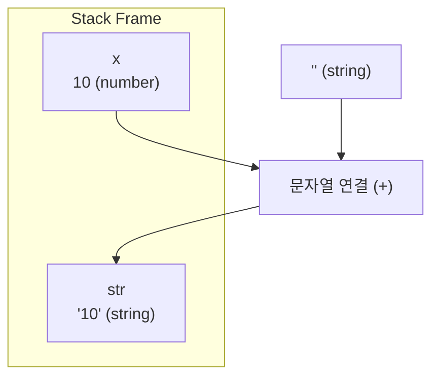
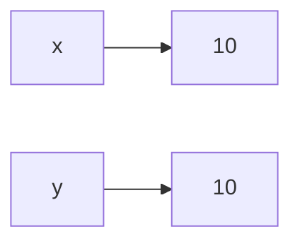
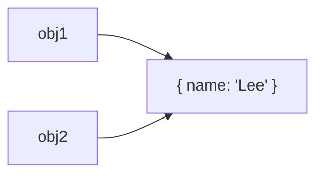
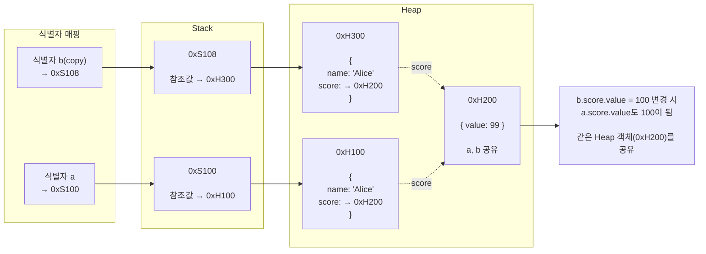
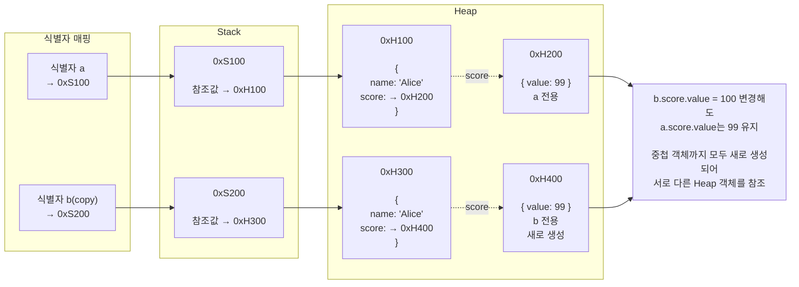
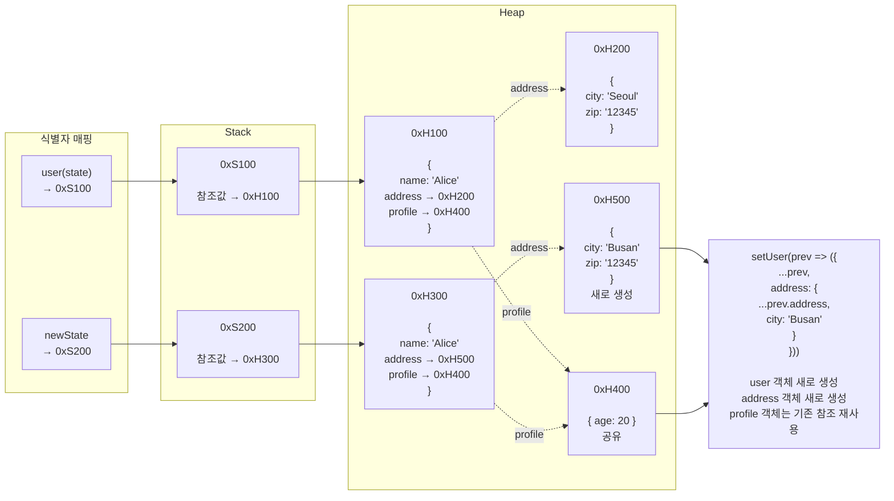

### 암묵적 타입 변환

자바스크립트의 모든 값은 타입이 있고 타입은 개발자의 의도에 따라 다른 타입으로 변환할 수 있음

타입 변환은 기존 원시 값을 직접 변경하는 것은 아님

→ 변경 불가능한 값이기에

그렇기에 타입 변환은 기존 원시 값을 사용해 다른 타입의 새로운 원시 값을 생성하는 것임

</br>

다음 예시 코드에서 암묵적 타입 변환이 일어나면 아래에 그림과 같음

```jsx
let x = 10;

let str = x + '';
console.log(typeof str, str);

console.log(typeof x, x);
```



</br>

먼저 알아볼 암묵적 타입 변환(타입 강제 변환)은 개발자의 의도와는 상관없이 코드의 문맥을 고려해 암묵적으로 데이터 타입을 강제 변환함

암묵적 타입 변환이 발생하면 문자열, 숫자, 불리언과 같은 원시 타입 중 하나로 타입을 자동 변환함

</br>
</br>

#### 문자열 타입으로 변환

```jsx
1 + '2' // "12"
```

`+` 연산자는 피연산자 중 하나 이상이 문자열이므로 문자열 연결 연산자로 동작함

문자열 연결 연산자의 역할은 문자열 값을 만드는 것, 문자열 연결 연산자의 모든 피연산자는 코드의 문맥상 모두 문자열 타입이어야 함

</br>

그렇다면 왜 문자열을 숫자로 변환이 아니라 문자열로 변환을 택한 것일까?

그 답은 문자열 연결은 정보 손실이 없기 때문임

```jsx
10 -> '10'
```

숫자 정보가 그대로  보존되는 반면

</br>

문자열을 숫자로 바꾸면 실패할 수 있음

```jsx
console.log(Number('hello'));  // NaN
```

</br>

따라서 숫자로 처리하는 것보다 문자열로 처리하는 것이 더 안전하다고 판단한 것임

```jsx
10 + 'hello'

10 + NaN  // X

'10hello' // O
```

정리하자면 `+` 연산자는 덧셈과 문자열 연결 모두를 담당하지만 피연산자 중 하나가 문자열이면 문자열 연결 모드로 전환 됨

</br>
</br>

#### 숫자 타입으로 변환

산술 연산자의 역할은 숫자 값을 만드는 것, 산술 연산자의 모든 피연산자는 코드 문맥상 모두 숫자 타입이어야 함

```jsx
1 - '1' // -> 0
1 * '10' // -> 10
1 / 'one' // -> NaN
```

JS 엔진은 산술 연산자 표현식을 평가하기 위해 산술 연산자의 피연산자 중에서 숫자 타입이 아닌 피연산자를 숫자 타입으로 암묵적 타입 변환함

변환할 수 없는 경우는 산술 연산을 수행할 수 없으므로 `NaN` 이 됨

</br>

비교 연산자는 피연산자의 크기를 비교하므로 모든 피연산자는 코드의 문맥상 모두 숫자 타입이어야 함

→ 비교 연산자의 역할은 불리언 값을 만드는 것

```jsx
console.log('1' > 0) // true
```

산술 연산자와 마찬가지로 JS 엔진이 숫자 타입이 아닌 피연산자를 숫자 타입으로 암묵적 타입 변환함

</br>
</br>

#### 불리언 타입으로 변환

if 문이나 for 문과 같은 제어문 또는 삼항 연산자의 조건식은 불리언 값으로 평가되어야 하는 표현식임

JS 엔진은 평가 결과를 불리언 타입으로 암묵적 타입 변환함

```jsx
if ('')    console.log('1');
if (true)  console.log('2');
if (0)     console.log('3');
if ('str') console.log('4');
if (null)  console.log('5');

// 2 4
```

불리언 타입이 아닌 값을 Truthy 값 또는 Falsy 값으로 구분함

</br>

다음 값을 제외한 나머지 값들은 `true` 로 평가되는 Truthy 값임

- `false`
- `undefined`
- `null`
- `0` , `-0`
- `‘’`

</br>
</br>

### 명시적 타입 변환

개발자의 의도에 따라 명시적으로 타입을 변경하는 방법은 다양함

표준 빌트인 생성자 함수를 `new` 연산자 없이 호출하는 방법, 빌트인 메서드를 사용하는 방법, 암묵적 타입 변환을 이용하는 방법이 있음

</br>

표준 빌트인 생성자 함수는 JS 엔진이 기본적으로 제공하는 객체 생성 함수로 `Object` , `String` , `Number` , `Boolean` 등이 있음

→ `new` 연산자와 함께 호출하면 새로운 객체가 생성되지만 없이 호출하면 타입 변환 함수로 동작하는 경우가 있음

빌트인 메서드는 JS가 기본적으로 제공하는 객체의 메서드를 말함

→ `String` 객체에서는 문자열을 다루기 위한 `toUpperCase` , `slice` , `includes` 등이 있음

</br>
</br>

#### 문자열 타입으로 변환

문자열 타입이 아닌 값을 문자열 타입으로 변환하는 방법은 다음과 같음

```jsx
// String 생성자 함수
String(1);
String(NaN);
String(Infinity);

// Object.prototype.toString 메서드
(1).toString();
(NaN).toString();
(Infinity).toString();

// 문자열 연결 연산자
1 + '';
NaN + '';
Infinity + '';
```

</br>
</br>

#### 숫자 타입으로 변환

숫자 타입이 아닌 값을 숫자 타입으로 변환하는 방법은 다음과 같음

```jsx
// Number 생성자 함수
Number('0');
Number('-1');
Number('10.53');

// parseInt, parseFloat 함수 -> 문자열만 가능
parseInt('0');
parseInt('-1');
parseInt('10.53');

// + 단항 산술 연산자
+'0';
+'-1';
+'10.53';

// * 산술 연산자
'0' * 1;
'-1' * 1;
'10.53' * 1;
```

</br>
</br>

#### 불리언 타입으로 변환

불리언 타입이 아닌 값을 불리언 타입으로 변환하는 방법은 다음과 같음

```jsx
// Boolean 생성자 함수
Boolean('x');
Boolean('');
Boolean('false');

// ! 부정 논리 연산자를 두 번 사용
!!'x';
!!'';
!!'false';
```

</br>
</br>

### 단축 평가

먼저 논리 연산자를 사용한 단축 평가부터 알아볼 것임

```jsx
'Cat' && 'Dog' // Dog

'Cat' || 'Dog' // Cat
```

`&&` , `||` 연산자는 논리 연산의 결과를 결정하는 피연산자를 타입 변환하지 않고 그대로 반환함

이를 단축 평가라함

즉, 표현식을 평가하는 도중에 평가 결과가 확정된 경우 나머지 평가 과정을 생략하는 것을 말함

</br>

단축 평가는 다음 규칙을 따름

- `true || anything` → `true`
- `false || anything` → `anything`
- `true && anything` → `anything`
- `false && anything` → `false`

단축 평가는 다음과 같은 상황에서 유용하게 사용됨

다음은 객체를 가리키기를 기대하는 변수가 `null` 또는 `undefined` 가 아닌지 확인하고 프로퍼티를 참조할 때의 상황임

```jsx
// TypeError
let elem = null;
let value = elem.value

// 단축 평가 사용
let elem = null;
let value = elem && elem.value;
```

</br>

또 다음처럼 함수 매개변수에 기본값을 설정할 때의 상황에서도 유용하게 사용됨

함수를 호출할 때 인수를 전달하지 않으면 매개변수에는 `undefined` 가 할당되기 때문임

```jsx
function getStringLength(str) {
	str = str || '';
	return str.length;
}

getStringLength();         // 0
getStringLength('hi');     // 2
```

</br>
</br>

### 옵셔널 체이닝, null 병합 연산자

옵셔널 체이닝 연산자 `?.` 는 좌항의 피연산자가 `null` 또는 `undefined` 인 경우 `undefined` 를 반환하고, 그렇지 않으면 우항의 프로퍼티 참조를 이어감

`user` 객체를 API 응답을 받아 사용한다는 코드가 있다고 가정함

```jsx
function Profile({ user }) {
	return (
		<div>
			<h1>{user?.name}</h1>
			<p>{user?.email}</p>
		</div>
	);
}
```

초기 렌더링 시에 API 요청이 완료되지 않았다면 `user` 가 `undefined` 일 수 있음

옵셔널 체이닝을 사용하지 않고 `user.name` 으로 접근하면 `undefined.name` 을 읽으려 하기 때문에 `TypeError` 가 발생함

반면 `user?.name` 은 `user` 가 `undefined` 이면 `.name` 프로퍼티에 접근하지 않고 연산 결과로 `undefined` 를 반환하므로 에러가 발생하지 않음

</br>

하지만 옵셔널 체이닝은 에러를 방지하는 역할만 수행할 뿐 기본값을 제공하지는 않음

```jsx
const postCount = user?.posts?.length;
```

`user` 또는 `posts` 가 존재하지 않는다면 `postCount` 는 `undefined` 가 됨

</br>

기본값이 필요하다면 `null` 병합 연산자 `??` 와 함께 사용하는 것이 일반적임

`null` 병합 연산자는 좌항의 피연산자가 `null` 또는 `undefined` 인 경우 우항의 피연산자를 반환하고, 그렇지 않으면 좌항의 피연산자를 반환함

```jsx
const postCount = user?.posts?.length ?? 0;
```

위 코드는 `user?.posts?.length` 의 결과가 `null` 또는 `undefined` 인 경우 `0` 을 반환함

</br>
</br>

### 객체란?

객체는 다양한 타입의 값을 하나의 단위로 구성한 복합적인 자료구조임

자바스크립트는 객체 기반의 프로그래밍 언어이며, 자바스크립트를 구성하는 거의 모든 것이 객체임

→ 원시 값을 제외한 나머지 값

</br>

객체는 0개 이상의 프로퍼티로 구성된 집합이며, 프로퍼티는 `key` 와 `value` 로 구성됨

```jsx
let person = {
	// 2개의 프로퍼티
	name: 'Lee', // name이라는 키, Lee라는 값
	age: 20      // age라는 키, 20라는 값
};
```

프로퍼티 키와 프로퍼티 값으로 사용할 수 있는 값은 다음과 같음

- **프로퍼티 키**
    - 빈 문자열을 포함한 모든 문자열 또는 심벌 값
    - 그렇기에 식별자 네이밍 규칙을 준수해야함
        - `“last-name”` 은 문자열로 해석하는 반면,  `lasst-name` 은 연산자가 있는 표현식으로 해석하기에
- **프로퍼티 값**
    - 자바스크립트에서 사용할 수 있는 모든 값

</br>

문자열 또는 문자열로 평가할 수 있는 표현식을 사용해 프로퍼티 키를 동적으로 생성할 수도 있음

```jsx
const searchType = 'email';

const user = {};

user[searchType] = 'test@test.com';

console.log(user);
```

키가 실행 중에 결정된다고 할때 기존 방식은 정적인 방식이기에 사용할 수 없음

즉, 프로퍼티 이름을 미리 알 수 없을 때 사용함

</br>

프로퍼티 값이 함수일 경우, 일반 함수와 구분하기 위해 메서드라고 부름

```jsx
let counter = {
	num: 0,
	// 메서드
	increase: function() {
		this.num++;
	}
};
```

</br>
</br>

### 객체 리터럴에 의한 객체 생성

클래스 기반 객체지향 언어는 클래스를 사전에 정의하고 필요한 시점에 `new` 연산자와 함께 생성자를 호출하여 인스턴스를 생성하는 방식으로 객체를 생성함

</br>

여기서 말하는 인스턴스란 무엇일까? 객체랑은 다른 것일까?

정확히 말하자면 둘은 관점이 다름

- **객체**
    - 메모리에 존재하는 참조 타입 값 전체를 의미
- **인스턴스**
    - 특정 생성자 함수 또는 클래스에 의해 생성된 객체를 그 생성 주체와의 관계를 강조하여 부르는 용어

즉, 존재 형태와 생성 관계에 따라 다름

</br>

자바스크립트는 프로토타입 기반 객체지향 언어로서 클래스 기반 객체지향 언어와는 달리 다양한 객체 생성 방법을 지원함

- 객체 리터럴
- `Object` 생성자 함수
- 생성자 함수
- `Object.create` 메서드
- 클래스

이러한 객체 생성 방법 중에서 가장 일반적이고 간단한 방법은 객체 리터럴을 사용하는 방법임

</br>

객체 리터럴 `{}` 은 중괄호 내에 0개 이상의 프로퍼티를 정의함

→ 빈 객체도 당연히 가능, 중괄호는 코드 블록을 의미하지 않음

변수에 할당되는 시점에 자바스크립트 엔진은 객체 리터럴을 해석해 객체를 생성함

```jsx
let person = {
	name: 'Lee',
	sayHello: function () {
		console.log(`Hello! My name is ${this.name}.`);
	}
};

console.log(typeof person); // object
console.log(person); // {name: 'Lee', sayHello: ƒ}
```

자바스크립트에서는 이렇게 객체 리터럴을 통해 클래스, `new` 연산자 없이도 쉽게 생성 가능함

</br>
</br>

### 프로퍼티 접근

프로퍼티에 접근하는 방법은 다음과 같음

- **마침표 표기법**
- **대괄호 표기법**

```jsx
let person = {
	name: 'Lee'
};

// 마침표 표기법에 의한 접근
console.log(person.name); // Lee

// 대괄호 표기법에 의한 접근
console.log(person['name']); // Lee
```

대괄호 표기법을 사용하는 경우 접근 연산자 내부에서 지정하는 프로퍼티 키는 반드시 따옴표로 감싼 문자열이어야 함

→ 사용하지 않을시 식별자로 해석하기에

만약 키가 숫자로 이뤄진 문자열인 경우 따옴표를 생략할 수 있음

→ 숫자를 문자열로 암묵 변환하여 키로 처리하기에

</br>

만약 다음과 같이 따옴표로 감싸지 않는다면 식별자 `name` 이 선언되지 않았기에 ReferenceError가 발생함

```jsx
let person = {
	name: 'Lee'
};

console.log(person[name]);
```

객체에 존재하지 않는 프로퍼티에 접근하면 `undefined` 를 반환함

</br>
</br>

### 프로퍼티 값 갱신, 동적 생성, 삭제

이미 존재하는 프로퍼티에 값을 할당하면 프로퍼티 값이 갱신됨

```jsx
let person = {
	name: 'Lee'
};

person.name = 'Kim';

console.log(person.name); // Kim
```

</br>

존재하지 않는 프로퍼티에 값을 할당하면 동적으로 생성되어 추가되어 값이 할당됨

```jsx
let person = {
	name: 'lee'
};

person.age = 20;

console.log(person.age); // 20
```

</br>

`delete` 연산자를 사용하면 객체의 프로퍼티를 삭제할 수 있음

이때 `delete` 연산자의 피연산자는 프로퍼티 값에 접근할 수 있는 표현식이어야 함

```jsx
let person = {
	name: 'Lee'
};

person.age = 20;

delete person.age;

delete person.address;
```

`address` 프로퍼티는 존재하지 않기에 삭제할 수 없음

→ 이때, 에러는 발생하지 않음

</br>
</br>

### ES6에서 추가된 객체 리터럴의 확장 기능

ES6에서는 프로퍼티 값으로 변수를 사용하는 경우 변수 이름과 프로퍼티 키가 동일한 이름일 때 프로퍼티 키를 생략 할 수 있음

```jsx
let x = 1, y = 2;

// ES5
let obj = {
	x: x,
	y: y
};

// ES6
let obj = { x, y };
```

이때 프로퍼티 키는 변수 이름으로 자동 생성됨

</br>

문자열 또는 문자열로 타입 변환할 수 있는 값으로 평가되는 표현식을 사용해 프로퍼티 키를 동적으로 생성 할 수도 있음

→ 계산된 프로퍼티 이름

```jsx
let prefix = 'prop';
let i = 0;

// ES5
let obj = {};

obj[prefix + '-' + ++i] = i;
obj[prefix + '-' + ++i] = i;
obj[prefix + '-' + ++i] = i;

console.log(obj);

// ES6
const obj = {
	[`${prefix}-${++i}`]: i,
	[`${prefix}-${++i}`]: i,
	[`${prefix}-${++i}`]: i
};
```

</br>

ES5까지만 해도 메서드를 정의할 때 `function` 키워드를 사용했지만 ES6에서는 생략한 축약 표현을 사용할 수 있음

```jsx
// ES5
let obj = {
	name: 'Lee'
	sayHi: function() {
		console.log('Hi ! ' + this.name);
	}
};

// ES6
const obj = {
	name: 'Lee'
	sayHi: {
		console.log('Hi ! ' + this.name);
	}
};
```

</br>
</br>

### 원시 값과 객체의 비교

원시 값을 변수에 할당하면 변수에는 실제 값이 저장됨

```jsx
let x = 10;
let y = x;
```



원시 값을 갖는 변수를 다른 변수에 할당하면 원본의 원시 값이 복사되어 전달됨

→ 값에 의한 전달

원시 값은 직접 변경할 수 없기에 변수 값을 변경하기 위해 원시 값을 재할당하면 새로운 메모리 공간을 확보하고 재할당한 값을 젖아한 후, 변수가 참조하던 메모리 공간의 주소를 변경함

→ 값의 이러한 특성을 불변성이라 함

</br>

이에 비해 객체를 변수에 할당하면 변수에는 참조 값이 저장됨

```jsx
const obj1 = { name: "Lee" };
const obj2 = obj1;
```



객체를 가리키는 변수를 다른 변수에 할당하면 원본의 참조 값이 복사되어 전달됨

→ 참조에 의한 전달

</br>
</br>

#### 문자열과 불변성

원시 값인 문자열은 다른 원시 값과 비교할 때 독특한 특징이 있음

숫자 값은 1도, 1000000도 동일한 8바이트가 필요하지만 문자열의 경우 1개의 문자로 이뤄진 문자열은 2바이트, 10개의 문자로 이뤄진 문자열은 20바이트가 필요함

이 같은 이유로 C에는 하나의 문자를 위한 데이터 타입, 문자열은 문자의 배열로 처리하고 자바에서는 String 객체로 처리함

→ 하지만 JS에서는 원시 타입인 문자열을 제공

</br>
</br>

#### 유사 배열 객체

유사 배열 객체란 마치 배열처럼 인덱스로 프로퍼티 값에 접근할 수 있고 `length` 프로퍼티를 갖는 객체를 말함

→ 실제 배열은 아님

</br>

예를 들어 다음 객체는 유사 배열 객체임

```jsx
const arrayLike = {
  0: "apple",
  1: "banana",
  2: "orange",
  length: 3
};

console.log(arrayLike[0]);             // apple
console.log(arrayLike.length);         // 3
console.log(Array.isArray(arrayLike)); // false
```

</br>

문자열도 인덱스로 문자에 접근할 수 있고 `length` 프로퍼티를 가지므로 유사 배열 객체처럼 동작함

```jsx
const str = "apple";

console.log(str[0]);      // a
console.log(str[1]);      // p
console.log(str.length);  // 5

console.log(Array.isArray(str)); // false
```

</br>

배열처럼 `arrayLike[0]` 으로 접근할 수 있고 `length` 도 있지만, 실제로는 객체임

```jsx
console.log(Array.isArray(str));  // false

console.log(typeof str); // object
```

</br>

그렇다면 왜 유사 배열일까?

배열과 생김새는 비슷하지만 배열 메서드를 사용할 수 없기 때문임

→ `push` , `pop` 등등..

```jsx
const arrayLike = {
	0: 'apple',
	1: 'banana',
	2: 'orange',
	length: 3
};

// Uncaught Error: Attempting to use a disconnected port object
arrayLike.push("orange");
```

</br>
</br>

### 얕은 복사와 깊은 복사

원시 값은 값 자체가 복사되므로 얕은 복사와 깊은 복사의 개념은 객체(특히 중첩 객체)에 대해서만 의미가 있음

```jsx
const a = {
  name: 'Alice',
  score: { value: 99 },
};

// 객체를 얕은 복사하는 자바스크립트 내장 메서드
const b = Object.assign({}, a);

b.score.value = 100;

console.log(a.score.value); // 100
console.log(b.score.value); // 100
```



얕은 복사는 식별자와 Stack 슬롯은 새로 할당하지만 중첩 객체의 Heap 주소는 원본과 공유함

따라서 중첩 객체를 수정하면 원본 객체도 함께 변경됨

객체 내부에 중첩 객체가 있을 때 이러한 공유가 발생함

</br>

```jsx
const a = {
  name: 'Alice',
  score: { value: 99 },
};

// 객체를 깊은 복사하는 자바스크립트 내장 메서드
const b = structuredClone(a);

b.score.value = 100;

console.log(a.score.value); // 99
console.log(b.score.value); // 100
```



깊은 복사는 Heap 객체까지 새로 생성해 원본과 완전히 독립된 복사본을 만듦

따라서 복사본을 수정해도 원본에는 영향을 주지 않음

`structuredClone()` 은 객체 전체를 복사하므로 원본과 완전히 독립적인 객체가 만들어진다

</br>
</br>

#### React에서의 얕은 복사

```jsx
const [user, setUser] = useState({
  name: "Alice",
  address: {
    city: "Seoul",
    zip: "12345"
  },
  profile: {
    age: 20
  }
});
```

</br>

위의 예시에서 `city` 만 변경하고 싶다면 다음과 같이 수정해야 함

```jsx
setUser(prev => ({
  ...prev,
  address: {
    ...prev.address,
    city: "Busan"
  }
}));
```



</br>