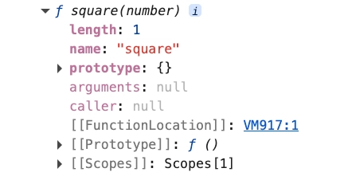
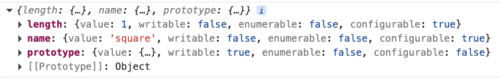

### 일급 객체

자바스크립트의 함수는 일급 객체이기에 객체와 동일하게 사용할 수 있음

일급 객체의 조건을 다음과 같음

- 무명의 리터럴로 생성할 수 있음
    - 런타임에 생성이 가능함
- 변수나 자료구조에 저장할 수 있음
- 함수의 매개변수에 전달할 수 있음
- 함수의 반환값으로 사용할 수 있음

</br>

예시 코드를 보면 다음과 같음

```tsx
// 변수에 함수를 저장함
// 이름 없는 함수 리터럴을 사용하여 생성함
const increase = function(num) {
	return ++num;
};

// 함수는 객체에 저장할 수 있음
const predicates = { increase };

// 함수의 매개변수에 전달할 수 있고 함수의 반환값으로 사용할 수 있음
function makeCounter(predicate) {
	let num = 0;
	
	return function() {
		num = predicate(num);
		return num;
	};
}
```

일반 객체와는 달리 함수 객체는 호출할 수 있음

</br>
</br>

### 함수 객체의 프로퍼티

함수는 객체이기에 프로퍼티를 가질 수 있음



</br>

`square` 함수의 모든 프로퍼티의 프로퍼티 어트리뷰트를 확인해 보면 다음과 같음

```tsx
function square(number) {
	return number * number;
}

console.log(Object.getOwnPropertyDescriptors(square));
```



책에서는 `arguments` , `caller` 이 출력된다고 나와있지만 둘 다 함수의 내부 실행 정보를 노출하기때문에 ES2015 이후는 최적화 방해, 보안 문제, 캡슐화 위반 등의 이유로 나오지 않음

</br>

현재는 일반 함수에서도 Rest 파라미티러를 사용한 방법을 많이 사용함

```tsx
function sum(...args) {
	return args.reduce((pre, cur) => pre + cur, 0);
}

console.log(sum(1, 2));
console.log(sum(1, 2, 3, 4, 5)):
```

</br>

`name` 프로퍼티는 ES6에서부터 함수 객체를 가리키는 식별자를 값으로 가짐

```tsx
// 기명 함수 표현식
let namedFunc = function foo() {};
console.log(namedFunc.name);  // foo

// 익명 함수 표현식
let anoymousFunc = function() {};
console.log(anonymouseFunc.name);  // anonymousFunc

// 함수 선언문
function bar() {}
console.log(bar.name);  // bar
```

</br>

모든 객체는 `[[Prototype]]` 이라는 내부 슬롯을 가짐

`[[Prototype]]` 내부 슬롯은 객체지향 프로그래밍의 상속을 구현하는 프로토타입 객체를 가리킴

`__proto__` 프로퍼티는 `[[Prototype]]` 내부 슬롯이 가리키는 프로토타입 객체에 접근하기 위해 사용하는 접근자 프로퍼티임

```tsx
const obj = { a: 1 };

console.log(obj.__proto__ === Object.prototype);  // true

console.log(obj.hasOwnProperty('a'));  // true
console.log(obj.hasOwnProperty('__proto__'));  // false
```

`__proto__` 접근자 프로퍼티를 통해서만 간접적으로 프로토타입 객체에 접근할 수 있음

`prototype` 프로퍼티는 함수가 객체를 생성하는 생성자 함수로 호출될 때 생성자 함수가 생성할 인스턴스의 프로토타입 객체를 가리킴

</br>