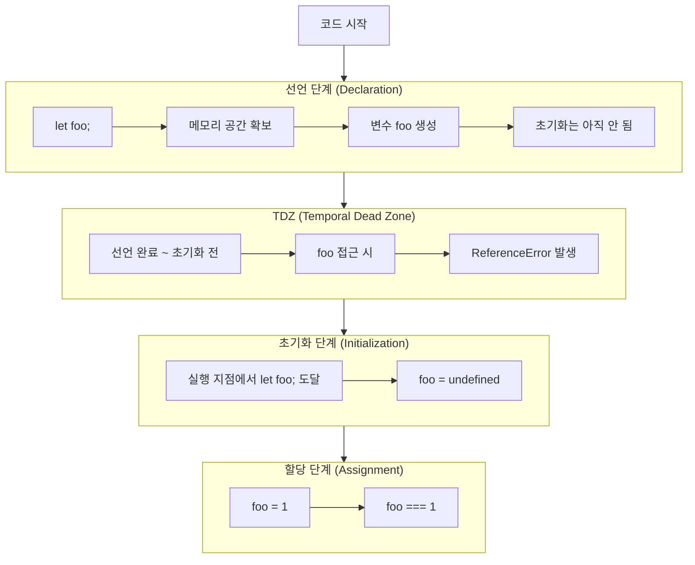
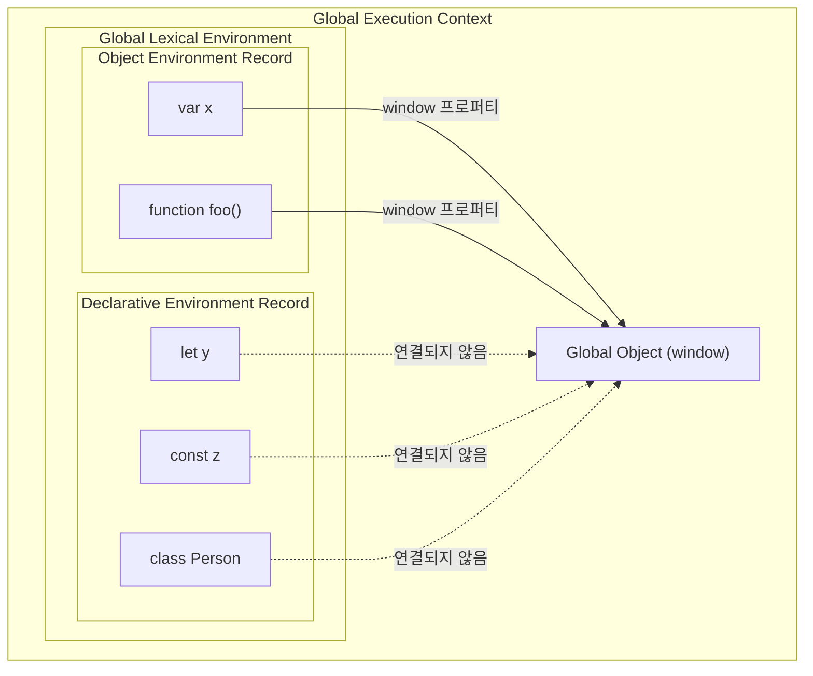
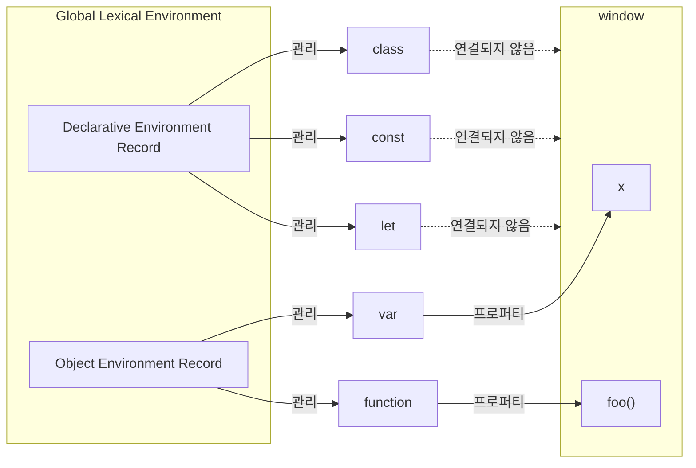

### var 키워드로 선언한 변수의 문제점

`var` 키워드로 선언된 변수는 같은 스코프 내에서 중복 선언을 허용함

또, 초기화문이 없는 변수 선언문은 무시됨

```tsx
var x = 1;
var y = 1;

var x = 100;
var y;

console.log(x);  // 100
console.log(y);  // 1
```

</br>

`var` 키워드로 선언한 변수는 오로지 함수의 코드 블록만을 지역 스코프로 인정함

```tsx
var x = 1;

if (true) {
	var x = 10;
}

console.log(x);  // 10
```

따라서 함수 외부에서 `var` 키워드로 선언한 변수는 코드 블록 내에서 선언해도 모두 전역 변수가 됨

</br>

`var` 키워드로 변수를 선언하면 변수 호이스팅이 일어남

이때문에 `var` 키워드로 선언한 변수는 변수 선언문 이전에 참조할 수 있음

→ `undefined` 를 반환

```tsx
console.log(foo);  // undefined

foo = 123;

console.log(foo);  // 123

var foo;
```

</br>
</br>

### let 키워드

`let` 키워드로 이름이 같은 변수를 중복 선언하면 문법 에러가 발생함

```tsx
var foo = 123;

var foo = 456;

let bar = 123;

let bar = 456;  // SyntaxError
```

</br>

함수 레벨 스코프만 따르는 `var` 키워드와는 다르게 `let` 키워드로 선언한 변수는 모든 코드 블록을 지역 스코프로 인정하는 블록 레벨 스코프를 따름

```tsx
// 전역 변수
let foo = 1;

// 지역 변수
{
	let foo = 2;
	let bar = 3;
}

console.log(foo);  // 1
console.log(bar);  // ReferenceError
```

</br>

함수도 코드 블록이므로 스코프를 만듦

```tsx
// 전역 스코프
let i = 10;

// 함수 레벨 스코프(지역 스코프)
function foo() {
	let i = 100;
	// 블록 레벨 스코프(지역 스코프)
	for (let i = 1; i < 3; i++) {
		console.log(i);
	}
	
	console.log(i);
}

foo();

console.log(i);
```

</br>

`var` 키워드로 선언한 변수와 달리 `let` 키워드로 선언한 변수는 변수 호이스팅이 발생하지 않는 것처럼 동작함

```tsx
console.log(foo);  // ReferenceError
let foo;
```

`let` 키워드로 선언한 변수는 선언 단계와 초기화 단계가 분리되어 진행되기 때문임

즉, 런타임 이전에 자바스크립트 엔진에 의해 암묵적으로 선언 단계가 먼저 실행되지만 초기화 단계는 변수 선언문에 도달했을 때 실행됨

</br>

만약 초기화 단계가 실행되기 이전에 변수에 접근하려고 하면 참조 에러가 발생함



스코프의 시작 시점부터 초기화 시작 지점까지 변수를 참조할 수 없는 구간을 일시적 사각지대, TDZ라고 부름

이때, `1` 로 바로 할당되는것이 아닌 초기화는 `undefined` 로 초기화됨

</br>
</br>

#### 전역 객체와 var, let

브라우저에서 자바스크립트가 실행되면 가장 먼저 Global Object가 생성됨

브라우저 환경에서 전역 객체는 `window` 이며, 브라우저가 JavaScript에게 제공하는 모든 기능을 하나의 객체에서 관리하기 위해 존재함

JavaScript 언어 자체는 화면을 그리거나 네트워크 요청을 보내는 기능을 가지고 있지 않음

브라우저는 이러한 기능들을 JavaScript에서 사용할 수 있도록 모두 `window` 객체의 프로퍼티로 등록함

</br>

다음과 같은 객체들이 모두 `window` 의 프로퍼티임

```tsx
window.alert
window.document
window.location
window.fetch
window.console
window.setTimeout
```

</br>

평소에는 `window` 를 생략해서 사용하기 때문에 다음 두 코드는 동일하게 동작함

```tsx
alert("Hello");
window.alert("Hello");
```

</br>

브라우저에서 전역 코드가 실행되면 Global Execution Context가 생성되고, 그 안에는 Global Lexical Environment가 생성됨

Global Lexical Environment는 다시 두 개의 Environment Record로 구성됨



- **Object Environment Record**
    - `var` 로 선언한 전역 식별자
    - 그외..
    - `window` 객체와 연결되어 있음
- **Declarative Environment Record**
    - `let` , `const` , `class` 로 선언한 전역 식별자
    - ES6에서 도입된 공간임
    - 그외…
    - `window` 객체와 연결되지 않음

</br>

따라서 아래 코드의 실행 결과값 다음과 같음

```tsx
var x = 1;
let y = 2;

function foo() {}

console.log(window.x);    // 1
console.log(window.foo);  // function foo() {}
console.log(window.y);    // undefined
```

`var` 와 함수 선언문은 `window` 의 프로퍼티로 등록되지만, `let` 은 `window` 와 연결되지 않기 때문에 `window.y` 로 접근할 수 없음

</br>

이렇게 Environment Record가 두 개로 나뉜 이유는 기존 JavaScript와의 하위 호완성을 유지하기 위해서임

ES6 이전에는 전역에서 선언한 `var` 와 함수 선언문이 모두 `window` 의 프로퍼티가 되는 것이 JavaScript의 동작 방식이었음

이미 수많은 웹사이트와 라이브러리가 이러한 동작을 전제로 작성되어 있었기 때문에 ES6에서 이를 변경하면 기존 코드들이 정상적으로 동작하지 않게됨

그래서 기존 방식은 그대로 유지하면서, 새롭게 도입된 `let` , `const` , `class` 만 별도의 Declarative Environment Record에서 관리하도록 설게하였음

</br>

결과적으로 현재의 Global Environment Record는 다음과 같은 구조를 가짐



</br>
</br>

### const 키워드

기존에 `let` 키워드는 선언 단계와 초기화 단계가 분리되어 진행되는 것을 알 수 있었음

따라서 선언문에 도달하면 먼저 `undefined` 로 초기화되고, 이후 값이 할당됨

</br>

반면 `const` 키워드는 반드시 선언과 동시에 초기화해야함

```tsx
const foo = 1;

const foo;  // SyntaxError
```

`const` 키워드로 선언한 변수는 `let` 키워드로 선언한 변수와 마찬가지로 블록 레벨 스코프를 가지며, 변수 호이스팅이 발생하지 않는 것처럼 동작함

</br>