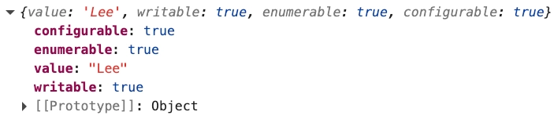
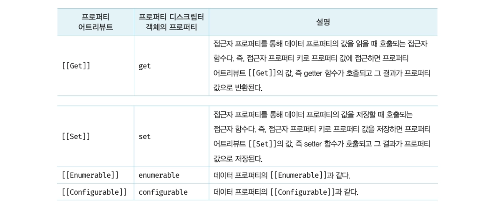
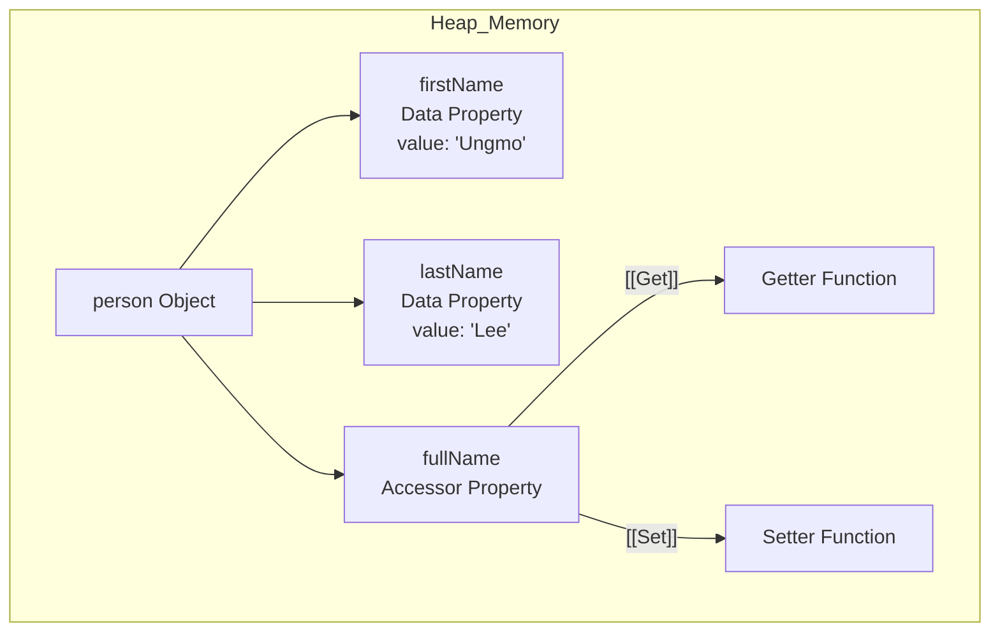
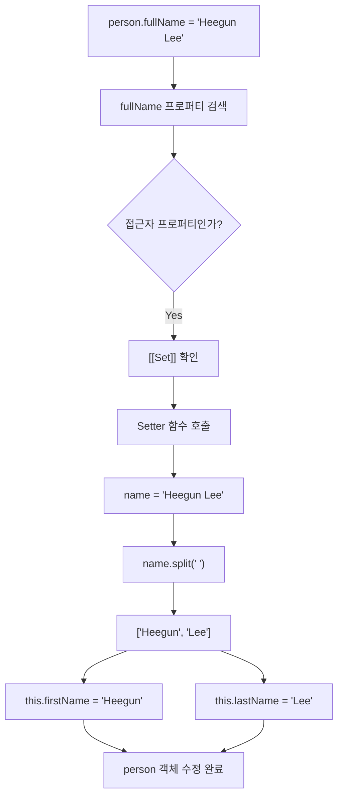
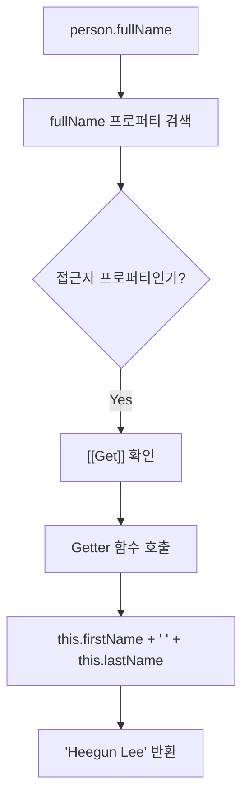

### 내부 슬롯과 내부 메서드

내부 슬롯과 내부 메서드는 자바스크립트 엔진의 구현 알고리즘을 설명하기 위해 ECMAScript 사양에서 사용하는 의사 프로퍼티와 의사 메서드임

ECMAScript 사양에 정의도니 대로 구현되어 자바스크립트 엔진에서 실제로 동작함

즉, 자바스크립트 엔진의 내부 로직임

</br>
</br>

### 프로퍼티 어트리뷰트와 프로퍼티 디스크립터 객체

자바스크립트 엔진은 프로퍼티를 생성할 때 프로퍼티의 상태를 나타내는 프로퍼티 어트리뷰트를 기본값으로 자동 정의함

프로퍼티의 상태란 다음 정보를 의미함

- `value`
    - 프로퍼티의 값
- `writable`
    - 값의 갱신 여부
- `enumerable`
    - 열거 가능 여부
- `configurable`
    - 재정의 가능 여부

</br>

프로퍼티 어트리뷰트는 자바스크립트 엔진이 관리하는 내부 슬롯이므로 코드에서 직접 접근할 수 없음

따라서 다음 메서드를 통해 간접적으로 확인할 수 있음

```tsx
const person = {
	name: 'Lee'
};

console.log(Object.getOwnPropertyDescriptor(person, 'name'));
```

`Object.getOwnPropertyDescriptor` 메서드를 호출할 때 첫 번째 매개변수에는 객체의 참조를 전달하고, 두 번째 매개변수에는 프로퍼티 키를 문자열로 전달함

</br>

실행시 다음과 같이 프로퍼티의 상태가 출력되는 것을 볼 수 있음



`Object.getOwnPropertyDescriptor` 메서드는 프로퍼티 어트리뷰트 정보를 일반 객체 형태로 반환하는데, 이 반환 객체를 프로퍼티 디스크립터 객체라고 함

즉, 프로퍼티 어트리뷰트는 자바스크립트 엔진 내부에 저장된 실제 상태 정보이고, 프로퍼티 디스크립터 객체는 그 상태 정보를 개발자가 확인하거나 사용할 수 있도록 만든 일반 객체임

</br>
</br>

### 데이터 프로퍼티와 접근자 프로퍼티

프로퍼티는 데이터 프로퍼티와 접근자 프로퍼티로 구분할 수 있음

먼저, 데이터 프로퍼티는 키와 값으로 구성된 일반적인 프로퍼티임

다음과 같은 프로퍼티 어트리뷰트를 가짐

!image.png

프로퍼티가 생성될 때 `[[Value]]` 의 값은 프로퍼티 값으로 초기화되며 `[[Writable]]` , `[[Enumerable]]` , `[[Configurable]]` 의 값은 `true` 로 초기화됨

</br>

다음은 접근자 프로퍼티임

접근자 프로퍼티는 자체적으로 값을 저장하지 않는 프로퍼티이며, 다른 데이터 프로퍼티의 값을 읽거나 저장할 때 사용하는 접근자 함수를 가짐

다음과 같은 프로퍼티 어트리뷰트를 가짐



접근자 함수는 `getter`, `setter` 함수라고도 하며 둘 다 정의할 수도 있고 하나만 정의할 수도 있음

</br>

```tsx
const person = {
  firstName: "Ungmo",
  lastName: "Lee",

  get fullName() {
    return `${this.firstName} ${this.lastName}`;
  },

  set fullName(name) {
    [this.firstName, this.lastName] = name.split(" ");
  }
};

console.log(person.firstName + " " + person.lastName);

person.fullName = "Heegun Lee";
console.log(person);

console.log(person.fullName);
```

위의 코드가 실행되어 객체가 생성되면 내부적으로는 다음과 같은 형태를 가짐

</br>



`firstName` , `lastName` 은 실제 값을 저장하는 데이터 프로퍼티이고, `fullName` 은 값을 저장하는 프로퍼티가 아니라 `getter` 와 `setter` 함수의 참조를 가지고 있는 접근자 프로퍼티임

</br>

따라서 아래 코드 실행시

```tsx
person.fullName = "Heegun Lee";
```

`“Heegun Lee”` 가 `fullName` 에 저장되는 것이 아니라, 자바스크립트 엔진이 `[[Set]]` 내부 메서드를 통해 `setter` 함수를 호출함

</br>

동작 과정은 다음과 같음



다음처럼 접근자 프로퍼티를 읽으면 `[[Get]]` 내부 메서드가 `getter` 함수를 호출함

```tsx
console.log(person.fullName);
```

동작 과정은 다음과 같음



</br>

```tsx
person.fullName

person.fullName = "Heegun Lee";
```

첫 코드는 `fullName` 에 저장된 값을 읽는 것이 아니라 `getter` 함수의 실행 결과를 반환하는 것임

두 번째 코드는 `fullName` 에 값을 저장하는 것이 아니라 `setter` 함수가 실행되어 다른 데이터 프로퍼티의 값을 수정하는 것임

즉, 데이터 프로퍼티는 실제 데이터를 저장하는 프로퍼티이고 접근자 프로퍼티는 `getter` 와 `setter` 를 통해 데이터 프로퍼티의 읽기와 쓰기를 제어하는 프로퍼티임

</br>
</br>

### 프로퍼티 정의

프로퍼티 정의한 새로운 프로퍼티를 추가하면서 프로퍼티 어트리뷰트를 명시적으로 정의하거나, 기존 프로퍼티의 프로퍼티 어트리뷰트를 재정의하는 것을 말함

`Object.definedProperty` 메서드를 사용하면 프로퍼티의 어트리뷰트를 정의할 수 있음

인수로는 객체의 참조와 데이터 프로퍼티의 키인 문자열, 프로퍼티 디스크립터 객체를 전달함

</br>

다음은 데이터 프로피티를 정의 했을때임

```tsx
const person = {};

Object.defineProperty(person, 'firstName', {
	value: 'Ungmo',
	writable: true,
	enumerable: true,
	configurable: true
});
```

</br>

디스크립터 객체의 프로퍼티를 누락시키면 `undefined` , `false` 가 기본값임

```tsx
Object.definedProperty(persosn, 'lastName', {
	value: 'Lee'
});

console.log(Object.getOwnProPertyDescriptor(person, 'lastName'));
// {value: "Lee" , writable: false, enumerable: false, configurable: false}
```

</br>

다음은 접근자 프로피티를 정의 했을때임

```tsx
Object.defineProperty(person, 'fullName', {
	get() {
		return `${this.firstName} ${this.lastName}`;
	},
	
	set(name) {
		[this.firstName, this.lastName] = name.split(' ' );
	},
	enumerable: true,
	configurable: true
});

console.log(Object.getOwnProPertyDescriptor(person, 'fullName'));
// {get: ƒ, set: ƒ, enumerable: true, configurable: true}
```

</br>

`Object.defineProperty` 메서드는 한번에 하나의 프로퍼티만 정의할 수 있음

여러 개의 프로퍼티를 한 번에 정의하고 싶다면 `Object.defineProperties` 메서드를 사용하면 됨

```tsx
const person = {};

Object.defineProperties(person, {
    firstName: {
        value: 'Ungmo',
        writable: true,
        enumerable: true,
        configurable: true
    },
    lastName: {
        value: 'Lee',
        writable: true,
        enumerable: true,
        configurable: true
    },
    fullName: {
        get() {
            return `${this.firstName} ${this.lastName}`
        },
        set(name) {
            [this.firstName, this.lastName] = name.split(' ');
        },
        enumerable: true,
        configurable: true
    }
})
```

</br>