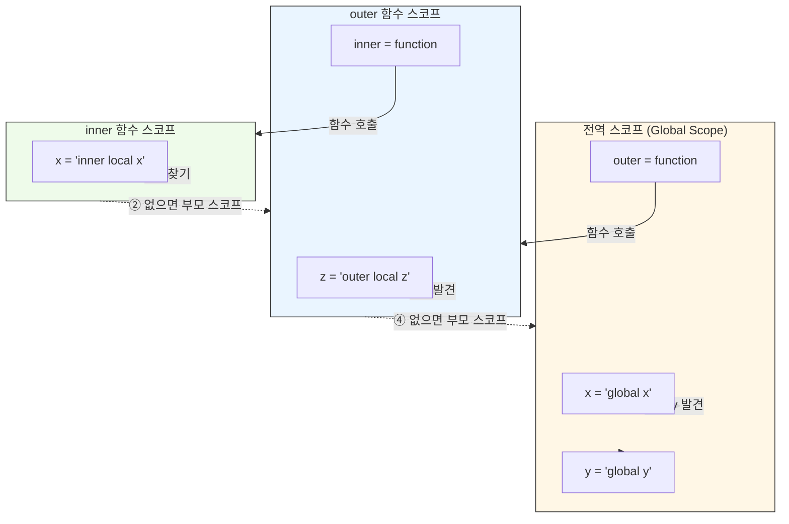
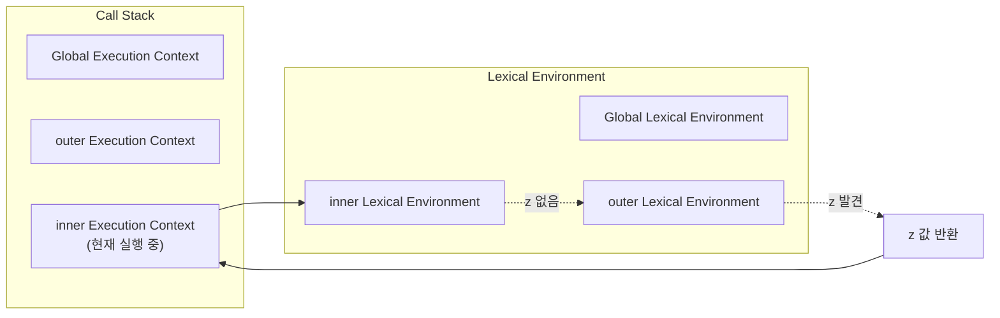
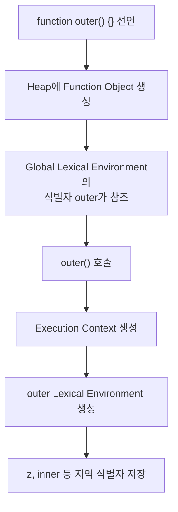

### 스코프란?

모든 식별자는 자신이 선언된 위치에 의해 다른 코드가 식별자 자신을 참조할 수 있는 유효 범위가 결정됨

이를 스코프라고 함

즉, 스코프는 식별자가 유효한 범위를 말함

</br>

예를 들어 함수의 매개변수는 함수 몸체 내부에서만 참조할 수 잇고 함수 몸체 외부에서는 참조할 수 없음

매개변수의 스코프가 함수 몸체 내부로 한정되기 때문임

```tsx
function add(x, y) {
	console.log(x, y);
	return x + y;
}

add(2, 5);

console.log(x, y);  // ReferenceError
```

</br>

변수는 코드의 가장 바깥 영역뿐 아니라 코드 블록이나 함수 몸체 내에서도 선언할 수 있음

이때 코드 블록이나 함수는 중첩될 수 있음

```tsx
let var1 = 1;

if (true) {
	let var2 = 2;
	if (ture) {
		let var3 = 3;
	}
}

function foo() {
	let var4 = 4;
	
	function bar() {
		let var5 = 5;
	}
}

console.log(var1);  // 1
console.log(var2);  // 2
console.log(var3);  // 3
console.log(var4);  // ReferenceError
console.log(var5);  // ReferenceError
```

</br>

```tsx
let x = 'global';

function foo() {
	let x = 'local';
	console.log(x);
}

foo();

console.log(x);
```

다음 코드에서 자바스크립트 엔진은 이름이 같은 두 개의 변수 중에서 어떤 변수를 참조해야 할 것인지를 결정해야함

이를 식별자 결정이라고 함

자바스크립트 엔진은 코드를 실행할 때 코드의 문맥을 고려함

→ 코드의 문맥은 렉시컬 환경으로 이루어짐

</br>
</br>

### 스코프의 종류

코드는 전역과 지역으로 구분할 수 있음

코드의 가장 바깥영역을 전역이라하고 함수 몸체 내부를 지역이라고 함

```tsx
let x = "globla x";
let y = "global y";

function outer() {
	let z = "outer's local z";
	
	console.log(x);  // global x
	console.log(y);  // global y
	console.log(z);  // outer's local z
	
	function inner() {
		let x = "inner's local x";
		
		console.log(x);  // global x
		console.log(y);  // global y
		console.log(z);  // outer's local z
	}
	
	inner();
}

outer();

console.log(x);  // global x
console.log(z);  // ReferenceError
```

전역에서 선언된 x 변수와 y 변수는 전역 변수로 어디서든지 참조할 수 있음

지역에 변수를 선언하면 지역 스크프를 갖는 지역 변수가 됨

지역 변수는 자신이 선언된 지역과 하위 지역에서만 참조할 수 있음

</br>
</br>

### 스코프 체인

함수는 중첩될 수 있으므로 함수의 지역 스코프도 중첩될 수 있음

중첩 함수의 지역 스코프는 중첩 함수를 포함하는 외부 함수의 지역 스코프와 계층적 구조를 가짐

이때 외부 함수의 지역 스코프를 중첩 함수의 상위 스코프라고 함

</br>

직전 예시 코드에서 `outer` 함수가 만든 지역 스코프는 `inner` 함수가 만든 지역 스코프의 상위 스코프이며, `outer` 함수의 지역 스코프의 상위 스코프는 전역 스코프임

```tsx
let x = "globla x";
let y = "global y";

function outer() {
	let z = "outer's local z";
	
	console.log(x);  // global x
	console.log(y);  // global y
	console.log(z);  // outer's local z
	
	function inner() {
		let x = "inner's local x";
		
		console.log(x);  // global x
		console.log(y);  // global y
		console.log(z);  // outer's local z
	}
	
	inner();
}

outer();

console.log(x);  // global x
console.log(z);  // ReferenceError
```

</br>

이러한 계층 구조를 그림으로 나타내면 다음과 같음



이처럼 모든 스코프는 하나의 계층적 구조로 연결되며, 모든 지역 스코프의 최상위 스코프는 전역 스코프임

이렇게 스코프가 계층적으로 연결된 것을 스코프 체인이라 함

변수를 참조할 때 자바스크립트 엔진은 스코프 체인을 통해 변수를 참조하는 코드의 스코프에서 시작하여 상위 스코프 방향으로 이동하며 선언된 변수를 검색함

즉, 변수 검색은 항상 현재 스코프 → 부모 스코프 → 전역 스코프 방향으로만 이루어짐

반대로 하위 스코프로 내려가면서 변수를 검색하는 일은 절대 없음

</br>

이때, 상위 스코프로 이동한다고 해서 상위 함수가 다시 실행되는 것은 아님

현재 실행 중인 함수는 그대로이며, 자바스크립트 엔진은 상위 스코프의 Lexical Environment를 조회해서 변수만 검색함

`inner` 함수에서 `z` 를 참조하는 과정을 Call Stack 관점에서 보면 다음과 같음



즉, 스코프 체인을 따라 상위 스코프로 이동한다는 것은 상위 함수를 다시 호출하는 것이 아니라 상위 Lexical Environment를 조회하는 과정임

</br>

`outer` 함수가 전역에서 선언되었는데 왜 `outer` 지역 스코프가 존재하는지에 대해 의문이 생길 수 있음

함수도 객체이므로 함수를 선언하면 함수 객체가 생성되고, 함수 이름과 동일한 식별자에는 함수 객체의 참조값이 저장됨

```tsx
function outer() {}
```

코드의 함수를 선언하면 전역에는 다음과 같은 상태가 만들어짐



여기서 `outer` 는 함수 객체를 참조하는 전역 식별자일 뿐이며, 아직 지역 변수는 존재하지 않음

이후 `outer()` 를 호출하는 순간 자바스크립트 엔진은 새로운 Execution Context를 생성하고, 그 안에 Lexical Environment를 생성함

이 Lexical Environment가 바로 `outer` 함수의 지역 스코프임

따라서 스코프 체인에서 말하는 `outer` 스코프는 전역의 `outer` 식별자가 아니라 `outer()` 실행 시 생성된 Lexical Environment를 의미함

</br>
</br>

### 렉시컬 스코프

```tsx
var x = 1;

function foo() {
	var x = 10;
	bar();
}

function bar() {
	console.log(x);
}

foo();
bar();
```

위 코드의 실행 결과는 `bar` 함수의 상위 스코프가 무엇인지에 따라 결정됨

이를 통해 두 가지 패턴을 예측할 수 있음

- 함수를 어디서 호출했는지에 따라 함수의 상위 스코프를 결정함
- 함수를 어디서 정의했는지에 따라 함수의 상위 스코프를 결정함

</br>

첫 번째 방식으로 함수의 상위 스코프를 결정한다면 `bar` 함수의 상위 스코프는 `foo` 함수의 지역 스코프와 전역 스코프일 것임

→ 동적 스코프 방식

두 번째 방식으로 함수의 상위 스코프를 결정한다면 `bar` 함수의 상위 스코프는 전역 스코프일 것임

→ 렉시컬 스코프 또는 정적 스코프

</br>

자바스크립트는 렉시컬 스코프를 따르므로 함수를 어디서 호출했는지가 아니라 함수를 어디서 정의했는지에 따라 상위 스코프를 결정함

그렇기에 함수가 호출된 위치는 상위 스코프 결정에 어떠한 영향도 주지 않음

따라서 `foo()` , `bar()` 시 `bar` 함수 객체는 자신이 정의된 전역 스코프를 기억하기에 1을 두 번 출력함

</br>
</br>

### 변수의 생명 주기

변수는 자신이 선언된 위치에서 생성되고 소멸함

전역 변수의 생명 주기는 애플리케이션의 생명 주기와 같지만 함수 내부에서 선언된 지역 변수는 함수가 호출되면 생성되고 종료시 소멸함


함수를 호출하면 함수 몸체의 다른 문들이 순차적으로 실행되기 이전에 변수의 선언문이 자바스크립트 엔진에 의해 가장 먼저 실행되어 변수가 선언되고 `undefined` 로 초기화됨

그리고 함수가 종료하면 변수도 소멸되어 생명 주기가 종료됨

즉, 지역 변수의 생명 주기는 함수의 생명 주기와 일치함

</br>

하지만  함수 몸체 내부에서 선언된 지역 변수의 생명 주기는 함수의 생명 주기와 대부분 일치하지만 지역 변수가 함수보다 오래 생존하는 경우도 있음

해당 스코프를 참조하고 있다면 스코프는 해제되지 않고 생존하기 때문임

이를 클로저라고 함

</br>

```tsx
let x = 'global';

function foo() {
	console.log(x);
	let x = 'local';
}

foo();  // ReferenceError
```

다음 코드에서는 `foo()` 시 `ReferenceError` 가 발생하는 것을 알 수 있음

호이스팅은 스코프 단위로 동작하기에 `let` 으로 선언한 변수는 TDZ에 머물기 때문임

</br>
</br>

### 전역 변수의 문제점

전역 변수는 전역에서 참조하고 할당할 수 있는 변수이기에 모든 코드가 전역 변수를 참조하고 변경할 수 있는 암묵적 결함을 허용하는 것임

또 전역 변수는 생명 주기가 길어 변수 이름이 중복되면 의도치 않은 재할당이 이뤄짐

그리고 전역 변수는 스코프 체인 상에서 종점에 존재하기에 검색 속도가 가장 느림

마지막으로 자바스크립트는 하나의 전역 스코프를 공유하기에 예상치 못한 결과를 가져올 수 있음

전역 변수를 반드시 사용해야 할 이유를 찾지 못한다면 지역 변수를 사용하는것이 좋음

</br>