### 프로토타입

자바스크립트는 프로토타입을 기반으로 상속을 구현하여 불필요한 중복을 제거함

기존에 생성자 함수는 다음과 같이 구현을 하였음

```tsx
function Circle(radius) {
  this.radius = radius;
  this.getArea = function () {
    return Math.PI * this.radius ** 2;
  };
}

const circle1 = new Circle(1);
const circle2 = new Circle(2);

console.log(circle1.getArea === circle2.getArea);  // false
```

`getArea` 메서드는 모든 인스턴스가 동일한 내용의 메서드를 사용하므로 단 하나만 생성하는 것이 바람직함

다음 상황에서 생성자 함수에 의해 생성된 인스턴스는 메모리를 불필요하게 낭비함

</br>

자바스크립트의 프로토타입을 기반으로 상속을 사용하면 불필요한 중복을 제거할 수 있음

프로토타입은 인스턴스들이 공통으로 사용할 프로퍼티와 메서드를 저장하는 객체임

```tsx
function Circle(radius) {
  this.radius = radius;
}

Circle.prototype.getArea = function() {
  return Math.PI * this.radius ** 2;
};

const circle1 = new Circle(1);
const circle2 = new Circle(2);

console.log(circle1.getArea === circle2.getArea);  // true
```

</br>

그림으로 보면 다음과 같음

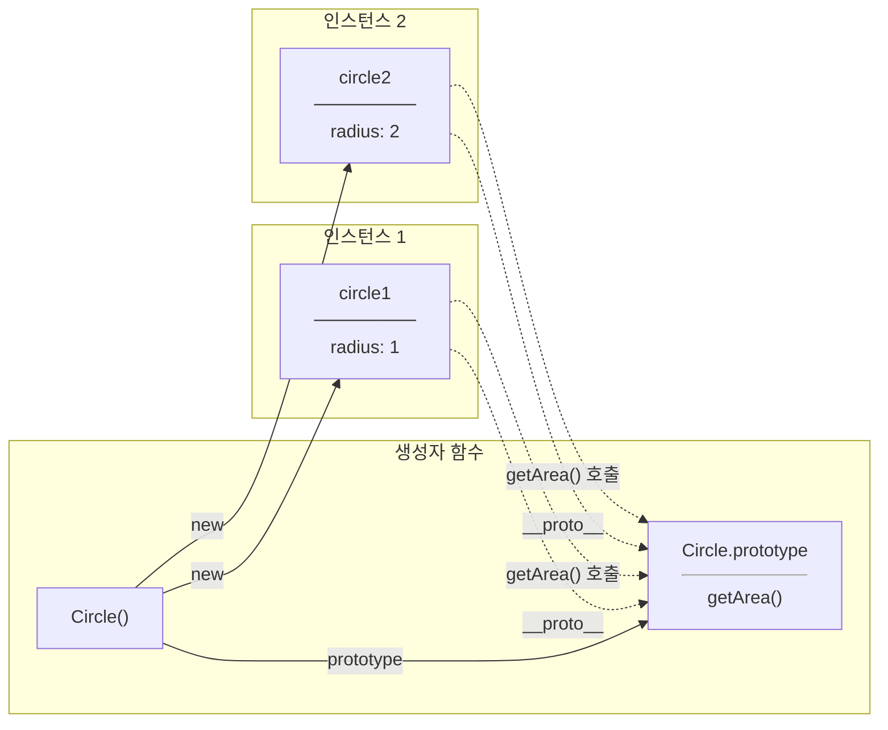

`Circle` 생성자 함수가 생성한 모든 인스턴스는 상위 객체 역할을 하는 `Circle.prototype` 의 모든 프로퍼티와 메서드를 상속받음

</br>
</br>

### 런타임 이전과 이후의 동작 과정

함수 선언문은 런타임 이전 평가 단계에서 먼저 평가되어 JS 엔진이 `Circle` 이라는 식별자를 생성한 뒤 함수 객체를 생성하여 연결함

```tsx
function Circle(radius) {
	this.radius = radius;
}
```

이때 함수 객체는 호출 방식에 따라 동작할 수 있도록 `[[Call]]`, `[[Construct]]` 내부 메서드를 함께 가지게 되며, 생성자 함수로 호출될 수 있는 함수이므로 `prototype` 프로퍼티도 함께 생성됨

→ 함수 객체의 `prototype` 프로퍼티

이후 JS 엔진은 인스턴스들이 공유할 프로토타입 객체 `Circle.prototype` 을 생성하고, 해당 객체에 자신을 생성한 함수 객체를 참조하는 `constructor` 프로퍼티를 추가함

→ 초기 상태에서는 `constructor` 프로퍼티만 존재

</br>

또한 `Circle.prototype` 역시 하나의 객체이므로 자신의 `[[Prototype]]` 내부 슬롯을 가짐

이 내부 슬롯은 `Object.prototype` 을 참조하며, 결국 `Circle.prototype` 역시 프로토타입 체인에 포함됨

즉, 프로토타입도 하나의 객체이기 때문에 또 다른 프로토타입을 가지게 되며, 최종적으로 모든 프로토타입 체인의 종점은 `null` 이 됨

마지막으로 함수 객체의 `prototype` 프로퍼티가 생성된 `Circle.prototype` 객체를 참조하도록 연결함

</br>

즉, `new Circle(1);` 를 호출해야 만들어지는 객체가 아니라, 함수 객체가 생성되는 순간 이미 존재하는 객체임

따라서 아직 인스턴스를 하나도 생성하지 않았더라도 `Circle.prototype` 은 이미 메모리에 존재하며, `constructor` 프로퍼티를 통해 자신을 생성한 생성자 함수를 참조하고 있음

```tsx
console.log(Circle.prototype);  // { constructor: ƒ Circle() }
```

그래서 아직 인스턴스를 하나도 생성하지 않았더라도 코드가 정상적으로 동작함

</br>

메모리 구조를 보면 다음과 같음

`[[Construct]]` 는 `new` 연산자와 함께 호출될 때 새로운 인스턴스를 생성하는 내부 메서드임

반면 `constructor` 는 프로토타입 객체에 존재하는 프로퍼티로, 자신을 생성한 생성자 함수를 참조하기 위한 용도로 사용됨

둘 다 이름은 비슷하지만 하나는 내부 메서드이고 다른 하나는 일반 프로퍼티이므로 서로 전혀 다른 개념임

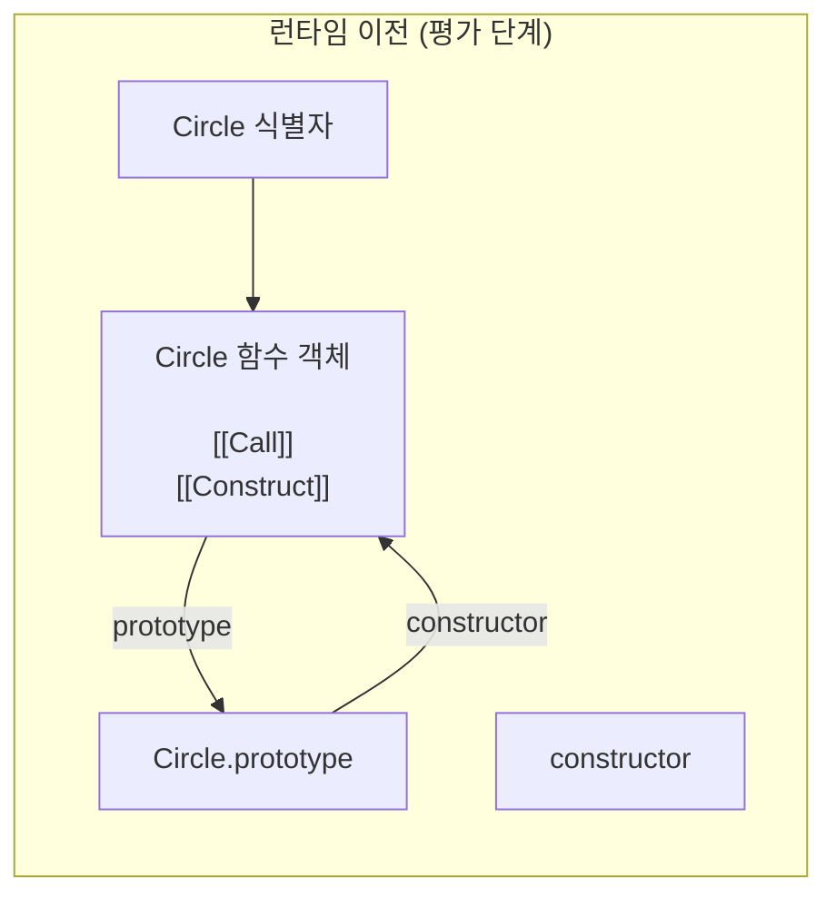

여기까지는 프로토타입 객체만 생성되었을 뿐 인스턴스는 아직 하나도 존재하지 않는 상태임

</br>

이후 런타임에서 다음 코드를 실행하면 `new` 키워드에 의해 함수의 `[[Construct]]` 내부 메서드가 실행됨

```tsx
const Circle1 = new Circle(1);
```

여기서 `[[Construct]]` 는 프로토타입 객체를 생성하는 역할이 아니라 이미 존재하는 프로토타입 객체를 이용하여 인스턴스를 생성하는 역할임

</br>

`[[Construct]]` 는 내부적으로 먼저 새로운 빈 객체를 하나 생성함

해당 객체는 아무런 프로퍼티도 가지지 않은 순수한 객체임

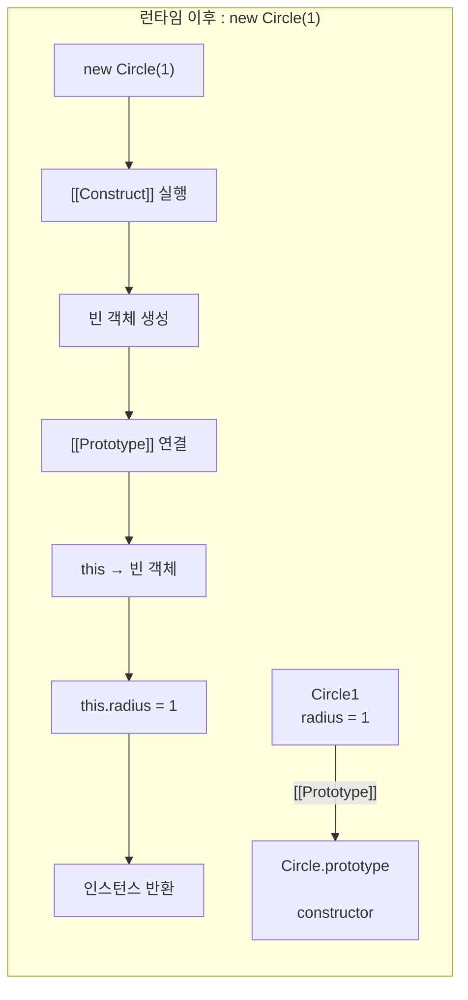

그 다음 생성한 객체의 `[[Prototype]]` 내부 슬롯을 이미 생성되어 있던 `Circle.prototype` 으로 연결함

여기서 `[[Prototype]]` 에는 프로포타입 객체 자체가 저장되는 것이 아니라 프로토타입 객체의 참조값이 저장됨

그 다음 생성한 객체를 `this` 에 바인딩함

</br>

따라서 생성자 함수 내부의 다음 코드는 동일한 의미가 됨

```tsx
this.radius = radius;

Circle1.radius = radius;
```

</br>

함수 실행이 모두 끝나면 `this` 가 가리키는 객체를 반환하여 최종 인스턴스가 완성됨

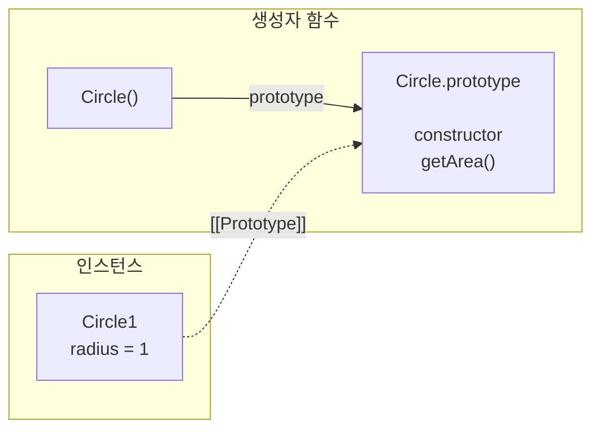

</br>

`prototype` 프로퍼티는 모든 객체가 가지고 있는 프로퍼티가 아니라 함수 객체만 소유하는 프로퍼티임

```tsx
(function () {}).hasOwnProperty('prototype');  // true

({}).hasOwnProperty('prototype');              // false
```

일반 객체는 생성될 인스턴스가 존재하지 않기 때문에 `prototype` 프로퍼티가 필요 없음

</br>

반면 함수 객체는 생성자 함수로 호출될 가능성이 있기 때문에 자신이 생성할 인스턴스의 프로토타입을 가리키는 `prototype` 프로퍼티를 가짐

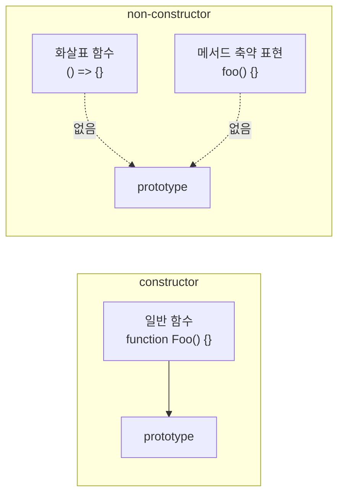

하지만 함수 객체라고 해서 모두 `prototype` 프로퍼티를 가지는 것은 아님

생성자 함수로 호출될 수 없는 non-constructor 는 `prototype` 프로퍼티도 생성되지 않음

</br>
</br>

### __proto__ 접근자 프로퍼티

모든 객체는 `__proto__` 접근자 프로퍼티를 통해 자신의 프로토타입, `[[Prototype]]` 내부슬롯에 간접적으로 접근할 수 있음

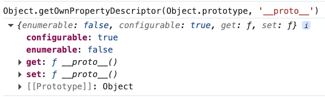!image.png

접근자 프로퍼티이기에 `[[Value]]` 프로퍼티 어트리뷰트를 갖지 않고 `[[Get]]` , `[[Set]]` 프로퍼티 어트리뷰트로 구성된 프로퍼티임

</br>

그렇기에 `__proto__` 접근자 프로퍼티를 통해 프로토타입에 접근하면 내부적으로 getter 함수가 호출, 새로운 프로토타입을 할당하면 setter 함수가 호출됨

```tsx
const obj = {};
const parent = { x: 1 };

// getter 함수인 get __proto__가 호출
obj.__proto__;

// setter 함수인 set __proto__가 호출
obj.__proto__ = parent;

console.log(obj.x);  // 1
```

</br>

함수 객체의 `prototype` 프로퍼티와 객체의 `__proto__` 접근자 프로퍼티는 모두 프로토타입 객체를 참조한다는 공통점이 있음

하지만 두 프로퍼티를 사용하는 주체와 목적은 서로 다름

- `prototype` 프로퍼티는 생성자 함수가 자신이 생성할 인스턴스의 프로토타입을 지정하기 위해 사용함
- `__proto__` 접근자 프로퍼티는 생성된 인스턴스가 자신의 프로토타입에 접근하기 위해 사용함

</br>

즉, 생성자 함수와 인스턴스는 서로 다른 프로퍼티를 사용하지만 결국 동일한 프로토타입 객체를 참조하게 됨

```tsx
function Person(name) {
  this.name = name;
}

const me = new Person('Lee');

console.log(Person.prototype === me.__proto__); // true
```

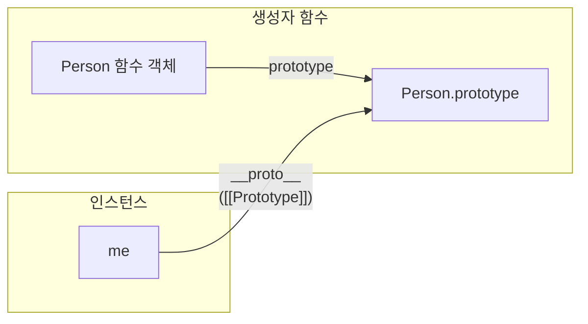

</br>

그렇기에 생성자 함수에서 프로토타입에 메서드를 추가하면 생성된 모든 인스턴스가 동일한 메서드를 사용할 수 있음

```tsx
Person.prototype.sayHello = function() {
	console.log(`Hello ${this.name}`);
};

me.sayHello();
```

여기서 `me` 객체에는 `sayHello` 가 존재하지 않지만, `me.__proto__` 가 참조하는 `Person.prototype` 에서 메서드를 찾기 때문에 정상적으로 호출할 수 있음

</br>

마지막으로 헷갈릴 수 있는 부분을 정리하면 다음과 같음

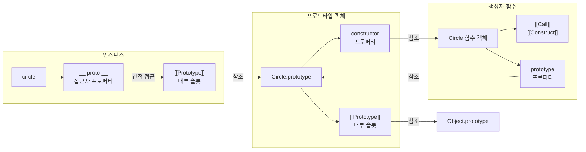

| 프로퍼티 / 내부 슬롯 | 소유자 | 참조 대상 | 역할 |
| --- | --- | --- | --- |
| `prototype` | 생성자 함수 | 프로토타입 객체 | 앞으로 생성될 인스턴스의 `[[Prototype]]` 으로 사용할 프로토타입 객체를 가리킴 |
| `[[Prototype]]` | 모든 객체, 내부 슬롯 | 프로토타입 객체 | 자신의 부모 프로토타입 객체를 참조 |
| `__proto__` | `Object.prototype` 의 접근자 프로퍼티 | `[[Prototype]]` | 객체가 자신의 `[[Prototype]]` 내부 슬롯에 간접적으로 접근하기 위해 사용 |
| `constructor` | 프로토타입 객체 | 생성자 함수 | 자신을 생성한 생성자 함수를 참조 |
| `[[Construct]]` | 생성자 함수, 내부 메서드 | 없음 | `new` 호출 시 새로운 인스턴스를 생성하는 내부 메서드 |

</br>
</br>

### Object.prototype

모든 객체는 프로토타입의 계층 구조인 프로토타입 체인에 묶여 있음

JS 엔진은 객체의 프로퍼티에 접근하려고 할 때 해당 객체에 접근하려는 프로퍼티가 없다면 `__proto__` 접근자 프로퍼티가 가리키는 참조를 따라 자신의 부모 역할을 하는 프로토타입의 프로퍼티를 순차적을 검색함

이때 체인의 종점, 즉 프로토타입 체인의 최상위 객체는 `Object.prototype` 이며, 이 객체의 프로퍼티와 메서드는 모든 객체에 상속됨

</br>

함수 선언문이 평가되는 시점에 생성되는 `Circle.prototype` 과 달리 `Object.prototype` 은 JS 엔진이 초기화되는 시점에 이미 생성됨

브라우저나 Node.js 환경에서 JS 엔진이 실행되면 사용자 코드가 평가되기 전에 전역 객체와 빌트인 생성자 함수들이 먼저 생성되며, 이 과정에서 `Object.prototype` 도 함께 생성됨

그렇기에 함수 선언문이 실행되기 전부터 `Object.prototype` 은 이미 메모리에 존재하는 상태이며, 이후 생성되는 모든 프로토타입 객체의 부모 역할을 하게 됨

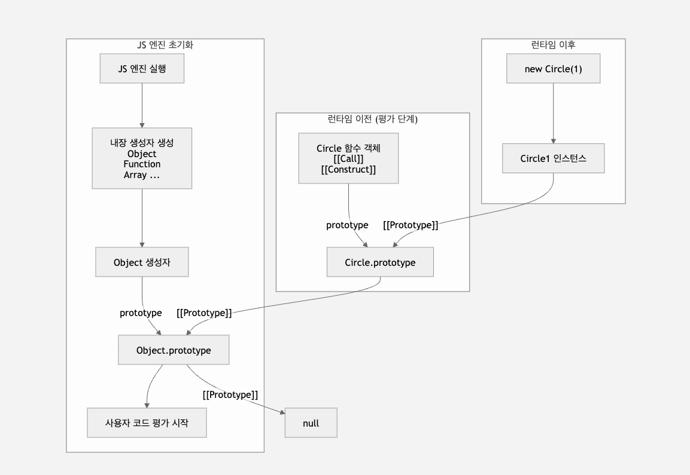

그렇기에 함수 선언문이 만나기 전부터 이미 `Object.prototype` 은 메모리에 존재하는 상태임

</br>

`Object.prototype` 이 JS 엔진 초기화 과정에서 미리 생성된다고 해서 모든 객체가 반드시 이를 상속하는 것은 아님

일반적으로는 객체 리터럴이나 생성자 함수를 통해 생성한 객체는 모두 `Object.prototype` 을 상속받음

하지만 개발자가 객체를 생성할 때 프로토타입을 직접 지정할 수도 있음

</br>

대표적인 예가 `Object.create(null)` 임

```tsx
const obj = Object.create(null);
```

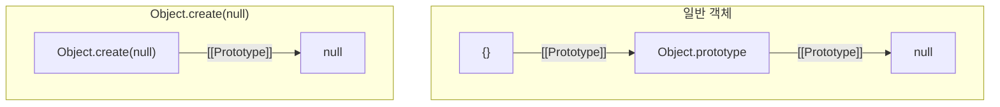

즉, `Object.prototype` 을 부모로 가지지 않는 객체가 생성됨

</br>

그렇기에 다음과 같이 `Object.prototype` 에 존재하는 메서드나 접근자 프로퍼티를 상속받지 못함

```tsx
const obj = Object.create(null);

console.log(obj.__proto__);        // undefined
console.log(obj.hasOwnProperty);   // undefined
```

이를 통해 `__proto__` 는 모든 객체가 공통적으로 가지고 있는 기능이 아니라는 점을 알 수 있음

</br>

하지만 `Object.getPrototypeOf()` 와 `Object.setPrototypeOf()` 는 특정 객체가 가지고 있는 메서드가 아니라 `Object` 생성자가 제공하는 정적 메서드임

즉, 객체가 `Object.prototype` 을 상속하는지 여부와 관계없이 항상 사용할 수 있음

```tsx
const obj = Object.create(null);

console.log(Object.getPrototypeOf(obj));  // null;
```

이러한 이유로 ES6에서는 `__proto__` 접근자 프로퍼티를 직접 사용하는 것보다 `Object.getPrototypeOf()` 와 `Object.setPrototypeOf()` 의 사용을 권장함

→ 호출의 주체가 `obj` 가 아니라 `Object` 생성자이기 때문임

</br>

또한 `__proto__` 접근자 프로퍼티는 프로토타입을 변경할 때 순환 참조가 발생하지 않도록 검사하는 역할도 수행함

```tsx
const parent = {};
const child = {};

child.__proto__ = parent;
parent.__proto__ = child;  // TypeError: Cyclic __proto__ value
```

</br>

다음과 같이 순환 참조하는 프로토타입 체인이 만들어지면 종점이 존재하지 않기 때문에 무한 루프에 빠짐

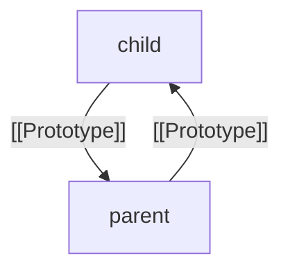

그렇기 때문에 프로토타입 체인은 반드시 `null` 을 종점으로 갖는 단방향 링크드 리스트 구조여야 하며, `__proto__` 의 setter는 이러한 순환 참조가 발생하지 않도록 미리 검사한 뒤 오류를 발생시킴

</br>
</br>

### 객체 생성 방식과 프로토타입의 결정

객체 생성 방법은 다음과 같음

- 객체 리터럴
- `Object` 생성자 함수
- 생성자 함수
- `Object.create` 메서드
- 클래스

겉으로 보기에는 객체를 생성하는 방법이 서로 다름

하지만 생성 방식이 다를 뿐, 최종적으로는 모두 ECMAScript 명세에서 정의하는 추상 연산인 `OrdinaryObjectCreate` 를 통해 객체가 생성됨

</br>

`OrdinaryObjectCreate` 는 객체를 생성하기 위해 `proto` 를 전달받음

`proto` 는 하나의 특정 객체를 의미하는 것이 아니라, 새롭게 생성될 객체의 `[[Prototype]]` 으로 설정할 객체를 전달받기 위한 매개변수 이름임

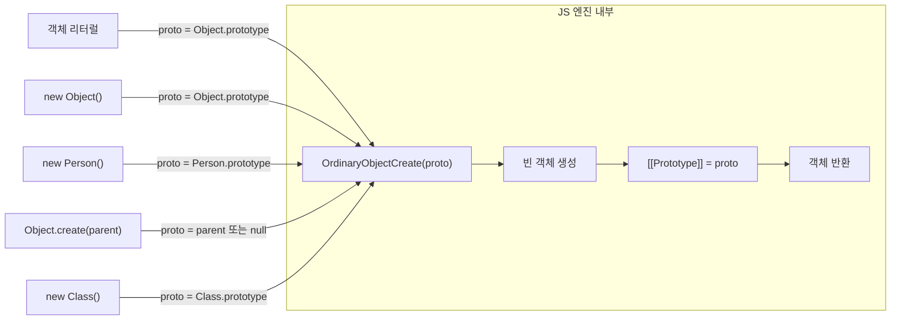

`OrdinaryObjectCreate` 는 새로운 빈 객체를 생성하고 전달받은 `proto` 를 새 객체의 `[[Prototype]]` 에 연결함

따라서 객체가 생성되는 순간 이미 자신의 프로토타입이 결정되어 있어 이후에는 해당 프로토타입을 통해 상속이 이루어짐

</br>

`proto` 는 `OrdinaryObjectCreate` 가 결정하는 것이 아니라, 객체 생성 방식에 따라 JS 엔진이 먼저 결정함

생성자 함수와 클래스는 `OrdinaryObjectCreate` 를 직접 호출하지 않고, 먼저 `OrdinaryCreateFromConstructor` 를 거침

이 과정에서 `new.target.prototype` 을 기준으로 `proto` 를 결정한 뒤 내부적으로 `OrdinaryObjectCreate` 를 호출함

반면 `Object.create()` 는 `OrdinaryCreateFromConstructor` 를 거치지 않고, 첫 번째 인자로 전달받은 객체 또는 `null` 을 그대로 `proto` 로 사용하여 `OrdinaryObjectCreate` 에 전달함

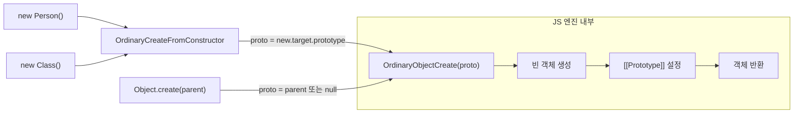

즉, 객체 생성 방식마다 `proto` 를 결정하는 과정은 서로 다르지만, 최종적으로 `OrdinaryObjectCreate` 는 전달받은 `proto` 를 새 객체의 `[[Prototype]]` 에 설정하는 역할만 수행함

</br>
</br>

### 프로토타입 체인

프로토타입 체인은 자바스크립트가 객체지향 프로그래밍의 상속을 구현하는 메커니즘임

→ `[[Prototype]]` 내부 슬롯의 참조를 따라 자신의 부모 역항을 하는 프로토타입의 프로퍼티를 순차적으로 검색하는 과정

</br>

다음과 같은 코드가 있을때 `person` 객체는 `Object.prototype` 의 메서드인 `hasOwnProperty` 를 호출할 수 있음

```tsx
function Person(name) {
  this.name = name;
}

Person.prototype.sayHello = function() {
  console.log(`Hi! My name is ${this.name}`);
}

const me = new Person('kang');

console.log(me.hasOwnProperty('name'));  // true
```

`me` 객체가 `Person.prototype` 뿐만 아니라 `Object.prototype` 도 상속받았다는 것을 의미함

</br>

그림으로 보면 다음과 같음

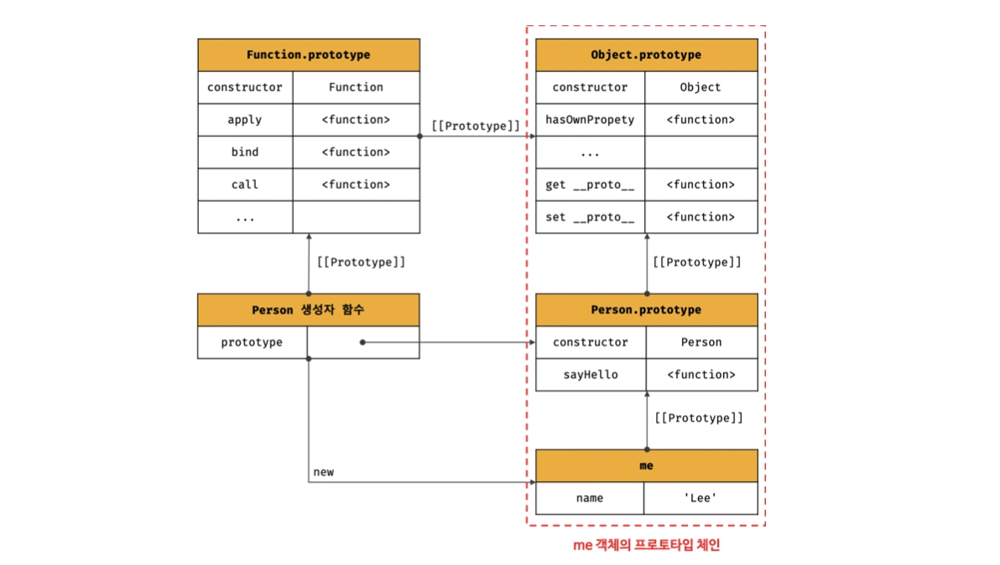

프로토타입 체인의 최상위에 위치하는 객체는 언제나 `Object.prototype` 임

따라서 모든 객체는 `Object.prototype` 을 상속받음

</br>

`me.hasOwnProperty('name')` 를 실행하면 다음과 같이 순서로 진행됨

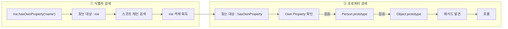

</br>

스코프 체인과 프로토타입 체인을 비교하면 다음과 같음

| 구분 | 스코프 체인(Scope Chain) | 프로토타입 체인(Prototype Chain) |
| --- | --- | --- |
| 목적 | 식별자(변수, 함수 등) 검색 | 프로퍼티/메서드 검색 |
| 검색 대상 | 변수, 함수, 매개변수 | 객체의 프로퍼티와 메서드 |
| 시작 위치 | 현재 실행 중인 스코프 | 현재 객체 |
| 검색 방향 | 현재 스코프 → 상위 스코프 → 전역 스코프 | 현재 객체 → `[[Prototype]]` → 상위 프로토타입 |
| 종료 조건 | 식별자를 찾거나 전역 스코프까지 탐색 | 프로퍼티를 찾거나 `null`에 도달 |
| 기준 | 렉시컬 스코프 | 프로토타입 |

즉, 스코프 체인은 식별자 검색을 위한 메커니즘이고 프로토타입 체인은 프로퍼티 검색을 위한 메커니즘임

</br>
</br>

### 오버라이딩과 프로퍼티 섀도잉

다음은 생성자 함수로 인스턴스를 생성한 다음, 인스턴스에 메서드를 추가한 코드임

```tsx
const Person = (function() {
  function Person(name) {
    this.name = name;
  }
  
  Person.prototype.sayHello = function() {
    console.log(`Hi! My name is ${this.name}`);
  }
  
  return Person;
}());

const me = new Person('Lee');

me.sayHello = function() {
  console.log(`Hey! My name is ${this.name}`);
}

me.sayHello();
```

</br>

그림으로 보면 다음과 같음

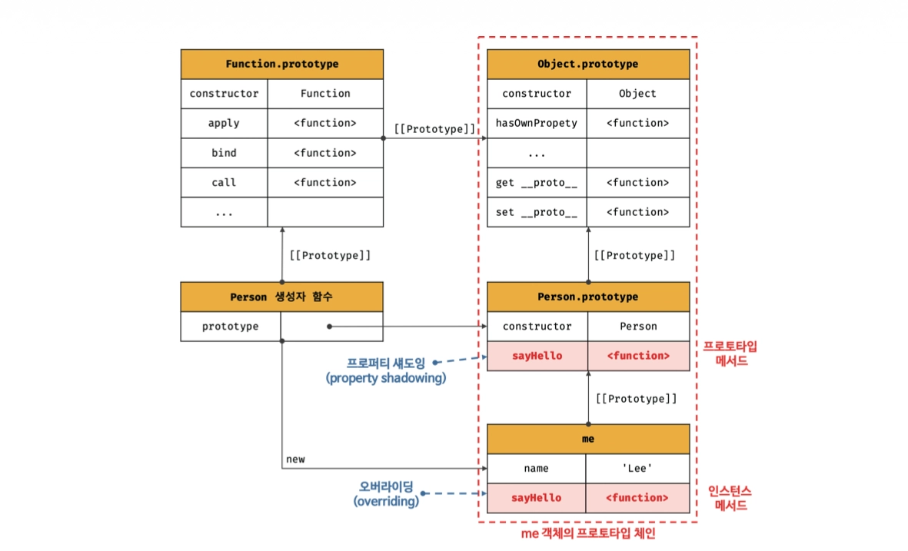

프로토타입 프로퍼티와 같은 이름의 프로퍼티를 인스턴스에 추가하면, 프로토타입 체인을 따라 프로토타입 프로퍼티를 찾아 덮어쓰는 것이 아니라 인스턴스에 동일한 이름의 새로운 프로퍼티를 생성함

프로토타입이 소유한 프로퍼티(메서드 포함)를 프로토타입 프로퍼티, 인스턴스가 직접 소유한 프로퍼티를 인스턴스 프로퍼티라고 함

</br>

이후 `me.sayHello()` 를 호출하면 프로퍼티 검색은 항상 인스턴스 → 프로토타입 순서로 이루어지므로, 인스턴스에서 `sayHello` 를 찾은 순간 검색이 종료됨

따라서 프로토타입의 `sayHello` 는 호출되지 않고 인스턴스의 `sayHello` 가 실행됨

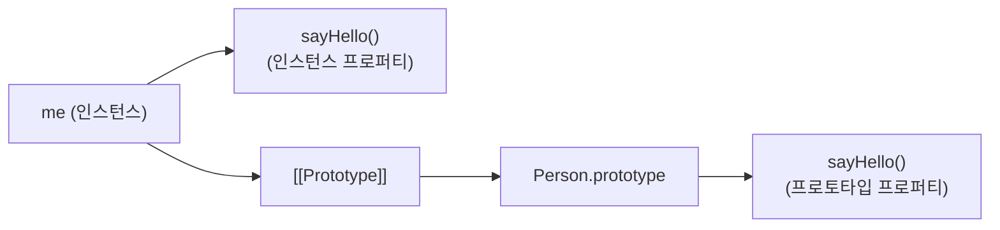

이처럼 조회 결과에서 인스턴스의 프로퍼티가 먼저 검색되어 프로토타입의 프로퍼티가 가려지는 현상을 프로퍼티 섀도잉 이라고 함

이러한 동작은 프로토타입 메서드 대신 인스턴스 메서드가 실행된다는 점에서 객체지향의 오버라이딩과 동일한 효과를 가지므로 오버라이딩이라고 표현함

하지만 실제로는 프로토타입 메서드를 재정의하거나 덮어쓰는 것이 아니라, 같은 이름의 프로퍼티를 인스턴스에 새롭게 추가하여 조회 결과가 달라진 것임

</br>

삭제 또한 가능하지만 하위 객체를 통해 프로토타입의 프로퍼티를 변경 또는 삭제하는 것은 불가능함

```tsx
Person.prototype.sayHello = function() {
  console.log(`Hey! My name is ${this.name}`);
};

delete Person.prototype.sayHello;
```

프로토타입 프로퍼티를 변경 또는 삭제하려면 하위 객체를 통해 프로토타입 체인으로 접근하는 것이 아니라 프로토타입에 직접 접근해야함

</br>
</br>

### 프로토타입의 교체

프로토타입은 동적으로 변경할 수 있어 객체 간의 상속 관계를 동적으로 변경할 수 있음

다음 코드에서는 생성자 함수 `Person` 의 `prototype` 프로퍼티를 통해 객체 리터럴을 할당하여 프로토타입을 교체함을 볼 수 있음

```tsx
const Person = (function() {
  function Person(name) {
    this.name = name;
  }
  
  Person.prototype = {
    sayHello() {
      console.log(`Hi! My name is ${this.name}`);
    }
  }
  
  return Person;
}());

const me = new Person('Lee');
console.log(me);
```

</br>

그림으로 보면 다음과 같음

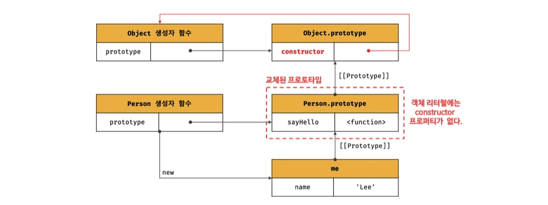

이처럼 프로토타입을 교체하면 `constructor` 프로퍼티와 생성자 함수 간의 연결이 끊김

```tsx
console.log(me.constructor === Person);  // false

console.log(me.constructor === Object);  // true
```

프로토타입으로 교체한 객체 리터럴에는 `constructor` 프로퍼티가 없기에 `me` 객체의 생성자 함수를 검색하면 `Person` 이 아닌 `Object` 가 나옴

</br>

그렇기에 자동으로 생성되었던 객체를 직접 `constructor` 프로퍼티를 추가하여 되살려야함

```tsx
Person.prototype = {
	constructor: Person,
	sayHello() {
      console.log(`Hi! My name is ${this.name}`);
    }
}
```

</br>

인스턴스로 프로토타입을 교체할 수도 있음

앞서 배운 내용에 따라 `__proto__` 접근자 프로퍼티 사용대신 `Object.getPrototypeOf` , `Object.setPrototypeOf` 를 사용해서 접근 및 교체를 할 수 있음

```tsx
function Person(name) {
  this.name = name;
}

const me = new Person('Lee');

const parent = {
  sayHello() {
    console.log(`Hi! My name is ${this.name}`);
  }
}

Object.setPrototypeOf(me, parent);

me.sayHello();
```

</br>

마찬가지로 그림으로 보면 다음과 같음

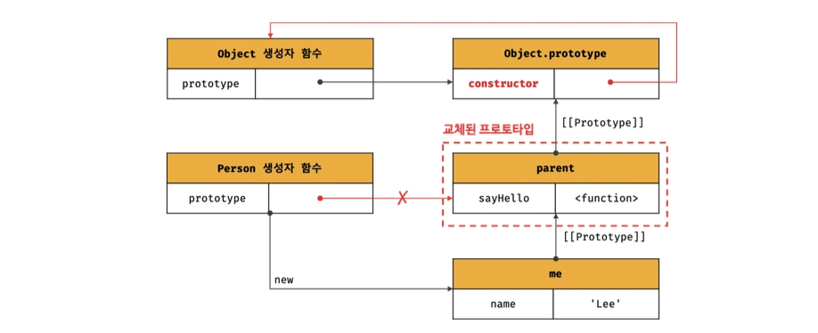

</br>

앞서 살펴본 생성자 함수, 인스턴스에 의한 프로토타입 교체를 정리하면 다음과 같음

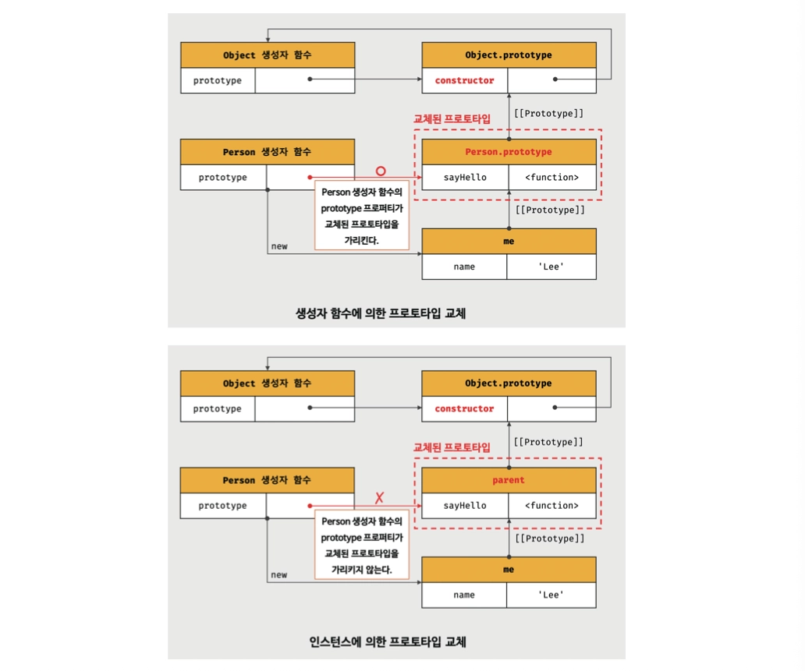

이처럼 프로토타입 교체를 통해 객체 간의 상속 관계를 동적으로 변경하는 것은 번거로워 직접 교체하지 않는 것이 좋음

→ 클래스를 사용한 상속 관계를 사용하는 것을 추천

</br>
</br>

### instanceof 연산자

해당 연산자는 우변의 생성자 함수의 `prototype` 에 바인딩된 객체가 좌변의 객체의 프로토타입 체인 상에 존재하면 `true` , 그렇지 않은 경우에는 `false` 로 평가됨

```tsx
function Person(name) {
  this.name = name;
}

const me = new Person('Lee');

console.log(me instanceof Person);  // true
console.log(me instanceof Object);  // true
```

</br>

`new Person()` 로 생성한 `me` 객체의 프로토타입 체인은 다음과 같음


이 상태에서 `me instanceof Person` 를 실행하면 `constructor` 를 확인하는 것이 아니라 `me` 의 프로토타입 체인을 따라 올라가면서 `Person.prototype` 객체가 존재하는지 확인함

-> `instanceof` 연산자는 프로토타입의 `constructor` 프로퍼티를 확인하는 연산자가 아님

</br>

다음은 프로토타입을 직접 변경하는 코드임

```tsx
function Person(name) {
  this.name = name;
}

const me = new Person('Lee');

const parent = {};

Object.setPrototypeOf(me, parent);

console.log(Person.prototype === parent);     // false
console.log(parent.constructor === Person);   // false

console.log(me instanceof Person); // false
console.log(me instanceof Object); // true
```

`Object.setPrototypeOf(me, parent)`를 실행하면 `me` 의 `[[Prototype]]` 이 `Person.prototype` 이 아니라 `parent` 를 가리키도록 변경됨

</br>

프로토타입 체인은 다음과 같이 변경됨

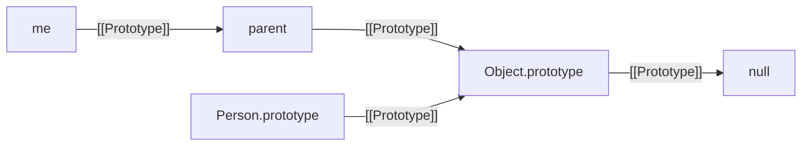

프로토타입 체인을 따라서 올라가도 `Person.prototype` 을 만나지 못했으므로 `false` 를 반환함

</br>
</br>

### 정적 프로퍼티/메서드

생성자 함수도 하나의 객체이므로 자신의 프로퍼티와 메서드를 가질 수 있음

생성자 함수 객체에 직접 추가한 프로퍼티와 메서드를 정적 프로퍼티/메서드라고 함

```tsx
function Person(name) {
  this.name = name;
}

// 프로토타입 메서드
Person.prototype.sayHello = function() {
  console.log(`Hi ! My name is ${this.name}`)
}

// 정적 프로퍼티
Person.staticProp = 'static prop';

// 정적 메서드
Person.staticMethod = function() {
  console.log('staticMethod')
}
```

</br>

다음 코드를 메모리 구조 그림으로 보면 다음과 같음

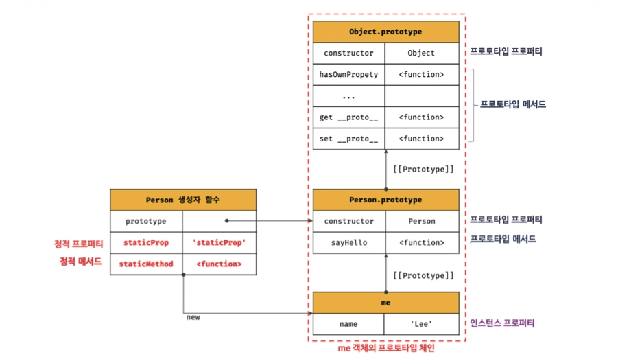

정적 메서드는 생성자 함수 객체에 직접 존재하고, 프로토타입 메서드는 `Person.prototype` 에 존재함

서로 저장되는 위치가 완전히 다름을 볼 수 있음

</br>

인스턴스를 생성한 뒤에는 정적 메서드와 프로토타입 메서드를 각각 호출할 수 있지만 `me.staticMethod()` 는 호출할 수 없음

```tsx
const me = new Person("Lee");

Person.staticMethod();  // staticMethod
me.sayHello();  // Hi ! My name is Lee
me.statickMethod();  // TypeError: me.statickMethod is not a function
```

인스턴스는 자신의 프로토타입 체인에 존재하는 프로퍼티와 메서드만 참조할 수 있기 때문에 에러가 발생함

`staticMethod` 는 생성자 함수 객체에 직접 존재할 뿐, 프로토타입 체인에는 포함되어 있지 않음

</br>

프로토타입 메서드와 정적 메서드의 가장 큰 차이는 `this` 의 사용 여부임

```tsx
Person.prototype.sayHello = function() {
	console.log(`Hi! My name is ${this.name}`);
};
```

프로토타입 메서드는 호출한 인스턴스를 `this` 로 사용하므로 인스턴스의 상태를 다룰 수 있음

</br>

반면 정적 메서드는 특정 인스턴스와 관계없이 동작함

```tsx
Person.staticMethod = function() {
	console.log('staticMethod');
};
```

따라서 인스턴스의 프로퍼티를 사용할 필요가 없는 기능이라면 정적 메서드로 만드는 것이 적절함

</br>
</br>

### in 연산자

`in` 연산자는 객체 내에 특정 프로퍼티가 존재하는지 여부를 확인함

```tsx
const person = {
  name: "Lee",
  address: "Seoul"
};

console.log('name' in person);  // true
console.log('address' in person);  // true
console.log('age' in person);  // false
```

</br>

`in` 연산자는 확인 대상 객체의 프로퍼티뿐만 아니라 확인 대상 객체가 상속받은 모든 프로토타입의 프로퍼티를 확인함

```tsx
console.log('toString' in person);  // true
```

</br>

`in` 연산자 대신 ES6에서 도입된 `Reflect.has` 메서드를 사용할 수도 있음

```tsx
const person = { name: "Lee"};

console.log(Reflect.has(person, 'name'));  // true
console.log(Reflect.has(person, 'toString'));  // true
```

`in` 연산자와 동일하게 동작함

</br>

`instanceof` 연산자와 `in` 연산자의 차이는 다음과 같음

| 연산자 | 찾는 대상 | 검사 내용 |
| --- | --- | --- |
| `instanceof` | 생성자 함수의 `prototype` 객체 | 프로토타입 체인에 해당 `prototype` 객체가 존재하는지 확인 |
| `in` | 프로퍼티 | 객체 또는 프로토타입 체인에 해당 프로퍼티가 존재하는지 확인 |

</br>
</br>

### for in 문

`for in` 문은 객체의 프로토타입 체인 상에 존재하는 모든 프로토타입의 프로퍼티 중에서 프로퍼티 어트리뷰트 `[[Enumerable]]` 의 값이 `true` 인 프로퍼티를 순회하며 열거함

`in` 연산자와 마찬가지로 상속받은 프로포타입의 프로퍼티까지 열거함

```tsx
const person = {
  name: "Lee",
  address: "Seoul"
}

for (const key in person) {
  console.log(key + ': ' + person[key])
}
```

객체의 프로퍼티 개수만큼 순회하며 변수 선언문에서 선언한 변수 `key` 에 프로퍼티 키를 할당함

</br>