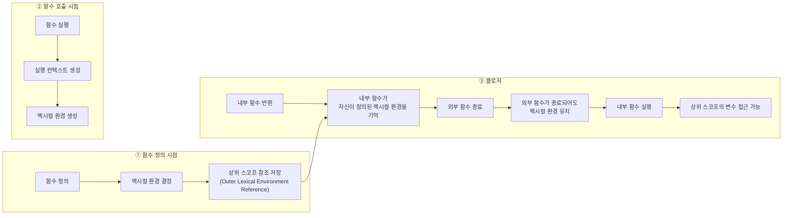
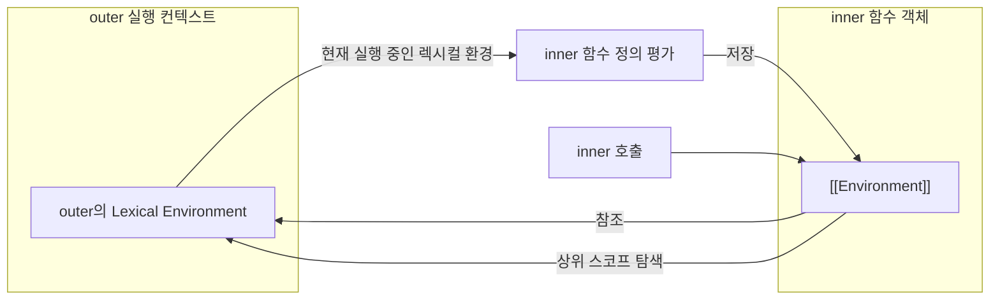
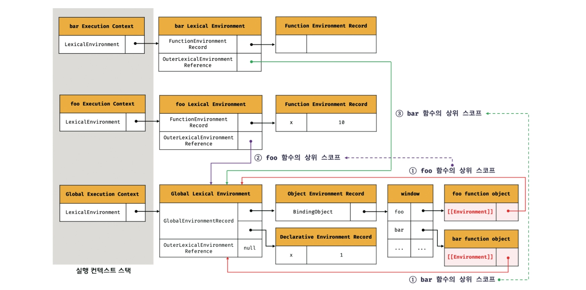
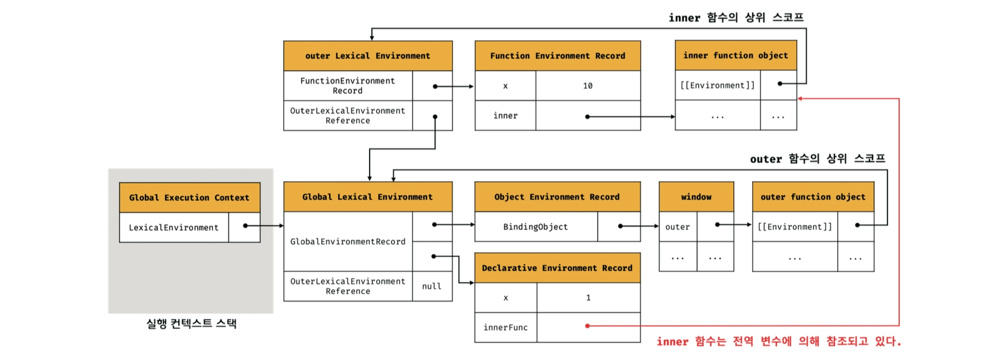
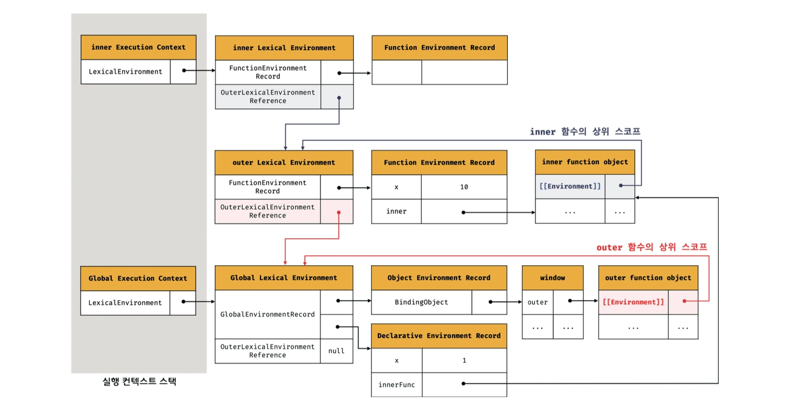
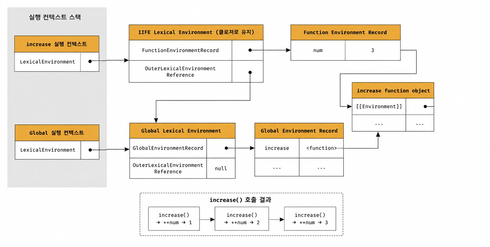

### 클로저

클로저는 함수를 일급 객체로 취급하는 함수형 프로그래밍에서 사용되는 중요한 특성임

클로저는 함수와 그 함수가 선언된 렉시컬 환경과의 조합을 말함



렉시컬 스코프에서 상위 스코프에 대한 참조는 함수 정의가 평가되는 시점에 함수가 정의된 환경에 의해 결정됨

<br/>

이를 위해 함수는 자신의 내부 슬롯 `[[Environment]]` 에 자신이 정의된 환경, 즉 상위 스코프의 참조를 저장함



상위 스코프의 참조는 현재 실행 중인 실행 컨텍스트의 렉시컬 환경을 가리킴

→ 현재 실행 중인 실행 컨텍스트는 상위 함수 또는 전역 코드의 실행 컨텍스트이기 때문임

<br/>

```tsx
const x = 1;

function foo() {
  const x = 10;
  bar();
}

function bar() {
  console.log(x);
}
```

위 예제의 `foo` 함수 내부에서 `bar` 함수가 호출되어 실행 중인 시점의 실행 컨텍스트는 아래에 그림과 같음

<br/>



`foo` 함수와 `bar` 함수는 모두 전역 코드가 평가되는 시점에 평가되어 함수 객체를 생성하고 전역 객체 `window` 의 메서드가 됨

이때 생성된 함수 객체의 내부 슬롯 `[[Environment]]` 에는 함수 정의가 평가된 시점인 전역 전역 렉시컬 환경의 참조가 저장됨

<br/>

다음은 중첩 함수보다 외부 함수가 먼저 생명 주기를 마감하는 예시 코드임

즉, 외부 함수가 실행이 종료되면 외부 함수의 실행 컨텍스트는 실행 컨텍스트 스택에서 제거됨

```tsx
const x = 1;

function outer() {
  const x = 10;
  const inner = function() {
    console.log(x);
  }
  return inner;
}

const innerFunc = outer();
innerFunc();  // 10
```

`outer` 함수의 지역 변수 `x` 와 변수 값 `10` 을 저장하고 있던 `outer` 함수의 실행 컨텍스트가 제거되었으므로 `outer` 함수의 지역 변수 `x` 또한 생명 주기를 마감함

하지만 `innerFunc()` 시 10 값이 출력되는 것을 볼 수 있음

<br/>

그림으로 보면 다음과 같음



이때 `outer` 함수의 실행 컨텍스트는 실행 컨텍스트 스택에서 제거되지만 `outer` 함수의 렉시컬 환경은 소멸되지 않음

`outer` 함수의 렉시컬 환경은 `inner` 함수의 `[[Environment]]` 내부 슬롯에 의해 참조되고 있고 `inner` 함수는 전역 변수 `innerFunc` 에 의해 참조되고 있으므로 GC의 대상이 되지 않기 때문임

<br/>

`outer` 함수가 반환한 `inner` 함수를 호출하면 `inner` 함수의 실행 컨텍스트가 생성되고 실행 컨텍스트 스택에 푸시됨

그림으로 보면 다음과 같음



이처럼 외부 함수보다 중첩 함수가 더 오래 유지되는 경우 중첩 함수는 이미 생명 주기가 종료한 외부 함수의 변수를 참조할 수 있고 이러한 중첩 함수를 클로저라고 부름

자바스크립트의 모든 함수는 상위 스코프를 기억하므로 이론적으로 모든 함수는 클로저이지만 상위 스코프의 어떤 식별자도 참조하지 않으면 모던 브라우저는 최적화를 통해 상위 스코프를 기억하지 않음

그렇기에 클로저는 중첩 함수가 상위 스코프의 식별자를 참조하고 있고 중첩 함수가 외부함수보다 더 오래 유지되는 경우에 한정하는 것이 일반적임

<br/>
<br/>

### 클로저의 활용

클로저는 상태가 의도치 않게 변경되지않도록 상태를 안전하게 은닉하고 특정 함수에게만 상태 변경을 허용하기 위해 사용함

다음 코드는 오류를 발생시킬 가능성을 내포하고 있는 좋지 않은 코드임

```tsx
let num = 0;

const increase = function() {
  return ++num;
}

console.log(increase());
console.log(increase());
console.log(increase());
```

카운트 상태는 전역 변수를 통해 관리되고 있기 때문에 언제든지 누구나 접근할 수 있고 변경할 수 있음

→ 의도치 않게 상태가 변경

<br/>

안전하게 변경하고 유지하기 위해서는 다음과 같이 사용해야함

```tsx
const increase = function() {
  let num = 0;
  
  return ++num;
}

console.log(increase());
console.log(increase());
console.log(increase());
```

하지만 해당 코드에서는 `increase` 함수가 호출될 때마다 지역 변수 `num` 은 다시 선언되고 0으로 초기화됨

<br/>

이전 상태를 유지할 수 있도록 클로저를 사용함

```tsx
const increase = (function() {
  let num = 0;

  return function() {
    return ++num;
  }
}());

console.log(increase());
console.log(increase());
console.log(increase());
```

즉시 실행 함수는 호출된 이후 소멸되지만 즉시 실행 함수가 반환한 클로저는 `increase` 변수에 할당되어 호출됨

이때 즉시 실행 함수가 반환한 클로저는 자신이 정의된 위치에 의해 결정된 상위 스코프인 즉시 실행 함수의 렉시컬 환경을 기억함

<br/>

그림으로 보면 다음과 같음



<br/>