### 소스코드의 타입

ECMAScript 사양은 소스코드를 4가지 타입으로 구분함

4가지 타입의 소스코드는 실행 컨텍스트를 생성함

- **전역 코드**
- **함수 코드**
- **eval 코드**
- **모듈 코드**

소스코드를 4가지 타입으로 구분하는 이유는 소스코드의 타입에 따라 실행 컨텍스트를 생성하는 과정과 관리 내용이 다르기 때문임

<br/>
<br/>

### 소스코드의 평가와 실행

모든 소스코드는 실행에 앞서 평가 과정을 거치며 코드를 실행하기 위한 준비를 함

즉 자바스크립트 엔진은 소스코드의 평가와 소스코드의 실행 과정으로 나누어 처리함

<br/>

소스코드 평가 과정에서는 실행 컨텍스트를 생성하고 변수, 함수 등의 선언문만 먼저 실행하여 생성된 변수나 함수 식별자를 키로 실행 컨텍스트가 관리하는 스코프에 등록함

→ 런타임 이전

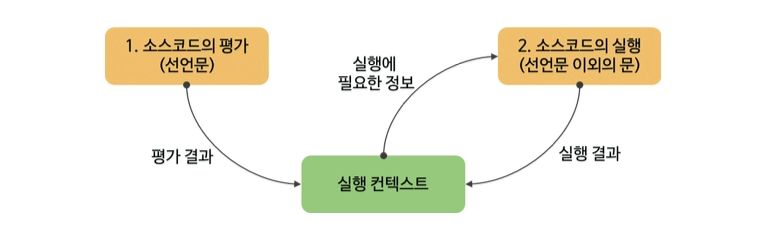

소스코드 평가 과정이 끝나면 비로소 선언문을 제외한 소스코드가 순차적으로 실행되기 시작함

→ 런타임 시작

<br/>
<br/>

### 실행 컨텍스트의 역할

다음은 전역 코드와 함수 코드로 구성되어 있는 코드임

```tsx
const x = 1;
const y = 2;

function foo(a) {
  const x = 10;
  const y = 20;

  console.log(a + x + y);
}

foo(100);

console.log(x + y);
```

실행 순서는 다음과 같음

- **전역 코드 평가**
    - 전역 코드의 변수 선언문과 함수 선언문이 먼저 실행됨
    - 결과로 생성된 전역 변수와 전역 함수가 실행 컨텍스트가 관리하는 전역 스코프에 등록됨
- **전역 코드 실행**
    - 런타임이 시작되어 값이 할당되고 함수가 호출됨
- **함수 코드 평가**
    - 함수 내부의 문들을 실행하기에 앞서 함수 코드 평가 과정을 거치며 함수 코드를 실행하기 위한 준비를함
- **함수 코드 실행**
    - 함수 코드 평가 과정이 끝나면 런타임이 시작되어 함수 코드가 순차적으로 실행되기 시작함

<br/>

위에 모든 것을 관리하는 것이 바로 실행 컨텍스트임

실행 컨텍스트는 식별자를 등록하고 관리하는 스코프와 코드 실행 순서 관리를 구현한 내부 메커니즘으로, 모든 코드는 실행 컨텍스트를 통해 실행되고 관리됨

식별자와 스코프는 실행 컨텍스트의 렉시컬 환경으로 관리하고 코드 실행 순서는 실행 컨텍스트 스택으로 관리함

<br/>
<br/>

### 실행 컨텍스트 스택

```tsx
const x = 1;

function foo(a) {
  const y = 2;
  
  function bar() {
    const z = 3;
    console.log(x + y + z);
  }
  bar()
}

foo()
```

<br/>

위의 코드는 다음과 같이 실행됨

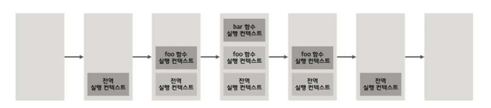

이때 생성된 실행 컨텍스트는 스택 자료구조로 관리되고 이를 실행 컨텍스트 스택이라고 부름

<br/>
<br/>

### 렉시컬 환경

렉시컬 환경은 키와 값을 갖는 객체 형태의 스코프를 생성하여 식별자를 키로 등록하고 식별자에 바인딩된 값을 관리함

실행 컨텍스트는 LexicalEnvironment 컴포넌트와 VariableEnvironment 컴포넌트로 구성됨

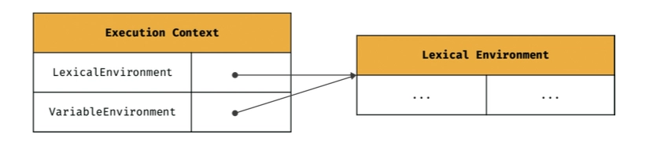

생성 초기에는 두 컴포넌트가 하나의 동일한 렉시컬 환경을 참조함

→ 보통 두 컴포넌트를 하나로 통일해서 봄

<br/>

렉시컬 환경은 다음과 같이 두 개의 컴포넌트로 구성됨

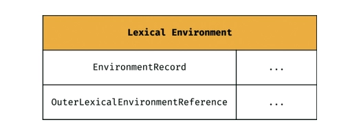

- **EnvironmentRecord**
    - 스코프에 포함된 식별자를 등록하고 등록된 식별자에 바인딩된 값을 관리함
- **OuterLexicalEnvironmentReference**
    - 외부 렉시컬 환경에 대한 참조는 상위 스코프를 가리킴

<br/>
<br/>

### 실행 컨텍스트의 생성과 식별자 검색 과정

다음 예시 코드를 어떻게 실행 컨텍스트가 생성되고 코드  실행 결과가 관리되는지, 그리고 어떻게 실행 컨텍스트를 통해 식별자를 검색하는지 알아 볼 것임

```tsx
var x = 1;
const y = 2;

function foo(a) {
  var x = 3;
  const y = 4;

  function bar(b) {
    const z = 5;
    console.log(a + b + x + y + z);
  }
  bar(10);
}

foo(20)
```

<br/>

먼저, 전역 객체가 생성됨

전역 객체는 전역 코드가 평가되기 이전에 생성됨

그다음 소스코드가 로드되면 자바스크립트 엔진은 전역 코드를 평가함

평가 순서는 다음과 같음

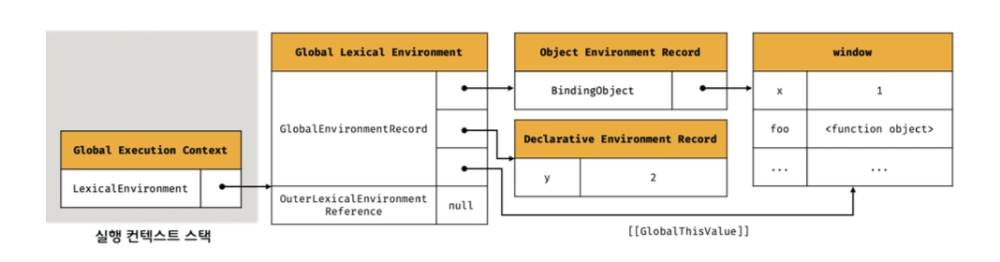

- **전역 실행 컨텍스트 생성**
- **전역 렉시컬 환경 생성**
    - **전역 환경 레코드 생성**
        - **객체 환경 레코드 생성**
        - **선언적 환경 레코드 생성**
    - **this 바인딩**
    - **외부 렉시컬 환경에 대한 참조 결정**

다음은 이 과정에 대해 세부적인 생성 과정을 살펴볼 것임

<br/>
<br/>

#### 전역 실행 컨텍스트 생성 후 전역 렉시컬 환경 생성

먼저 비어있는 전역 실행 컨텍스트를 생성하여 실행 컨텍스트 스택에 푸시함

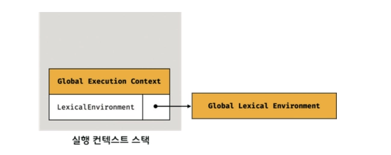

그 이후 전역 렉시컬 환경을 생성하고 전역 실행 컨텍스트에 바인딩함

<br/>
<br/>

#### 전역 환경 레코드 생성

전역 환경 레코드는 객체 환경 레코드와 선언적 환경 레코드로 구성되어 있음

객체 환경 레코드와 선언적 환경 레코드는 서로 협력하여 전역 스코프와 전역 객체를 관리함

객체 환경 레코드는 기존의 전역 객체가 관리하던 `var` 키워드로 선언한 전역 변수와 함수 선언문으로 정의한 전역 함수, 빌트인 전역 프로퍼티와 빌트인 전역 함수, 표준 빌트인 객체를 관리함

선언적 환경 레코드는 `let` , `const` 키워드로 선언한 전역 변수를 관리함

<br/>

전역 코드 평가 과정에서 `var` 키워드로 선언한 전역 변수와 함수 선언문으로 정의된 전역 함수는 전역 환경 레코드의 객체 환경 레코드에 연결된 `BindingObject` 를 통해 전역 객체의 프로퍼티와 메서드가 됨

```tsx
var x = 1;
const y = 2;

function foo(a) {
...
```

<br/>

그림으로 보면 다음과 같음

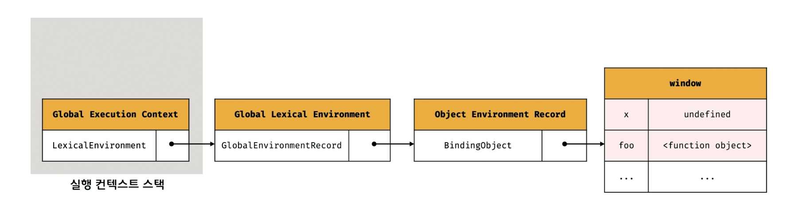

`var x` 는 전역 코드 평가 시저메 객체 환경 레코드에 바인딩된 `BindingObject` 를 통해 전역 객체에 변수 식별자를 키로 등록한 다음, 암묵적으로 `undefined` 를 바인딩 함

<br/>

`let` , `const` 는 전역 객체의 프로퍼티가 되지 않고 개념적인 블록인 전역 환경 레코드의 선언적 환경 레코드에 존재함

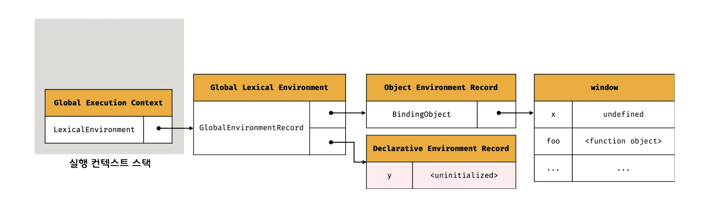

<br/>
<br/>

#### this 바인딩

전역 환경 레코드의 `[[GlobalThisValue]]` 내부 슬롯에 `this` 가 바인딩됨

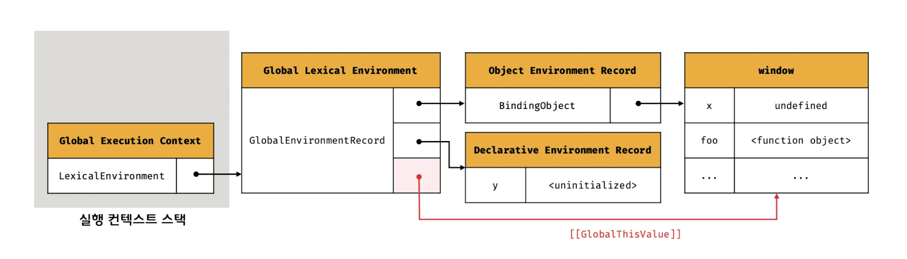

위에 그림에서는 일반적으로 전역 코드에서 `this` 는 전역 객체를 가리키므로 전역 객체가 바인딩된 것을 알 수 있음

`this` 바인딩은 전역 환경 레코드와 함수 환경 레코드에만 존재함

<br/>
<br/>

#### 외부 렉시컬 환경에 대한 참조 결정

외부 렉시컬 환경에 대한 참조는 현재 평가 중인 소스코드를 포함하는 외부 스스코드의 렉시컬 환경, 즉 상위 스코프를 가리킴

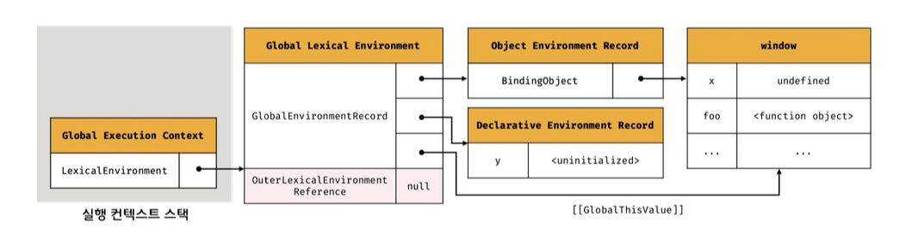

평가 중인 소스코드가 전역 코드면 외부 렉시컬 환경에 대한 참조에 `null` 이 할당됨

<br/>
<br/>

#### 전역 코드 실행

이제 전역 코드가 순차적으로 실행되어 변수 할당문이 전역 변수 `x` , `y` 에 값을 할당하고 `foo` 함수가 호출됨

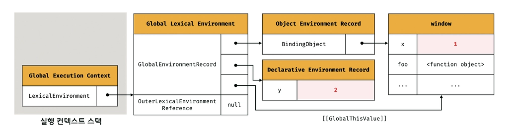

변수 할당문 또는 함수 호출문을 실행하려면 선언된 식별자인지 확인해야하는데 동일한 이름의 식별자가 다른 스코프에 여러 개 존재할 수도 있음

따라서 어느 스코프의 식별자를 참조하면 되는지 결정할 필요가 있음, 이를 식별자 결정이라함

<br/>

식별자 결정을 위해 식별자를 검색할 때는 실행 중인 실행 컨텍스트에서 식별자를 검색하기 시작함

실행 중인 실행 컨텍슽의 렉시컬 환경에서 식별자를 검색할 수 없으며 외부 렉시컬 환경에 대한 참조가 가리키는 렉시컬 환경인 상위 스코프로 이동하여 식별자를 검색함

→ 스코프 체인의 동작 원리

<br/>
<br/>

#### foo 함수 코드 평가

이제 `foo` 함수가 호출되면 전역 코드의 실행을 일시 중단하고 `foo` 함수 내부로 코드의 제어권이 이동함

그리고 함수 코드를 다음과 같은 순서로 평가하기 시작함

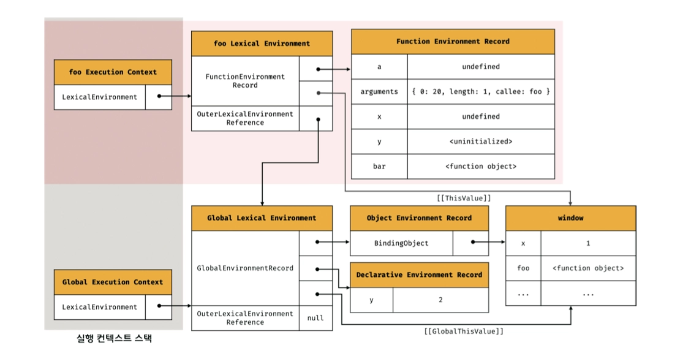

- **함수 실행 컨텍스트 생성**
- **함수 렉시컬 환경 생성**
    - **함수 환경 레코드 생성**
    - **this 바인딩**
    - **외부 렉시컬 환경에 대한 참조 결정**

다음은 이 과정에 대해 세부적인 생성 과정을 살펴볼 것임

<br/>
<br/>

#### `foo` 함수 실행 컨텍스트 생성 후 `foo` 함수 렉시컬 환경 생성

먼저 `foo` 함수 실행 컨텍스트를 생성하여 실행 컨텍스트 스택에 푸시함

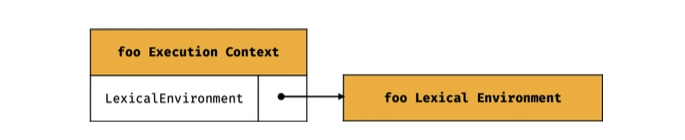

그 이후 `foo` 함수 렉시컬 환경을 생성하고 `foo`  함수 실행 컨텍스트에 바인딩함

<br/>
<br/>

#### `foo` 함수 환경 레코드 생성

함수 렉시컬 환경을 구성하는 컴포넌트 중 하나인 함수 환경 레코드는 매개변수, `arguments` 객체, 함수 내부에서 선언한 지역 변수와 중첩 함수를 등록하고 관리함

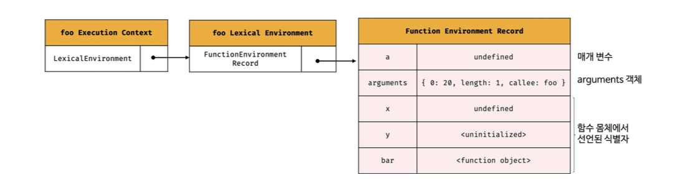

<br/>
<br/>

#### `foo` 함수 내부 this 바인딩

`foo` 함수 환경 레코드의 `[[ThisValue]]` 내부 슬롯에 `this` 가 바인딩 됨

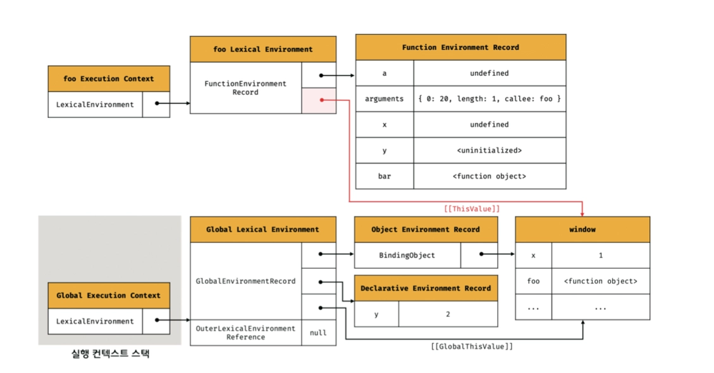

`foo` 함수 내부에서 `this` 를 참조하면 함수 환경 레코드의 `[[ThisValue]]` 내부 슬롯에 바인딩되어 있는 객체가 반환됨

`foo` 함수는 일반 함수로 호출되었으므로 `this` 는 전역 객체를 가리킴

<br/>
<br/>

#### `foo` 함수 내부 외부 렉시컬 환경에 대한 참조 결정

외부 렉시컬 환경에 대한 참조에 `foo` 함수 정의가 평가된 시점에 실행 중인 실행 컨텍스트의 렉시컬 환경의 참조가 할당됨

`foo` 함수는 전역 코드에 정의된 전역 함수이므로 전역 렉시컬 환경의 참조가 할당됨

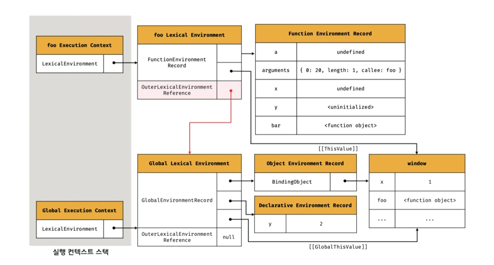

이를 통해 자바스크립트는 함수를 어디서 호출했는지가 아니라 어디에 정의했는지에 따라 상위 스코프를 결정한다는 것을 알 수 있음

<br/>
<br/>

#### `foo` 함수 코드 실행

이제 런타임이 시작되어 `foo` 함수의 소스코드가 순차적으로 실행되기 시작함

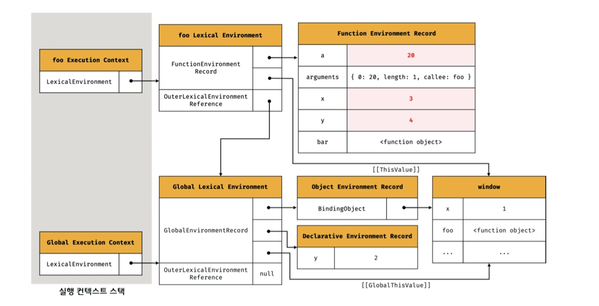

마찬가지로 식별자 결정을 위해 실행 중인 실행 컨텍스트의 렉시컬 환경에서 식별자를 검색하기 시작함

<br/>
<br/>

#### `bar` 함수 코드 평가

현재 `foo` 함수 코드 평가를 통해 `foo` 함수 실행 컨텍스트가 생성되었고 `foo` 함수 코드를 실행하고 있음

이후 `bar` 함수가 호출되면 `bar` 함수 내부로 코드의 제어권이 이동하고 평가하기 시작함

`foo` 함수와 마찬가지로 같은 과저을 거쳐 생성된 `bar` 함수 실행 컨텍스트와 렉시컬 환경은 다음과 같음

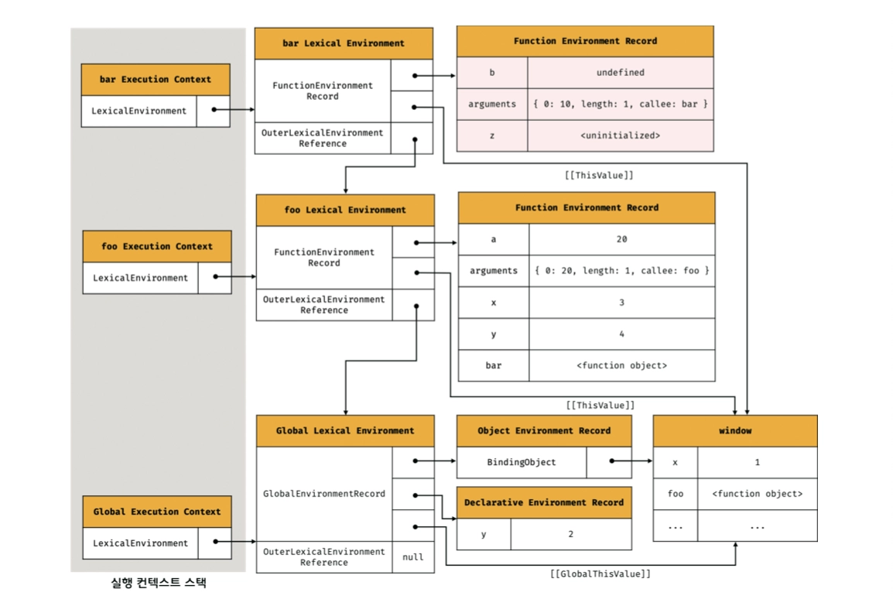

마지막으로 `bar` 함수 코드가 실행되어 끝나면 실행 컨텍스트 스택에서 팝 되고 차례대로 나머지 함수들도 종료되어 팝 됨

<br/>
<br/>

### 실행 컨텍스트와 블록 레벨 스코프

`let` , `const` 키워드로 선언한 변수는 모든 코드 블록을 지역 스코프로 인정하는 블록 레벨 스코프를 따름

이를 위해 선언적 환경 레코드를 갖는 렉시컬 환경을 새롭게 생성하여 기존의 전역 렉시컬 환경을 교체함

```tsx
let x = 1;

if (true) {
	let x = 10;
	console.log(x);
}

console.log(x);
```

이때 코드 블록을 위한 렉시컬 환경의 외부 렉시컬 환경에 대한 참조는 블록문이 실행되기 이전에 전역 렉시컬 환경을 가리킴

<br/>

그림으로 보면 다음과 같음

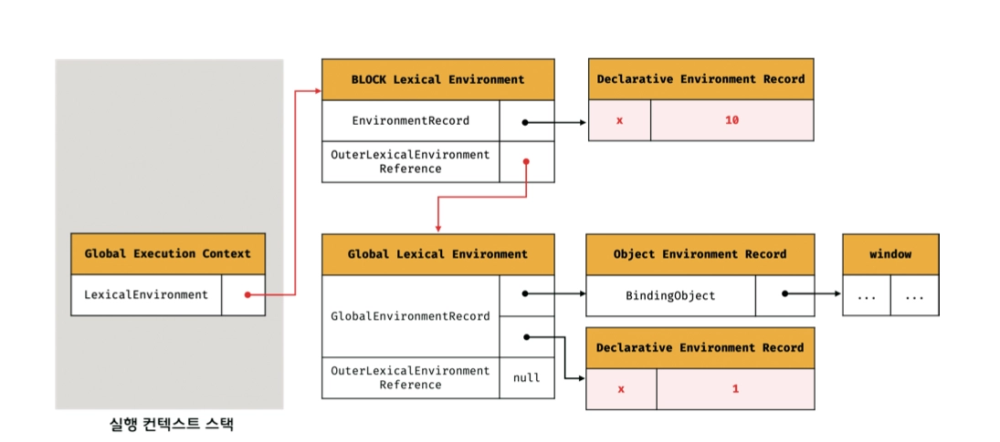!image.png

블록문 코드 블록의 실행이 종료되면 블록문의 코드 블록이 실행되기 이전의 렉시컬 환경으로 되돌림

<br/>