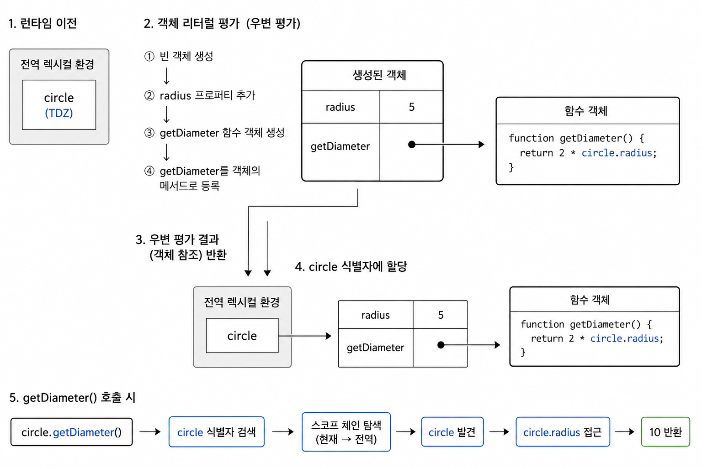
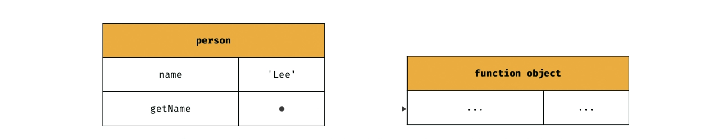
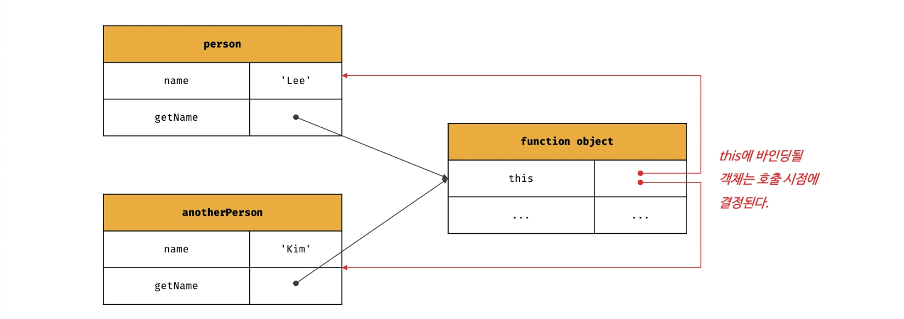

### this 키워드

동작을 나타내는 메서드는 자신이 속한 객체의 상태, 즉 프로퍼티를 참조하고 변경할 수 있어야 함

→ 자신이 속한 객체를 가리키는 식별자를 참조할 수 있어야한다는 뜻

<br/>

객체 리터럴 방식으로 생성한 객체의 메서드는 자신이 속한 객체를 가리키는 식별자를 참조할 수 있음

이 식별자는 메서드가 호출되어 함수 몸체가 실행되는 시점에 스코프 체인을 따라 탐색됨

```tsx
const circle = {
  radius: 5,
  getDiameter() {
    return 2 * circle.radius;
  },
};

console.log(circle.getDiameter());
```

<br/>

코드의 동작 방식은 다음과 같음



- 런타임 이전 전역 렉시컬 환경에 `circle` 식별자가 생성
- 런타임시 `const circle` 을 실행시 우변을 먼저 평가함
    - 객체 리터럴이 평가
        - 새로운 객체 생성
        - 프로퍼티 정의들을 앞에서부터 하나씩 평가
            - `radius` 프로퍼티 정의
            - `getDimater` 함수 객체 생성
            - 생성된 함수 객체를 `getDiamter` 프로퍼티의 값으로 저장
- 객체 리터럴이 평가 종료시 우변의 평가 결과는 생성된 객체의 참조값임
- `circle` 식별자에 할당

<br/>

이때 `getDiameter` 는 함수 객체만 생성될 뿐 함수 몸체는 실행되지 않아 `circle.radius` 표현식도 아직 평가되지 않음

이후 `getDiameter` 가 호출되어 함수 몸체가 실행되는 시점에 `circle` 식별자를 스코프 체인을 따라 탐색하며, 이미 `circle` 에는 생성된 객체가 할당되어 있으므로 `circle.radius` 를 정상적으로 참조할 수 있음

<br/>

다음은 생성자 함수 방식으로 인스턴스를 생성하는 방식임

생성자 함수 내부에서는 프로퍼티 또는 메서드를 추가하기 위해 자신이 생성할 인스턴스를 참조할 수 있어야함

```tsx
function Circle(radius) {
	???.radius = radius;
}

Circle.prototype.getDiameter = function() {
	return 2 * ???.radius;
};

const circle = new Circle(5);
```

하지만 생성자 함수를 정의하는 시점에는 아직 인스턴스를 생성하기 이전이므로 생성자 함수가 생성할 인스턴스를 가리키는 식별자를 알 수 없음

이를 해결하기 위해 자바스크립트는 `this` 라는 특수한 식별자를 제공함

<br/>

`this` 는 자신이 속한 객체 또는 자신이 생성할 인스턴스를 가리키는 자기 참조 변수임

이를 통해 자신이 속한 객체 또는 자신이 생성할 인스턴스의 프로퍼티나 메서드를 참조할 수 있음

`this` 바인딩은 함수 호출 방식에 의해 동적으로 결정됨

<br/>

다음은 객체 리터럴과 생성자 함수의 예제를 `this` 를 사용해 수정한 코드임

```tsx
// 객체 리터럴
const circle = {
  radius: 5,
  getDiameter() {
    return 2 * this.radius;
  }
}

// circle이 getDiameter 메서드를 호출
console.log(circle.getDiameter());

//  생성자 함수
function Circle(radius) {
  this.radius = radius;
}

Circle.prototype.getDiameter = function() {
  return 2 * this.radius;
}

// 생성자 함수가 생성할 인스턴스는 여기서 circle, this는 이 circle을 가리킴
const circle = new Circle(5);
console.log(circle.getDiameter());
```

이때, 객체 리터럴의 메서드 내부에서의 `this` 는 메서드를 호출한 객체, `circle` 을 가리키지만 생성자 함수 내부의 `this` 는 생성자 함수가 생성할 인스턴스를 가리킴

<br/>

다음은 동적으로 결정되는 `this` 예시 코드임

```tsx
// 전역에서 this는 window
// node 환경에서는 global
console.log(this);  // window

// 일반 함수 내부에서 this는 전역 객체 window를 가리킴
function square(number) {
  console.log(this);  // window
}
square(2);

// 메서드 내부에서 this는 메서드를 호출한 객체를 가리킴
const person = {
  name: "Lee",
  getName() {
    console.log(this); // { name: 'Lee', getName: [Function: getName] }
    return this.name;
  }
}
console.log(person.getName());

// 생성자 함수 내부에서 this는 생성자 함수가 생성할 인스턴스를 가리킴
function Person(name) {
  this.name = name;
  console.log(this); // Person { name: 'Lee' }
}
const me = new Person('Lee')
```

`this` 는 객체의 프로퍼티나 메서드를 참조하기 위한 자기 참조 변수이므로 일반적으로 객체의 메서드 내부 또는 생성자 함수 내부에서만 의미가 있음

<br/>

일반 함수에서의 `this` 에 대해 더 자세하게 들어가봄

```tsx
// 전역 객체 확인용으로 var 키워드를 사용
var value = 1;

const obj = {
  value: 100,
  foo() {
    console.log("foo's this: ", this);
    setTimeout(function() {
      console.log("callback's this: ", this);
      console.log("callback's this.value ", this.value);
    }, 100);
  }
}

obj.foo();  // 1
```

메서드 내에서 정의한 중첩 함수도 일반 함수로 호출(중첩 함수, 콜백 함수 포함)되면 `this` 에는 전역 객체가 바인딩됨

<br/>

메서드 내부의 중첩 함수나 콜백 함수의 `this` 바인딩을 메서드의 `this` 바인딩과 일치시키려면 다음과 같이 해야함

```tsx
const obj = {
  value: 100,
  foo() {
    // this 바인딩을 변수 this에 할당
    const that = this;

    setTimeout(function() {
      console.log(that.value);
    }, 100)
  }
}

obj.foo()
```

위 방법 이외에도 `Function.prototype.apply` , `Function.prototype.call` , `Function.prototype.bind` 를 통해 명시적으로 바인딩 할 수 있음

<br/>

다음은 메서드 호출시의 `this` 바인딩임

메서드 내부의 `this` 는 메서드를 소유한 객체가 아닌 메서드를 호출한 객체에 바인딩됨

```tsx
const person = {
  name: "Lee",
  getName() {
    return this.name;
  }
}

console.log(person.getName());  // Lee
```

<br/>

이때, `person` 객체의 정의된 `getName` 메서드는 프로퍼티에 바인딩된 함수임



즉, `person` 객체의 `getName` 프로퍼티가 가리키는 함수 객체는 `person` 객체에 포함된 것이 아니라 독립적으로 존재하는 별도의 객체임

<br/>

따라서 `getName` 프로퍼티가 가리키는 함수 객체는 다른 객체의 프로퍼티에 할당하는 것으로 다른 객체의 메서드가 될 수도 있고 일반 변수에 할당하여 일반 함수로  호출될 수도 있음

```tsx
const person = {
  name: "Lee",
  getName() {
    return this.name;
  }
}

const anotherPerson = {
  name: "Kim"
}

// anotherPerson 객체의 메서드로 할당
anotherPerson.getName = person.getName;
console.log(anotherPerson.getName());  // Kim

// getName 메서드를 변수에 할당
const getName = person.getName;
console.log(getName());  // 일반 함수 호출이기에 window.name
```

<br/>

그림으로 보면 다음과 같음

!image.png

<br/>

마지막으로 생성자 함수에서의 호출 상황임

생성자 함수 내부의 `this` 에는 생성자 함수가 생성할 인스턴스가 바인딩됨

```tsx
function Circle(radius) {
  this.radius = radius;
  this.getDiameter = function() {
    return 2 * this.radius;
  }
}

const circle1 = new Circle(5);
const circle2 = new Circle(10)

console.log(circle1.getDiameter());  // 10
console.log(circle2.getDiameter());  // 20
```

<br/>