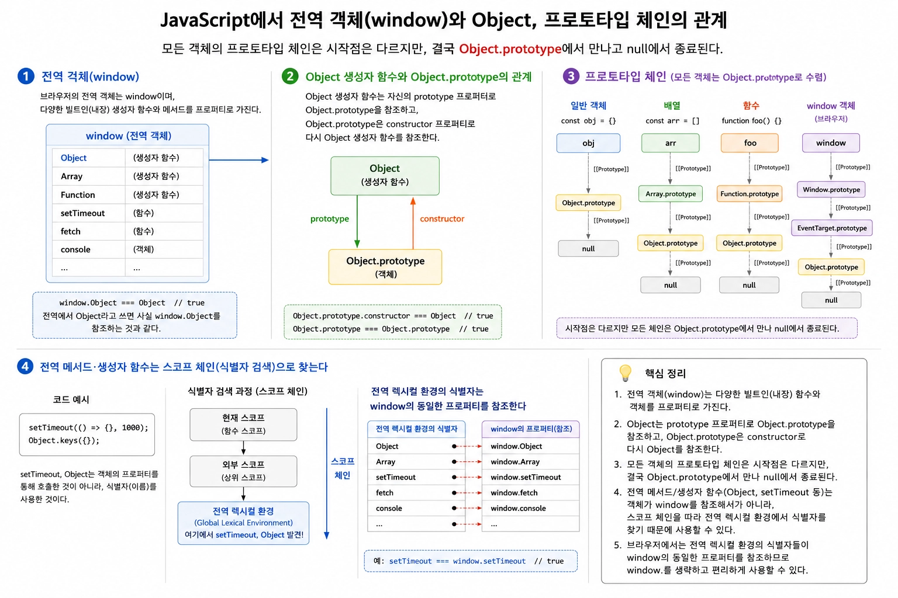
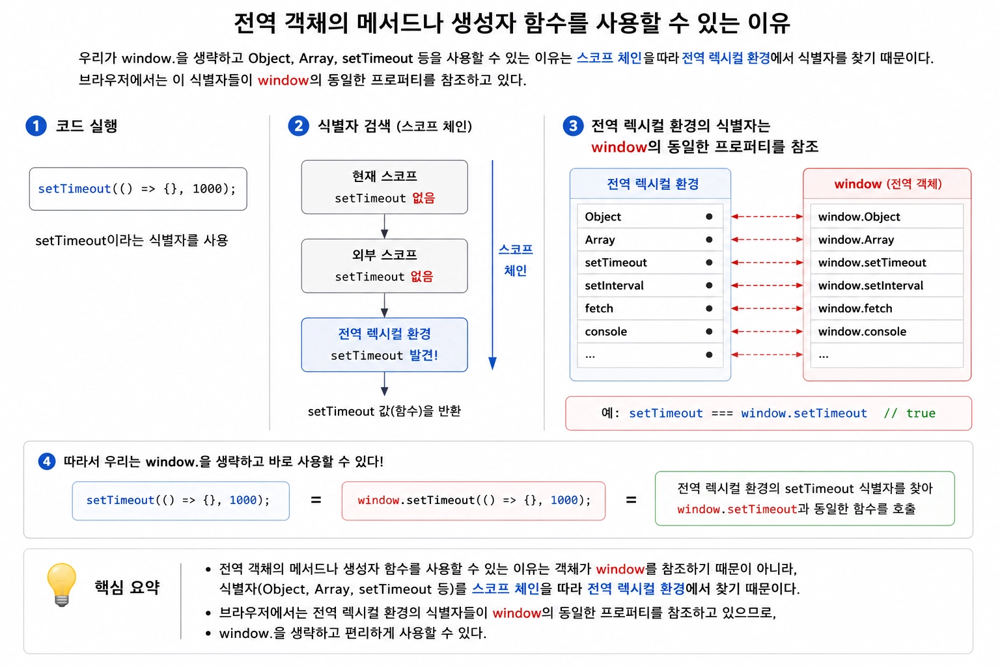

#### 전역 객체

전역 객체는 전역에서 사용할 수 있는 빌트인 객체, 함수, 값 등을 프로퍼티로 가지고 있는 객체임

대표적으로 `Object` , `Array` , `Function` , `Promise` , `Math` , `console` , `setTimeout` , `fetch` 등이 전역 객체의 프로퍼티로 존재함

```tsx
Object === window.Object;          // true
setTimeout === window.setTimeout;  // true
```

<br/>

JavaScript는 브라우저에서만 실행되는 언어가 아니므로 실행 환경에 따라 전역 객체가 달라짐

- **브라우저**
    - `window`
- **Node.js**
    - `global`
- **Bun**
    - `global`

<br/>

ES2020부터는 실행 환경에 관계없이 동일한 이름으로 전역 객체를 참조할 수 있도록 `globalThis` 가 추가됨

```tsx
// 브라우저
globalThis === window

// Node.js & Bun
globalThis === global

console.log(Object === globalThis.Object);  // true
```

<br/>

이 개념을 바탕으로 `this` 를 알아보자면

```tsx
var value = 1;

setTimeout(function() {
  console.log(this.value);
}, 100);  // 1
```

`setTimeout` 의 콜백은 일반 함수이므로 브라우저에서는 `this` 가 `window` 를 가리킴

→ `window.value` === `this.value`

<br/>

`var` 로 선언한 전역 변수는 전역 객체의 프로퍼티도 함께 생성됨

```tsx
var value = 1;

window.value = 1;
```

개념적으로 다음은 동일함

그렇기에 `this.value` 는 1이 됨

<br/>

> **단, Node.js/Bun에서는 파일 하나가 하나의 모듈로 실행도
그렇기에 실제로는 모듈 스코프의 변수로 적용됨
즉,  `this` 는 `Timeout` 객체를 가리키므로 `this.value` 는 `undefined` 가 됨**
>

<br/>

반면 `let` 키워드는 전역 객체의 프로퍼티를 생성하는 대신 전역 렉시컬 환경에 저장됨

```tsx
let value = 1;

setTimeout(function() {
  console.log(this.value);
}, 100);
```

즉, `window` 객체에는 `value` 프로퍼티가 존재하지 않음

따라서 해당 코드에서 `this.value` 는 `window.value` 를 참조하지만 `window.value` 가 존재하지 않으므로 `undefined` 가 출력됨

<br/>
<br/>

#### 전역 객체와 Object 객체

전역 객체는 전역에서 사용할 수 있는 값들을 저장하는 객체임

반면 프로토타입 체인은 객체가 프로퍼티를 검색하기 위해 따라가는 상속 관계임



브라우저가 초기화되는 과정에서 전역 객체가 먼저 생성되고, 이후 JS 엔진은 `Object`, `Array`, `Function` 등의 빌트인 생성자 함수와 각 프로토타입 객체를 생성하여 전역 객체의 프로퍼티로 등록함

전역 객체도 객체이므로 `[[Prototype]]` 내부 슬롯을 가지며 자신만의 프로토타입 체인을 가짐

다만 일반 객체와 시작점은 다르며, 두 체인은 결국 `Object.prototype` 에서 만나 `null` 에서 종료됨

<br/>

전역 객체의 메서드나 생성자 함수를 사용할 수 있는 이유는 객체가 `window` 를 참조하기 때문이 아니라, `Object`, `Array`, `setTimeout` 등의 식별자를 사용하기 때문임

식별자를 사용하면 스코프 체인을 따라 전역 렉시컬 환경에서 해당 식별자를 찾음



브라우저에서는 전역 렉시컬 환경의 식별자들이 `window` 의 동일한 프로퍼티를 참조하고 있으므로 `window.` 를 생략하고 사용할 수 있음

<br/>