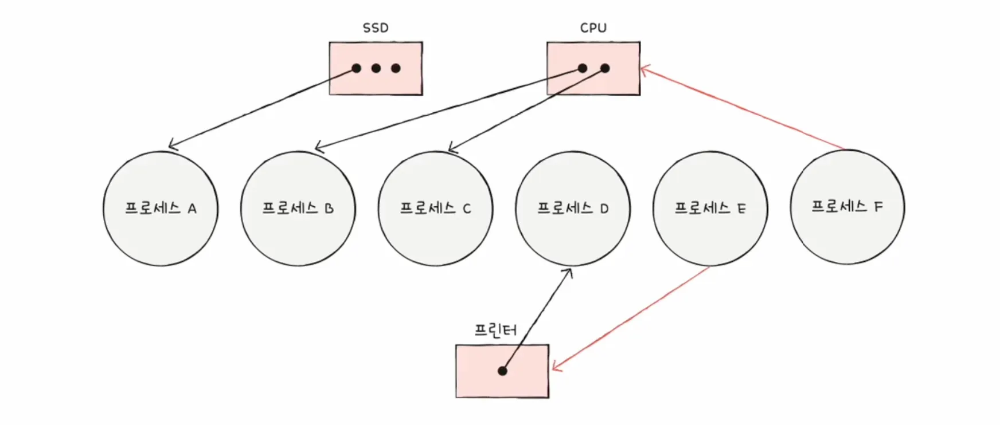
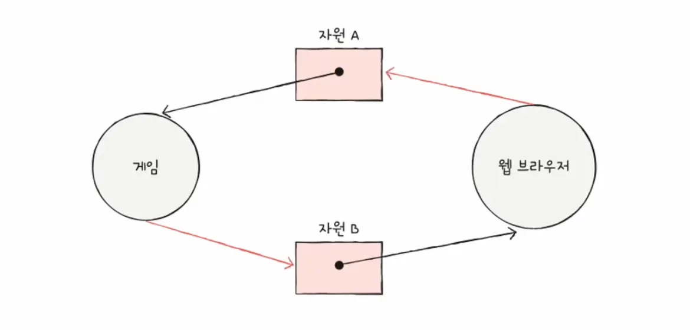

### 교착 상태란?

두 개 이상의 프로세스가 서로 상대방이 점유하고 있는 자원을 요구하며 무한정 대기하는 현상을 말합니다.

결과적으로 아무런 프로세스도 진행되지 못하고 시스템이 멈춰 버리게 됩니다.

 
 

### 자원 할당 그래프

교착 상태를 시각적으로 표현하고 판별하기 위한 방향성 그래프를 말합니다.

프로세스 노드는 원으로 표현하고 자원 노드는 사각형으로 표현합니다.

이때 사각형 안의 점은 자원의 개수를 의미합니다.

 

**교착 상태 판별**

그래프 내에 사이클 즉, 원형이 아니면 교착 상태는 발생하지 않습니다.

이미지처럼 사이클이 존재하게 된다면 다음과 같은 경우가 발생합니다.

- 자원 유형당 인스턴스가 하나라면 무조건 교착 상태입니다.
- 자원 유형당 인스턴스가 여러 개라면 교착 상태일 수도 있고 아닐 수도 있습니다.

 
 

### 교착 상태 발생의 4가지 필요 조건

교착 상태가 발생하라면 4가지 조건이 동시에 모두 성립해야 합니다.

하나라도 성립하지 않으면 교착 상태는 발생하지 않습니다.

- **상호 배제:**
    - 한 번에 하나의 프로세스만이 자원을 사용할 수 있어야 합니다.
    - 공유 불가능한 자원(예: 프린터, 임계 구역 등)에서 발생합니다.
- **점유와 대기:**
    - 최소한 하나의 자원을 점유한 상태에서, 다른 프로세스가 점유하고 있는 자원을 추가로 얻기 위해 대기해야 합니다.
- **비선점:**
    - 다른 프로세스가 점유한 자원을 강제로 뺏을 수 없습니다. 자원은 점유하고 있는 프로세스가 자발적으로 반납할 때만 해제됩니다.
- **원형 대기:**
    - 프로세스들이 원의 형태로 자원을 대기하는 상태입니다.

 
 

### 교착 상태 해결 방법: 예방

교착 상태 발생 조건 4가지 중 하나 이상을 원천적으로 차단하여 발생 가능성을 0으로 만드는 방법입니다.

가장 강력하지만, 자원 낭비가 심하고 시스템 효율성을 떨어뜨릴 수 있습니다.

**제거 대상 조건**

- **상호 배제:**
    - 모든 자원을 공유 가능하게 만듭니다.
    - 동기화 문제가 필요한 자원은 상호 배제가 필수적이므로 적용이 어렵습니다.
- **점유와 대기:**
    - 프로세스 시작 시 필요한 모든 자원을 한꺼번에 할당받거나, 자원이 없을 때만 요청 가능하게 합니다.
    - 당장 필요 없는 자원도 미리 선점해 둬야하기에 자원 효율성이 저하되고 기아 현상이 발생합니다.
- **비선점:**
    - 자원을 점유한 프로세스가 다른 자원을 요청했으나 대기해야 한다면, 가진 자원을 모두 반납하고 다시 요청하게 합니다.
    - 문맥 교환 오버헤드가 발생합니다.
- **원형 대기:**
    - 모든 자원에 고유 순서를 부여하고, 오름차순으로만 자원을 요청하도록 강제합니다.

 
 

### 교착 상태 해결 방법: 회피

교착 상태가 발생할 가능성이 있는 자원 할당을 피하는 방식입니다.

운영체제는 자원을 할당하기 전에 자원을 할당해도 시스템이 안전한지 먼저 검사합니다.

- **안전 순서열:**
    - 특정한 순서대로 자원을 할당해 주었을 때, 모든 프로세스가 교착 상태 없이 작업을 마치고 자원을 반납할 수 있는 순서를 말합니다.
- **안전 상태:**
    - 시스템에 안전 순서열이 하나라도 존재하는 상태입니다.
    - 교착 상태가 발생하지 않음이 보장됩니다.
- **불안전 상태:**
    - 시스템에 안전 순서열이 존재하지 않는 상태입니다.
    - 교착 상태가 발생할 가능성이 있는 상태입니다.

 
 

### 교착 상태 해결 방법: 검출 및 회복

교착 상태 방지책을 쓰지 않고, 일단 자원을 자유롭게 할당합니다.

대신 주기적으로 시스템을 검사하여 교착 상태가 발생했는지 확인하고 사후 조치합니다.

- **교착 상태 검출:**
    - 자원 할당 그래프를 통해 사이클을 찾거나, 대기 그래프 등을 활용하여 검출 알고리즘을 실행합니다.
- **교착 상태 회복:**
    - 교착 상태가 확인되면, 이를 해소하기 위해 자원을 선점하거나 프로세스를 종료처럼 강압적인 조치를 취합니다.

 