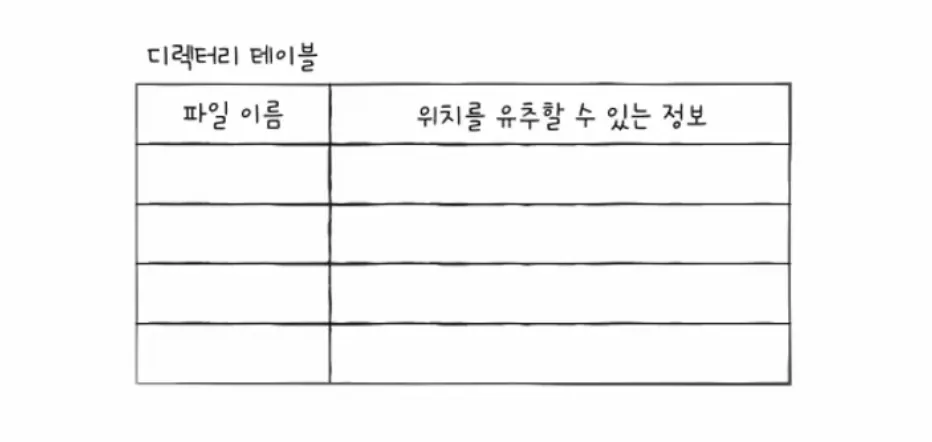
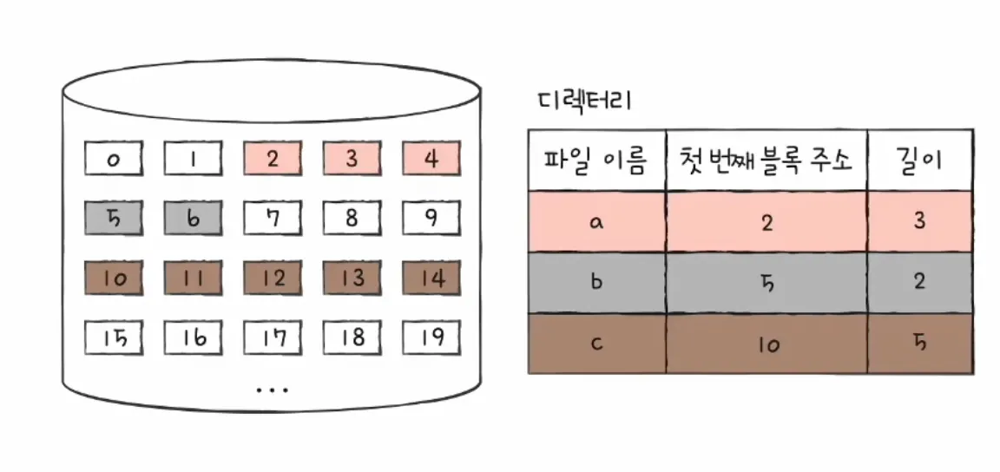
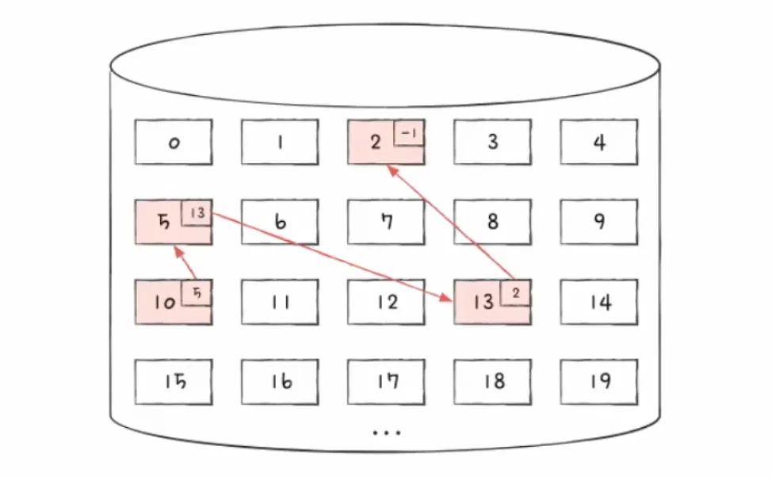
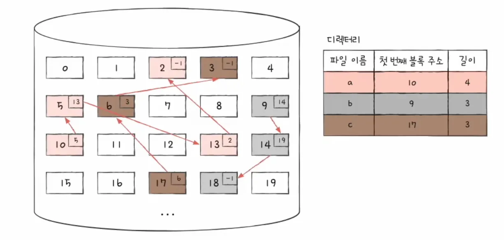
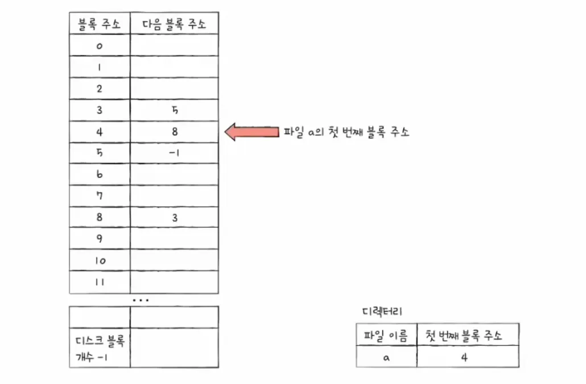
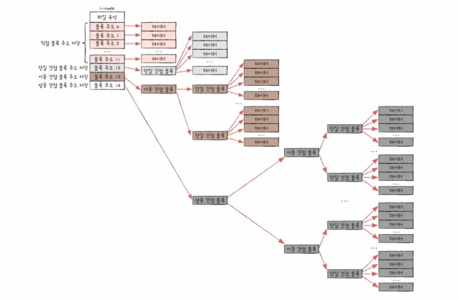

### 파일 시스템이란?

운영체제 내에서 파일과 디렉터리를 관리하는 서브시스템을 말합니다.

보조기억장치(HDD, SSD 등)의 물리적인 데이터 저장을 사용자가 인지할 수 있는 논리적 단위인 파일로 추상화하여 제공합니다.

 

**핵심 역할**

- **저장 공간 관리:**
    - 보조기억장치의 공간 할당 및 회수를 합니다.
- **접근 제어:**
    - 파일에 대한 읽기, 쓰기, 실행 권한 관리를 합니다.
- **메타데이터 관리:**
    - 파일의 내용 외에 속성 정보 유지를 합니다.

 
 

### 파일과 속성

파일은 보조기억장치에 저장된 논리적인 정보의 집합입니다.

파일은 크게 두 가지 정보로 구성됩니다.

- **데이터:**
    - 실제 사용자가 작성하거나 프로그램이 실행하는 바이너리/텍스트 정보를 말합니다.
- **메타데이터:**
    - 파일을 관리하기 위한 부가 정보를 말합니다.
    - 메타데이터를 저장하는 구조체를 FCB(File Control Block)라고 하며, 유닉스 계열에서는 inode가 해당 역할을 수행합니다.
        - 파일명
        - 식별자
        - 유형
        - 크기
        - 위치
        - 접근 제어
        - 시간정보

 
 

### 디렉토리 구조

디렉터리는 파일의 위치와 이름을 연결해주는 특수한 형태의 파일입니다.

기술적으로는 파일명, 해당 파일의 메타데이터 주소 쌍을 저장하는 테이블로 구현됩니다.

디렉터리 계층 구조는 다음과 같습니다.

- **트리 구조:**
    - 현대 운영체제의 표준 구조입니다.
- **루트 디렉터리:**
    - 최상위 디렉터리로 윈도우에서는 `C:\`, 유닉스와 리눅스에서는 `/` 로 표현합니다.
- **서브 디렉터리:**
    - 루트 아래에 종속된 디렉터리들을 말합니다.

**경로**

파일 시스템 내에서 특정 파일의 위치를 식별하는 문자열을 말합니다.

- **절대 경로:**
    - 루트 디렉터리부터 시작하여 목표 파일까지의 전체 경로를 말합니다.
- **상대 경로:**
    - 현재 작업 디렉터리를 기준으로 한 경로를 말합니다.

 

**디렉터리 엔트리**

디렉터리 파일 내부에 저장되는 개별 레코드를 말합니다.

디렉터리 엔트리에는 파일 이름과 그 파일이 보조기억장치 내에 저장된 위치를 유추할 수 있는 정보로 구성됩니다.

운영체제는 이 엔트리를 통해 파일명과 실제 데이터 블록의 위치를 매핑합니다.

 
 

### 파티셔닝

물리적인 저장 장치를 논리적인 영역인 섹션으로 분할하는 작업을 말합니다.

각 파티션은 독립적인 논리적 디스크로 간주되고 파티션마다 서로 다른 파일 시스템을 설치할 수 있습니다.

 
 

### 포매팅

파일 시스템을 설정하여 어떤 방식으로 파일을 관리할지 결정 및 새로운 데이터를 쓸 준비하는 작업을 말합니다.

파일 시스템은 포매팅할 때 결정됩니다.

 
 

### 파일 할당 방법

운영체제는 디스크를 블록 단위로 읽고 사용합니다.

하드웨어의 최소 단위는 섹터이나, 운영체제는 효율성을 위해 여러 섹터를 묶어 블록 단위로 관리합니다.

파일을 보조기억장치 블록에 배치하는 방식은 크게 연속 할당과 불연속 할당으로 나뉩니다.

 
 

### **연속 할당**

하나의 파일을 디스크의 연속된 블록에 저장하는 방식을 말합니다.

디렉터리 엔트리는 파일 이름, 첫 번째 블록 주소, 블록 단위 길이 명시로 이루어져있습니다.

구현이 단순하고 순차 접근과 직접 접근 속도가 모두 빠르다는 장점이 있습니다.

외부 단편화 문제와 파일 크기 확장 어렵다는 단점이 있습니다.

 
 

### **불연속 할당**

파일의 데이터 블록을 디스크 여러 곳에 분산하여 저장하는 방식으로 현대 파일 시스템의 기반입니다.

불연속 할당에는 연결 할당 방식과 색인 할당 방식이 있습니다.

 

**연결 할당**

파일의 데이터를 연결 리스트 형태로 관리합니다.

각 블록의 끝에 다음 블록을 가리키는 포인터가 포함됩니다.

디렉터리 엔트리는 첫 번째 블록의 주소만 가집니다.

외부 단편화가 발생하지 않다는 장점을 가집니다.

순차 접근만 가능하고 중간 블록의 포인터가 손상되면 그 이후의 데이터를 모두 유실한다는 단점을 가집니다.

 

**색인 할당**

색인 블록 하나에 파일의 모든 데이터 블록 포인터를 모아 관리하는 방식을 말합니다.

디렉터리 엔트리는 색인 블록의 주소를 가리킵니다.

색인 블록 안에는 실제 데이터 블록들의 주소 목록이 들어있습니다.

랜덤 액세스가 빠르다는 장점이 있지만 작은 파일의 경우에도 색인 블록이 필요하므로 공간 낭비 발생 가능이 있습니다.

 
 

### FAT (File Allocation Table) 파일 시스템

연결 할당 기반 파일 시스템으로 연결 할당의 단점을 보완한 방식입니다.

데이터 블록에 있던 다음 블록 포인터들을 추출하여, 디스크 앞부분의 FAT(파일 할당 테이블)이라는 별도의 영역에 모아서 관리합니다.

FAT(파일 할당 테이블) 테이블을 메모리에 로드하면, 블록을 일일이 접근하지 않고도 FAT 테이블만 참조하여 랜덤 액세스가 가능해집니다.

연결 할당 기반이지만 직접 접근이 가능한 형태가 됩니다.

 
 

### 유닉스 파일 시스템 - UFS

색인 할당을 기반으로 최적화한 방식을 말합니다.

유닉스 파일 시스템은 색인 할당의 문제를 해결하기 위해 inode 기반의 다단계 인덱싱 방식을 사용합니다.

inode는 파일의 모든 메타데이터와 블록 주소를 저장하는 자료구조를 말합니다.

- **직접 블록:**
    - 실제 데이터 블록을 직접 가리키는 포인터를 말합니다.
    - 블록 주소 중 12개에는 직접 블록 주소를 저장합니다.
- **단일 간접 블록:**
    - 데이터 블록 주소를 담고 있는 인덱스 블록을 가리킵니다.
    - 13번째 주소에 단일 간접 블록 주소를 저장합니다.
- **이중 간접 블록:**
    - 단일 간접 블록의 주소를 담고 있는 블록을 가리킵니다.
    - 14번째 주소에 이중 간접 블록 주소를 저장합니다.
- **삼중 간접 블록:**
    - 대용량 파일을 지원하기 위한 3단계 포인터 구조를 말합니다.
    - 15번째 주소에 삼중 간접 브록 주소를 저장합니다.

 