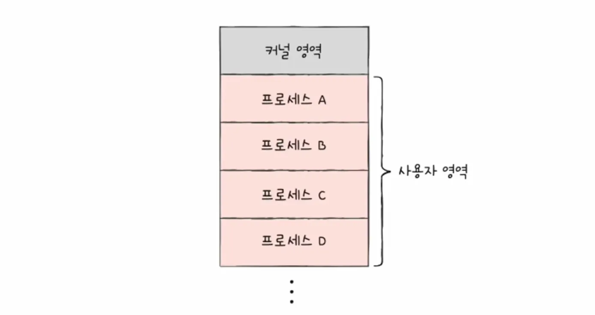
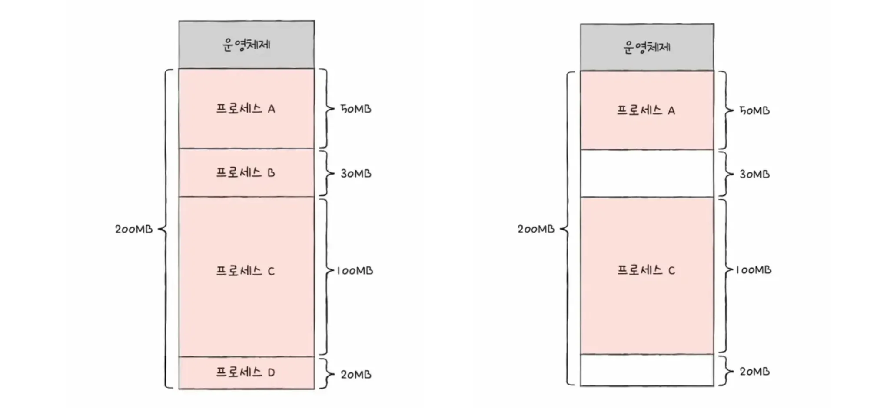
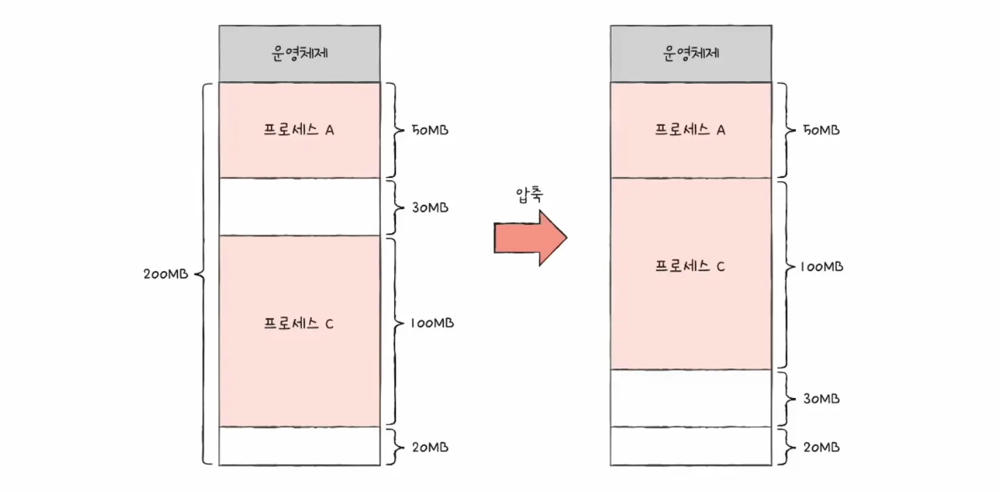
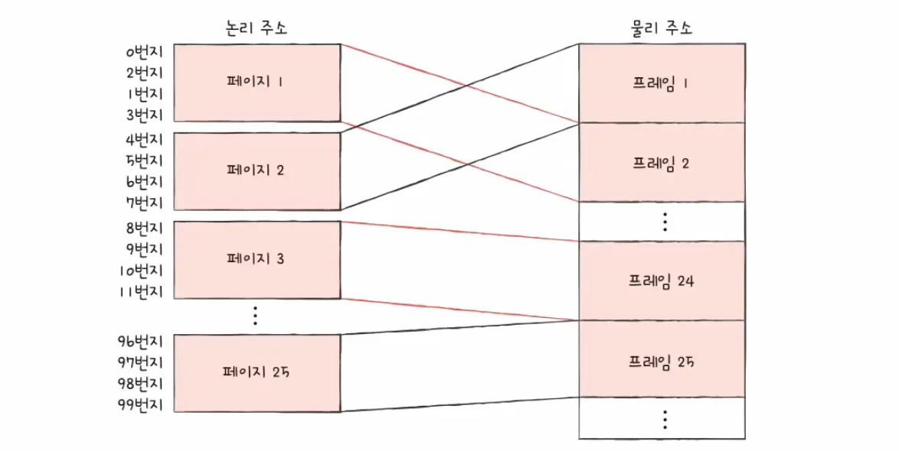
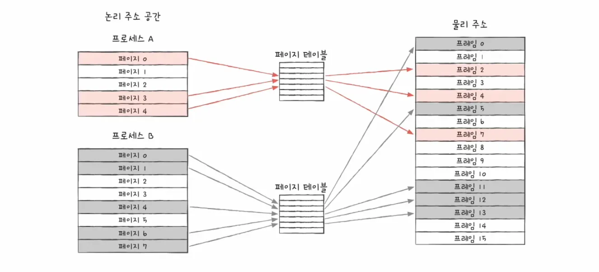

### 연속 메모리 할당이란?

초기 시스템이나 단순한 구조에서 사용되는 방식으로, 프로세스를 메모리의 연속적인 공간에 통째로 적재하는 기법을 말합니다.

운영체제는 프로세스를 적재할 빈 공간을 찾기 위해 다음 세 가지 전략 중 하나를 사용합니다.

- **최초 적합:**
    - 메모리 내의 빈 공간을 순서대로 검색하여 적재할 수 있는 공간을 발견하면 그 공간에 프로세스를 할당합니다.
    - 검색 최소화와 빠른 할당이 가능합니다.
- **최적 적합:**
    - 메모리 내의 빈 공간을 모두 검색한 후, 프로세스 크기에 가장 딱 맞는 공간에 할당합니다.
- **최악 적합:**
    - 메모리 내의 빈 공간을 모두 검색한 후, 프로세스 크기에 가장 큰 공간에 할당합니다.

 
 

### 외부 단편화

연속 메모리 할당을 사용하면 외부 단편화 문제가 발생합니다.

프로세스들이 생성되고 종료되는 과정이 반복되면서, 메모리 사이사이에 작은 빈 공간들이 흩어지게 됩니다.

빈 공간들의 총합은 새로운 프로세스를 실행하기에 충분하지만, 이들이 연속적이지 않고 흩어져 있어 실제로는 할당할 수 없게 됩니다.

메모리 압축 방식과 페이징 방식으로 해결할 수 있습니다.

 
 

### 메모리 압축

운영체제가 현재 실행 중인 프로세스들을 한쪽으로 몰라, 흩어진 빈 공간을 하나의 큰 공간으로 합치는 방법을 말합니다.

오버헤드가 크고 시스템 성능 저하를 유발하여 현대에는 잘 쓰이지 않는 방법입니다.

 
 

### 가상 메모리와 페이징

페이징은 가상 메모리 기법 중 하나로 페이징을 사용하여 외부 단편화를 해결할 수 있습니다.

프로세스의 논리 주소 공간을 페이지라는 일정 단위로 자르고, 메모리의 물리 주소 공간을 프레임이라는 페이지와 동일한 일정한 단위로 자른 뒤 페이지를 프레임에 할당합니다.

이때, 물리 주소는 실제 메모리 내의 주소를 말하고 논리 주소는 CPU가 바라보는 주소를 말합니다.

프로세스가 메모리에 연속적으로 존재할 필요가 없으므로 외부 단편화가 해결됩니다.

 
 

### 페이지 테이블

프로세스가 메모리에 불연속적으로 배치되어 있다면 CPU 입장에서 이를 순차적으로 실행할 수 없습니다.

페이지 테이블은 물리 주소에 불연속적으로 배치되더라도 논리 주소에는 연속적으로 배치되도록 중재하는 역할을 합니다.

페이지 테이블을 이용하면 물리적으로는 분산되어 저장되어 있더라도 CPU 입장에서 바라본 논리 주소로 연속적으로 보이게 됩니다.

CPU는 그저 논리 주소를 순차적으로 실행합니다.

 
 

### 스와핑

메모리 공간 부족을 해결하기 위해 보조기억장치를 메모리의 연장선으로 활용하는 방법을 말합니다.

스와핑을 사용하면 프로세스들이 요구하는 메모리 공간 크기보다 실제 메모리 크기보다 커도 사용이 가능합니다.

 