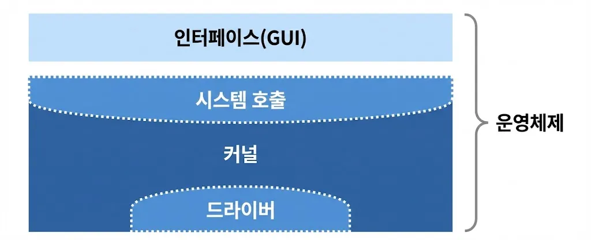
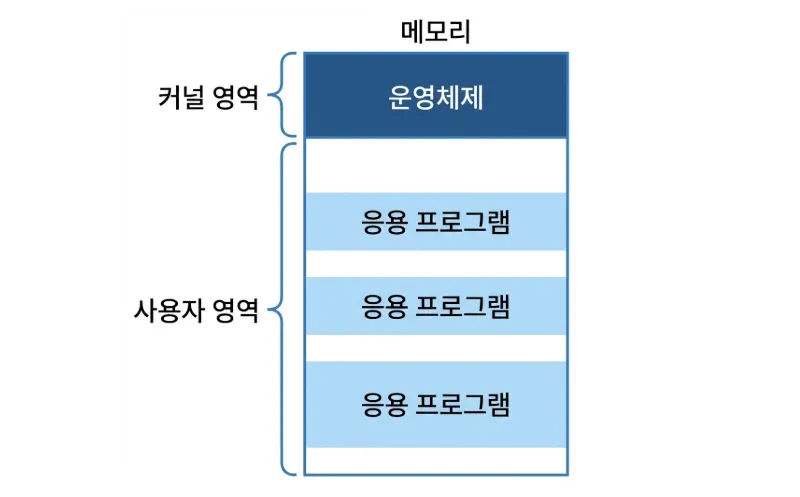
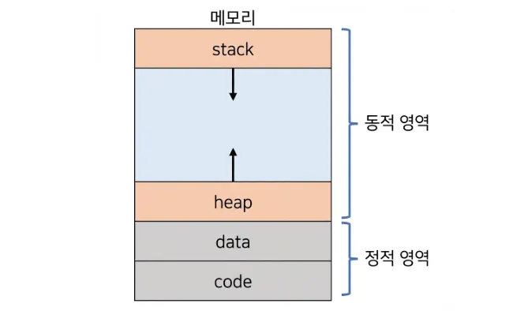

### 운영체제란?

운영체제는 사용자가 컴퓨터를 쉽게 다룰 수 있게 해주는 인터페이스를 말합니다.

컴퓨터 시스템의 자원 CPU, 메모리, 스토리지 등을 효율적으로 관리하고 사용자가 컴퓨터를 편리하게 사용할 수 있는 환경을 제공합니다.

 
 

### 운영체제의 역할

컴퓨터는 하드웨어와 소프트웨어(유저 프로그램)를 관리하는 일꾼인 운영체제와 CPU, 메모리 등으로 이루어져 있습니다.

- **CPU 스케줄링과 프로세스 관리:**
    - CPU 소유권을 어떤 프로세스에 할당할지 관리합니다.
    - 프로세스의 생성과 삭제를 관리합니다.
    - 자원 할당 및 반환을 관리합니다.
- **메모리 관리:**
    - 한정된 메모리를 어떤 프로세스에 얼만큼 할당해야 하는지 관리합니다.
- **디스크 파일 관리:**
    - 디스크 파일을 어떠한 방법으로 보관할지 관리합니다.
    - 디스크는 HDD (Hard Disk Drive), SSD(Solid State Drive)를 의미합니다
- **I/O 디바이스 관리:**
    - I/O 디바이스들인 마우스, 키보드와 컴퓨터 간에 데이터를 주고받는 것을 관리합니다.

 
 

### 운영체제 구조

운영체제의 구조는 다음과 같습니다.

- **GUI (Graphic User Interface):**
    - 사용자가 명령어를 입력하지 않고도 시스템을 사용할 수 있도록 도와줍니다
    - 애플리케이션 실행, 파일 탐색, 시스템 설정 등의 작업을 직관적으로 수행할 수 있게 합니다
- **시스템 호출:**
    - 운영체제가 커널에 접근하기 위한 인터페이스를 말합니다.
    - 유저 모드가 시스템 호출을 통해 커널 모드로 변환됩니다.
- **커널:**
    - 운영체제의 핵심 부분으로 시스템 전체를 관리하고 제어하는 역할을 합니다.
    - 하드웨어와 직접 통신하며, 메모리에 상주하는 핵심 구성 요소로서 운영체제의 생명줄과 같은 역할을 합니다.
    - 보안, 메모리, 프로세스, 파일 시스템, I/O 디바이스 관리 등 운영체제의 중추적인 역할을 합니다.
- **드라이버:**
    - 하드웨어 장치의 제어와 관리를 담당합니다.
    - 장치의 특정 기능을 운영체제에 통합하여 사용자가 쉽게 사용할 수 있도록 합니다.

 
 

### 응용 프로그램이란?

운영체제 위에서 실행되는 모든 소프트웨어를 의미합니다.

응용 프로그램은 하드웨어 자원에 직접 접근할 수 없으며, 반드시 운영체제를 통해서만 자원을 사용 할 수 있습니다.

 
 

### 메모리 영역의 구분, 커널 영역과 사용자 영역

메모리는 전자회로에서 데이터나 상태, 명령어 등을 기록하는 장치를 말합니다.

메모리는 운영체제 실행을 위한 공간과 사용자가 실행하는 프로그램을 위한 공간으로 엄격히 분리됩니다.

 

**커널 영역**

운영체제의 핵심 부분 커널이 항상 상주하는 영역으로 하드웨어 제어, 프로세스 스케줄링, 메모리 관리 등 시스템의  핵심 코드가 위치합니다.

일반 사용자의 접근이 차단되어 있습니다.

 

**사용자 영역**

사용자가 실행한 응용 프로그램이 적재되는 영역입니다.

 

**사용자 영역의 4가지 세부 구조**

힙과 스택은 서로 반대 방향으로 메모리를 채워나가며, 서로의 영역을 침범하면 스택 오버플로우 등의 문제가 발생합니다.

- **코드 영역(Read Only):**
    - 실행할 프로그램의 기계어 명렁어가 저장되는 공간입니다.
- **데이터 영역:**
    - 전역 변수, 정적 변수 등 프로그램이 시작될 때 할당되고 종료될 때 해제되는 데이터가 저장됩니다.
- **힙 영역:**
    - 사용자가 필요에 따라 동적으로 할당하고 해제하는 공간입니다.
    - 그림에서처럼 낮은 주소에서 높은 주소 방향으로 할당됩니다.
- **스택 영역:**
    - 함수의 호출과 관계되는 지역 변수, 매개 변수, 리턴 주소 등이 저장됩니다.
    - 함수 호출 시 할당되고 종료 시 자동 해제됩니다.
    - 그림에서처럼 높은 주소에서 낮은 주소 방향으로 할당됩니다.

### 이중 모드 & 시스템 호출

CPU는 오작동이나 악의적인 프로그램으로부터 시스템을 보호하기 위해 두 가지 실행 모드를 가집니다.

 

**이중 모드**

- **사용자 모드:**
    - 응용 프로그램이 실행되는 기본 상태입니다.
    - 하드웨어 접근이나 중요한 명령을 수행할 수 없습니다.
- **커널 모드(슈퍼바이저 모드):**
    - 운영체제 코드가 실행되는 상태입니다.
    - 모든 시스템 자원과 하드웨어에 접근할 수 있는 권한을 가집니다.

 
 

### 인터럽트

인터럽트는 어떤 신호가 들어왔을 때 CPU를 잠깐 정지시키는 것을 말합니다. 

인터럽트 간에는 우선순위가 있고 우선순위에 따라 실행되며 인터럽트는 하드웨어 인터럽트, 소프트웨어 인터럽트 두 가지로 나뉩니다.

 

**하드웨어 인터럽트**

CPU 외부의 하드웨어 장치(입출력 장치)가 발생시키는 인터럽트입니다. 

CPU의 명령 실행 주기와 무관하게 비동기적으로 발생합니다.

 

**스프트웨어 인터럽트**

CPU가 현재 실행 중인 명령어의 결과로 인해 동기적으로 발생하는 인터럽트로 , 프로세스 오류 등으로 프로세스가 시스템을 호출할 때 발동합니다.

주로 예외(Exception) 또는 트랩(Trap)이라고 부릅니다.

 

**인터럽트 처리 과정**

인터럽트가 발생하면 CPU는 하드웨어적으로 다음과 같은 순서를 따릅니다.

- **중단 및 상태 저장:**
    - 현재 실행 중이던 프로세스의 명령어 실행을 완료한 뒤 중단하고, 돌아올 복귀 주소(PC)와 현재 상태(레지스터 값)를 스택이나 PCB에 저장합니다.
- **인터럽트 벡터참조:**
    - 발생한 인터럽트의 종류를 식별하고, 해당 인터럽트를 처리할 코드가 메모리 어디에 있는지 찾기 위해 인터럽트 벡터 테이블을 참조합니다.
- **ISR(인터럽트 서비스 루틴) 실행:**
    - 해당 인터럽트를 처리하기 위해 미리 정의된 함수인 ISR을 커널 모드에서 실행합니다.
- **상태 복구 및 재개:**
    - ISR 실행이 끝나면, 저장해 두었던 이전 프로세스의 상태를 레지스터에 복구하고 원래 수행하던 작업으로 돌아갑니다.

 
 