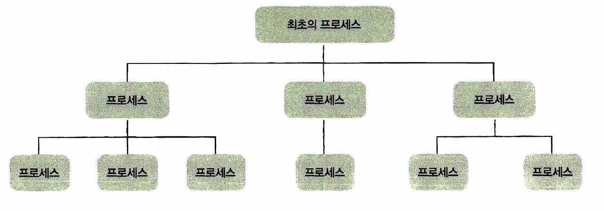
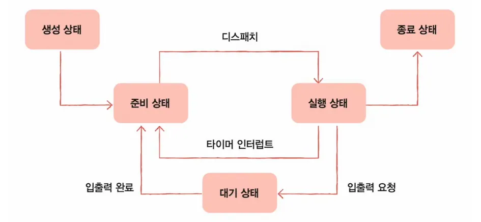

### 프로세스란?

보조기억장치에 저장된 정적인 프로그램이 메모리에 적재되어 CPU의 할당을 받을 수 있는 실행 중인 상태를 말합니다.

 

**포그라운드 프로세스**

사용자가 화면에서 직접 상호작용하며 실행되는 프로세서를 말합니다.

 

**백그라운드 프로세스**

사용자와 직접 상호작용하지 않고 뒤에서 실행되는 프로세스를 말합니다.

데몬 혹은 서비스라고 부릅니다.

 
 

### 프로세스 제어 블록

운영체제는 수많은 프로세스를 관리하기 위해 각 프로세스마다 PCB를 생성하여 커널 영역에 저장합니다.

PCB(Process Control Block)는 운영체제에서 프로세스에 대한 메타데이터를 저장한 데이터를 말합니다.

 

프로그램이 실행되면 프로세스가 생성되고 프로세스 주소 값들에 앞서 설명한 스택, 힙 등의 구조를 기반으로 메모리가 할당됩니다. 그리고 이 프로세스의 메타데이터들이 PCB에 저장되어 관리됩니다.

이는 프로세스의 중요한 정보를 포함하고 있기 때문에 일반 사용자가 접근하지 못하도록 커널 스택의 가장 앞부분에서 관리됩니다.

 

**PCB에 포함되는 주요 정보**

- **PID:**
    - 프로세스를 식별하기 위한 고유 번호를 말합니다.
- **레지스터 값:**
    - 프로세스가 다음 차례에 CPU를 할당받았을 때 작업을 이어서 하기 위해 저장해둔 CPU 레지스터 값을 말합니다.
- **프로세스 상태:**
    - 현재 프로세스가 어떤 상태인지(준비, 대기, 실행 등)를 나타냅니다.
- **CPU 스케줄링 정보:**
    - 프로세스의 우선순위, 스케줄링 큐 포인터 등을 담고 있습니다.
- **메모리 정보:**
    - 프로세스가 위치한 메모리 주소, 페이지 테이블 정보 등을 담고 있습니다.
- **사용 파일 및 입출력 장치 정보:**
    - 프로세스가 실행 중에 열어둔 파일 목록이나 할당받은 I/O 장치 정보를 담고 있습니다.
- **프로그램 카운터:**
    - 다음에 실행할 명령어의 주소를 담고 있습니다.
- **계정 정보:**
    - 프로세스를 실행시킨 사용자의 계정 정보를 담고 있습니다.

 
 

### 프로세스 계층 구조

대부분의 운영체제는 프로세스가 다른 프로세스를 낳는 계층적 구조를 가집니다.

프로세스 실행 중 시스템 호출을 통해 새로운 프로세스를 생성하면, 생성한 쪽이 부모, 생성된 쪽이 자식이 됩니다.

 
 

### 프로세스 상태

프로세스는 생성되어 종료될 때까지 여러 가지 상태 값을 갖고, 상태는 계속 변화합니다.

**상태의 종류는 다음과 같습니다.**

- **생성 상태:**
    - 프로세스가 생성되어 PCB가 할당된 상태를 의미합니다.
- **대기 상태:**
    - 메모리 공간이 충분하면 메모리를 할당받고 아니면 아닌 상태로 대기하고 있으며 CPU 스케줄러로부터 CPU 소유권이 넘어오기를 기다리는 상태입니다.
- **대기 중단 상태:**
    - 메모리 부족으로 일시 중단된 상태입니다.
- **실행 상태:**
    - CPU 소유권과 메모리를 할당받고 인스트럭션을 수행 중인 상태를 의미합니다.
- **중단 상태:**
    - 어떤 이벤트가 발생한 후 기다리며 프로세스가 차단된 상태입니다.
    - I/O 디바이스에 의한 인터럽트로 이런 현상이 많이 발생하기도 합니다.
- **일시 중단 상태:**
    - 대기 중단과 유사한 상태로 중단된 상태에서 프로세스가 실행되려고 했지만 메모리 부족으로 일시 중단된 상태입니다.
- **종료 상태:**
    - 메모리와 CPU 소유권을 모두 놓고 가는 상태를 말합니다.
    - 종료는 자연스럽게 종료되는 것도 있지만 부모 프로세스가 자식 프로세스를 강제시키는 비자발적 종료로 종료되는 것도 있습니다.
    - 자식 프로세스에 할당된 자원의 한계치를 넘어서거나 부모 프로세스가 종료되거나 사용자가 명령어로 프로세스를 종료할 때 발생합니다.

 
 

### 문맥 교환 - Context Switch

운영체제에서 CPU를 한 프로세스에서 다른 프로세스로 넘겨주는 작업을 말합니다.

CPU는 한 번에 하나의 프로세스만 실행할 수 있기 때문에, 여러 프로세스가 실행되려면 CPU를 적절히 넘겨가며 실행해야 합니다.

 

Context Switch 비용이 너무 크면 시스템 전체 성능이 저하될 수 있습니다.

따라서 운영체제는 Context Switch 횟수를 최소화하고, 빠르게 처리하는 것이 중요합니다.

이를 위해 프로세스 스케줄링 정책, 메모리 관리 기법 등을 효율적으로 설계해야 합니다.

 

**발생하는 주요 원인은 다음과 같습니다.**

- **프로세스 스케줄링에 의한 전환:**
    - 타임 슬라이스 만료, 높은 우선순위 프로세스 도착 등
- **인터럽트 발생:**
    - I/O, 트랩 등의 인터럽트 발생 시
- **사용자/커널 모드 전환:**
    - 사용자 프로세스가 커널 시스템 콜을 호출할 때

 

**과정은 다음과 같습니다.**

- CPU에서 실행 중인 프로세스의 하드웨어 컨텍스트(레지스터값, 메모리 매핑 등)를 PCB에 저장합니다.
- 새로 실행할 프로세스의 PCB 정보를 CPU에 복원합니다.
- 새 프로세스 실행합니다.

 