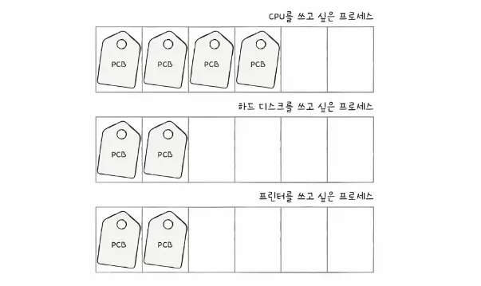
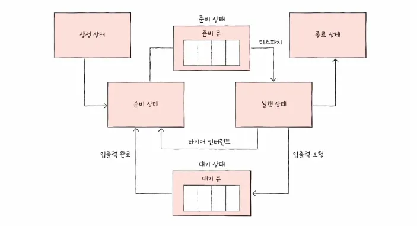

### CPU 스케줄링

준비 큐에 있는 프로세스들 중 어느 프로세스에 CPU 코어를 할당할 것인지를 결정하는 커널의 기능을 의미합니다.

스케줄링의 주된 목적은 CPU 이용률을 최대화하고, 프로세스 처리율을 높이는 것 입니다.

 

가장 공정한 CPU 스케줄링은 모든 프로세스가 Starvation 상태 없이 CPU 시간을 할당받는 것을 의미합니다.

Starvation은 운영체제 스케줄링에서 특정 프로세스가 수행할 준비가 되어 있음에도 불구하고, 우선순위 경쟁에서 지속적으로 밀려 CPU 자원을 영원히 할당받지 못하는 상태를 말합니다.

 
 

### 프로세스 우선순위

각 프로세스를 관리하기 위해 우선순위를 PCB 저장합니다.

스케줄러는 PCB를 참조하여 어떤 프로세스를 다음에 실행할지 결정합니다.

 

프로세스의 실행 주기는 CPU 연산과 입출력 대기의 반복으로 이루어집니다.

 

**입출력 집중 프로세스 - I/O Bound Process**

CPU 연산보다 입출력 요청이 빈번하여, 짧은 CPU 실행시간을 많이 가집니다.

 

**CPU 집중 프로세스 - CPU Bound Process**

복잡한 연산이 주를 이루어, 긴 CPU 실행시간을 소수 가집니다.

 
 

### 스케줄링 큐

프로세스의 상태에 따라 이를 연결 리스트 등의 형태로 관리합니다.

**준비 큐**

메인 메모리에 적재되어 있으며, CPU 할당을 기다리는 프로세스들의 집합입니다.

선입선출일 필요는 없으며, 우선순위 큐나 트리 구조 등으로 구현되어 우선순위가 높은 프로세스가 헤드에 위치할 수도 있습니다.

 

**대기 큐**

I/O 작업이나 특정 이벤트 발생을 기다리는 프로세스들이 머무는 큐입니다.

각 I/O 장치마다 별도의 큐가 존재합니다.

같은 장치를 요구한 프로세스들은 해당 장치의 대기 큐에 줄을 섭니다.

 
 

### 선점형 스케줄링

운영체제가 개입하여 실행 중인 프로세스로부터 CPU를 강제로 회수하고 다른 프로세스에 할당할 수 있습니다.

빠른 응답 시간을 보장하지만 문맥 교환 오버헤드가 발생하고 데이터 동기화 문제가 발생할 수 있습니다.

 
 

### 비선점형 스케줄링

프로세스가 CPU를 할당받으면, 작업을 종료하거나 I/O를 위해 스스로 대기 상태로 전환하기 전까지는 CPU를 뻇기지 않습니다.

문맥 교환 오버헤드가 적지만, 응답성이 떨어집니다.

 
 

### CPU 스케줄링 알고리즘

**선입 선처리 스케줄링**

비선점형 스케줄링으로 준비 큐에 도착한 순서대로 CPU를 할당합니다.

CPU 사용 시간이 매우 긴 프로세스가 먼저 도착하여 CPU를 독접하면, 뒤에 오는 짧은 프로세스들이나 I/O 바운드 프로세스들이 기다리는 호위 효과가 발생합니다.

 

**최단 작업 우선 스케줄링**

CPU 실행 시간이 가장 짧은 프로세스에게 먼저 CPU를 할당합니다.

긴 프로세스가 뒤로 밀리므로 호위 효과를 방지할 수 있습니다.

 

**최소 잔여 시간 우선 스케줄링**

최단 작업 우선 스케줄링의 선점형 버전으로 현재 실행 중인 프로세스의 남은 시간보다 더 짧은 CPU 실행시간을 가진 프로세스가 준비 큐에 도착하면, 즉시 문맥 교환이 일어나 새로운 프로세스가 CPU를 차지합니다.

 

**라운드 로빈 스케줄링**

선입 선처리 스케줄링에 타임 슬라이스가 합쳐진 형태입니다.

타입 슬라이스는 각 프로세스가 CPU를 사용할 수 있는 정해진 시간을 말합니다.

각 프로세스는 할당된 타임 슬라이스 동안만 CPU를 사용합니다.

시간이 만료되면 타이머 인터럽트가 발생하고, 프로세스는 준비 큐의 맨 뒤로 밀려납니다.

 

**우선순위 스케줄링**

각 프로세스에 우선순위 번호를 부여하고, 가장 높은 우선순위를 가진 프로세스에 CPU를 할당합니다.

오랫동안 대기한 프로세스의 우선순위를 점진적으로 높여주는 에이징 기법을 사용하여 해결할 수 있습니다.

 
 

### 복합 스케줄링 알고리즘

**다단계 큐 스케줄링**

준비 큐를 목적에 따라 여러 개의 하위 큐로 분할합니다.

각 큐는 독자적인 스케줄링 알고리즘을 가질 수 있습니다.

큐 자체에도 우선순위가 있어, 상위 큐가 비어있지 않으면 하위 큐의 프로세스는 실행될 수 없습니다

큐 간의 이동이 불가능하도록 고정되어 있어, 융통성이 부족하고 하위 큐에 있는 프로세스에 Starvation이 발생할 가능성이 높습니다.

 

**다단계 피드백 큐 스케줄링**

다단계 큐의 경직성을 해결하기 위해 큐 간의 이동을 허용한 가장 일반적인 현대적 스케줄링 기법입니다.

새로운 프로세스는 최상위 단계의 큐에 진입하고 할당된 시간 내에 작업을 마치지 못하면 한 단계 낮은 우선순위 큐로 강등됩니다.

낮은 큐에서 너무 오래 대기하면 다시 상위 큐로 승격시킵니다.

 