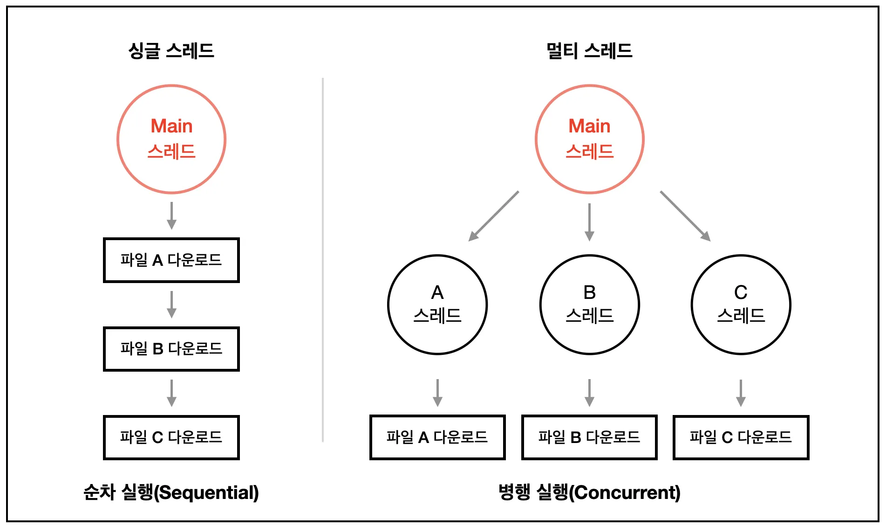

### 스레드란?

프로세스가 할당받은 자원을 이용하는 실행 흐름의 단위를 말합니다.

모든 프로세스는 생성 시 최소 하나의 스레드를 가지며, 필요에 따라 여러 개의 스레드를 생성하여 병행 또는 병렬 처리를 수행할 수 있습니다.

 
 

### 스레드의 내부 구조

**스레드 간 독립적인 요소**

각 스레드는 독립적인 실행 흐름을 유지하기 위해 다음 요소들을 개별적으로 소유합니다.

이를 TCB(Thread Control Block)에 저장합니다.

- **스레드 ID:**
    - 스레드를 식별하는 고유 번호
- **프로그램 카운터:**
    - 다음에 실행할 명령어의 메모리 주소를 가리킵니다.
    - 스레드마다 실행 위치가 다르므로 독립적이어야 합니다.
- **레지스터 집합:**
    - 현재 CPU에서 연산 중인 데이터 상태를 말합니다.
    - 컨텍스트 스위칭 시 해당 값들이 저장되고 복구되어야 하므로 독립적입니다.
- **스택:**
    - 함수 호출 시의 매개변수, 복귀 주소, 로컬 변수 등을 저장합니다.
    - 독립적인 함수 호출 흐름을 가지기 위해 스택은 반드시 분리되어야 합니다.

 

**스레드 간 공유하는 요소**

동일한 프로세스 내의 스레드들은 다음 자원을 공유합니다.

이를 PCB(Process Control Block)의 정보를 통해 접근합니다.

 
 

### 싱글 스레드 & 멀티 스레드

**싱글 스레드**

하나의 프로세스에서 하나의 스레드를 실행합니다.

 

**싱글 스레드의 장점**

자원 접근에 대한 동기화를 신경쓰지 않아도 됩니다.

여러개의 스레드가 공유된 자원을 사용할 경우, 각 스레드가 원하는 결과를 얻게 하려면 공용 자원에 대한 접근이 통제되어야 하며, 이 작업은 프로그래머에게 많은 노력을 요구하고 많은 비용을 발생시킵니다.

단일 스레드 모델에서는 이러한 작업이 필요하지 않습니다.

 

**싱글 스레드의 단점**

여러 개의 CPU를 활용하지 못합니다.

 

**멀티 스레드**

프로그램을 다수의 실행 단위로 나누어 실행합니다.

 

**멀티 스레드의 장점**
프로세스 내에서 자원을 공유하여 자원 생성과 관리의 중복을 최소화합니다.

서버가 많은 요청을 효율적으로 수행할 수 있는 환경을 제공합니다.

 

**멀티 스레드의 단점**

멀티 스레딩을 위해 운영체제의 지원이 필요하다.

스레드 스케쥴링을 신경써야 한다.

 
 

### 프로세스 간 통신

프로세스는 메모리가 격리되어 있으므로, 커널이 중재하는 별도의 통신 수단이 필요합니다.

- **Pipe:**
    - 부모 자식 간 단방향 통신
- **FIFO:**
    - 파일 시스템을 통해 서로 관련 없는 프로세스 간 통신
- **Message Queue:**
    - 메모리에 메시지 버퍼를 두고 데이터를 큐 형태로 교환
- **Shared Memory:**
    - 커널에 요청하여 특정 메모리 블록을 두 프로세스의 주소 공간에 매핑
- **Socket:**
    - 네트워크 스택을 이용한 통신

 
 

### 스레드 간 통신

별도의 통신 기법이 불필요합니다.

전역 변수나 힙 영역의 포인터만 알면 직접 메모리 참조가 가능합니다.

 