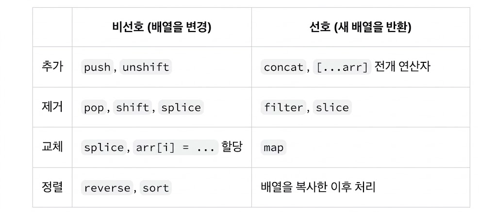

### 배열 State 업데이트하기

배열은 JavaScript에서는 변경이 가능하지만, `state` 로 저장할 때에는 변경할 수 없도록 처리해야 함

새 배열을 생성 혹은 기존 배열의 복사본을 생성한 뒤, 새 배열을 `state` 로 두어 업데이트해야 함

</br>
</br>

### 변경하지 않고 배열 업데이트하기

객체와 마찬가지로 React `state` 에서 배열은 읽기 전용으로 처리해야 함

→ `push()` 나 `pop()` 같은 함수로 변경해서는 안됨

이를 위해 `state` 의 원본 배열을 변경시키지 않는 `filter()` 와 `map()` 같은 함수를 사용하여 원본 배열로부터 새 배열을 만들 수 있음

</br>



React `state` 내에서 배열을 다룰 땐, 왼쪽 열에 있는 함수들의 사용을 피하는 대신, 오른쪽 열에 있는 함수들을 선호해야함

</br>
</br></br>

### 배열에 항목 추가하기

다음 방식은 배열을 변경함

```jsx
import { useState } from 'react';

let nextId = 0;

export default function List() {
  const [name, setName] = useState('');
  const [artists, setArtists] = useState([]);

  return (
    <>
      <h1>Inspiring sculptors:</h1>
      <input
        value={name}
        onChange={e => setName(e.target.value)}
      />
      {/* 배열을 직접 변경하는 부분 */}
      <button onClick={() => {
        artists.push({
          id: nextId++,
          name: name,
        });
      }}>Add</button>
      <ul>
        {artists.map(artist => (
          <li key={artist.id}>{artist.name}</li>
        ))}
      </ul>
    </>
  );
}

```

</br>

대신 기존에 존재하던 항목들 뒤에 새 항목을 포함하는 새로운 배열을 만드는 방법을 사용

가장 쉬운 방법은 스프레드 구문을 사용하는 것임

```jsx
setArtists(
  [
    ...artists,
    { id: nextId++, name: name } // 기존 배열의 모든 항목에, 마지막에 새 항목을 추가
  ]
);
```

</br>

다음과 같이 스프레드 구문을 기존 배열 앞에 배치하여 추가할 수도 있음

```jsx
setArtists([
  { id: nextId++, name: name },
  ...artists
]);
```

이런 식으로 배열의 가장 뒤에 추가하는 `push()` 와, 배열의 가장 앞에 추가하는 `unshift()` 의 두 기능 모두 수행할 수 있음

</br>
</br>

### 배열에서 항목 제거하기

배열에서 항목을 제거하는 가장 쉬운 방법은 필터링임

`filter` 함수를 사용하여 해당 항목을 포함하지 않는 새 배열을 제공하는 방법을 사용하는 것임

```jsx
import { useState } from 'react';

let initialArtists = [
  { id: 0, name: 'Marta Colvin Andrade' },
  { id: 1, name: 'Lamidi Olonade Fakeye'},
  { id: 2, name: 'Louise Nevelson'},
];

export default function List() {
  const [artists, setArtists] = useState(
    initialArtists
  );

  return (
    <>
      <h1>Inspiring sculptors:</h1>
      <ul>
        {artists.map(artist => (
          <li key={artist.id}>
            {artist.name}{' '}
            {/* 해당 부분임 */}
            <button onClick={() => {
              setArtists(
                artists.filter(a =>
                  a.id !== artist.id
                )
              );
            }}>
              Delete
            </button>
          </li>
        ))}
      </ul>
    </>
  );
}
```

`artists.filter(s => s.id !== artist.id)` 는 `artist.id` 와 ID가 다른 `artists` 로 구성된 배열을 생성함

</br>
</br>

### 배열 변환하기

배열의 일부 또는 전체 항목을 변경하고자 한다면, `map()` 을 사용해 새로운 배열을 만들 수 있음

```jsx
import { useState } from 'react';

let initialShapes = [
  { id: 0, type: 'circle', x: 50, y: 100 },
  { id: 1, type: 'square', x: 150, y: 100 },
  { id: 2, type: 'circle', x: 250, y: 100 },
];

export default function ShapeEditor() {
  const [shapes, setShapes] = useState(
    initialShapes
  );

  function handleClick() {
    const nextShapes = shapes.map(shape => {
      if (shape.type === 'square') {
        return shape;
      } else {
        return {
          ...shape,
          y: shape.y + 50,
        };
      }
    });
    // 새로운 배열로 리렌더링
    setShapes(nextShapes);
  }

  return (
    <>
      <button onClick={handleClick}>
        Move circles down!
      </button>
      {shapes.map(shape => (
        <div style={{
          background: 'purple',
          position: 'absolute',
          left: shape.x,
          top: shape.y,
          borderRadius:
            shape.type === 'circle'
              ? '50%' : '',
          width: 20,
          height: 20,
        }} />
      ))}
    </>
  );
}
```

`map()` 을 통해 `shapes` 배열을 순회하면서, 각 `shape` 객체를 JSX로 변환해 새 배열을 반환하여 화면에 렌더링함

</br>
</br>

### 배열 내 항목 교체하기

항목을 교체하기 위해 마찬가지로 `map` 을 이용해서 새로운 배열을 만듦

`map` 을 호출할 때 두 번째 인수로 항목의 인덱스를 받을 수 있음

```jsx
import { useState } from 'react';

let initialCounters = [
  0, 0, 0
];

export default function CounterList() {
  const [counters, setCounters] = useState(
    initialCounters
  );

  function handleIncrementClick(index) {
    // 해당 부분임
    const nextCounters = counters.map((c, i) => {
      if (i === index) {
        // 클릭된 counter를 증가시킴
        return c + 1;
      } else {
        // 변경되지 않은 나머지를 반환
        return c;
      }
    });
    setCounters(nextCounters);
  }

  return (
    <ul>
      {counters.map((counter, i) => (
        <li key={i}>
          {counter}
          <button onClick={() => {
            handleIncrementClick(i);
          }}>+1</button>
        </li>
      ))}
    </ul>
  );
}
```

</br>
</br>

### 배열에 항목 삽입하기

시작, 끝도 아닌 위치에 항목을 삽입하고 싶을땐 스프레드 문법과 `slice()` 함수를 함께 사용하면 됨

```jsx
import { useState } from 'react';

let nextId = 3;
const initialArtists = [
  { id: 0, name: 'Marta Colvin Andrade' },
  { id: 1, name: 'Lamidi Olonade Fakeye'},
  { id: 2, name: 'Louise Nevelson'},
];

export default function List() {
  const [name, setName] = useState('');
  const [artists, setArtists] = useState(
    initialArtists
  );

  function handleClick() {
    const insertAt = 1;
    const nextArtists = [
      // 삽입 지점 이전 항목
      ...artists.slice(0, insertAt),
      // 새 항목
      { id: nextId++, name: name },
      // 삽입 지점 이후 항목
      ...artists.slice(insertAt)
    ];
    setArtists(nextArtists);
    setName('');
  }

  return (
    <>
      <h1>Inspiring sculptors:</h1>
      <input
        value={name}
        onChange={e => setName(e.target.value)}
      />
      <button onClick={handleClick}>
        Insert
      </button>
      <ul>
        {artists.map(artist => (
          <li key={artist.id}>{artist.name}</li>
        ))}
      </ul>
    </>
  );
}
```

삽입 지점 앞에 자른 배열을 전개하고, 새 항목과 원본 배열의 나머지 부분을 전개하는 배열을 만드는 과정임

</br>
</br>

### 배열에 기타 변경 적용하기

JavaScript에서는 배열을 뒤집거나 정렬할때 `reverse()` 및 `sort()` 함수를 사용했음

하지만 이는 원본 배열을 변경시키므로 직접 사용할 수 없음

대신, 먼저 배열을 복사한 뒤 변경하면 됨

```jsx
import { useState } from 'react';

const initialList = [
  { id: 0, title: 'Big Bellies' },
  { id: 1, title: 'Lunar Landscape' },
  { id: 2, title: 'Terracotta Army' },
];

export default function List() {
  const [list, setList] = useState(initialList);

  function handleClick() {
    const nextList = [...list];
    nextList.reverse();
    setList(nextList);
  }

  return (
    <>
      <button onClick={handleClick}>
        Reverse
      </button>
      <ul>
        {list.map(artwork => (
          <li key={artwork.id}>{artwork.title}</li>
        ))}
      </ul>
    </>
  );
}
```

먼저 `[…list]` 전개 구문을 사용해 원본 배열의 복사본을 만들고 이후에 `reverse()` 또는 `sort()` 를 사용하면 됨

</br>

그러나, 배열을 복사하더라도 배열 내부에 기존 항목을 직접 변경해서는 안됨

→ 얕은 복사이기 때문에 복사된 배열 내부의 객체를 수정하면 기존 `state` 가 변경됨

```jsx
const nextList = [...list];
nextList[0].seen = true;
setList(nextList);
```

`list` 와 `nextList` 는 서로 다른 배열이지만 안에 들어 있는 요소, 객체는 같은 참조임

`nextList.reverse()` 는 인덱스 순서만 바꾸지만 `nextList[0].seen` 는 `state` 에 있는 객체를 직접 `mutate` 했기때문에 문제 발생

</br>
</br>

### 배열 내부의 객체 업데이트하기

중첩된 `state` 를 업데이트할 때, 업데이트하려는 지점부터 최상위 레벨까지의 복사본을 만들어야 함

```jsx
const myNextList = [...myList];
const artwork = myNextList.find(a => a.id === artworkId);
artwork.seen = nextSeen; // 기존 항목을 변경시킴
setMyList(myNextList);
```

</br>

```jsx
setMyList(myList.map(artwork => {
  if (artwork.id === artworkId) {
    // 변경된 새 객체를 만들어 반환합니다.
    return { ...artwork, seen: nextSeen };
  } else {
    // 변경시키지 않고 반환합니다.
    return artwork;
  }
}));
```

이런 식으로 `map` 을 사용하면 이전 항목의 변경 없이 업데이트된 버전으로 대체할 수 있음

일반적으로 방금 생성한 객체만 변경하는게 맞지만 이미 `state` 에 존재하는 것을 처리하려면 복사본을 만들어야 함

</br>
</br>

### Immer로 간결한 업데이트 로직 작성하기

`state` 구조를 변경하고 싶지 않다면, `Immer` 사용할 수 있음

손쉽게 변경 문법을 사용하여 작성할 수 있고 복사본을 생성하여 처리할 수 있음

`Immer` 의 두 가지 라이브러리를 install하여 사용 할 수 있음

```jsx
npm install immer
npm install use-immer
```

</br>

```jsx
updateMyTodos(draft => {
  const artwork = draft.find(a => a.id === artworkId);
  artwork.seen = nextSeen;
});
```

`Immer` 를 사용하면 `artwork.seen = nextSeen` 과 같이 변경해도 문제없음

→ 원본 `state` 를 변경하는 것이 아니라, `Immer` 에서 제공하는 특수 `draft` 객체를 변경하기 때문

내부적으로 `Immer` 는 항상 `draft` 에서 수행한 변경 사항에 따라 처음부터 다음 `state` 를 구성함

</br>