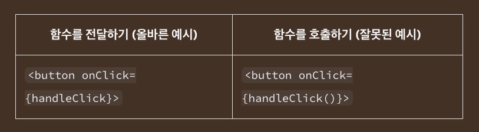
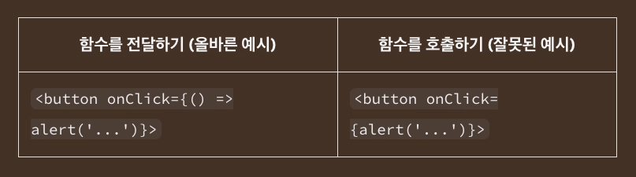

### 이벤트에 응답하기

React에서는 JSX에 이벤트 핸들러를 추가할 수 있습니다.

이벤트 핸들러는 클릭, 마우스 호버, 품 인풋 포커스 등 사용자 상호작용에 따라 유발되는 사용자 정의 함수입니다.

</br>
</br>

### 이벤트 핸들러 추가하기

이벤트 핸들러 추가를 위해서는 먼저 함수를 정의하고 이를 적절한 JSX 태그에 `prop` 형태로 전달해야 합니다.

아래 예시 코드는 아직 아무런 동작도 수행하지 않는 버튼입니다.

```tsx
// App.js
export default function Button() {
  return (
    <button>
      I don't do anything
    </button>
  );
}
```

</br>

해당 코드를 다음 3단계 과정을 거치면 사용자가 버튼을 클릭할 경우 메시지를 보여줄 수 있습니다.

먼저 `Button` 컴포넌트 내부에 `handleClick` 함수를 선언합니다.

그다음 해당 함수 내부 로직을 구현합니다.

마지막으로 `<button>` JSX에 `onClick={handleClick}` 을 추가합니다.

</br>

```tsx
// App.js
export default function Button() {
  function handleClick() {
    alert('You clicked me!');
  }

  return (
    <button onClick={handleClick}>
      Click me
    </button>
  );
}
```

`handleClick` 함수를 정의하였고 이를 `<button>` 에 `prop` 형태로 전달하였습니다.

여기서 `handleClick` 은 이벤트 핸들러 함수입니다.

</br>

이벤트 핸들러 함수는 다음 특징을 가집니다.

- 주로 컴포넌트 내부에서 정의됩니다.
- `handle` 로 시작하고 그 뒤에 이벤트명을 붙인 함수명을 가집니다.

관습적으로 `handle` 로 시작하며 이벤트명을 이어 붙인 이벤트 핸들러 명명법이 일반적입니다.

`onClick={handleClick}` , `onMouseEnter={handleMouseEnter}` 와 같은 경우를 자주 볼 수 있습니다.

</br>

다른 방법으로 이벤트 핸들러를 JSX 내에서 인라인으로 정의할 수 있습니다.

```tsx
<button onClick={function handleClick() {
  alert('You clicked me!');
}}>
```

</br>

또는 다음과 같이 화살표 함수를 사용하여 보다 간결하게 정의할 수도 있습니다.

```tsx
<button onClick={() => {
  alert('You clicked me!');
}}>
```

이러한 스타일은 모두 동일한 결과를 보여줍니다.

특히 인라인 이벤트 핸들러는 짧은 함수들을 정의할때 편리합니다.

</br>
</br>

### 이벤트 핸들러로 전달한 함수의 주의점

이벤트 핸들러를 전달한 함수들은 호출이 아닌 전달되어야 합니다.



첫 번째 예시에서 `handleClick` 함수는 `onClick` 이벤트 핸들러에 전달되었습니다.

이후 React는 이 내용을 기억하고 오직 사용자가 버튼을 클릭하였을 때만 함수를 호출하도록 합니다.

두 번째 예시에서는 `handleClick()` 끝의 `()` 가 렌더링 과정 중 클릭이 없었음에도 불구하고 즉시 함수를 실행하도록 만듭니다.

이는 JSX `{` 와 `}` 내의 자바스크립트가 즉시 실행되기 때문입니다.

</br>

인라인으로 코드를 작성할 때에도 동일한 함정이 다른 형태로 나타납니다.



</br>

다음과 같이 인라인 함수를 전달하면 버튼을 클릭할 때마다 실행되는 것이 아니라 컴포넌트가 렌더링 될 때마다 실행될 것입니다.

```tsx
// 이 alert는 클릭 시 실행되지 않고 컴포넌트가 렌더링 된 시점에 실행됩니다!
<button onClick={alert('You clicked me!')}>
```

</br>

만약 이벤트 핸들러를 인라인으로 정의하고자 한다면, 다음과 같이 익명 함수로 감싸면 됩니다.

```tsx
<button onClick={() => alert('You clicked me!')}>
```

이러한 방법으로 매 렌더링마다 내부 코드를 실행하지 않고 함수를 생성하여 추후 이벤트에 의해 호출되게 합니다.

</br>

두 가지 경우 모두, 전달하는 것은 함수입니다.

- `<button onClick={handleClick}>` 은 `handleClick` 함수를 전달합니다.
- `<button onClick={() => alert('...')}>` 은 `() => alert('...')` 함수를 전달합니다.

</br>
</br>

### 이벤트 핸들러 내에서 Prop 읽기

이벤트 핸들러는 컴포넌트 내부에서 선언되기에 이들은 해당 컴포넌트의 `prop` 에 접근할 수 있습니다.

다음 코드를 보면 클릭시 `message` `prop` 의 내용을 포함한 `alert` 를 표시하는 버튼을 볼 수 있습니다.

```tsx
//App.js
function AlertButton({ message, children }) {
  return (
    <button onClick={() => alert(message)}>
      {children}
    </button>
  );
}

export default function Toolbar() {
  return (
    <div>
      <AlertButton message="Playing!">
        Play Movie
      </AlertButton>
      <AlertButton message="Uploading!">
        Upload Image
      </AlertButton>
    </div>
  );
}
```

위와 같이 `prop` 을 통해 두 개의 버튼이 서로 다른 메시지를 표시할 수 있습니다.

</br>
</br>

### 이벤트 핸들러를 Prop으로 전달하기

종종 부모 컴포넌트로 자식의 이벤트 핸들러를 지정하기를 원할 수 있습니다.

`Button` 컴포넌트를 사용하는 위치에 따라 다른 기능을 수행하도록 만들고자 할 때 이러한 기능을 위해서 컴포넌트가 그 부모 컴포넌트로부터 받은 `prop` 을 이벤트 핸들러로 다음과 같이 전달합니다.

```tsx
// App.js
function Button({ onClick, children }) {
  return (
    <button onClick={onClick}>
      {children}
    </button>
  );
}

function PlayButton({ movieName }) {
  function handlePlayClick() {
    alert(`Playing ${movieName}!`);
  }

  return (
    <Button onClick={handlePlayClick}>
      Play "{movieName}"
    </Button>
  );
}

function UploadButton() {
  return (
    <Button onClick={() => alert('Uploading!')}>
      Upload Image
    </Button>
  );
}

export default function Toolbar() {
  return (
    <div>
      <PlayButton movieName="Kiki's Delivery Service" />
      <UploadButton />
    </div>
  );
}
```

다음 코드에서는 `Toolbar` 컴포넌트가 `PlayButton` 과 `UploadButton` 을 렌더링합니다.

- `PlayButton` 은 `handlePlayClick` 을 `Button` 내 `onClick` `prop` 으로 전달합니다.
- `UploadButton` 은 `() => alert('Uploading!')`을 `Button` 내 `onClick` `prop` 으로 전달합니다.

</br>

최종적으로, `Button` 컴포넌트는 `onClick` `prop` 을 받습니다.

이후 받은 `prop` 을 브라우저 빌트인 `<button>` 의 `onClick={onClick}` 으로 직접 전달합니다.

</br>
</br>

### 이벤트 핸들러 Prop 명명하기

`<button>` 과 `<div>` 같은 빌트인 컴포넌트는 `onClick` 과 같은 브라우저 이벤트 이름만을 지원합니다.

그러나 사용자 정의 컴포넌트(커스텀 컴포넌트)에서는 이벤트 핸들러 `prop` 의 이름을 원하는 대로 명명할 수 있습니다.

</br>

관습적으로 이벤트 핸들러 `prop` 의 이름은 `on` 으로 시작하여 대문자 영문으로 이어집니다.

그 예시로, 지금까지 살펴봤던 `Button` 컴포넌트의 `onClick` `prop` 은 `onSmash` 라는 이름으로 호출할 수도 있습니다.

```tsx
// App.js
function Button({ onSmash, children }) {
  return (
    <button onClick={onSmash}>
      {children}
    </button>
  );
}

export default function App() {
  return (
    <div>
      <Button onSmash={() => alert('Playing!')}>
        Play Movie
      </Button>
      <Button onSmash={() => alert('Uploading!')}>
        Upload Image
      </Button>
    </div>
  );
}
```

위 코드에서 `<button onClick={onSmash}>` 은 브라우저의 `<button>` 이 여전히 `onClick` `prop` 을 필요로 하고 있음을 보여줍니다.

그러나 사용자 정의 `Button` 컴포넌트가 받게 될 `prop` 의 이름은 원하는 대로 명명할 수 있습니다.

</br>

컴포넌트가 여러 상호작용을 지원한다면 이벤트 핸들러 `prop` 을 애플리케이션에 특화시켜 명명할 수 있습니다.

다음 예시는 `Toolbar` 컴포넌트가 `onPlayMovie` 와 `onUploadImage` 이벤트 핸들러를 받습니다.

```tsx
// App.js
export default function App() {
  return (
    <Toolbar
      onPlayMovie={() => alert('Playing!')}
      onUploadImage={() => alert('Uploading!')}
    />
  );
}

function Toolbar({ onPlayMovie, onUploadImage }) {
  return (
    <div>
      <Button onClick={onPlayMovie}>
        Play Movie
      </Button>
      <Button onClick={onUploadImage}>
        Upload Image
      </Button>
    </div>
  );
}

function Button({ onClick, children }) {
  return (
    <button onClick={onClick}>
      {children}
    </button>
  );
}
```

`onPlayMovie` 와 같이 `prop` 이름을 애플리케이션별 상호작용에 기반하여 명명한다면 나중에 어떻게 이를 이용하게 될지에 대한 유연성을 제공합니다.

</br>

> 이벤트 핸들러에 적절한 HTML 태그를 사용하고 있는지 확인해야합니다.
예를 들어 클릭을 처리하기 위해서는 `<div onClick={handleClick}>` 대신 `<button onClick={handleClick}>` 을 사용해야합니다.
실제 브라우저에서 `<button>` 은 키보드 내비게이션과 같은 빌트인 브라우저 동작을 활성화 합니다.
> 

</br>
</br>

### 이벤트 전파

이벤트 핸들러는 해당 컴포넌트가 가진 어떤 자식 컴포넌트의 이벤트를 수신할 수도 있습니다.

이를 이벤트가 트리를 따라 bublle 되거나 전파된다고 표현하고 이떄 이벤트는 발생한 지점에서 시작하여 트리를 따라 위로 전달됩니다.

</br>

아래 `<div>` 는 두 개의 버튼을 포함하고 있습니다.

`<div>` 그리고 각각의 버튼은 각자의 `onClick` 핸들러를 가지고 있습니다.

```tsx
// App.js
export default function Toolbar() {
  return (
    <div className="Toolbar" onClick={() => {
      alert('You clicked on the toolbar!');
    }}>
      <button onClick={() => alert('Playing!')}>
        Play Movie
      </button>
      <button onClick={() => alert('Uploading!')}>
        Upload Image
      </button>
    </div>
  );
}
```

둘 중의 어느 버튼을 클릭하더라도 해당 버튼의 `onClick` 이 먼저 실행될 것이며 이후 부모인 `<div>` 의 `onClick` 이 뒤이어 실행될 것입니다.

따라서 두 개의 메시지가 표시되고 만약 툴바 자체를 클릭한다면 오직 부모인 `<div>` 의 `onClick` 만이 실행될 것입니다.

부여된 JSX 태그 내에서만 실행되는 `onScroll` 을 제외한 React 내의 모든 이벤트는 전파됩니다.

</br>
</br>

### 전파 멈추기

이벤트 핸들러는 이벤트 오브젝트를 유일한 매개변수로 받습니다.

관습에따라 `event` 를 의미하는 `e` 로 호출되는 것이 일반적이며 이 오브젝트를 이벤트의 정보를 읽어들이는데 사용할 수 있습니다.

</br>

이러한 이벤트 오브젝트는 전파를 멈출 수 있게 해줍니다.

이벤트가 부모 컴포넌트에 닿지 못하도록 막으려면 아래 `Button` 컴포넌트와 같이 `e.stopPropagation()` 를 호출합니다.

```tsx
// App.js
function Button({ onClick, children }) {
  return (
    <button onClick={e => {
      e.stopPropagation();
      onClick();
    }}>
      {children}
    </button>
  );
}

export default function Toolbar() {
  return (
    <div className="Toolbar" onClick={() => {
      alert('You clicked on the toolbar!');
    }}>
      <Button onClick={() => alert('Playing!')}>
        Play Movie
      </Button>
      <Button onClick={() => alert('Uploading!')}>
        Upload Image
      </Button>
    </div>
  );
}
```

버튼을 클릭하면 다음과 같은 절차가 진행됩니다.

- React가 `<button>` 에 전달된 `onClick` 핸들러를 호출합니다.
- `Button` 에 정의된 해당 핸들러는 다음을 수행합니다.
    - `e.stopPropagation()` 을 호출하여 이벤트가 더 이상 bubbling 되지 않도록 방지합니다.
    - `Toolbar` 컴포넌트가 전달해 준 `onClick` 함수를 호출합니다.
- `Toolbar` 컴포넌트에서 정의된 위 함수가 버튼의 `alert` 를 표시합니다.
- 전파가 중단되었으므로 부모인 `<div>` 의 `onClick` 은 실행되지 않습니다.

</br>

`e.stopPropagation()` 의 결과, 버튼을 클릭하는 것은 이제 `<button>` 과 그 부모인 툴바의 `<div>` 가 보내는 두 개의 `alert` 를 표시하지 않고 단 하나의 `<button>` `alert` 만을 표시합니다.

버튼을 클릭하는 것은 그 주변의 툴바 부분을 클릭하는 것과 같지 않기에 이 UI 상에서는 전파를 멈추는 것이 합리적입니다.

</br>
</br>

### 단계별 이벤트 갭처

드물게 전파가 중단된 상황일지라도 분석을 위해 전파 로직에 상관 없이 모든 클릭 이벤트를 기록하고 싶을 수 있습니다.

이를 위해서는 이벤트명 마지막에 `Capture` 를 추가하면 됩니다.

```tsx
<div onClickCapture={() => { /* 가장 먼저 실행됩니다 */ }}>
  <button onClick={e => e.stopPropagation()} />
  <button onClick={e => e.stopPropagation()} />
</div>
```

각각의 이벤트는 세 단계를 거쳐 전파됩니다.

- 아래로 전달되면서 만나는 모든 `onClickCapture` 핸들러를 호출합니다.
- 클릭된 요소의 `onClick` 핸들러를 실행합니다.
- 위로 전달되면서 만나는 모든 `onClick` 핸들러를 호출합니다.

이벤트 캡처는 라우터나 분석을 위한 코드에 유용할 수 있지만 일반 애플리케이션 코드에서는 사용하지 않을 가능성이 높습니다.

</br>
</br>

### 전파의 대안으로 핸들러를 전달하기

아래 코드의 핸들러 내에서 부모의 `onClick` 이벤트 핸들러를 호출하는 부분 앞에 코드를 더 추가할 수도 있습니다.

이러한 패턴은 전파의 대안을 제공합니다.

```tsx
// App.js
function Button({ onClick, children }) {
  return (
    <button onClick={e => {
      e.stopPropagation();
      onClick();
    }}>
      {children}
    </button>
  );
}
```

부모 컴포넌트가 일부 추가적인 동작에 특화되도록 하면서 자식 컴포넌트가 이벤트를 처리할 수 있도록 합니다.

전파와는 다르게 자동으로 동작하지않아 이 패턴의 장점은 일부 이벤트의 결과로 실행되는 전체 코드 체인을 명확히 좇을 수 있게 해줍니다.

</br>
</br>

### 기본 동작 방지하기

일부 브라우저 이벤트는 그와 관련된 기본 브라우저 동작을 가집니다.

일례로 `<form>` 의 제출 이벤트는 그 내부의 버튼을 클릭 시 페이지 전체를 리로드하는 것이 기본 동작입니다.

```tsx
// App.js
export default function Signup() {
  return (
    <form onSubmit={() => alert('Submitting!')}>
      <input />
      <button>Send</button>
    </form>
  );
}
```

</br>

이러한 일이 발생하지 않도록 막기 위해 `e.preventDefault()` 를 이벤트 오브젝트에서 호출할 수 있습니다.

```tsx
// App.js
export default function Signup() {
  return (
    <form onSubmit={e => {
      e.preventDefault();
      alert('Submitting!');
    }}>
      <input />
      <button>Send</button>
    </form>
  );
}
```

`e.stopPropagation()` 와 `e.preventDefault()` 를 혼동하면 안됩니다.

- `e.stopPropagation()` 은 이벤트 핸들러가 상위 태그에서 실행되지 않도록 멈춥니다.
- `e.preventDefault()` 는 기본 브라우저 동작을 가진 일부 이벤트가 해당 기본 동작을 실행하지 않도록 방지합니다.

</br>
</br>

### 이벤트 핸들러가 사이드 이펙트를 가질 수도 있나요?

이벤트 핸들러는 사이드 이펙트를 위한 최고의 위치입니다.

함수를 렌더링하는 것과 다르게 이벤트 핸들러는 순수할 필요가 없기에 무언가를 변경하는데 최적의 위치입니다.

예를 들어 타이핑에 반응해 입력 값을 수정하거나, 버튼 입력에 따라 리스트를 변경할 때 적절합니다.

그러나 일부 정보를 수정하기 위해서는 먼저 그 정보를 저장하기 위한 수단이 필요합니다.

React에서는 컴포넌트의 기억 역할을 하는 `state` 를 이용할 수 있습니다.

</br>