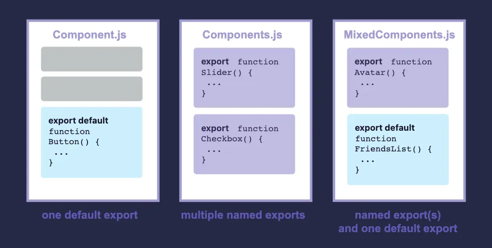
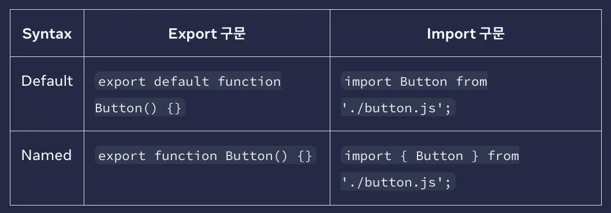

### 컴포넌트 import 및 export 하기

컴포넌트의 가장 큰 장점은 재사용성으로 컴포넌트를 조합해 또 다른 컴포넌트를 만들 수 있다는 것입니다.

컴포넌트를 여러 번 중첩하게 되면 다른 파일로 분리해야 하는 시점이 생기고 이렇게 분리하면 나중에 파일을 찾기 더 쉽고 재사용하기 편리해집니다.

</br>
</br>

### Root 컴포넌트란

아래 예시의 `Profile`, `Gallery` 컴포넌트들은 모두 `App.js` 라는 `root` 컴포넌트 파일에 존재합니다.

```tsx
function Profile() {
  return (
    
  );
}

export default function Gallery() {
  return (
    <section>
      <h1>Amazing scientists</h1>
      <Profile />
      <Profile />
      <Profile />
    </section>
  );
}
```

설정에 따라 `root` 컴포넌트가 다른 파일에 위치할 수도 있습니다.

Next.js처럼 파일 기반으로 라우팅하는 프레임워크일 경우 페이지별로 `root` 컴포넌트가 다를 수 있습니다.

</br>
</br>

### 컴포넌트를 import 하거나 export 하는 방법

랜딩 화면을 변경하게 되어 프로필 사진을 다른 곳에서 사용하게 된다면 `Gallery` 컴포넌트와 `Profile` 컴포넌트를 `root` 컴포넌트가 아닌 다른 파일로 옮기는 게 좋습니다.

그렇게 변경하면 재사용성이 높아져 컴포넌트를 모듈로 사용할 수 있습니다.

컴포넌트를 다른 파일로 이동하려면 세 가지 단계가 있습니다.

</br>

- 컴포넌트를 추가할 JS 파일을 생성합니다.
- 새로 만든 파일에서 함수 컴포넌트를 `export` 합니다.
    - `default` 또는 `named export` 방식을 사용합니다.
- 컴포넌트를 사용할 파일에서 `import` 합니다.
    - 적절한 방식을 선택해서 `default` 또는 `named` 로 `import` 합니다.

</br>

아래 예시를 보면 `App.js` 파일에서 `Profile` 과 `Gallery` 컴포넌트를 빼서 새로운 `Gallery.js` 파일로 옮겼습니다.

```tsx
// App.js
import Gallery from './Gallery.js';

export default function App() {
	return (
		<Gallery />
	);
}
```

</br>

```tsx
// Gallery.js
function Profile() {
  return (
    
  );
}

export default function Gallery() {
  return (
    <section>
      <h1>Amazing scientists</h1>
      <Profile />
      <Profile />
      <Profile />
    </section>
  );
}
```

이제 `Gallery`는 `Gallery.js` 를 `import` 해서 사용할 수 있습니다.

다음 예시는 컴포넌트들이 두 파일로 나뉘게 되었습니다.

- `Gallery.js`:
    - `Profile` 컴포넌트를 정의하고 해당 파일에서만 사용되기 때문에 `export` 하지 않습니다.
    - `Default` 방식으로 `Gallery` 컴포넌트를 `export` 합니다.
- `App.js`:
    - `Default` 방식으로 `Gallery`를 `Gallery.js`로부터 `import` 합니다.
    - `Root App` 컴포넌트를 `default` 방식으로 `export` 합니다.

</br>
</br>

> 가끔 `.js` 와 같은 파일 확장자가 없을 때도 있습니다.
`import Gallery from ‘./Gallery’;`
React에서는 `‘./Gallery.js’` 또는 `‘./Gallery’` 둘 다 사용할 수 있지만 전자의 경우가 native ES Modules 사용 방법에 더 가깝습니다.
>

</br>
</br>

### Default와 Named Exports

보통 JavaScript에서는 `default` 와 `named export` 라는 두 가지 방법으로 값을 `export` 합니다.



두 방법 다 한 파일에서 사용할 수도 있지만 한 파일에서는 하나의 `default export` 만 존재할 수 있고 `named export`는 여러 개가 존재할 수 있습니다.

</br>
</br>

`Export` 하는 방식에 따라 `import` 하는 방식이 정해져 있습니다.

`Default export` 로 한 값을 `named import` 로 가져오려고 하려면 에러가 발생합니다.



`Default import` 를 사용하는 경우 원한다면 import 단어 후에 다른 이름으로 값을 가져올 수 있습니다.

예를 들어 `import Banana from ‘./button.js’` 라고 쓰더라도 같은 `default export` 값을 가져오게 됩니다.

</br>

반대로 `named import` 를 사용할 때는 양쪽 파일에서 사용하고자 하는 값의 이름이 같아야 하기 때문에 `named import` 라고 불립니다.

</br>

보편적으로 한 파일에서 하나의 컴포넌트만 `export` 할 때 `default export` 방식을 사용하고 여러 컴포넌트를 `export` 할 경우엔 `named export` 방식을 사용합니다.

어떤 방식을 사용하든 컴포넌트와 파일의 이름을 의미 있게 명명하는 것은 중요합니다.

`export default () ⇒ {}` 처럼 이름 없는 컴포넌트는 나중에 디버깅하기 어렵기 때문에 괸장하지 않습니다.

</br>
</br>

### 한 파일에서 여러 컴포넌트를 import 하거나 export 하는 방법

전체 갤러리가 아니라 하나의 `Profile` 만 사용하고 싶을 때 `Profile` 컴포넌트만 `export` 하면 됩니다.

하지만 `Gallery.js` 파일에는 이미 하나의 `default export` 가 존재하기 때문에 두 개의 `default export` 를 정의할 수 없습니다.

이런 경우 새로운 파일 하나를 더 생성해서 `default export` 를 사용하거나 `named export` 로 `Profile` 컴포넌트를 `export` 할 수 있습니다.

한 파일에서는 단 하나의 `default export` 만 사용할 수 있지만 `named export` 는 여러 번 사용할 수 있습니다.

</br>

먼저 `named export` 방식을 사용해서 `Gallery.js` 파일에서 `Profile` 컴포넌트를 `export` 합니다.

```tsx
// Gallery.js
export function Profile() {
	// ...
}
```

</br>

`named import` 방식으로 `Gallery.js` 파일에서 `Profile` 컴포넌트를 `App.js` 파일에 `import` 합니다.

```tsx
// App.js
import { Profile } from ',/Gallery.js';

export default function App() {
	return <Profile />;
}
```

마지막으로 `<Profile/>` 컴포넌트를 `App` 컴포넌트에서 렌더링합니다.

이제 `Gallery.js` 에는 `default Gallery export` 랑 `named Profiel export` 라는 두 가지의 `export`가 존재합니다.

</br>

**( `Gallery.js`에 코드는 글의 위에서 부터 아래로 이어지며 사용됩니다. )**

</br>

`App.js` 에서는 두 컴포넌트를 `import` 해서 사용합니다.

```tsx
// App.js
import Gallery from './Gallery.js';
import { Profile } from './Gallery.js';

export default function App() {
  return (
    <Profile />
  );
}
```

</br>

`Gallery.js` 는 다음과 같습니다.

```tsx
export function Profile() {
  return (
    
  );
}

export default function Gallery() {
  return (
    <section>
      <h1>Amazing scientists</h1>
      <Profile />
      <Profile />
      <Profile />
    </section>
  );
}
```

- `Gallery.js`:
    - `Named export` 방식으로 `Profile` 이라는 이름의 컴포넌트를 `export` 합니다.
    - `Default export` 방식으로 `Gallery` 컴포넌트를 `export` 합니다.
- `App.js`:
    - `Gallery.js` 에서 `named import` 방식으로 `Profile` 컴포넌트를 `import` 합니다.
    - `Gallery.js`에서 `default import` 방식으로 `Gallery` 컴포넌트를 `import` 합니다.
    - `Default export` 방식으로 `App` 컴포넌트를 `export` 합니다.

</br>