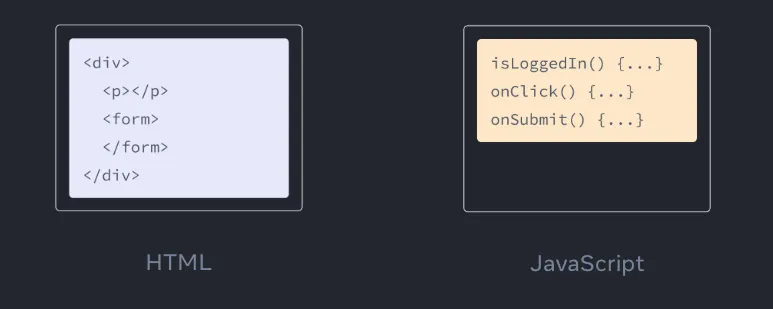
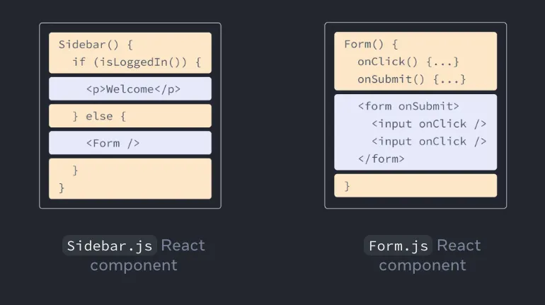

### JSX로 마크업 작성하기

JSX는 JavaScript를 확장한 문법으로, JavaScript 파일을 HTML과 비슷하게 마크업을 작성할 수 있도록 해줍니다.

컴포넌트를 작성하는 다른 방법도 있지만, 대부분의 React 개발자는 JSX의 간결함을 선호하며 대부분의 코드 베이스에서 JSX를 사용합니다.

</br>

Web은 HTML, CSS, JavaScript를 기반으로 만들어져 왔습니다.

수년 동안 웹 개발자는 HTML로 내용을, CSS로 디자인을, JavaScript로 로직을 작성해 왔습니다.

보통은 HTML, CSS, JavaScript를 분리된 파일로 관리합니다.



페이지의 로직이 JavaScript 안에서 분리되어 동작하는 동안, HTML 안에서는 내용이 마크업 되었습니다.

</br>

그러나 Web이 더욱 인터랙티브해지면서, 로직이 내용을 결정하는 경우가 많아졌습니다.

그래서 JavaScript가 HTML을 담당하게 되어 React에서 렌더링 로직과 마크업이 같은 위치에 함께 있게 된 이유입니다.

</br>

버튼의 렌더링 로직과 버튼의 마크업이 함께 있으면, 매번 변화가 생길 때마다 서로 동기화 상태를 유지할 수 있습니다.



반대로 버튼의 마크업과 사이드바의 마크업처럼 서로 관련이 없는 항목들을 서로 분리되어 있으므로, 각각 개별적으로 변경하는 것이 더 안전합니다.

</br>

각 React 컴포넌트는 React가 브라우저에 마크업을 렌더링할 수 있는 JavaScript 함수입니다.

React 컴포넌트는 JSX라는 확장된 문법을 사용하여 마크업을 나타냅니다.

JSX는 HTML과 비슷해 보이지만, 조금 더 엄격하며 동적으로 정보를 표시할 수 있습니다.

</br>
</br>

### HTML을 JSX로 변환하기

다음과 같은 HTML이 있다고 가정합니다.

```tsx
<h1>Hedy Lamarr's Todos</h1>

<ul>
    <li>Invent new traffic lights
    <li>Rehearse a movie scene
    <li>Improve the spectrum technology
</ul>
```

</br>

이제 이것을 컴포넌트로 만들어 봅시다.

```tsx
export default function TodoList() {
  return (
    <h1>Hedy Lamarr's Todos</h1>
    
    <ul>
      <li>Invent new traffic lights
      <li>Rehearse a movie scene
      <li>Improve the spectrum technology
    </ul>
  );
}
```

HTML 코드를 컴포넌트 함수에 그대로 복사하여 붙여 넣는다면 동작하지 않습니다.

</br>

다음과 같은 에러가 발생할 것 입니다.

```tsx
Error
/src/App.js: Adjacent JSX elements must be wrapped in an enclosing tag. Did you want a JSX fragment <>...</>? (5:4)

  3 |     // 이것은 동작하지 않습니다!
  4 |     <h1>Hedy Lamarr's Todos</h1>
> 5 |     
</br>

### JSX의 규칙

**하나의 루트 엘리먼트로 반환해야 합니다.**

한 컴포넌트에서 여러 엘리먼트를 반환하려면, 하나의 부모 태그로 감싸야합니다.

다음과 같이 `<div>`를 사용할 수 있습니다.

```tsx
<div>
  <h1>Hedy Lamarr's Todos</h1>
  
  <ul>
    ...
  </ul>
</div>
```

</br>

마크업에 `<div>` 를 추가하고 싶지 않다면, `<>` 와 `</>` 로 대체할 수 있습니다.

```tsx
<>
  <h1>Hedy Lamarr's Todos</h1>
  
  <ul>
    ...
  </ul>
</>
```

이러한 빈 태그를 ***Fragment***라고 합니다.

***Fragment***는 브라우저상의 HTML 트리 구조에서 흔적을 남기지 않고 그룹화해 줍니다.

</br>
</br>

> **왜 여러 JSX 태그를 하나로 감싸줘야 할까요?**
JSX는 HTML처럼 보이지만 내부적으로는 일반 JavaScript 객체로 변환됩니다.
JavaScript의 함수는 호출 시 단 하나의 값만을 반환할 수 있습니다.
따라서 또 다른 태그나 ***Fragment***로 감싸지 않으면 두 개의 JSX 태그를 반환할 수 없습니다.
> 

</br>
</br>

**모든 태그는 닫아야 합니다.**

JSX에서는 태그를 명시적으로 닫아야 합니다.

`` 처럼 자체적으로 닫아주는 태그는 반드시 `` 형태로 작성해야 하며 `<li>oranges` 와 같은 래핑 태그도 `<li>oranges</li>` 형태로 작성해야 합니다.

</br>
</br>

**대부분 캐멀 케이스를 사용해야 합니다.**

JSX는 겉모습만 태그일 뿐, 실제로는 JavaScript 객체를 생성하는 함수이기에 작성한 어트리뷰트는 JavaScript 객체의 키가 됩니다.

어트리뷰트는 태그 이름 옆에 붙는 설정값들을 말합니다.

예시로 `<button type="submit" className="btn-primary">` 에서 `type` 과 `className` 이 어트리뷰트입니다.

</br>

JavaScript는 변수명에는 변수명에 대시를 포함하거나 `class` 처럼 예약어를 사용할 수 없다는 제한이 있습니다.

이것이 바로 React에서 HTML과 SVG의 어트리뷰트 대부분이 캐멀 케이스로 작성되는 이유입니다.

예를 들면, `stroke-width` 대신 `strokeWidth` 로 사용합니다.

```tsx

```

`class` 는 예약어이기 때문에, React에서는 DOM의 프로퍼티의 이름을 따서 `className` 으로 대신 작성합니다.

이러한 모든 어트리뷰트는 React DOM 엘리먼트에서 찾을 수 있습니다.

</br>

역사적인 이유로, `aria-*` 와 `data-*` 의 어트리뷰트는 HTML에서와 동일하게 대시(`-`)를 사용하여 작성합니다.

</br>

기존 마크업에서 모든 어트리뷰트를 변환하는 것은 지루할 수 있으니 [변환기](https://transform.tools/html-to-jsx)를 사용하여 기존 HTML과 SVG를 JSX로 변환하는 것을 추천합니다.

</br>