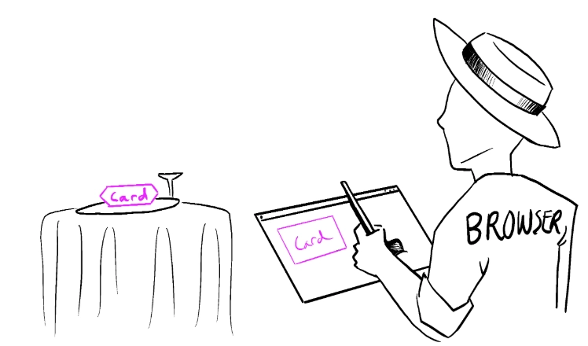

### 렌더링 그리고 커밋

컴포넌트를 화면에 표시하기 이전에 React에서 렌더링을 해야 합니다.

해당 과정의 단계를 이해하면 코드가 어떻게 실행되는지 이해할 수 있고 React 렌더링 동작에 관해 설명하는데 도움이 됩니다.

</br>

주방에서 요리사가 컴포넌트를 재료로 요리를 한다는 예시로 설명을 하겠습니다.

해당 시나리오에서 React는 고객들의 요청을 받고 주문을 가져오는 웨이터입니다.

이 과정에는 UI를 요청하고 제공하는 세 가지 단계가 있습니다.

- **렌더링 트리거**
    - 손님의 주문을 주방으로 전달합니다.
- **컴포넌트 렌더링**
    - 주방에서 주문을 준비합니다.
- **DOM에 커밋**
    - 테이블에 주문한 요리를 내놓습니다.

</br>
</br>

### 1단계: 렌더링 트리거

컴포넌트 렌더링이 일어나는 데에는 두 가지 이유가 있습니다.

- 컴포넌트의 초기 렌더링인 경우
- 컴포넌트의 `state` 가 업데이트된 경우

</br>
</br>

**초기 렌더링**

앱을 시작할 때 초기 렌더링을 트리거해야 합니다.

프레임워크와 샌드박스는 때때로 이 코드를 숨기곤 하지만, 대상 DOM 노드와 함께 `createRoot` 를 호출한 다음 해당 컴포넌트로 `render` 메서드를 호출하면 이 작업이 완료됩니다.

```tsx
// index.js
import Image from './Image.js';
import { createRoot } from 'react-dom/client';

const root = createRoot(document.getElementById('root'))
root.render(<Image />);
```

</br>
</br>

**`State` 업데이트 시 리렌더링**

컴포넌트가 처음으로 렌더링 된 후에는 `set` 함수를 통해 상태를 업데이트하여 추가적인 렌더링을 트리거할 수 있습니다.

컴포넌트의 상태를 업데이트하면 자동으로 렌더링 대기열에 추가됩니다.

</br>
</br>

### 2단계: React 컴포넌트 렌더링

렌더링을 트리거한 후 React는 컴포넌트를 호출하여 화면에 표시할 내용을 파악합니다.

렌더링은 React에서 컴포넌트를 호출하는 것입니다.

- 초기 렌더링에서 React는 루트 컴포넌트를 호출합니다.
- 이후 렌더링에서 React는 `state` 업데이트가 일어나 렌더링을 트리거한 컴포넌트를 호출합니다.

</br>
</br>

**재귀적 단계**

업데이트된 컴포넌트가 다른 컴포넌트를 반환하면 React는 다음으로 해당 컴포넌트를 렌더링하고 해당 컴포넌트도 컴포넌트를 반환하면 반환된 컴포넌트를 다음에 렌더링하는 방식입니다.

중첩된 컴포넌트가 더 이상 없고 React가 화면에 표시되어야 하는 내용을 정확히 알 때까지 이 단계는 계속됩니다.

</br>

다음 예시에서 React는 `Gallery()` 와 `Image()` 를 여러 번 호출합니다.

```tsx
// Gallery.js
export default function Gallery() {
  return (
    <section>
      <h1>Inspiring Sculptures</h1>
      <Image />
      <Image />
      <Image />
    </section>
  );
}

function Image() {
  return (
    
  );
}
```

초기 렌더링 하는 동안 React는 `<section>` , `<h1>` 그리고 3개의 `` 태그에 대한 DOM 노드를 생성합니다.

리렌더링하는 동안 React는 이전 렌더링 이후 변경된 속성을 계산합니다.

다음 단계인 커밋 단계까지는 해당 정보로 아무런 작업도 수행하지 않습니다.

</br>

렌더링은 항상 순수한 계산을 합니다.

- **동일한 입력에는 동일한 출력을 해야합니다.**
    - 동일한 입력이 주어지면 컴포넌트는 항상 동일한 JSX를 반환해야 합니다.
- **이전의 `state` 를 변경해서는 안됩니다.**
    - 렌더링 전에 존재했던 객체나 변수를 변경해서는 안 됩니다.

그렇지 않으면 코드베이스가 복잡해짐에 따라 혼란스러운 버그와 예측할 수 없는 동작이 발생할 수 있습니다.

Strict Mode에서 개발할 때 React는 각 컴포넌트의 함수를 두 번 호출하여 순수하지 않은 함수로 인한 실수를 표면화하는데 도움을 받을 수 있습니다.

</br>
</br>

### 3단계: React가 DOM에 변경사항을 커밋

컴포넌트를 렌더링한 후 React는 DOM을 수정합니다.

- **초기 렌더링의 경우**
    - React는 `appendChild()` DOM API를 사용하여 생성한 모든 DOM 노드를 화면에 표시합니다.
    - `appendChild()` DOM API는 특정 노드의 자식 노드를 추가할 때 사용합니다.
- **리렌더링의 경우**
    - React는 필요한 최소한의 작업을 적용하여 DOM이 최신 렌더링 출력과 일치하도록 합니다.

</br>

React는 렌더링 간에 차이가 있는 경우에만 DOM 노드를 변경합니다.

예를 들어 매초 부모로부터 전달된 다른 `props` 로 다시 렌더링하는 컴포넌트가 있습니다.

`<input>` 에 텍스트를 입력하여 `value` 를 업데이트 하지만 컴포넌트가 리렌더링 될 때 텍스트가 사라지지 않습니다.

```tsx
// Clock.js
export default function Clock({ time }) {
  return (
    <>
      <h1>{time}</h1>
      <input />
    </>
  );
}
```

마지막 단계에서 React가 `<h1>` 의 내용만 새로운 `time` 으로 업데이트하기 때문입니다.

`<input>` 이 JSX에서 이전과 같은 위치로 확인되므로 React는 `<input>` 또는 `value` 를 건드리지 않습니다.

</br>
</br>

**브라우저 페인트**



렌더링이 완료되고 React가 DOM을 업데이트한 후 브라우저는 화면을 다시 그립니다.

이 단계를 브라우저 렌더링이라고 하지만 페이팅이라고도 부릅니다.

</br>