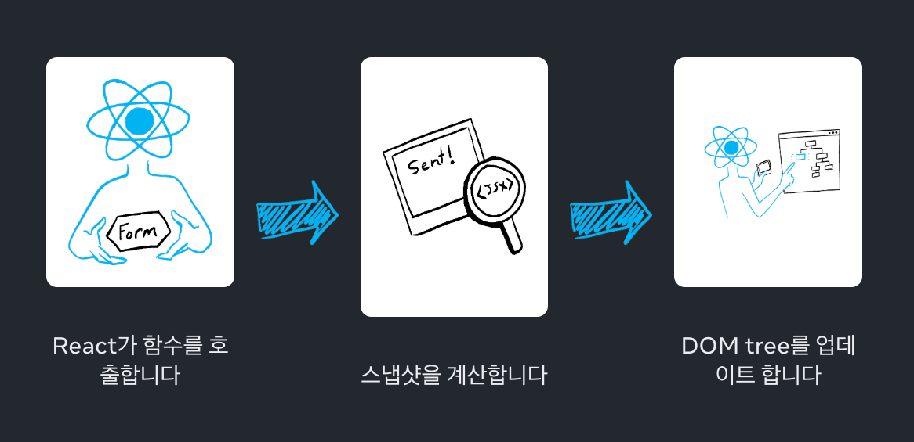
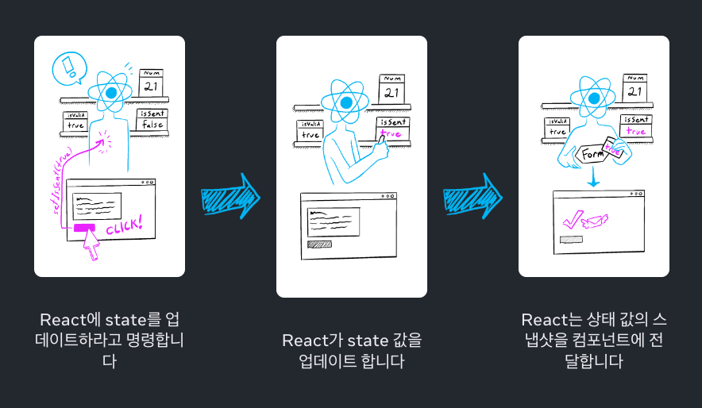

### 스냅샷으로서의 State

`State`  변수는 읽고 쓸 수 있는 일반 자바스크립트 변수처럼 보일 수 있습니다.

하지만 `state` 는 스냅샷처럼 동작합니다.

`state` 변수를 설정하여도 이미 가지고 있는 `state` 변수는 변경되지 않고, 대신 리렌더링이 발동됩니다.

</br>
</br>

### state를 설정하면 렌더링이 동작합니다.

클릭과 같은 사용자 이벤트에 반응하여 사용자 인터페이스가 직접 변경된다고 생각할 수 있습니다.

React에서는 이 멘탈 모델과는 조금 다르게 작동합니다.

인터페이스가 이벤트에 반응하려면 `state` 를 업데이트해야 합니다.

</br>

다음 예시는 send를 누르면 `setIsSent(true)` 는 React에 UI를 다시 렌더링하도록 지시합니다.

```tsx
// App.js
import { useState } from 'react';

export default function Form() {
  const [isSent, setIsSent] = useState(false);
  const [message, setMessage] = useState('Hi!');
  if (isSent) {
    return <h1>Your message is on its way!</h1>
  }
  return (
    <form onSubmit={(e) => {
      e.preventDefault();
      setIsSent(true);
      sendMessage(message);
    }}>
      <textarea
        placeholder="Message"
        value={message}
        onChange={e => setMessage(e.target.value)}
      />
      <button type="submit">Send</button>
    </form>
  );
}

function sendMessage(message) {
  // ...
}
```

버튼을 클릭하면 다음과 같은 일이 발생합니다.

- `onSubmit` 이벤트 핸들러가 실행됩니다.
- `setIsSent(true)` 가 `isSent` 를 `true` 로 설정하고 새로운 렌더링을 큐에 넣습니다.
- React는 새로운 `isSent` 값에 따라 컴포넌트를 다시 렌더링합니다.

</br>
</br>

### 렌더링은 그 시점의 스냅샷을 찍습니다.

렌더링이란 React가 컴포넌트, 즉 함수를 호출한다는 뜻입니다.

해당 함수에서 반환하는 JSX는 시간상 UI의 스냅샷과 같습니다.

`prop`, 이벤트 핸들러, 로컬 변수는 모두 렌더링 당시의 `state` 를 사용해 계산됩니다.

</br>

사진이나 동영상 프레임과 달리 반환하는 UI 스냅샷은 대화형입니다.

여기에는 입력에 대한 응답으로 어떤 일이 일어날지 지정하는 이벤트 핸들러와 같은 로직이 포함됩니다.

그러면 React는 이 스냅샷과 일치하도록 화면을 업데이트하고 이벤트 핸들러를 연결합니다.

결과적으로 버튼을 누르면 JSX의 클릭 핸들러가 발동됩니다.

</br>



React가 컴포넌트를 다시 렌더링할 때

- React가 함수를 다시 호출합니다.
- 함수가 새로운 JSX 스냅샷을 반환합니다.
- 그러면 React가 함수가 반환한 스냅샷과 일치하도록 화면을 업데이트합니다.

</br>

컴포넌트의 메모리로써 `state` 는 함수가 반환된 후 사라지는 일반 변수와 다릅니다.

`state` 는 함수 내부의 지역 변수처럼 스택에 생성됐다가 사라지는 값이 아니라, React가 컴포넌트 인스턴스에 대해 별도로 보관하고 관리하는 저장소에 유지됩니다.

React가 컴포넌트를 호출하면 특정 렌더링에 대한 `state` 의 스냅샷을 제공합니다.

컴포넌트는 해당 렌더링의 `state` 값을 사용해 계산된 새로운 `props` 세트와 이벤트 핸들러가 포함된 UI의 스냅샷을 JSX에 반환합니다.

</br>



다음 예시는 위의 이미지가 어떻게 작동하는지 보여주는 코드입니다.

`setNumber(number + 1)` 를 세 번 호출하므로 카운터가 세 번 증가할 것으로 예상할 수 있습니다.

```tsx
import { useState } from 'react';

export default function Counter() {
  const [number, setNumber] = useState(0);

  return (
    <>
      <h1>{number}</h1>
      <button onClick={() => {
        setNumber(number + 1);
        setNumber(number + 1);
        setNumber(number + 1);
      }}>+3</button>
    </>
  )
}
```

하지만 `number` 는 클릭당 한 번만 증가합니다.

`state` 를 설정하면 다음 렌더링에 대해서만 변경됩니다.

첫 번째 렌더링에서 `number` 는 `0` 이었습니다.

따라서 해당 렌더링의 `onClick` 핸들러에서 `setNumber(number + 1)` 가 호출된 후에도 `number` 의 값은 여전히 `0` 입니다.

</br>

```tsx
<button onClick={() => {
  setNumber(number + 1);
  setNumber(number + 1);
  setNumber(number + 1);
}}>+3</button>
```

이 버튼의 클릭 핸들러가 React에 지시하는 작업은 다음과 같습니다.

- `setNumber(number + 1)`
    - `number` 는 `0` 이므로 `setNumber(0 + 1)` 입니다.
    - React는 다음 렌더링에서 `number` 를 `1` 로 변경할 준비를 합니다.
- `setNumber(number + 1)`
    - `number` 는 `0` 이므로 `setNumber(0 + 1)` 입니다.
    - React는 다음 렌더링에서 `number` 를 `1` 로 변경할 준비를 합니다.
- `setNumber(number + 1)`
    - `number` 는 `0` 이므로 `setNumber(0 + 1)` 입니다.
    - React는 다음 렌더링에서 `number` 를 `1` 로 변경할 준비를 합니다.

</br>

`setNumber(number + 1)` 를 세 번 호출했지만, 이 렌더링에서 이벤트 핸들러에서 `number` 는 항상 `0` 이므로 `state` 를 `1` 로 세 번 설정합니다.

이것이 이벤트 핸들러가 완료된 후 React가 컴포넌트 안의 `number` 를 `3` 이 아닌 `1` 로 다시 렌더링하는 이유입니다.

</br>

코드에서 `state` 변수를 해당 값으로 대입하여 이를 시각화할 수도 있습니다.

이 렌더링에서 `number` `state` 변수는 `0` 이므로 이벤트 핸들러는 다음과 같습니다.

```tsx
<button onClick={() => {
  setNumber(0 + 1);
  setNumber(0 + 1);
  setNumber(0 + 1);
}}>+3</button>
```

</br>

다음 렌더링에서는 `number` 가 `1` 이므로 렌더링의 클릭 핸들러는 다음과 같이 표시됩니다.

```tsx
<button onClick={() => {
  setNumber(1 + 1);
  setNumber(1 + 1);
  setNumber(1 + 1);
}}>+3</button>
```

그렇기 때문에 버튼을 다시 클릭하면 카운터가 `2` 로 설정되고, 다음 클릭 시에는 `3` 으로 설정되는 방식입니다.

</br>
</br>

### 시간 경과에 따른 State

```tsx
import { useState } from 'react';

export default function Counter() {
  const [number, setNumber] = useState(0);

  return (
    <>
      <h1>{number}</h1>
      <button onClick={() => {
        setNumber(number + 5);
        alert(number);
      }}>+5</button>
    </>
  )
}
```

다음 코드에서 버튼을 클릭하면 `0` 이 출력되는 것을 알 수 있습니다.

</br>

```tsx
setNumber(0 + 5);
alert(0);
```

`setNumber` 는 `state` 를 즉시 변경하지 않고 다음 렌더링을 예약하므로, 현재 이벤트 핸들러 안에서는 기존 렌더링의 스냅샷이 그대로 유지됩니다.

따라서 `alert(number)` 는 업데이트된 값이 아니라 이전 값인 `0` 을 출력합니다.

</br>

하지만 경고창에 타이머를 설정하여 컴포넌트가 다시 렌더링 된 후에만 발동하도록 하면 어떨까요?

```tsx
import { useState } from 'react';

export default function Counter() {
  const [number, setNumber] = useState(0);

  return (
    <>
      <h1>{number}</h1>
      <button onClick={() => {
        setNumber(number + 5);
        setTimeout(() => {
          alert(number);
        }, 3000);
      }}>+5</button>
    </>
  )
}
```

`alert` 메서드를 사용하면 현재 렌더링의 `state` 스냅샷을 확인할 수 있습니다.

</br>

```tsx
setNumber(0 + 5);
setTimeout(() => {
  alert(0);
}, 3000);
```

React에 저장된 `state` 는 경고창이 실행될 때 변경되었을 수 있지만 사용자가 상호작용한 시점에 `state` 스냅샷을 사용하는 건 이미 예약이 되어 있습니다.

</br>

`state` 변수의 값은 이벤트 핸들러의 코드가 비동기적이더라도 렌더링 내에서 절대 변경되지 않습니다.

해당 렌더링의 `onClick` 내에서, `setNumber(number + 5)` 가 호출된 후에도 `number` 의 값은 계속 `0` 입니다.

이 값은 컴포넌트를 호출해 React가 UI의 스냅샷을 찍을때 고정된 값입니다.

다시 렌더링하기 전에 최신 `state` 를 읽고 싶다면 `state` 갱신 함수를 사용하면 됩니다.

</br>