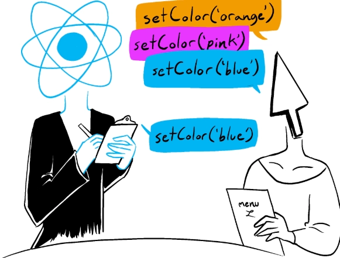
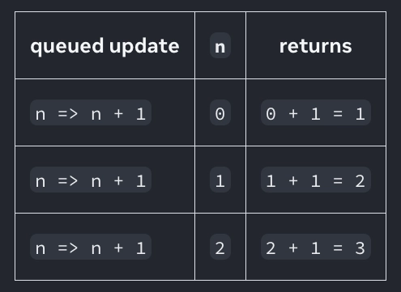
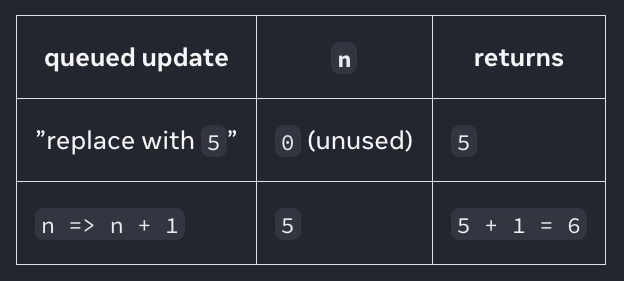
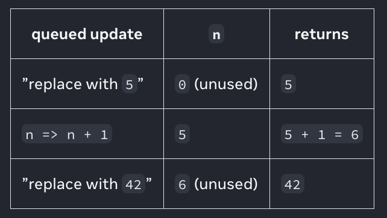

### state 업데이트 큐

`state` 변수를 설정하면 다음 렌더링이 큐에 들어갑니다.

그러나 때에 따라 다음 렌더링을 큐에 넣기 전에, 값에 대해 여러 작업을 수행하고 싶을 때도 있습니다.

이를 위해서는 React가 `state` 업데이트를 어떻게 배치하면 좋을지 이해하는게 좋습니다.

</br>
</br>

### React state batches 업데이트

`setNumber(number +1)` 를 세 번 호출하므로 +3 버튼을 클릭하면 세 번 증가할 것으로 예상할 수 있습니다.

```tsx
import { useState } from 'react';

export default function Counter() {
  const [number, setNumber] = useState(0);

  return (
    <>
      <h1>{number}</h1>
      <button onClick={() => {
        setNumber(number + 1);
        setNumber(number + 1);
        setNumber(number + 1);
      }}>+3</button>
    </>
  )
}
```

하지만 각 렌더링의 `state` 값은 고정되어 있으므로, 첫 번째 렌더링의 이벤트 핸들러의 `number` 값은 `setNumber(1)` 을 몇 번 호출하든 항상 0입니다.

</br>

```tsx
setNumber(0 + 1);
setNumber(0 + 1);
setNumber(0 + 1);
```

하지만 여기에는 한가지 요인이 더 있습니다.

React는 `state` 업데이트를 하기 전에 이벤트 핸들러의 모든 코드가 실행될 때까지 기다립니다.

이 때문에 리렌더링은 모든 `setNumber()` 호출이 완료된 이후에만 일어납니다.

</br>

이는 음식점에서 주문받는 웨이터를 생각해 볼 수 있습니다.



웨이터는 첫 번째 요리를 말하자마자 주방으로 달려가지 않고, 주문이 끝날 때까지 기다렸다가 주문을 변경하고, 심지어 테이블에 있는 다른 사람의 주문도 받습니다.

이렇게 하면 너무 많은 리렌더링이 발생하지 않고도 여러 컴포넌트에서 나온 다수의 `state` 변수를 업데이트할 수 있습니다.

하지만 이는 이벤트 핸들러와 그 안에 있는 코드가 완료될 때까지 UI가 업데이트되지 않는다는 의미이기도 합니다.

</br>

**Batching** 라고도 하는 이 동작은 React 앱을 훨씬 빠르게 실행할 수 있게 해줍니다.

또한 일부 변수만 업데이트된 반쯤 완성된 혼란스러운 렌더링을 처리하지 않아도 됩니다.

React는 클릭과 같은 여러 의도적인 이벤트에 대해 batch를 수행하지 않으며, 각 클릭은 개별적으로 처리됩니다.

React는 안전한 경우에만 batch를 수행하니 안심해도됩니다.

</br>
</br>

### 다음 렌더링 전에 동일한 state 변수를 여러 번 업데이트하기

다음 렌더링 전에 동일한 `state` 변수를 여러 번 업데이트 하고 싶다면 `setNumber(number + 1)` 와 같은 다음 `state` 값을 전달하는 대신, `setNumber(n ⇒ n + 1)` 와 같이 이전 큐의 `state` 를 기반으로 다음 `state` 를 계산하는 함수를 전달할 수 있습니다.

이는 단순히 `state` 값을 대체하는 것이 아니라 React에 `state` 값으로 무언가를 하라고 지시하는 방법입니다.

</br>

```tsx
import { useState } from 'react';

export default function Counter() {
  const [number, setNumber] = useState(0);

  return (
    <>
      <h1>{number}</h1>
      <button onClick={() => {
        setNumber(n => n + 1);
        setNumber(n => n + 1);
        setNumber(n => n + 1);
      }}>+3</button>
    </>
  )
}
```

여기서 `n ⇒ n + 1` 은 **업데이터 함수(updater function)**라고 부릅니다.

이를 `state` 설정자 함수에 전달 할때,

- React는 이벤트 핸들러의 다른 코드가 모두 실행된 후에 이 함수가 처리되도록 큐에 넣습니다.
- 다음 렌더링 중에 React는 큐를 순회하여 최종 업데이트된 `state` 를 제공합니다.

</br>

```tsx
setNumber(n => n + 1);
setNumber(n => n + 1);
setNumber(n => n + 1);
```

React가 이벤트 핸들러를 수행하는 동안 여러 코드를 통해 작동하는 방식은 다음과 같습니다.

- `setNumber(n => n + 1)`
    - `n => n + 1` 함수를 큐에 추가합니다.
- `setNumber(n => n + 1)`
    - `n => n + 1` 함수를 큐에 추가합니다.
- `setNumber(n => n + 1)`
    - `n => n + 1` 함수를 큐에 추가합니다.

</br>

다음 렌더링 중에 `useState` 를 호출하면 React는 큐를 순회합니다.

이전 `number` `state` 는 `0` 이었으므로 React는 이를 첫 번째 업데이터 함수에 `n` 인수로 전달합니다.

그런 다음 React는 이전 업데이터 함수의 반환 값을 가져와서 다음 업데이터 함수에 `n` 으로 전달하는 식으로 반복합니다.



React는 `3` 을 최종 결과로 저장하고 `useState` 에서 반환합니다.

즉, 이벤트 핸들러 안에서는 업데이트 요청을 큐에 저장만 하고, 이벤트 핸들러가 끝난 뒤 렌더링 과정에서 큐를 순차적으로 처리합니다.

</br>
</br>

### state를 교체한 후 업데이트하면 어떻게 되나요?

다음 코드에서 다음 렌더링에서 `number` 는 어떻게 될까요?

```tsx
<button onClick={() => {
  setNumber(number + 5);
  setNumber(n => n + 1);
}}>
```

이 이벤트 핸들러가 React에 지시하는 작업은 다음과 같습니다.

- `setNumber(number + 5)`
    - `number` 는 `0` 이므로 `setNumber(0 + 5)` 입니다.
    - React는 큐에 `5` 로 바꾸기를 추가합니다.
- `setNumber(n ⇒ n + 1)`
    - `n ⇒ n +1` 는 업데이터 함수입니다.
    - React는 해당 함수를 큐에 추가합니다.

</br>

다음 렌더링하는 동안 React는 `state` 큐를 순회합니다.



React는 `6` 을 최종 결과로 저장하고 `useState` 에서 반환합니다.

여기서 `setState(5)` 가 실제로는 `setState(n ⇒ 5)` 처럼 동작하지만 `n` 은 사용되지 않는다는것을 알 수 있습니다.

</br>
</br>

### 업데이트 후 state를 바꾸면 어떻게 되나요?

다음 렌더링에서 `number` 는 어떻게 될까요?

```tsx
<button onClick={() => {
  setNumber(number + 5);
  setNumber(n => n + 1);
  setNumber(42);
}}>
```

이 이벤트 핸들러를 실행하는 동안 React가 이 코드를 통해 작동하는 방식은 다음과 같습니다.

- `setNumber(number + 5)`
    - `number` 는 `0` 이므로 `setNumber(0 + 5)` 입니다.
    - React는 `5` 로 바꾸기를 큐에 추가합니다.
- `setNumber(n ⇒ n + 1)`
    - `n ⇒ n + 1` 는 업데이터 함수입니다.
    - React는 이 함수를 큐에 추가합니다.
- `setNumber(42)`
    - React는 `42` 로 바꾸기를 큐에 추가합니다.

</br>

다음 렌더링하는 동안, React는 `state` 큐를 순회합니다.



그럼 다음 React는 `42` 를 최종 결과로 저장하고 `useState` 에서 반환합니다.

</br>

요약하자면, `setNumber` `state` 설정자 함수에 전달할 내용은 다음과 같이 생각할 수 있습니다.

- 업데이터 함수가 큐에 추가됩니다.
- 다른 값은 큐에 `5` 로 바꾸기를 추가하며, 이전 계산 결과와 관계없이 해당 값으로 덮어씌웁니다.

</br>
</br>

### 명명 규칙

업데이터 함수 인수의 이름은 해당 `state` 변수의 첫 글자로 지정하는 것이 일반적입니다.

```tsx
setEnabled(e => !e);
setLastName(ln => ln.toUpperCase());
setFriendCount(fc => fc * 2);
```

좀 더 자세한 코드를 선호하는 경우 `setEnabled(enabled => !enabled)` 와 같이 전체 `state` 변수 이름을 반복하거나, `setEnabled(prevEnabled => !prevEnabled)` 와 같은 접두사를 사용하는 것이 널리 사용되는 규칙입니다.

</br>