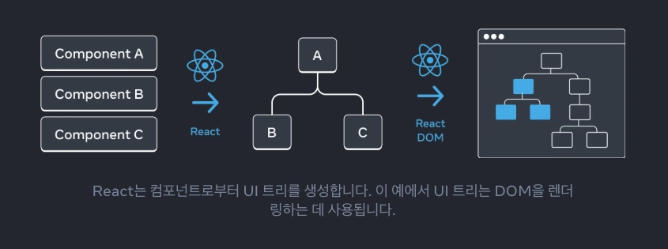
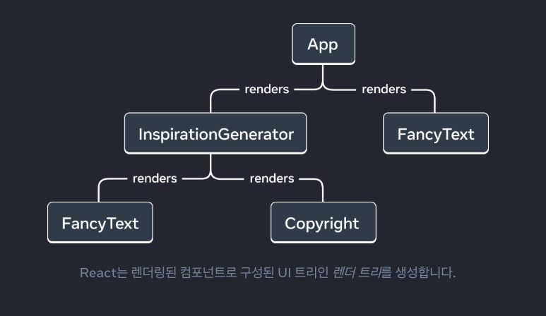
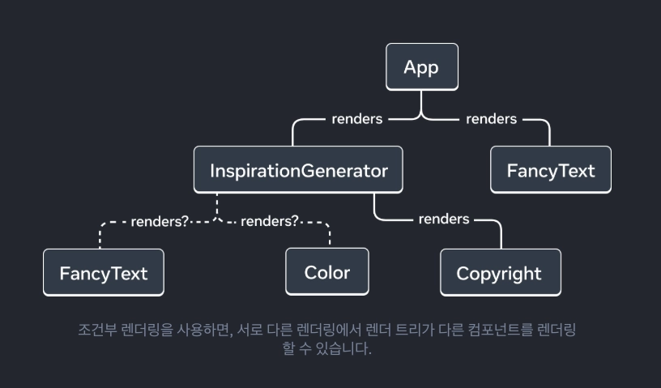
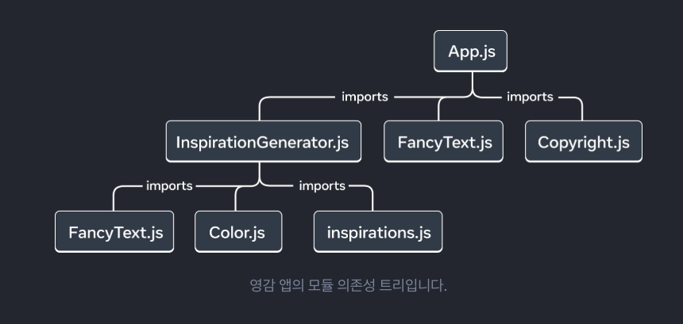

</br>

`App` 컴포넌트 제외 코드가 필요하시다면 [React Docs](https://ko.react.dev/learn/understanding-your-ui-as-a-tree)를 활용해주세요 !

</br>

### 트리로서의 UI

React 앱은 서로 중첩된 많은 컴포넌트로 구성되어 있습니다.

React와 많은 다른 UI 라이브러리는 UI를 트리로 모델링합니다.

애플리케이션을 트리로 생각하면 컴포넌트 간의 관계를 이해하는 데 도움이 됩니다.

</br>

트리는 요소 사이의 관계 모델이며 UI는 종종 트리 구조를 사용하여 표현됩니다.

예를 들어, 브라우저는 HTML(DOM)과 CSS(CSSOM)을 모델링하기 위해 트리 구조를 사용합니다.

모바일 플랫폼도 뷰계층 구조를 나타내는 데 트리를 사용합니다.



브라우저와 모바일 플랫폼처럼 React도 React 앱의 컴포넌트 간의 관계를 관리하고 모델링하기 위해 트리 구조를 사용합니다.

트리는 React 앱에서 데이터가 흐르는 방식과 렌더링 및 앱 크기를 최적화하는 방법을 이해하는 데 유용한 도구입니다.

</br>
</br>

### 렌더 트리

컴포넌트의 주요 특징은 다른 컴포넌트의 컴포넌트를 구성하는 것입니다.

컴포넌트를 중첩하면 부모 컴포넌트와 자식 컴포넌트의 개념이 생기며, 각 부모 컴포넌트는 다른 컴포넌트의 자식이 될 수 있습니다.

React 앱을 렌더링할 때, 이 관계를 렌더 트리라고 알려진 트리로 모델링할 수 있습니다.

</br>

아래 코드는 명언을 렌더링하는 React 앱입니다.

```tsx
// App.js
import FancyText from './FancyText';
import InspirationGenerator from './InspirationGenerator';
import Copyright from './Copyright';

export default function App() {
  return (
    <>
      <FancyText title text="Get Inspired App" />
      <InspirationGenerator>
        <Copyright year={2004} />
      </InspirationGenerator>
    </>
  );
}
```

</br>

예시 앱에서, 다음과 같은 렌더 트리를 구성할 수 있습니다.



트리는 노드로 구성되어 있으며, 각 노드는 컴포넌트를 나타냅니다.

`App`, `FancyText`, `Copyright` 등은 모두 트리의 노드입니다.

</br>

React 렌더 트리에서 루트 노드는 앱의 Root 컴포넌트입니다.

이 경우 루트 컴포넌트는 `App` 컴포넌트이며 React가 렌더링하는 첫 번째 컴포넌트입니다.

트리의 각 화살표는 부모 컴포넌트에서 자식 컴포넌트를 가리킵니다.

</br>

렌더 트리는 React 앱의 단일 렌더링을 나타냅니다.

조건부 렌더링을 사용하면 부모 컴포넌트가 전달된 데이터에 따라 다른 자식을 렌더링할 수 있습니다.

</br>

우리는 앱을 업데이트하여 명언이나 색상을 조건부로 렌더링할 수 있습니다.

```tsx
// InspirationGenerator.js
import { useState } from 'react';
import inspirations from './inspirations';
import FancyText from './FancyText';
import Color from './Color';

export default function InspirationGenerator({children}) {
  const [index, setIndex] = useState(0);
  const inspiration = inspirations[index];
  const next = () => setIndex((index + 1) % inspirations.length);

  return (
    <>
      <p>Your inspirational {inspiration.type} is:</p>
      {inspiration.type === 'quote'
      ? <FancyText text={inspiration.value} />
      : <Color value={inspiration.value} />}

      <button onClick={next}>Inspire me again</button>
      {children}
    </>
  );
}
```

해당 예시에서, `inspiration.type` 이 무엇이냐에 따라 `<FancyText>` 또는 `<Color>` 를 렌더링할 수 있습니다.

렌더 트리는 각 렌더링마다 다를 수 있습니다.

</br>



렌더 트리가 렌더링 단계마다 다를 수 있지만, 이 트리는 React 앱에서 최상위 컴포넌트와 리프 컴포넌트가 무엇인지를 식별하는 데 도움이 됩니다.

최상위 컴포넌트는 루트 컴포넌트에 가장 가까운 컴포넌트이며, 그 아래의 모든 컴포넌트의 렌더링 성능에 영향을 미치며, 가장 복잡성이 높습니다.

리프 컴포넌트는 트리의 맨 아래에 있으며 자식 컴포넌트가 없으며 자주 다시 렌더링 됩니다.

</br>

컴포넌트 카테고리를 식별하는 것은 앱의 데이터 흐름과 성능을 이해하는 데 유용합니다.

</br>
</br>

### 렌더 트리에 HTML 태그는 어디에 있나요?

위의 렌더 트리이미지에서 각 컴포넌트가 렌더링하는 HTML 태그에 대한 언급이 없음을 알 수 있습니다.

이는 렌더 트리가 React 컴포넌트로만 구성되어 있기 때문입니다.

</br>

UI 프레임워크로서 React는 플랫폼에 독립적입니다.

react.dev에서는 HTML 마크업을 UI 기본 요소로 사용하는 웹을 렌더링하는 예시를 보여줍니다.

하지만 React 앱은 모바일이나 데스크톱 플랫폼에 렌더링 될 수 있으며, 이러한 플랫폼은 UIView나 FrameworkElement와 같은 다른 UI 기본 요소를 사용할 수 있습니다.

</br>

이러한 플랫폼 UI 기본 요소는 React의 일부가 아닙니다.

React 렌더 트리는 앱이 렌더링되는 플랫폼에 관계없이 React 앱에 대한 통찰력을 제공할 수 있습니다.

</br>
</br>

### 모듈 의존성 트리

트리로 모델링 할 수 있는 React 앱의 다른 관계는 앱의 모듈 의존성입니다.

컴포넌트를 분리하고 로직을 별도의 파일로 분리하면 컴포넌트, 함수 또는 상수를 내보내는 JS 모듈을 만들 수 있습니다.

</br>

모듈 의존성 트리의 각 노드는 모듈이며, 각 가지는 해당 모듈의 `import` 문을 나타냅니다.

지금까지 살펴봤던 `InspirationGenerator` 앱의 모듈 의존성 트리는 다음과 같습니다.



트리의 루트 노드는 루트 모듈이며, 엔트리 포인트 파일이라고도 합니다.

일반적으로 루트 컴포넌트를 포함하는 모듈입니다.

</br>

동일한 앱의 렌더 트리와 비교하면 유사한 구조가 있지만 다음과 같은 차이점이 존재합니다.

- 트리를 구성하는 노드는 컴포넌트가 아닌 모듈을 나타냅니다.
- `inspirations.js`와 같은 컴포넌트가 아닌 모듈도 트리에 나타납니다. 
렌더 트리는 컴포넌트만 캡슐화합니다.
- `Copyright.js`가 `App.js` 아래에 나타나지만, 렌더 트리에서 `Copyright` 컴포넌트는 `InspirationGenerator`의 자식으로 나타납니다.
이는 `InspirationGenerator`가 자식 `props`로 JSX를 허용하기 때문에, `Copyright`를 컴포넌트로 렌더링하지만 모듈을 가져오지는 않기 때문입니다.

</br>

의존성 트리는 React 앱을 실행하는 데 필요한 모듈을 결정하는 데 유용합니다.

React 앱을 프로덕션용으로 빌드할 때, 일반적으로 클라이언트에 제공할 모든 필요 JavaScript를 번들로 묶는 빌드 단계가 있습니다.

이 작업을 담당하는 도구를 번들러라고 하며, 번들러는 의존성 트리를 사용하여 포함해야 할 모듈을 결정합니다.

</br>

앱이 커짐에 따라 번들 크기도 커집니다.

번들 크기가 커지면 클라이언트가 다운로드하고 실행하는 데 드는 비용도 커집니다. 

또한 UI가 그려지는 데 시간이 지체될 수 있습니다. 

앱의 의존성 트리를 파악하면 이러한 문제를 디버깅하는 데 도움이 될 수 있습니다.

</br>