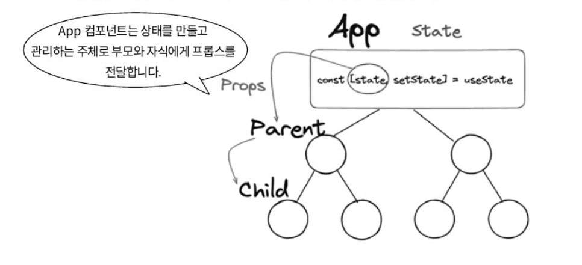
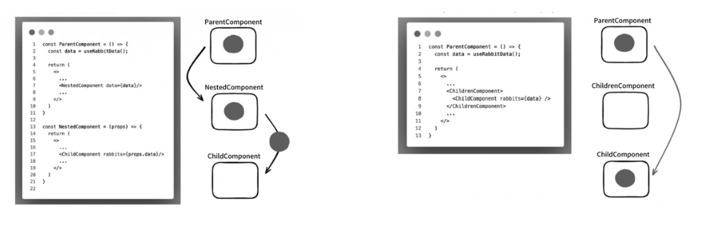
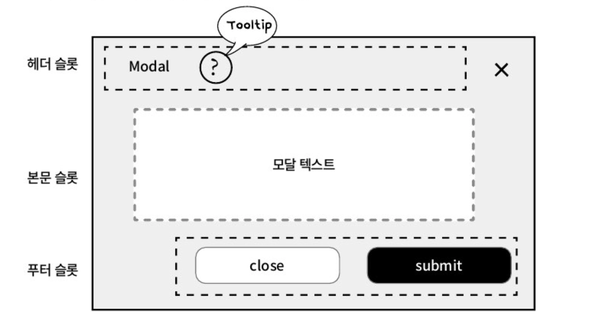

### 리액트의 prop와 컴포넌트 패턴을 돌아봐야 하는 이유

Props는 부모에서 자식으로 데이터를 넘기는 리액트의 핵심 메커니즘임

이때 props는 컴포넌트의 예측 가능성을 보장하기 위해 불변성을 가져야한다는 핵심 원칙이 존재함

더 나아가, 컴파운드 컴포넌트와 Render props 등 props를 활용한 고급 컴포넌트 패턴들의 차이점과 각각의 장단점을 체계적으로 이해하게 되면, props를 데이터 전달 수단이 아닌 컴포넌트의 공개 API 설계 도구로 바라보는 관점을 갖게 됨

→ props를 어떤 형태로 노출할 것인가?

</br>
</br>

### 리액트의 프롭스와 상태

프롭스는 애플리케이션의 루트 컴포넌트에서 생성될 수 있으며 계층 구조의 어느 부모 컴포넌트에서도 생성되어 하위 컴포넌트로 전달될 수 있음

→ 관리 주체가 부모 컴포넌트이기에 자식 컴포넌트에서는 프롭스를 변경하지 못함

</br>



Props를 전달받는 자식 컴포넌트는 이 props를 직접 수정할 수 없지만, 자식 컴포넌트도 자기만의 state를 만들 수 있음

그 state를 자기 자식 컴포넌트에게 내려주면, 자식 컴포넌트 입장에서는 props가 됨

</br>
</br>

#### Props의 불변성

리액트에서 프롭스의 불변성을 강조하는 이유는 다음과 같음

- **예측 가능한 데이터 흐름**
    - 소유한 컴포넌트에서 시작되므로 추적이 용이해짐
- **예측 가능한 컴포넌트의 동작**
    - 같은 props가 주어지면 항상 같은 결과를 렌더링
- **유리한 성능 최적화**
    - 컴포넌트 렌더링의 최적화를 위해 props의 변경을 추적할 때 전달받은 props가 컴포넌트 내부에서 변경되면 안됨

</br>

Props는 자식 컴포넌트 입장에서는 데이터 관리 주체가 어디인지 알지 못함

```jsx
// 부모 컴포넌트
const GoldenRabbitApp = () => {
	const [goldieInfo, setGoldieInfo] = useState({
		name: "goldie",
		age: "16",
		status: "hide"
	});
	
	const updateStatus = () => {
		setGoldieInfo({
			...goldieInfo,
			status: "reveal"
		});
	};
	
	return (
		<div>
			<h1>{goldieInfo.status === "hide"
				? "Where is Golden Rabbit?"
				: "You discovered Golden Rabbit!"
				}
			</h1>
			<GoldenRabbitButton onClick={updateStatus} hide={goldieInfo.status === "hide"} />
		</div>
	);
};

// 자식 컴포넌트
const GoldenRabbitButton = ({ onClick, hide }) => {
	return (
		<button onClick={onClick} disabled={!hide}>
			Click to reveal the Golden Rabbit
		</button>
	);
};
```

다음과 같이 자식 컴포넌트에서의 버튼 클릭 이벤트를 통해 상탯값을 변경하길 원한다면 업데이트 함수를 props로 전달해야함

</br>

```jsx
const updateStatus = () => {
	setGoldieInfo({
		...goldieInfo,
		status: "reveal"
	});
}
```

부모 컴포넌트에서 정의한 `updateStatus()` 함수를 보면 내부에서 `setState()` 를 호출할 때 스프레드 연산자를 사용하는 것을 볼 수 있음

→ `setGoldieInfo()` 함수를 호출할 때마다 새로운 객체 레퍼런스를 생성하여 일부 속성만 변경하는 것이 아닌 래퍼런스 자체를 교체

</br>

객체와 배열의 불변성을 유지하는 올바른 방법을 더 알아보겠음

```jsx
const [frineds, setFriends] = useState([
	{ id: 1, name: "Flopsy" },
	{ id: 2, name: "Mopsy" },
]);

// 배열 불변성 유지
const addFriend = (name) => {
	const newFriend = { id: Date.now(), name };
	// 이전 friends 배열을 복사하고 새 친구 객체를 추가하여 새로운 배열 생성
	setFriends([...friends, newFriend]);
};

// 배열 및 내부 객체 불변성 유지
const renameFriend = (id, newName) => {
	setFriends(
		friends.map((friend) => {
			if (friend.id === id) {
				// 변경 대상 객체를 찾으면, 이전 객체를 복사하고 name만 업데이트하여 새로운 객체 반환
				return { ...friend, name: newName };
			}
			return friend;
		})
	);
};
```

이처럼 props의 불변성을 유지하는 것은 애플리케이션의 데이터 흐름을 명확하고 예측 가능하게 만듦

상태를 변경하는 함수를 props로 전달하는 패턴은 부모와 자식 컴포넌트 간의 결합도를 낮추고 각 컴포넌트의 역할을 명확히 구분함

→ 부모는 자식에게 함수를 적절한 때 호출해달라고 위임만 할 뿐

</br>
</br>

#### props와 attribute

리액트 JSX에서 사용하는 props는 HTML의 속성과 문법적으로 유사해 보이지만, 개념적으로는 명확한 차이가 있음

→ `` 에서 `src` , `alt` 는 HTML 이미지 태그의 속성, 리액트에서는 같은 문법을 사용해도 props로 취급됨

HTML 엘리먼트의 props는 HTML 표준에 따라 이름과 타입이 정해져 있고, 렌더링 시 실제 DOM 속성으로 변환됨

</br>

커스텀 컴포넌트에서는 프롭스를 자유롭게 정의할 수 있음

문자열, 숫자뿐 아니라 객체, 배열, 함수 등 모든 자바스크립트 값을 전달할 수 있어 HTML 속성보다 훨씬 유연함

HTML 속성과 DOM 프로퍼티의 차이는 다음과 같음

- **HTML 속성**
    - HTML 문서에 작성된 정적인 값
        - `value = “initialValue”`
- **DOM 프로퍼티**
    - 자바스크립트로 접근 가능한 DOM 객체의 값
        - `inputElement.value`
    - 리액트의 props는 대부분 DOM 프로퍼티에 대응
        - `<input value={state} >` → `value` 프로퍼티를 직접 제어

</br>

JSX의 프롭스는 컴파일 시 `React.createElement()` 의 인자로 변환되어 프롭스 객체에 담김

순수 HTML 속성은 브라우저가 HTML을 파싱해 DOM을 생성할 때 직접 설정하는 값이기에 `<button>` 같은 HTML 엘리먼트에 전달하는 프롭스는 리액트가 정한 타입 규칙을 따라야 함

```jsx
interface CustomAttributeProps {
  // 의도적으로 number 타입으로 정의
	disabled: number;
};

const CustomAttribute = ({
	disabled
}: CustomAttributeProps) => {
	return (
		<button
			disabled={disabled}
		>
			attribute의 속성은 임의로 변경할 수 없습니다.
		</button>
	)
}
```

예시 코드처럼 개발자가 임의의 타입으로 값을 전달시 에러가 발생함

</br>

JSX로 작성된 네이티브 HTML 요소의 속성 타입은 리액트의 `@types/react` 내에 별도로 정의되어 관리됨

```jsx
interface ButtonHTMLAttributes<T> extends HTMLAttributes<T> {
	disabled? : boolean | undefined;
	form?: string | undefined;
	formAction?:
	// .. 이하 생략
}
```

</br>

`ButtonHTMLAttributes` 가 확장하는 `HTMLAttributes` 의 정의 부분은 다음과 같이 나눠짐

```jsx
interface HTMLAttributes<T> extends AriaAttributes, DOMAttributes<T> {
	// React-specific Attributes
	defaultChecked?: boolean | undefined;
	defaultValue?: string | number | readonly string[] | undefined;
	suppressContentEditableWarning?: boolean | undefined;
	suppressHydrationWarning?: boolean | undefined;
	
	// Standard HTML Attributes
	accessKey?: string | undefined;
	autoFoucs?: boolean | undefined;
	className?: string | undefined;
	// ... 이하 생략 ...
}
```

자바스크립트의 예약어와 충돌 방지를 위해 다음과 같음 대체 이름을 사용함

- `class` → `className`
- `for` - > `htmlFor`

</br>
</br>

### Props 자료형 검증

컴포넌트가 기대하는 타입과 다른 타입의 props를 받게 되면, 예상치 못한 동작이나 런타임 오류로 이어질 수 있음

이를 해결하고자 리액트 개발에서는 이를 위한 두 가지 접근 방식이 있음

- **prop-types 라이브러리**
- **TypeScript**

</br>
</br>

#### 컴파일 타임 검증을 위한 TypeScript

리액트 19버전부터는 런타임 타입 체킹이 종료되어 prop-types 라이브러리는 더 이상 권장하지 않는 방식이 되었음

→ prop-types 라이브러리는 런타임에 타입을 검증, 잘못된 타입이 전달되어도 사전에 차단하지 못 함

</br>

현재는 컴파일 타임 검증 방식인 TypeScript의 사용이 선호

→ 빌드 시점에 타입 불일치를 에러로 발생시켜 잘못된 사용 자체를 사전에 방지

```tsx
import { ReactNode } from 'react';

interface GoldenTabbitDetailsProps {
	name: string;
	age: number;
	isHidden?: boolean;
}

function GoldenRabbitDetails({
	name,
	age,
	isGidden = false,
}: GoldenTabbitDetailsProps) {
	return (
		<div>
			<h1>{name}</h1>
			<p>AgeL {age}</p>
			<p>Status: {isHidden ? "Hidden" : "Visible"}</p>
		</div>
	);
}

// children의 타입이 ReactNode인 이유는 JSX 사이에 들어갈 수 있는 거의 모든 값을 받아야하기 때문
// 즉, ReactNode는 React가 렌더링 가능한 값들을 모두 포괄하는 유니온 타입
interface GoldenRabbitDetailsWithChildrenProps {
	name: string;
	age: number;
	isHidden?: boolean;
	children: ReactNode;
}

// 함수 매개변수의 기본값 설정도 가능함
function GoldenTabbitDetailsWithChildren({
	name,
	age,
	isHidden = false,
	children,
}: GoldenRabbitDetailsWithChildrenProps) {
	return (
		<div>
			<h1>{name} (with children)</h1>
      <p>Age: {age}</p>
      <p>Status: {isHidden ? "Hidden" : "Visible"}</p>
      <div>{children}</div>
    </div>
  );
}

function GoldenRabbitApp() {
  return (
    <div>
      <GoldenRabbitDetails name="Goldie" age={3} />
      <GoldenRabbitDetails name="Silvie" age={parseInt("four")} isHidden={true} />
      <GoldenRabbitDetailsWithChildren name="Fluffy" age={1}>
        <span>This is a child element</span>
      </GoldenRabbitDetailsWithChildren>
    </div>
  );
}
```

</br>

위 코드에서 `children` 의 타입이 `ReactNode` 인 이유는 다음과 같음

```tsx
interface GoldenRabbitDetailsWithChildrenProps {
	name: string;
	age: number;
	isHidden?: boolean;
	children: ReactNode;
}
```

JSX 사이에 들어갈 수 있는 거의 모든 값을 받아야하기 때문

→ `ReactNode` 는 React가 렌더링 가능한 값들을 모두 포괄하는 유니온 타입

</br>

React 타입 정의인 `@types/react` 를 보면 ReactNode 의 실제 정의는 다음과 같음

```tsx
type ReactNode =
  | ReactElement                    // <div />, <Component /> 같은 JSX 엘리먼트
  | string                          // "텍스트"
  | number                          // 숫자
  | bigint                          // BigInt 값 (예: 100n)
  | Iterable<ReactNode>             // 배열, Set, 제너레이터 등 모든 iterable (이전 ReactFragment를 일반화)
  | ReactPortal                     // createPortal로 만든 포털
  | boolean                         // true/false (렌더링은 안 되지만 허용)
  | null                            // null
  | undefined                       // undefined
  | DO_NOT_USE_OR_YOU_WILL_BE_FIRED_EXPERIMENTAL_REACT_NODES[
      keyof DO_NOT_USE_OR_YOU_WILL_BE_FIRED_EXPERIMENTAL_REACT_NODES
    ]                               // React 내부 실험적 노드 타입 (사용 금지)
  | Promise<AwaitedReactNode>;      // 비동기 컴포넌트 반환값 (React 19 / RSC 지원)
```

즉, JSX 안에 들어갈 수 있는 모든 합법적인 값의 합집합임

</br>
</br>

### Props를 사용하는 Component Pattern

`Props` 로 컴포넌트 아키텍처를 설계하고 재사용성을 극대화하는 핵심 도구로 활용할 수 있음

알아볼 패턴은 다음과 같음

- **컴포넌트 함성**
- **children props의 다양한 활용법**
- **렌더 프롭스**
- **슬롯 패턴**
- **컴파운드 컴포넌트 패턴 등**

</br>
</br>

#### 컴포넌트 합성과 상속, 그리고 HOC

리액트는 강력한 합성 모델을 가지며, 컴포넌트 간 재사용은 상속보다 합성을 사용할 것을 권장함

- **합성 - Composition**
    - 여러 개의 작은 컴포넌트를 조립하여 더 큰 컴포넌트를 만드는 방식
    - 컴포넌트 간의 결합도를 낮춤
    - 각 컴포넌트의 독립성과 재사용성을 높여 유연하고 확장성 있는 구조를 만듦
- **상속 - Inheritance**
    - 자식 컴포넌트가 부모 컴포넌트의 기능을 물려받아 확장하는 방식
    - 부모와 자식 간에 강한 결합을 만들어 코드의 유연성을 해침
    - `props` 가 여러 계층을 거치며 복잡하게 얽히는 문제를 야기

</br>

합성의 가장 기본적이고 흔한 형태는 Containment 패턴임

다른 컴포넌트를 품을 수 있는 범용적인 컨테이너 컴포넌트를 만드는 기법으로, 리액트의 특별한 `props` 인 `children` 을 통해 구현 됨

```tsx
import { ReactNode, CSSProperties } from 'react';

interface HighlightBoxProps {
	backgroundColor?: string;
	icon?: ReactNode;
	children: ReactNode;
}

function HighlightBoxProps({
	backgroundColor = '#f0f0f0',
	icon,
	children,
}: HighlightBoxProps) {
	const boxStyle: CSSProperties = {
		backgroundColor,
		padding: '16px',
		borderRadius: '8px',
		display: 'flex',
		alighItems: 'flex-start',
		gap: '12px',
	};
	
	const iconStyle: CSSProperties = {
		fontSize: '20px',
		flexShrink: 0,
	};
	
	return (
		<div style={boxStyle}>
			{icon && <span style={iconStyle}>{icon}</span>}
			<div>
				{children}
			</div>
		</div>
	);
}

export default ContainmentHighlightApp() {
	return (
		<div>
			<h1>Containment 패턴 - HighlightBox 예시</h1>
			
			<HighlightBox>
				<p>이것은 기본 강조 상자입니다. 약간의 배경색이 적용됩니다.</p>
			</HighlightBox>
			
			<HighlightBox backgroundColor="#e0f7fa" icon="💡">
				<h4>아이디어 제안</h4>
        <p>이 섹션은 중요한 제안 사항을 담고 있습니다.</p>
        <ul>
          <li>첫 번째 제안</li>
          <li>두 번째 제안</li>
        </ul>
      </HighlightBox>
    </div>
  );
}
```

`HighlightBox` 컴포넌트는 어떤 내용이든 담을 수 있는 범용적인 컨테이너 역할을 수행하고 있음

</br>

리액트에서 코드 재사용을 위한 또 다른 패턴은 HOC임

→ 컴포넌트를 인자로 받아 새로운 컴포넌트를 반환하는 함수임

합성이 여러 컴포넌트를 조립하는 방식이라면, HOC는 컴포넌트 자체의 로직을 재사용하고 강화하는 데 중점을 둠

```tsx
import { ComponeneType } from 'react';

interface WithLoadingProps {
	isLoading: boolean;
}

function withLoadingSpinner<P extends object>(
  WrappedComponent: ComponentType<P>
) {
	function ComponentWithLoadingSpinner({
		isLoading,
		...props
	}: P & WithLoadingProps) {
		if (isLoading) {
			return <div>로딩 중...</div>
		}
		
		return <WrappedComponent {...(props as P)} />;
	}
	
	const wrappedComponentName = WrappedComponent.displayName || WrappedComponent.name || 'Component';
	
	ComponentWithLoadingSpinner.displayName = `withLoadingSpinner(${wrappedComponentName})`;
	
	return ComponentWithLoadingSpinner;
}

interface UserProfileProps {
	userId: string;
	name: string;
	email: string;
}

function UserProfile({ userId, name, email }: UserProfileProps) {
  return (
    <div>
      <h3>유저 프로필 (ID: {userId})</h3>
      <p>이름: {name}</p>
      <p>이메일: {email}</p>
    </div>
  );
}
```

</br>

```tsx
// HOC를 적용한 컴포넌트
const UserProfileWithLoading = withLoadingSpinner(UserProfile);

export default function HOCExampleApp() {
  const [loading, setLoading] = useState(true);
  const [userData, setUserData] = useState<UserProfileProps | null>(null);

  useEffect(() => {
    setTimeout(() => {
      setUserData({
        userId: "user-123",
        name: "단테",
        email: "dante@example.com",
      });
      setLoading(false);
    }, 2000);
  }, []);

  return (
    <div>
      {/* 다음 코드랑 같음 
		  <UserProfileWithLoading isLoading={loading} userId="user-123" name="단테" email="dante@example.com" /> */}
      <UserProfileWithLoading isLoading={loading} {...userData} />
    </div>
  );
}
```

다음과 같이 HOC를 `UserProfile` 컴포넌트에 적용하여 로딩 기능이 추가된 `UserProfileWithLoading` 이라는 새 컴포넌트를 생성함

→ HOC를 사용하면 로딩 처리와 같은 공통 로직을 여러 컴포넌트에 걸쳐 쉽게 재사용할 수 있음

</br>
</br>

#### 중첩 컴포넌트와 children, props drilling

중첩 컴포넌트는 부모 리액트 컴포넌트 내부에서 직접 JSX로 선언되는 컴포넌트임

중첩 컴포넌트의 이점은 유저 입장에서 JSX 구조만 봐도 관계를 이해하기 쉬움

```tsx
function ChildComponent() {
	return (
		<div>Child component </div>
	)
}

const NestedComponent = () => {
	return (
		<>
			<ChildComponent />
		</>
	)
}
```

</br>

다음은 `props.children` 을 사용하는 합성 패턴 예시 코드임

```tsx
function ChildrenComponent({children}) {
	return (
		<>
			{children}
		</>
	)
}
```

</br>

마지막으로 두 패턴을 함께 사용하는 컴포넌트임

```tsx
function ChildComponent() {
  return (
    <div>Child component </div>
  )
}

const NestedComponent = () => {
  return (
    <>
      <div>중첩 컴포넌트</div>
      <ChildComponent /> 
    </>
  )
}

function ChildrenComponent({children}) {
  return (
    <>
      <div>ChildrenComponent</div>
      {children}
    </>
  )
}

function MyApp() {
	return (
		<div>
		  {/* 합성 */}
			<ChildrenComponent>
				<ChildComponent key="I'm children" />
			</ChildrenComponent>
			{/* 중첩 */}
			<NestedComponent></NestedComponent>
		</div>
	);
}
```

</br>

다음은 두 패턴을 함께 사용하여 나온 변환 결과 코드임

```tsx
// MyApp의 JSX를 바벨로 변환한 결과
_jsxs("div", {
  children: [
    // 합성 방식 사용
    _jsx(ChildrenComponent, {
      children: _jsx(ChildComponent, {})
    }),
    // 중첩 방식 사용
    _jsx(NestedComponent, {})
  ]
});

// NestedComponent의 변환 결과
_jsxs("div", {
  children: [
    _jsx("h3", {}),
    // 중첩 방식 사용
    _jsx(ChildComponent, {})
  ]
});
```

합성 방식을 사용한 부분은 다음과 같음

- `MyApp` 이 `<ChildComponent>` 를 먼저 리액트 엘리먼트로 만듦
- 생성된 엘리먼트를 `ChildrenComponent` 의 `children` `props` 로 전달
- `ChildrenComponent` 는 그저 전달받은 엘리먼트를 렌더링할 뿐
- 그렇기에 `children` `props` 자체가 변하지 않았다면, `ChildComponent` 는 리렌더링되지 않음
- 렌더링의 주체는 `MyApp`

</br>

중첩 방식을 사용한 부분은 다음과 같음

- `MyApp` 이 `<NestedComponent />` 엘리먼트만 생성
- `ChildComponent` 엘리먼트를 생성하는 책임은 `NestedComponent` 의 렌더링 로직 내부에 존재
- 그렇기에 `NestedComponent` 가 리렌더링될 때마다 그 내부에서 `ChildComponent` 엘리먼트가 새롭게 생성됨
- 렌더링의 주체는 `NestedComponent`

</br>

이러한 렌더링의 주체의 차이는 Props drilling 문제를 해결하는 열쇠가 됨



`children` 과 중첩 컴포넌트의 차이점을 사용해 불필요한 `props` 전달 계층을 줄일 수 있음

</br>
</br>

#### Render props Pattern

렌더링 로직을 함수 형태의 `props` 로 주입하여 컴포넌트의 동작을 제어하는 디자인 패턴임

Render props 패턴의 기본 아이디어는 다음과 같음

- **역할 분리**
    - 컴포넌트는 상태와 로직만 캡슐화함
    - 렌더링 방법은 결정하지 않음
- **위임**
    - 부모는 어떻게 그릴지를 함수, render prop으로 자식에게 넘김
- **호출**
    - 자식은 상태가 바뀔 때마다 그 함수를 현재 상태를 인자로 호출하여, 실제 그리기를 부모에게 되돌려줌

이러한 제어의 역전을 통해 동작과 뷰를 완벽하게 분리하여 코드의 재사용성과 유연성을 극대화함

</br>

다음은 Render props 패턴을 사용한 예시 코드임

먼저 마우스 커서의 `position` 상태를 추적하고 관리하는 동작을 책임지는 `RabbitPositionTracker` 컴포넌트임

```tsx
import { type ReactNode, useState } from "react";

// 함수 타입 시그니처
// 매개변수 시그니처 -> (position: { x: number; y: number }), 반환값 -> ReactNode
type RenderProp = (position: { x: number; y: number }) => ReactNode;

interface RabbitPositionTrackerProps {
  children: RenderProp;
}

export default function RabbitPositionTracker({
  children,
}: RabbitPositionTrackerProps) {
  const [position, setPosition] = useState({ x: 0, y: 0 });

  const handleMouseMove = (event: MouseEvent<HTMLDivElement>) => {
    setPosition({
      x: event.clientX,
      y: event.clientY,
    });
  };

  return (
    // 마우스 움직임을 감지할 영역
    <div
      style={{
        border: "1px dashed #ccc",
        minHeight: "300px",
        position: "relative",
      }}
      onMouseMove={handleMouseMove}
    >
      {children(position)}
    </div>
  );
}
```

`position` 값을 가지고 무엇을 그릴지 스스로 결정하지 않음

`children` 으로 받은 함수를 호출하고, 현재 `position` 값을 인자로 넘겨주어 렌더링에 대한 제어권을 부모에게 완전히 넘김

</br>

다음은 `RabbitPositionTracker` 컴포넌트를 사용하는 부모 컴포넌트의 코드임

```tsx
import RabbitPositionTracker from "@/example/ch10/RabbitPositionTracker.tsx";

// 이 타입을 명시적으로 정의해두면 사용처에서 의미가 분명해짐
type MousePosition = { x: number; y: number };

export default function GoldenFarmApp() {
  return (
    <div>
      <h1>토끼를 따라가 보세요!</h1>
      <p>아래 회색 점선 상자 안에서 마우스를 움직여보세요.</p>
      {/* 부모 컴포넌트는 RabbitPositionTracker 태그 사이에 함수를 직접 정의하여 children props 로 전달함 */}
      <RabbitPositionTracker>
        {/* RabbitPositionTracker 로 부터 postion 객체를 받아, 토끼 이모지를 담은 div를 반환함 */}
        {(position) => (
          <div
            style={{
              position: "absolute",
              left: position.x,
              top: position.y,
              transform: "translate(-50%, -50%)",
              fontSize: "2em",
            }}
          >
            🐇
          </div>
        )}
      </RabbitPositionTracker>
    </div>
  );
}

```

`RabbitPostionTracker` 가 마우스 움직임에 따라 `postion` 상태를 업데이트하고 render props 함수를 다시 호출할 때마다, 토끼는 새로운 좌표에 다시 그려지게 됨

</br>
</br>

#### Slot Props Pattern

`children` 은 하나의 통로만 제공하기에 UI의 여러 영역을 개별적으로 커스터마이징해야 하는 복잡한 컴포넌트를 만들기에는 부족함

→ 헤더, 본문, 푸터 영역이 명확히 구별이 어려움

</br>

이러한 문제를 Slot Pattern을 사용하여 해결함



컴포넌트가 자신의 레이아웃 안에 여러 개의 명명된 빈자리인 Slot을 정의하고, 각 Slot에 채워질 내용을 `props` 를 통해 외부에서 주입받는 디자인 패턴임

→ 여러 개의 프롭스를 Slot으로 사용하게 되면 그 패턴을 Slot Props Pattern 이라고 함

</br>

다음은 Slot Props Pattern을 활용한 코드임

```tsx
import type { ReactNode } from "react";

interface ConfigurableModalProps {
  isOpen: boolean;
  onClose: () => void;
  headerContent?: ReactNode;
  bodyContent: ReactNode;
  footerContent?: ReactNode;
}

const ConfigurableModal = ({
  isOpen,
  onClose,
  headerContent,
  bodyContent,
  footerContent,
}: ConfigurableModalProps) => {
  if (!isOpen) {
    return null;
  }

  return (
    <div className="modal-overlay" onClick={onClose}>
      <div className="modal-content" onClick={(e) => e.stopPropagation()}>
        {/* 헤더 슬롯 */}
        {headerContent && <div className="modal-header">{headerContent}</div>}

        {/* 본문 슬롯 */}
        <div className="modal-body">{bodyContent}</div>

        {/* 푸터 슬롯 */}
        {footerContent && <div className="modal-footer">{footerContent}</div>}

        {/* 헤더가 없어도 닫기 버튼은 항상 보이도록 처리 */}
        <button type="button" className="modal-close-btn" onClick={onClose}>
          &times;
        </button>
      </div>
    </div>
  );
};
```

`ConfigurableModalProps` 인터페이스를 보면 이 컴포넌트의 사용법이 명확히 드러남

`bodyContent` 는 필수적으로 채워야 하는 Slot이며, `headerContent`와 `footerContent` 는 선택적으로 채울 수 있는 Slot

→ `props` 의 이름 자체가 컴포넌트의 API 명세가 됨

</br>

앞서 구현한 `ConfigurableModal` 을 실제 사용하는 부모 컴포넌트 코드는 다음과 같음

```tsx
export default function SlotPatternApp() {
  const [modalType, setModalType] = useState<"confirm" | "info" | null>(null);

  const confirmHeader = <h3>삭제 확인</h3>;
  const confirmBody = <p>정말로 이 항목을 삭제하시겠습니다?</p>;
  const confirmFooter = (
    <>
      <button type="button" onClick={() => setModalType(null)}>
        취소
      </button>
      <button
        type="button"
        onClick={() => {
          alert("삭제됨!");
          setModalType(null);
        }}
      >
        삭제
      </button>
    </>
  );

  const infoBody = <p>새로운 기능이 추가되었습니다.</p>;
  const infoFooter = (
    <button type="button" onClick={() => setModalType(null)}>
      확인
    </button>
  );

  return (
    <div>
      <button type="button" onClick={() => setModalType("confirm")}>
        삭제 확인 모달 열기
      </button>
      <button type="button" onClick={() => setModalType("info")}>
        정보 모달 열기
      </button>

      {/* 모든 슬롯에 콘텐츠 전달 */}
      <ConfigurableModal
        isOpen={modalType === "confirm"}
        onClose={() => setModalType(null)}
        headerContent={confirmHeader}
        bodyContent={confirmBody}
        footerContent={confirmFooter}
      />

      {/* body와 footer 슬롯만 사용 */}
      <ConfigurableModal
        isOpen={modalType === "info"}
        onClose={() => setModalType(null)}
        // headerContent는 생략
        bodyContent={infoBody}
        footerContent={infoFooter}
      />
    </div>
  );
}
```

`modalType` 의 `state` 값에 따라 `ConfigurableModal` 은 전달 받아 정해진 위치에 배치하는 역할만 함

→ `props` 의 존재에 따라 해당 영역의 렌더링 여부가 바뀌어 더 간결한 형태의 모달을 유연하게 만듦

하지만 slot의 개수와 이름, 전체적인 레이아웃이 `ConfigurableModal` 컴포넌트 내부에 고정되어 있어 유연성이 떨어짐

</br>
</br>

#### Compound Component Pattern

서로 강하게 연관된 여러 컴포넌트를 하나의 그룹으로 묶어, 이들이 공유된 상태를 기반으로 함께 동작하도록 만드는 패턴임

부모 컴포넌트가 `React.Context` 를 통해 공유 상태와 로직을 관리하고, 자식 컴포넌트들이 이 Context를 구독하는 형태임

유저는 각 부분을 조립하여 원하는 UI를 선언적으로 구성할 수 있으며, 복잡한 내부 상태 관리는 캡슐화됨

</br>

다음은 Compound Component Pattern 패턴이 적용된 예시 코드임

먼저 Tab Context와 실제 Active Tab State를 관리하는 `Tabs` 컴포넌트임

```tsx
import {
  createContext,
  type ReactNode,
  useContext,
  useMemo,
  useState,
} from "react";

interface TabsContextProps {
  activeTab: string | number;
  setActiveTab: (id: string | number) => void;
}

// Context 사용을 위한 Custom Hook
const TabsContext = createContext<TabsContextProps | undefined>(undefined);

const useTabs = () => {
  const context = useContext(TabsContext);
  if (!context) {
    throw new Error("useTabs must be used within a Tabs component");
  }
  return context;
};

interface TabsProps {
  children: ReactNode;
  defaultValue: string | number;
}

export default function Tabs({ children, defaultValue }: TabsProps) {
  const [activeTab, setActiveTab] = useState<string | number>(defaultValue);
  const contextValue = useMemo(
    () => ({ activeTab, setActiveTab }),
    [activeTab],
  );

  return (
    <TabsContext.Provider value={contextValue}>{children}</TabsContext.Provider>
  );
}
```

`TabsContext.Provider` 를 통해 자신의 상태와 관리 함수를 `children` 에게 제공함

</br>

다음은 `TabsContext` 를 소비하는 `Tab`, `TabPanel` 컴포넌트와 `Tabs` 컴포넌트를 통해 이 두 컴포넌트를 소비할 수 있는 API임

```tsx
interface TabProps extends ButtonHTMLAttributes<HTMLButtonElement> {
  id: string;
}

function Tab({ children, id, ...props }: TabProps) {
  const { activeTab, setActiveTab } = useTabs();
  const isActive = activeTab === id;
  return (
    <button
      type="button"
      role="tab"
      aria-selected={isActive}
      onClick={() => setActiveTab(id)}
      {...props}
    >
      {children}
    </button>
  );
}

interface TabPanelProps extends HTMLAttributes<HTMLDivElement> {
  id: string;
}

function TabPanel({ children, id, ...props }: TabPanelProps) {
  const { activeTab } = useTabs();
  const isActive = activeTab === id;
  return (
    <div role="tabpanel" hidden={!isActive} {...props}>
      {children}
    </div>
  );
}

function TabList({ children }: { children: ReactNode }) {
  return <div role="tablist">{children}</div>;
}

function TabPanels({ children }: { children: ReactNode }) {
  return <div>{children}</div>;
}

// 하위 컴포넌트들을 정적 속성으로 할당
// 사용처에서는 Tabs 하나만 import하면 되고, Tabs에 속한 하위 부품이라는 관계가 코드만 봐도 드러남
Tabs.TabList = TabList;
Tabs.Tab = Tab;
Tabs.TabPanels = TabPanels;
Tabs.TabPanel = TabPanel;
```

</br>

위에서 만든 `Tabs` 컴포넌트를 실제로 조립하여 사용하는 예시 코드임

```tsx
function App() {
  return (
    <Tabs defaultValue="tab1">
      <Tabs.TabList aria-label="샘플 탭">
        <Tabs.Tab id="tab1">탭 1</Tabs.Tab>
        <Tabs.Tab id="tab2">탭 1</Tabs.Tab>
        <Tabs.Tab id="tab3">탭 1</Tabs.Tab>
      </Tabs.TabList>

      <Tabs.TabPanels>
        <Tabs.TabPanel id="tab1">
          <p>탭 1의 내용입니다.</p>
        </Tabs.TabPanel>
        <Tabs.TabPanel id="tab2">
          <p>탭 2의 내용입니다. 다른 내용을 포함할 수 있습니다.</p>
        </Tabs.TabPanel>
        <Tabs.TabPanel id="tab3">
          <p>탭 3의 내용입니다. 이미지를 넣을 수도 있습니다.</p>
        </Tabs.TabPanel>
      </Tabs.TabPanels>
    </Tabs>
  );
}
```

</br>