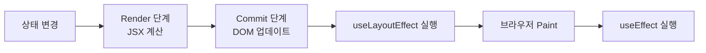
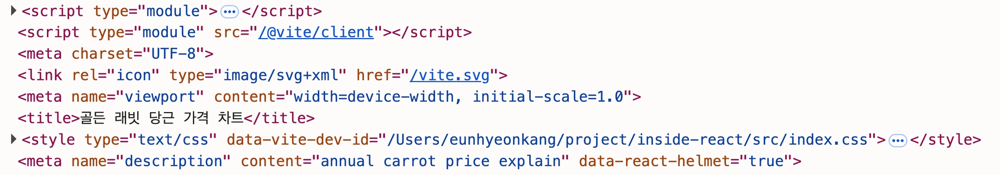
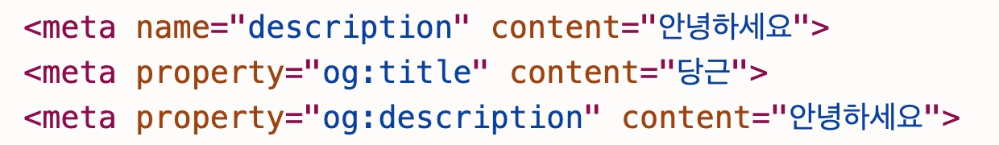

### Overview

외부 스토어의 상태를 구독하는 컴포넌트가 동시성 기능 환경에서 서로 다른 값을 순간적으로 렌더링하는 티어링 현상으로 인해 데이터 불일치를 겪을 수 있음

또, 부모 컴포넌트에서 자식 컴포넌트의 특정 DOM 메서드를 반드시 호출해야만 하는 요구 사항에 직면할 수도 있음

이러한 문제들은 `useState()` , `useEffect()` 만으로는 해결하기가 어려움

이를 해결하는 동시성 기능과 심화 훅에 대해 알아 볼 것임

</br>
</br>

### useLayoutEffect()와 useInsertionEffect()

리액트 개발에서 가장 흔하게 사용되는 생명주기 훅은 `useEffect()` 임

하지만 브라우저가 화면을 그리기 전에 특정 작업을 동기적으로 처리해야 하거나, 스타일을 효율적으로 주입해야 하는 고급 사용 사례에서는 사용하기 어려움

이를 해결하고자 두 훅이 나오게 됨

</br>
</br>

#### useEffect()와 useLayoutEffect()의 차이점



`useEffect()` 는 화면에 변경 사항이 반영된 후 비동기적으로 실행되는 반면, `useLayoutEffect()` 는 DOM 변경 후 화면에 그려지기 직전에 동기적으로 실행 됨

이 차이를 알아보기위해 먼저 `useEffect()` 를 사용했을때를 먼저 알아 볼 것 임

</br>

다음 코드는 그 예시 코드임

```tsx
import { Chart, type ChartData, type ChartItem, registerables } from "chart.js";
import { useEffect, useRef } from "react";

Chart.register(...registerables);

interface CarrotData {
  years: string[];
  prices: number[];
}

export const CarrotPriceChart = ({ data }: { data: CarrotData }) => {
  const chartRef = useRef<Chart | null>(null);
  const canvasRef = useRef<HTMLCanvasElement | null>(null);

  const getChartData = (data: CarrotData): ChartData<"line"> => {
    return {
      labels: data.years,
      datasets: [
        {
          // 데이터셋 배열
          label: "당근 가격 ($/kg)",
          data: data.prices,
          borderColor: "rgb(255, 159, 64)",
          backgroundColor: "rgba(255, 159, 64, 0.2)",
          tension: 0.1,
          fill: true,
        },
      ],
    };
  };

  // Chart.js와 같은 외부 라이브러리를 사용한 DOM 직접 조작 작업은 effect 훅 내부에서 수행
  useEffect(() => {
    if (canvasRef.current) {
      if (chartRef.current) {
        chartRef.current.destroy();
      }

      const ctx = canvasRef.current.getContext("2d") as ChartItem;

      chartRef.current = new Chart(ctx, {
        type: "line",
        data: getChartData(data),
      });
    }

    return () => {
      if (chartRef.current) {
        chartRef.current.destroy();
      }
    };
  }, [data]);

  return (
    <div>
      <canvas ref={canvasRef} />
    </div>
  );
};
```

`useEffect()` 를 사용하면 차트가 표시되기 이전에 빈 화면이 먼저 노출됨

→ 페인트 이후에 작동하기에

매우 짧은 시간이지만 이런 경험이 쌓일수록 유저의 피로도는 급격하게 올라가게 됨

</br>

다른 코드는 변경하지 않고 기존의 `useEffect` 부분을 `useLayoutEffect` 로 대체함

```tsx
useLayoutEffect(() => {
	if (chartRef.current) {
		chartRef.current.destroy();
	}
	// ..
)
```

당연하듯 `useEffect` 와 달리 x, y 축과 같은 차트 데이터가 처음부터 페인트되기 시작함

</br>

이처럼 `useEffect()` 보다 먼저 실행되어야하는 설정, 깜빡임 방지, 레이아웃 계산과 같이 브라우저 페인트 이전에 작업들을 처리할 때 사용할 수 있음

하지만 `useLayoutEffect()` 는 동기적으로 동작하기 때문에 페인트가 시작되는 시점을 지연할 수 있다는 단점이 존재함

또, 비동기적 실행보다 동기적 실행이 상대적으로 메인 스레드에 더 큰 부담을 줄 수 있음

</br>
</br>

#### 리액트 헬멧과 useInsertionEffect()

리액트 헬멧을 사용하면 컴포넌트 내부에서도 HTML의 메타데이터를 간편하게 변경할 수 있음

```tsx
return (
  <div>
    <Helmet>
			<meta name="description" content="annual carrot price explain" />
      <title>골든 래빗 당근 가격 차트</title>
    </Helmet>
    <canvas ref={canvasRef} />
  </div>
);
```

</br>



실제 DOM을 확인하면 다음과 같이 생성된 메타데이터를 확인할 수 있음

</br>

다음은 `useInsertionEffect()` 훅임

해당 훅은 리액트 18버전에서 추가되어 `useLayoutEffect()` 보다 더 이른 시점에 실행되는 훅임

DOM 변경 후, 레이아웃 계산 전 실행 됨

그렇기에 17버전 이하는 `useLayoutEffect()` 를 사용하여 스타일 삽입 → 레이아웃 재계산 → 페인트 순서도 한 번 더 진행 했기에 느렸음

- **styled-components v6**
    - React 18+ 환경
    - `useInsertionEffect` 사용
- **emotion**
    - React 18+ 감지시
    - 자동으로 사용, 아니면 `useLayoutEffect` 폴백

</br>

해당훅을 사용하는 이유는 `<head>` 내부에 `<style>` 을 삽입하기 위함이며 해당 경우 외의 직접적인 DOM 조작이나 레이아웃 정보 읽기를 시도하는 것은 권장되지 않음

→ DOM이 완성되기 전 시점이라 React가 덮어쓸 수 있고, 레이아웃 값도 아직 계산 전이라 신뢰할 수 없기
때문

`<head>` 내부에 삽입하는 이유는 브라우저가 페이지 렌더링 전에 읽는 영역이기 때문임

</br>

`useInsertionEffect()` 를 사용해 스타일을 동적으로 주입하는 컴포넌트 예시는 다음과 같음

해당 컴포넌트는 CSS 규칙 문자열을 props로 전달받아 동적으로 `<style>` 에 스타일을 주입함

```tsx
import { useId, useInsertionEffect } from "react";

interface DynamicStyleInjectorProps {
  rule: string;
}

export function DynamicStyleInjector({ rule }: DynamicStyleInjectorProps) {
  const styleIdSuffix = useId();
  const styleElementId = `dynamic-style-${styleIdSuffix}`;

  useInsertionEffect(() => {
    const oldStyleElement = document.getElementById(styleElementId);
    if (oldStyleElement) {
      oldStyleElement.remove();
    }

    const styleElement = document.createElement("style");
    styleElement.id = styleElementId;
    styleElement.innerHTML = rule;

    document.head.appendChild(styleElement);

    return () => {
      const styleTagToRemove = document.getElementById(styleElementId);
      if (styleTagToRemove) {
        document.head.removeChild(styleTagToRemove);
      }
    };
  }, [rule, styleElementId]);

  return null;
}
```

</br>
</br>

#### 리액트 19버전의 메타 데이터와 스타일시트

리액트 19버전부터는 별도의 라이브러리를 사용하지 않더라도 브라우저에서 기본적으로 사용할 수 있는 엘리먼트를 통해 메타 데이터를 추가 할 수 있음

```tsx
interface productProps {
  name: string;
  description: string;
}

export default function ComponentWithReact19({
  product,
}: {
  product: productProps;
}) {
  return (
    <div>
      <title>{product.name} - 리액트 19</title>
      <meta name="description" content={product.description} />
      <meta property="og:title" content={product.name} />
      <meta property="og:description" content={product.description} />
      <link rel="canonical" href={`https://../products/${product.id}`} />
      <h1>{product.name}</h1>
      <link rel="stylesheet" href="/style-first.css" precedence="foo" />
      <link rel="stylesheet" href="/style-third.css" precedence="bar" />
      <link rel="stylesheet" href="/style-second.css" precedence="foo" />
      <link rel="stylesheet" href="/style-wrong.css" />
    </div>
  );
}
```

</br>

컴포넌트 안에서 사용한 태그들이 자동으로 `<head>` 태그로 호이스팅됨



각 메타 데이터를 추가하는 엘리먼트마다 적용 가능한 프롭스는 다름

</br>

`<title>` 태그는 문자열 하나를 기대하기 때문에 여러 개의 `children` 이 아닌 하나의 문자열로 만들어 전달해야 함

```tsx
const something = "리액트";

// 잘못 작성된 경우
<title>title {something}</title>

// 올바르게 작성된 경우
<title>{`title ${something}`}</title>
```

동적인 텍스트를 `<title>` 에 적용할 때는 단일 문자열이 아닌 JSX 중괄호 안에 변수를 사용하는 방식으로 작성해야함

</br>

앞서 예제 코드에서 사용했던 `link` 엘리먼트의 또 다른 사용 사례는 컴포넌트에서 작성되지 않은 외부 스타일이나 아이콘 등 정적 리소스를 불러옴

```tsx
<link rel="stylesheet" href="/style-first.css" precedence="foo" />
<link rel="stylesheet" href="/style-third.css" precedence="bar" />
<link rel="stylesheet" href="/style-second.css" precedence="foo" />
```

이 중 `rel=”stylesheet”` 프롭스로 작성된 `<link>` 는 리액트 19버전에서 조금 더 특별하게 처리됨

해당 프롭스 사용 시 `precedence` 프롭스와 같이 사용해야함

</br>

`precedence` 프롭스는 같은 값을 가진 `<link rel=”stylesheet”>` 태그들을 그룹화하는 역할을 함

리액트는 컴포넌트 트리에 선언된 순서대로 `precedence` 그룹들을 `<head>` 내부에 삽입함

```tsx
<link rel="stylesheet" href="/style-first.css" precedence="foo" />
<link rel="stylesheet" href="/style-third.css" precedence="bar" />
<link rel="stylesheet" href="/style-second.css" precedence="foo" />
```

다음 코드에서는 `precedence="foo"` 가 `precedence="bar"` 를 가진 태그들보다 먼저 선언되었다면, `foo` 그룹이 먼저 위치하게 됨

이런식으로 개발자는 `precedence` 값을 통해 스타일 적용 우선순위를 의도적으로 제어할 수 있음

</br>
</br>

### useImperativeHandle()을 사용한 제어 역전

부모는 프롭스를 통해 자식에게 데이터를 전달하고, 자식은 콜백 함수를 통해 부모에게 이벤트를 알림

`useImperativeHandle()` 훅은 부모 컴포넌트가 선언적이 아닌 명령형으로 자식 컴포넌트의 동작을 직접 제어해야 할 때 사용함

이 훅을 사용하면 자식 컴포넌트는 부모가 `ref` 를 통해 호출 할 수 있는 함수들, 즉 명령형 핸들을 직접 정의할 수 있음

</br>

다음 예제를 통해 `useImperativeHandle()` 에 대해 알아볼것임

```tsx
interface ChildInputHandle {
  focusInput: () => void;
  getInputValue: () => string | undefined;
  clearInput: () => void;
}

const ChildComponent = forwardRef<ChildInputHandle, {}>((props, ref) => {
  const inputRef = useRef<HTMLInputElement>(null);

  useImperativeHandle(ref, () => ({
    focusInput: () => {
      inputRef.current?.focus(); // input 요소에 포커스를 줌
    },
    getInputValue: () => {
      return inputRef.current?.value; // input 요소의 현재 값을 반환함
    },
    clearInput: () => {
      if (inputRef.current) {
        inputRef.current.value = ""; // input 요소의 값을 비움
      }
    },
  }));

  return (
    <div>
      <input type="text" ref={inputRef} className="border p-1" />
      <p className="text-sm">이것은 자식 컴포넌트의 입력 필드입니다.</p>
    </div>
  );
});
```

`useImperativeHandle()` 훅을 사용하여 부모로부터 받은 `ref` 에 실제 기능을 연결함

</br>

다음은 부모 컴포넌트에서 `ref` 를 통해 앞서 정의한 핸들을 어떻게 활용하는지 알아볼것임

```tsx
export default function ParentComponent() {
  const childRef = useRef<ChildInputHandle>(null);

  const handleFocusClick = () => {
    childRef.current?.focusInput(); // 자식의 focusInput 메서드 호출
  };

  const handleGetValueClick = () => {
    const value = childRef.current?.getInputValue(); // 자식의 getInputValue 메서드 호출
    alert(`자식 Input 값: ${value || "없음"}`);
  };

  const handleClearClick = () => {
    childRef.current?.clearInput(); // 자식의 clearInput 메서드 호출
  };

  return (
    <div className="parent-component p-4 border rounded-md">
      <h3 className="text-lg font-semibold mb-2">부모 컴포넌트</h3>
      <ChildComponent ref={childRef} />
      <div className="mt-2 space-x-2">
        <button
          type="button"
          onClick={handleFocusClick}
          className="px-3 py-1 bg-blue-500 text-white rounded hover:bg-blue-600"
        >
          자식 Input에 포커스
        </button>
        <button
          type="button"
          onClick={handleGetValueClick}
          className="px-3 py-1 bg-green-500 text-white rounded hover:bg-green-600"
        >
          자식 Input 값 가져오기
        </button>
        <button
          type="button"
          onClick={handleClearClick}
          className="px-3 py-1 bg-red-500 text-white rounded hover:bg-red-600"
        >
          자식 Input 값 지우기
        </button>
      </div>
      <p className="text-xs mt-2">
        부모 컴포넌트의 버튼을 클릭하면, `childRef`를 통해 `ChildComponent`에서
        `useImperativeHandle`로 노출한 함수들을 호출하여 자식 컴포넌트를
        제어합니다.
      </p>
    </div>
  );
}
```

`handleFocusClick()` 내에서 `childRef.current` 를 통해 `<ChildComponent>` 가 노출한 `focusInput()` , `getInputValue()` , `clearInput()` 을 직접 호출함

즉, 자식 컴포넌트가 정의한 기능을 부모가 직접 사용하는 모습임

</br>
</br>

### 동시성 기능과 트랜지션

동시성 기능을 활용하면, 리액트는 렌더링 작업을 여러 작은 단위로 나누고 우선순위에 따라 처리 순서를 조절할 수 있게 됨

이를 통해 긴급한 유저 입력은 즉시 처리하고, 덜 긴급한 UI 업데이트는 백그라운드에서 점진적으로 수행하며 애플리케이션의 반응성을 크게 향상시킬 수 있음

→ 리액트는 타임 슬라이싱 사용

타입 슬라이싱은 메인 스레드에 제어권을 양보하여 유저 입력 처리와 같이 현재 실행 중인 작업보다 더 높은 우선순위를 가진 다른 작업을 먼저 처리되게 기회를 제공하는것을 말함

</br>

`useTransition()` 과 `useDeferredValue()` 훅은 이런 리액트의 동시성 특징과 타임 슬라이싱 메커니즘을 개발자가 직접 활용할 수 있게 도움

이러한 훅들을 사용하려면 진입점에서 react-dom의 `render()` 함수 대신, react-dom/client에서 제공하는 `createRoot()` API를 사용해야함

→ 리액트 18버전부터는 자동으로 설정되어있음

</br>
</br>

#### useTransition() 사용하여 우선순위 낮은 작업 선정하기

`useTransition()` 은 특정 상태 업데이트를 트랜지션으로  표시하여 리액트에게 해당 업데이트가 긴급하지 않음을 알림

해당 업데이트는 백그라운드에서 진행할 수 있게 됨

</br>

다음 코드는 `useTransition()` 을 사용한 예시 코드임

```tsx
export default function BubbleGenerator() {
  const [isPending, startTransition] = useTransition();

  // 슬라이더 위치(즉시 반영)
  const [currentSliderValue, setCurrentSliderValue] = useState(1);

  // 실제 BubbleList에 전달될 값(무거운 렌더링)
  const [listSize, setListSize] = useState(1);

  const handleSliderChange = (e: ChangeEvent<HTMLInputElement>) => {
    const value = Number(e.target.value);

    // 긴급 업데이트
    setCurrentSliderValue(value);

    // 낮은 우선순위 업데이트
    startTransition(() => {
      setListSize(value);
    });
  };

  return (
    <>
      <input
        type="range"
        min="1"
        max="30000"
        value={currentSliderValue}
        onChange={handleSliderChange}
      />

      <p>슬라이더: {currentSliderValue}</p>
      <p>버블 개수: {listSize}</p>

      {isPending && <p>버블 생성 중...</p>}

      <BubbleList size={listSize} />
    </>
  );
}
```

무거운 렌더링이 필요하는 `setListSize(size)` 에 `startTransition` 을 감싸 사용함

적용하지 않았다면 슬라이더를 움직일때마다 무거운 렌더링이 즉시 발생하여 메인 스레드를 차단함

`isPending` 은 트랜지션이 진행 중인지 여부를 나타내는 `boolean` 값으로 이를 사용하여 유저에게 백그라운드에서 업데이트가 일어나는 동안 로딩 상태를 보여줄 수 있음

</br>
</br>

#### useDeferredValue() 사용하여 지연된 상탯값 사용하기

`useDeferredValue()` 는 반응성을 부드럽게 유지한단느 같은 목표를 가지지만, 접근 방식이 조금 다름

해당 훅은 특정 값의 지연된 버전을 생성하여, 해당 값을 사용하는 부분의 업데이트가 긴급한 다른 렌더링을 방해하지 않도록 함

다음은 `useEferredValue()` 를 적용한 예시임

```tsx
import { type ChangeEvent, useDeferredValue, useState } from "react";

export default function BubbleGenerator() {
  const [inputValue, setInputValue] = useState("");
  const deferredInputValue = useDeferredValue(inputValue);

  const handleInputChange = (e: ChangeEvent<HTMLInputElement>) => {
    setInputValue(e.target.value);
  };

  return (
    <BubbleTextInput
      label="버블에 글자 새기기:"
      value={inputValue}
      onChange={handleInputChange}
    />
      <BubbleList size={listSize} text={deferredInputValue} />
  );
}
```

유저가 타이핑하는 긴급한 업데이트시 `deferredInputValue` 가 이전 값을 유지하도록 하여, 이 값에 의존하는 `BubbleList` 의 리렌더링을 뒤로 미룸

두 훅을 마지막으로 정리하자면 `useTransition()` 은 상태 업데이트를 낮은 우선순위로 예약하는 훅이고, `useDeferredValue()` 는 이미 변경된 값의 지연된 버전을 제공하여 해당 값을 사용하는 컴포넌트의 렌더링을 늦추는 훅임

</br>
</br>

### useSyncExternalStore()를 사용한 외부 상태 동기화

리액트가 제공하는 `useState()` , `useReducer()` 훅들로 생성된 상태를 내부 상태라고 부름

때로는 해당 훅 외에 리액트 컴포넌트 외부에서 생성되거나 관리되는 값을 컴포넌트 내부로 가져와 상태처럼 활용해야 하는 상황이 발생함

이런 외부 상태의 대표적인 예로는 Zustand와 같은 상태 관리 라이브러리에 관리하는 데이터가 있음

→ 브라우저 환경의 전역 변수, Date 객체, 또는 DOM 요소의 특정 속성값들도 외부 상태로 간주됨

</br>

`useSyncExternalStore()` 가 도입되기 이전에는 외부 스토어를 사용하기 위해 직접 구독을 등록하고, 변경 알림을 받아 React 상태를 수동으로 갱신해야 했음

또한 동시성 환경에서는 여러 컴포넌트가 동일한 외부 스토어의 서로 다른 시점의 데이터를 읽어 UI가 일관되지 않게 표시되는 티어링 현상이 발생할 수 있었음

`useSyncExternalStore()`는 외부 스토어를 React와 동기화하여 이러한 문제를 해결하고, 외부 상태를 안전하게 사용 가능케 함

</br>

기본 형태는 다음과 같음

```tsx
const value = useSyncExternalStore(
	subscribe,
	getSnapshot
);
```

- `subscribe`
    - 외부 상태가 변경되었을 때 React에게 알려주는 함수
- `getSnapshot`
    - 외부 상태의 현재 값을 반환하는 함수

</br>

사용된 예시 코드를 보면 다음과 같음

```tsx
import { useSyncExternalStore } from "react";

const networkStore = {
  isOnline: navigator.onLine,

  listeners: new Set<() => void>(),

  subscribe(listener: () => void) {
    this.listeners.add(listener);

    return () => this.listeners.delete(listener);
  },

  getSnapshot() {
    return this.isOnline;
  },
};

window.addEventListener("online", () => {
  networkStore.isOnline = true;
  networkStore.listeners.forEach(listener => listener());
});

window.addEventListener("offline", () => {
  networkStore.isOnline = false;
  networkStore.listeners.forEach(listener => listener());
});

export default function NetworkStatus() {
  const isOnline = useSyncExternalStore(
    networkStore.subscribe.bind(networkStore),
    networkStore.getSnapshot.bind(networkStore)
  );

  return <h1>{isOnline ? "Online" : "Offline"}</h1>;
}
```

</br>