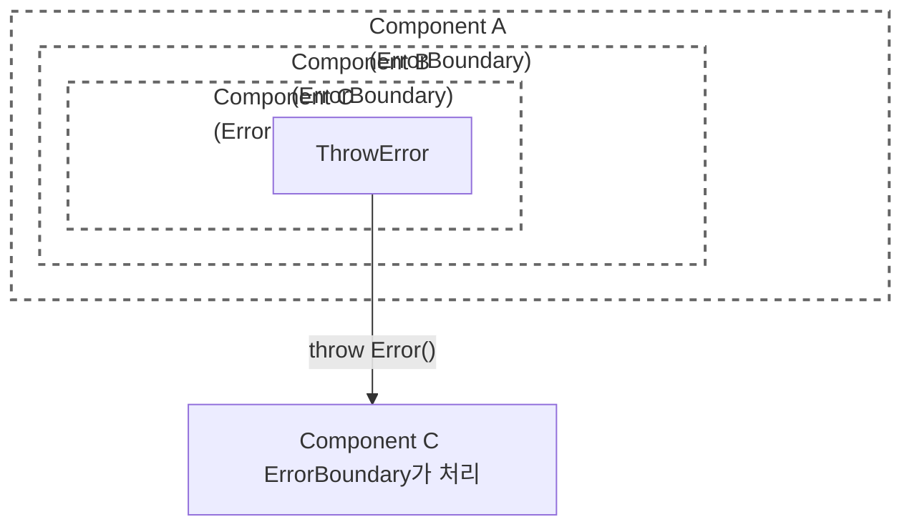
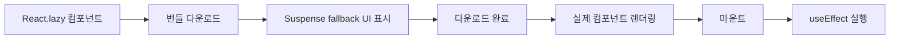
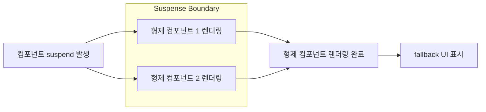
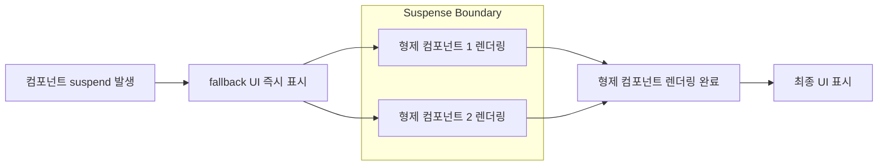
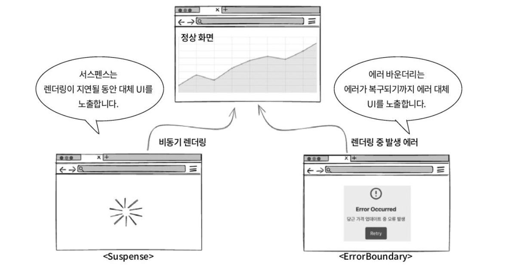
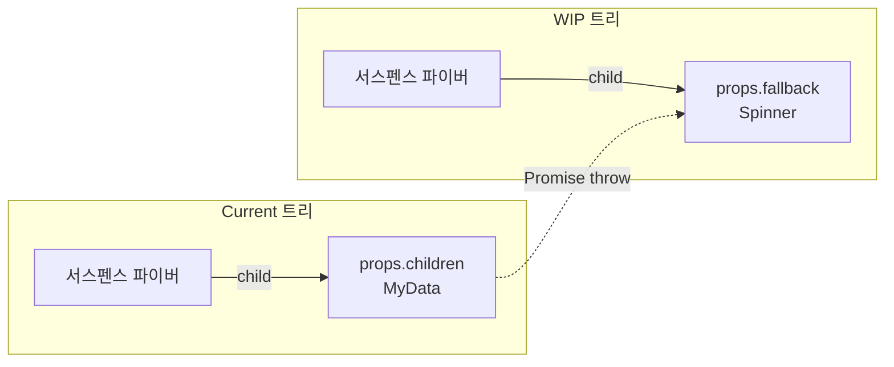
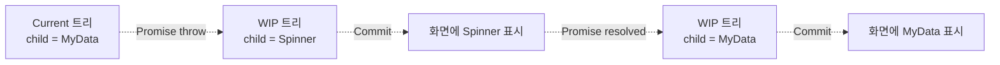
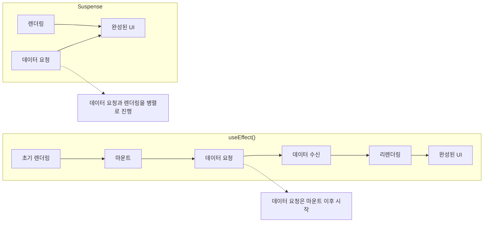
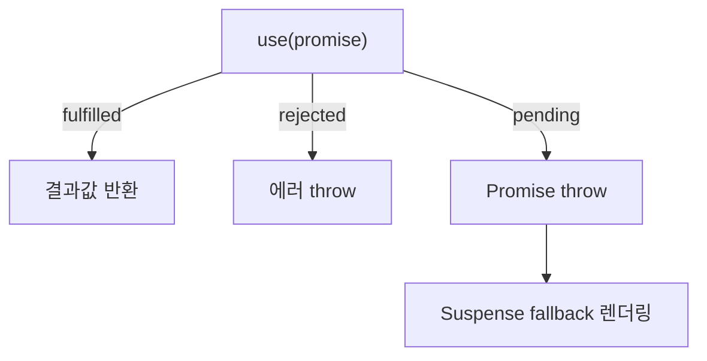
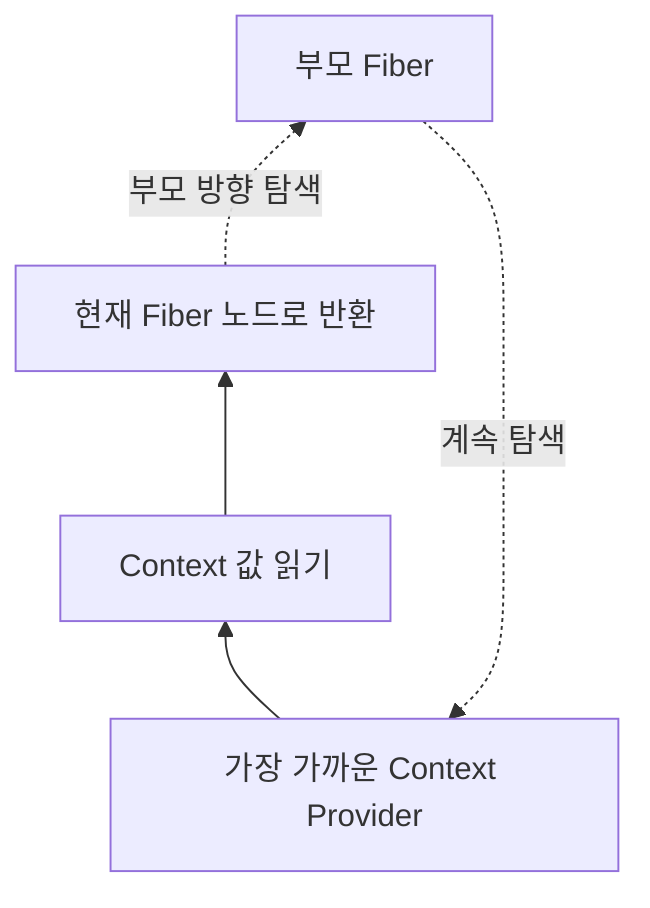

### Overview

지금까지 배운 컴포넌트, 상태 관리, 최적화만으로도 앱을 만들 수 있지만, 규모가 커질수록 새로운 문제가 발생함

에러 하나로 앱 전체가 멈추거나 Props Drilling 발생, 비동기 로딩 코드가 복잡해짐

이를 해결하기 위해 Error Boundary, Context, Suspense를 사용함

</br>
</br>

### 에러 바운더리 사용하여 견고한 앱 만들기

에러 바운더리는 특수한 컴포넌트 개념을 사용해, 하위 컴포넌트 트리에서 발생하는 렌더링 에러를 포착하고 제어할 수 있음

하지만 에러 바운더리에 사용하는 메서드 기능이 공식적으로 존재하지 않아, 반드시 클래스 컴포넌트를 사용해야 함

→ `react-error-boundary` 라이브러리를 활용하여 해결 가능함

</br>
</br>

#### 클래스 컴포넌트를 사용해 에러 바운더리 컴포넌트 만들어보기

어떤 컴포넌트가 에러 바운더리의 자격을 갖추려면, 다음 두 가지 클래스 컴포넌트 전용 생명 주기 메서드 중 하나 이상을 구현해야 함

- `static getDerivedStateFromError(error)`
    - 렌더링 과정에서 에러가 발생했을 때 호출
    - 에러를 인자로 받아 컴포넌트의 상태를 갱신하는 용도로 사용
    - 상태 갱신에 의해 리렌더링이 일어나면 Fallback UI를 보여줄 수 있음
- `componentDidCatch(error, errorInfo)`
    - 렌더링 과정에서 에러가 포작된 후 호출
    - 에러와 에러에 대한 정보를 포함하는 인자를 받음
    - 외부 에러 모니터링 서브스에 에러 정보를 전송하는 등의 부수 효과를 처리하는 데 사용

</br>

먼저 컴포넌트가 사용할 상태와 프롭스의 타입임

```tsx
import type { Component, PropsWithChildren, ReactNode } from "react";

type ErrorBoundaryState = {
  error: Error | null;
};

export type FallbackProps = {
  error: Error;
  resetErrorBoundary: () => void;
};

// Fallback UI Props
type ErrorBoundaryProps = PropsWithChildren<{
  fallbackRender?: (props: FallbackProps) => ReactNode;
  FallbackComponent?: React.ComponentType<FallbackProps>;
  onReset?: () => void;
  onError?: (error: Error, info: ErrorInfo) => void;
}>;
```

</br>

이어서 에러 바운더리 컴포넌트의 생성자와 생명주기 메서드임

```tsx
class ErrorBoundary extends Component<ErrorBoundaryProps, ErrorBoundaryState> {
  constructor(props: ErrorBoundaryProps) {
    super(props);
    this.state = { error: null };
  }

  // 발생한 error 를 받아 상태를 갱신하는 일만 수행
  // 동기적 호출 -> 부수 효과 발생시켜선 안 됨
  static getDerivedStateFromError(error: Error): ErrorBoundaryState {
    return { error };
  }

  // 상태 업데이트 완료 후, 커밋 단계에서 실행되는 메서드
  // 부수 효과 수행이 허용, 포착된 인자들을 외부 모니터링 서비스로 전송
  componentDidCatch(error: Error, errorInfo: React.ErrorInfo) {
    if (this.props.onError) {
      this.props.onError(error, errorInfo);
    }
  }

  resetErrorBoundary = () => {
    if (this.porps.onReset) {
      this.props.onReset();
    }
    this.setState({ error: null });
  };
}
```

</br>

다음은 에러 상태에 따라 자식 컴포넌트 또는 폴백 UI를 조건부로 렌더링하는 `render()` 메서드임

```tsx
render() {
    const { fallbackRender, FallbackComponent, children } = this.props;
    const { error } = this.state;

    if (error) {
      const fallbackProps: FallbackProps = {
        error,
        resetErrorBoundary: this.resetErrorBoundary,
      };

      if (FallbackComponent) {
        return <FallbackComponent {...fallbackProps} />;
      }

      if (fallbackRender) {
        return fallbackRender(fallbackProps);
      }

      return (
        <div>
          <h2>문제가 발생했습니다.</h2>
          <p>{error.message}</p>
          <button type="button" onClick={this.resetErrorBoundary}>
            다시 시도
          </button>
        </div>
      );
    }

    return children;
  }
```

</br>

다음은 `ErrorBoundary` 컴포넌트를 실제로 사용하는 `ErrorPage` 컴포넌트임

```tsx
const App = () => {
  if (Math.random() > 0.5) {
    throw new Error("App 컴포넌트에서 예기치 않은 에러 발생!");
  }
  return <div>애플리케이션의 주요 내용</div>;
};

export default function ErrorPage() {
  return (
    <ErrorBoundary
      fallbackRender={({ error, resetErrorBoundary }) => (
        <SignSpinner error={error} resetErrorBoundary={resetErrorBoundary} />
      )}
      
      onReset={() => console.log("ErrorBoundary가 리셋되었습니다.")}
      
      onError={(error, info) => {
        console.error("ErrorBoundary에서 에러 감지:", error);
        console.error("에러 정보:", info.componentStack);
        // 이곳에서 Sentry 등의 외부 서비스로 에러를 로깅할 수 있음
        // logErrorToService(error, info);
      }}
    >
      {/* 실제 애플리케이션 컴포넌트 */}
      <App />
    </ErrorBoundary>
  );
}
```

</br>
</br>

#### 에러 전파 알아보기

렌더링 과정에서 에러가 발생하면, DOM의 이벤트 버블링과 유사하게 컴포넌트 트리를 따라 상위로 전파됨

리액트는 에러가 발생한 지점부터 가장 가까운 부모 에러 바운더리를 찾을 때까지 계속 위로 올림

이를 에러 전파라고 함

</br>

에러 전파의 예시는 다음과 같음

```tsx
import ErrorBoundary from "@/example/ch16/ErrorBoundary.tsx";

const ThrowError = ({ message }: { message: string }) => {
  throw new Error(message);
};

function ComponentC() {
  return (
    <ErrorBoundary
      fallbackRender={({ error, resetErrorBoundary }) => (
        <div>
          <p>Component C 내부 에러:</p>
          <pre>{error.message}</pre>
          <button type="button" onClick={resetErrorBoundary}>
            C에서 재시도
          </button>
        </div>
      )}
    >
      <div>
        <h3>Component C</h3>
        <ThrowError message="Error thrown from Component C's child (ThrowError)" />
      </div>
    </ErrorBoundary>
  );
}

function ComponentB() {
  return (
    <ErrorBoundary
      fallbackRender={({ error, resetErrorBoundary }) => (
        <div>
          <p>Component B 내부 에러:</p>
          <pre>{error.message}</pre>
          <button type="button" onClick={resetErrorBoundary}>
            B에서 재시도
          </button>
        </div>
      )}
    >
      <div>
        <h3>Component B</h3>
        <ComponentC />
      </div>
    </ErrorBoundary>
  );
}

function ComponentA() {
  return (
    <ErrorBoundary
      fallbackRender={({ error, resetErrorBoundary }) => (
        <div>
          <p>Component A 내부 에러:</p>
          <pre>{error.message}</pre>
          <button type="button" onClick={resetErrorBoundary}>
            A에서 재시도
          </button>
        </div>
      )}
    >
      <div>
        <h3>Component A</h3>
        <ComponentB />
      </div>
    </ErrorBoundary>
  );
}

```

</br>

그림으로 보면 다음과 같음



`ThrowError` 에서 발생한 에러는 가장 가까운 `ComponentC`의 ErrorBoundary가 먼저 포착하여 처리하므로, `ComponentC` 의 fallback UI만 렌더링 됨

이미 처리된 에러는 상위 ErrorBoundary(`ComponentB` , `ComponentA`)로 전파되지 않기 때문에 해당 fallback UI들은 표시되지 않음

</br>
</br>

#### 렌더링 에러와 에러 바운더리 작동 조건

에러 바운더리는 리액트 렌더링 생명주기 동안 발생하는 에러만 감지할 수 있음

다음과 같은 상황에서는 에러를 감지하지 못 함

```tsx
const handleErrorInEventHanlder = () => {
  try {
    throw new Error("이벤트 핸들러에서 발생한 에러");
  } catch (e) {
    if (e instanceof Error) {
      alert(`ErrorBoundary에 감지 안 됨`);
    }
  }
};
```

리액트의 렌더링 과정이 이미 완료된 이후이거나, 렌더링과는 별개의 이벤트 루프에서 동작하기 때문에 에러 바운더리에 의해 감지되지 않음

→ 리액트는 이벤트 핸들러 내부에서 어떤 일이 일어날지 예측하거나 제어하지 않음

</br>

다음은 비동기적으로 실행되는 코드임

```tsx
const handleErrorInFetch = () => {
  fetch("/invalid-endpoint")
    .then((response) => {
      if (!response.ok) {
        throw new Error(`HTTP 에러! status: ${response.status}`);
      }
      return response.json();
    })
    .catch((e) => {
      if (e instanceof Error) {
        alert(`fetch 비동기 에러`);
      }
    });
};
```

비동기 작업은 리액트의 렌더링 사이클과는 분리되어 실행되기에 에러 바운더리의 감지 범위를 벗어남

</br>

하지만 다음과 같이 렌더링 과정의 일부로 간주되는 명시적 에러 발생은 에러 바운더리 컴포넌트에 의해 감지될 수 있음

→ `useEffect`

```tsx
const ChildWithErrorOnMount = () => {
  useEffect(() => {
    throw new Error("useEffect에서 즉시 발생한 동기적 에러")
  }, []);
  return <p>이 컴포넌트는 마운트 시 즉시 에러를 발생시킴</p>
}
```

</br>

이렇듯 재조정 과정에서 발생하는 에러만 감지하기 때문에 특정 버튼을 눌러 에러가 발생하더라도 에러 바운더리에서 선언한 폴백 UI를 보여주려면 다음과 같은 트릭이 필요함

```tsx
import { useState } from "react";

export const useThrowError = () => {
  const [_errorState, setErrorState] = useState<Error | null>(null);

  return (error: Error) => {
    setErrorState(() => {
      throw error;
    });
  };
};

const CarrotPriceUpdater = () => {
  const throwErrorHook = useThrowError();

  const handleUpdatePrice = () => {
    try {
      console.log("당근 가격 업데이트 시도...");
      throw new Error("당근 가격 서버 통신 실패!");
    } catch (error) {
      if (error instanceof Error) {
        throwErrorHook(error);
      } else {
        throwErrorHook(new Error("알 수 없는 에러 발생"));
      }
    }
  };

  return (
    <div>
      <h3>당근 가격 정보</h3>
      <button type="button" onClick={handleUpdatePrice}>
        가격 업데이트
      </button>
    </div>
  );
};
```

이벤트 핸들러에서 발생한 에러를 리액트의 에러 바운더리 메커니즘으로 포착할 수 있도록 상태 업데이트 함수 내에서 전달받은 에러를 다시 `throw` 하여, 렌더링 과정 중 발생한 에러처럼 만들 수 있음

커스텀 훅으로 만들어 에러를 발생시키고 싶은 컴포넌트에서 사용하면됨

→ 해당 방식도 좋지만 효율적인 사용을 위해 검증된 라이브러리인 `react-error-boundary` 패키지를 추천

</br>
</br>

### 컨텍스트 API를 사용한 효과적인 상태 공유

컨텍스트 API를 사용하면 깊은 계층의 리액트 트리에서도 프롭스 전달을 우아하게 해결할 수 있음

`React.createContext()` 를 사용해 컨텍스트를 생성하고, 생성된 컨텍스트를 Context Provider를 통해 하위 컴포넌트에게 제공함

</br>

컨텍스트를 사용한 예시는 다음과 같음

먼저, 컨텍스트 타입을 먼저 선언함

```tsx
type SidebarContext = {
  state: "expanded" | "collapsed";
  open: boolean;
  setOpen: (open: boolean) => void;
  openMobile: boolean;
  setOpenMobile: (open: boolean) => void;
  isMobile: boolean;
  toggleSidebar: () => void;
};
```

타입스크립트 환경에서 컨텍스트를 통해 공유할 데이터의 구조를 명확하게 정의하는 것은 중요함

→ 어떤 값들이 하위 컴포넌트에 제공되는지 알 수 있으므로

</br>

그다음은 `createContext()` 를 통해 `SidebarContext` 객체를 생성함

생성된 객체는 그 자체만으로는 아무 정보를 가지고 있지 않으며, 하위 컴포넌트에서 이 컨텍스트를 읽으려면 `<SidebarContext>` 로 감싸고 `value` 프롭스를 제공해야함

```tsx

import { createContext, useContext } from "react";

const SidebarContext = createContext<SidebarContext | null>(null);

function useSiderbar() {
  const context = useContext(SidebarContext);
  if (!context) {
    throw new Error("useSidebar must be used within a SidebarProvider.");
  }

  return context;
}

const SidebarProvider = () => {
  return <SidebarContext value={contextValue}>{children}</SidebarContext>;
};
```

</br>
</br>

### 컨텍스트 API의 유스케이스

앞서 배운 렌더 프롭스 패턴에는 다음과 같은 문제가 있었음

중간 컴포넌트 `IntermediateComponent` 는 `loading` , `error` , `data` 상태를 직접 사용하지 않지만, 이 상태들이 하위에 전달되게 구조를 유지해야함

```tsx
// 중간 컴포넌트
function IntermediateComponent({ children }) {
  return (
    <div
      className="intermediate-wrapper"
      style={{ border: "1px dashed gray", padding: "10px", margin: "10px 0" }}
    >
      <p style={{ fontWeight: "bold", color: "gray" }}>중간 컴포넌트 영역</p>
      {children}
    </div>
  );
}

// 데이터를 실제로 표시하는 컴포넌트
function DisplayDataComponent({ loading, error, data }) {
  if (loading) {
    return <div className="loading">데이터 로딩 중...</div>;
  }
  if (error) {
    return <div className="error">에러 발생: {error.message}</div>;
  }
  return (
    <div className="data-display">
      <h4>가져온 데이터 목록:</h4>
      <ul>
        {Array.isArray(data) ? (
          data.map((item, index) => <li key={index}>{item}</li>)
        ) : (
          <li>데이터가 없습니다.</li>
        )}
      </ul>
    </div>
  );
}

// 앱 컴포넌트
function AppWithIntermediateRenderProps() {
  return (
    <DataFetcher url="https://api.example.com/gadgets">
      {({ loading, error, data }) => (
        <IntermediateComponent>
          {() => (
            <DisplayDataComponent loading={loading} error={error} data={data} />
          )}
        </IntermediateComponent>
      )}
    </DataFetcher>
  );
}

```

컨텍스트 API를 사용하면 `loading` , `error` , `data` 를 컨텍스트로 제공하여 해결할 수 있음

</br>

컨텍스트 API를 사용하여 위 코드를 개선하면 다음과 같음

```tsx
import { type Context, useContext } from "react";

function useData<T = any>() {
  const context = useContext(
    DataContext as Context<DataContextType<T> | undefined>,
  );

  if (context === undefined) {
    throw new Error("useData must be used within a DataProvider");
  }
  return context;
}

function IntermediateComponentWithContext({ children }) {
  return (
    <div>
      <p>중간 컴포넌트 영역</p>
      {children}
    </div>
  );
}

function DisplayDataComponentWithContext() {
  const { loading, error, data, refetch } = useData<string[]>();

  if (loading) {
    return <div>컨텍스트: 데이터 로딩 중...</div>;
  }
  if (error) {
    return (
      <div>
        {error.message}{" "}
        <button type="button" onClick={refetch}>
          재시도
        </button>
      </div>
    );
  }

  return (
    <div>
      <ul>
        {Array.isArray(data) ? (
          data.map((item, index) => <li key={index}>{item}</li>)
        ) : (
          <li>데이터가 없습니다.</li>
        )}
      </ul>
      <button type="button" onClick={refetch}>
        목록 새로고침
      </button>
    </div>
  );
}
```

커스텀훅을 만들어 컨텍스트를 사용하여 `IntermediateComponentWithContext` 는 더 이상 상태를 전달하지 않음

그저, `props.children` 을 렌더링하는 책임을 가짐

이처럼 컨텍스트 API를 사용하면 중간 컴포넌트가 추가되더라도 프롭스 드릴링 문제나 코드 구조의 복잡성 증가 없이 상태를 효과적으로 공유할 수 있음

</br>
</br>

### 컨텍스트 API와 리렌더링

이쯤되면 Zustand, Redux처럼 컨텍스트가 전역 상태 도구로 오해할 수 있음

→ 컨텍스트는 프롭스 드릴링을 피하기 위해 만든 도구일뿐

이를 잘 구분하기 위해 주요 상태 관리 전략으로 사용할 때 발생할 수 있는 리렌더링 문제와 기타 주의점을 살펴볼 것 임

</br>
</br>

#### 컨텍스트 제공자의 value 프롭스 메모이제이션

컨텍스트 제공자를 포함하는 상위 컴포넌트가 리렌더링될 때, `value` 프롭스로 전달되는 객체나 배열이 매번 새롭게 생성되면, 컨텍스트를 구독하는 모든 하위 컴포넌트들이 불필요하게 리렌더링될 수 있음

`useMemo()` 훅을 사용하여 해결할 수 있음

```tsx
const contextValue = useMemo(
  () => ({
    loading,
    error,
    refetch: fetchData,
  }),
  [loading, error, data, fetchData],
);
```

</br>
</br>

#### 컨텍스트 분리해서 리렌더링 영향 범위 줄이기

애플리케이션의 규모가 커지면서 다양한 상태들을 컨텍스트를 통해 관리하게 될 때, 하나의 컨텍스트에 모든 상태를 담아두려는 경향이 있음

→ `value` 프롭스에 포함된 여러 상태 중 단 하나라도 변경되면, 리렌더링 발생

이를 해결하려면 다음과 같이 관심사별로 분리하는 것임

```tsx
// 모든 설정을 하나의 객체로 묶어 제공
const settingsValue = useMemo(() => ({
    theme,
    notificationsEnabled,
    userPreferences: { fontSize: "medium" },
  }), [theme, notificationsEnabled],
);

// 관심사별로 분리하여 필요한 것만 사용
const themeValue = useMemo(() => ({ theme }), [theme]);

const notificationsValue = useMemo(
  () => ({ notificationsEnabled }),
  [notificationsEnabled],
);
```

</br>
</br>

### 서스펜스 사용해 컴포넌트 내 비동기 작업 수행하기

리액트에서 서스펜스는 비동기 작업이 완료될 때까지 UI 렌더링을 일시적으로 보류하고, 그동안 사용자에게 폴백 UI를 보여줄 수 있도록 지원하는 기능임

이를 통해 데이터 요청이나 지연 로딩된 컴포넌트의 로딩 상태를 선언적으로 관리할 수 있으며, 사용자에게 더 일관된 화면을 제공할 수 있음

또한 `React.lazy` 와 함께 사용하면 필요한 컴포넌트만 필요한 시점에 불러오는 코드 분할을 구현할 수 있어 초기 로딩 성능을 개선할 수 있음

</br>

다음 예시 코드는 여러 페이지의 컴포넌트로 나눠져 있는 대규모 애플리케이션에서 페이지 단위로 코드 분할을 수행하는 부분임

React 18 이전의 레거시 `Suspense` 를 사용함

```tsx
import { lazy, Suspense } from "react";

const Home = lazy(() => import("./routes/Home"));

const About = lazy(() => import("./routes/About"));

const Profile = lazy(() => import("./routes/Profile"));

const App = () => (
  <Router>
    <nav>
      <ul>
        <li>
          <Link to="/">Home</Link>
        </li>
        <li>
          <Link to="/about">About</Link>
        </li>
        <li>
          <Link to="/profile">Profile</Link>
        </li>
      </ul>
    </nav>
    <Suspense fallback={<div>Loading...</div>}>
      <Routes>
        <Route path="/" element={<Home />} />
        <Route path="/about" element={<About />} />
        <Route path="/profile" element={<Profile />} />
      </Routes>
    </Suspense>
  </Router>
);
```

`React.lazy()` 를 통해 동적으로 필요한 순간에만 로딩되기에 해당 컴포넌트 번들 파일을 내려받기까지 시간이 걸림

`<Suspense>` 컴포넌트에 프롭스로 제공된 폴백 UI가 번들 파일이 다운로드되기 전까지 보여짐

즉, 컴포넌트를 먼저 마운트해두고 로딩 화면을 덮어씌우는 것이 아닌 컴포넌트 렌더링 자체를 보류하고 `fallback` 만 렌더링하는 것

</br>

그림으로 보면 다음과 같음



</br>

하지만 React 17에서는 `Suspense` 내부의 컴포넌트가 데이터를 기다리며 지연되더라도, 같은 Suspense 경계 안에 있는 다른 컴포넌트들은 먼저 마운트되고 `useEffect()` 까지 실행될 수 있었음

즉, 사용자는 아직 로딩 화면만 보고 있는데도 일부 컴포넌트는 이미 렌더링되고 부수 효과가 실행되는 문제가 존재했음

</br>

다음 예시 코드를 통해 알아 볼 것임

```tsx
<Suspense fallback={<Loading />}>
  <Sibling />
  <ProfileDetails />
</Suspense>
```

다음 코드에서 `ProfileDetails` 데이터를 기다리는 중이라면 로딩 될때 `<Loading />` 을 보여주고 모든 컴포넌트는 대기하고 완료시 컴포넌트가 마운트되어 `useEffect` 가 실행되어야 함

하지만 React 17까지는 `<Sibling />` 이 먼저 마운트되어 `Sibling` 의 `useEffect` 가 실행 될 수 있었음

→ React 17까지는 렌더링 방식이 동기 렌더링이었기 때문임

</br>

리액트 18버전에서는 동시성 기능이 정식으로 도입되면서 Suspense 내부 컴포넌트의 마운트와 이펙트 실행을 데이터가 준비될 때까지 보류하도록 개선됨

따라서 fallback UI가 표시되는 동안에는 실제 컴포넌트가 마운트되지 않으며 `useEffect()` 도 실행되지 않음

이를 통해 React 17에서 존재하던 로딩 중인데 컴포넌트가 먼저 실행되는 문제가 해결됨

</br>

다만 새로운 문제가 있었음

Suspense가 표시되어야 하는 상황에서도 React는 fallback UI를 즉시 보여주지 않고 형제 컴포넌트들의 렌더링을 먼저 수행하려고 했음



이 때문에 형제 컴포넌트의 렌더링 비용이 크다면 사용자에게 로딩 UI가 늦게 보일 수 있었음

</br>

React 19에서는 suspend가 발생하면 형제 컴포넌트 렌더링을 기다리지 않고 fallback UI를 먼저 화면에 표시하도록 개선됨

그 이후 나머지 형제 컴포넌트 렌더링을 스케줄링함



이를 통해 React 18의 로딩 UI 노출이 늦어질 수 있는 문제가 해결되었고, 사용자는 로딩 상태를 더 빠르게 인지할 수 있게 됨

</br>
</br>

#### 에러 바운더리와 서스펜스

리액트는 특정 상황에 대한 폴백 UI를 선언적으로 처리하기 위해 에러 바운더리와 서스펜스를 사용한다고 했음



두 가지 메커니즘의 차이는 다음과 같음

- **에러 바운더리**
    - 렌더링 동안 발생하는 에러 상황에서 폴백 UI를 보여주거나 특정 로직을 수행
- **서스펜스**
    - 비동기 작업이 수행하는 동안 폴백 UI를 보여주거나 특정 로직을 수행

</br>

또한 두 기능은 함께 사용하는 경우가 많음

- `<Suspense>` 는 데이터 로딩, 코드 스플리팅 등 비동기 작업이 완료될 때까지 로딩 UI를 표시
- 비동기 렌더링 과정에서 예외가 발생하면 가장 가까운 에러 바운더리가 이를 포착하여 에러 UI를 표시

즉, 서스펜스는 아직 준비되지 않은 상태 를 처리하고, 에러 바운더리는 복구 가능한 오류 상태를 처리함

</br>

```tsx
<ErrorBoundary fallback={<ErrorPage />}>
  <Suspense fallback={<Loading />}>
    <UserProfile />
  </Suspense>
</ErrorBoundary>
```

위 구조에서는 다음과 같이 동작함

- 데이터 로딩 중이라면 `Loading` 컴포넌트가 렌더링됨
- 로딩이 완료되면 실제 컴포넌트가 렌더링됨
- 렌더링 과정에서 에러가 발생하면 `ErrorBoundary`가 에러를 포착하여 에러 UI를 렌더링함

따라서 일반적으로는 `<Suspense>`를 `<ErrorBoundary>` 내부에 배치하여 비동기 렌더링 과정에서 발생할 수 있는 오류까지 함께 처리하는 것이 권장됨

</br>

React 18 이후 SSR 환경에서는 `<Suspense>` 내부에서 오류가 발생하더라도 서버는 즉시 전체 렌더링을 중단하지 않음

- 에러가 발생한 영역은 `<Suspense>` 의 fallback UI를 렌더링
- 오류가 없는 나머지 영역은 계속 서버 렌더링 수행
- 클라이언트에서 해당 컴포넌트를 다시 렌더링 시도
- 재시도 과정에서도 오류가 발생하면 가장 가까운 `ErrorBoundary` 가 에러를 처리

이를 통해 페이지 일부에서 문제가 발생하더라도 전체 페이지의 가용성을 유지할 수 있음

</br>

SSR 환경에서는 서버에서 비동기 렌더링을 수행하고 싶지 않은 경우가 있음

→ `window` , `document` , 브라우저 API처럼 클라이언트에서만 존재하는 객체에 의존하는 컴포넌트

이 경우 `useEffect` 를 사용해 컴포넌트가 클라이언트에 마운트된 이후에만 `<Suspense>` 를 활성화할 수 있음

```tsx
function ClientOnlySuspense() {
  // 컴포넌트가 클라이언트 환경에서 마운트되었는지 여부를 추적
  const [isClient, setIsClient] = useState(false);

  useEffect(() => {
    setIsClient(true);
  }, []);

  return isClient ? (
    <Suspense fallback={<Loading />}>
      <LazyComponent />
    </Suspense>
  ) : (
    <div>서버 렌더링 중...</div>
  );
}
```

`isClient` 상태를 통해 비동기 렌더링을 클라이언트 환경에서만 수행하도록 제어할 수 있음

</br>

또 다른 방법으로 SSR시 의도적으로 에러를 발생시킬 수 있음

```tsx
<Suspense fallback={<Loading />}>
  <ClientOnlyComponent />
</Suspense>

function ClientOnlyComponent() {
  if (typeof window === 'undefined') {
    throw Error('클라이언트에서만 렌더링 가능');
  }

  // ...
}
```

서버에는 `window` 객체가 없기에 에러를 발생시켜 서버에서는 로딩 UI만 보여주고 실제 컴포넌트는 클라이언트에서만 렌더링하도록 강제할 수 있음

</br>
</br>

#### 서스펜스 내부 구현과 작동 원리

`<Suspense>` 는 단순히 로딩 UI를 보여주는 컴포넌트가 아니라, 렌더링 중 발생한 `Promise` 를 리액트가 감지하고 처리하는 메커니즘 위에서 동작함

즉, 컴포넌트가 아직 준비되지 않은 데이터를 만나면 `Promise` 를 `throw`하고, 리액트는 이를 감지하여 `<Suspense>` 의 fallback UI를 렌더링한 뒤 `Promise` 가 해결되면 렌더링을 다시 수행함

</br>

먼저, 서스펜스 내부의 컴포넌트가 렌더링되는 과정에서 필요한 데이터가 아직 준비되지 않았다면 `Promise` 를 `throw` 함

```tsx
function MyData() {
  const data = resource.read();
  return <div>{data}</div>;
}
```

여기서 `resource.read()` 는 데이터가 준비되지 않은 경우 `Promise` 를 `throw` 함

이때의 `throw` 는 에러 발생이 아니라, 현제 렌더링을 중단하고 `Promise` 가 완료될 때까지 기다려 달라는 신호로 사용됨

</br>

다음은 리액트가 `Promise` 를 감지함

리액트는 렌더링 과정 전체를 내부적으로 `try...catch` 로 감싸고 있음

```tsx
try {
  workLoopSync();
} catch (thrownValue) {
  handleThrow(root, thrownValue);
}
```

컴포넌트가 `Promise` 를 `throw` 하면 리액트는 이를 `catch` 한 뒤, 일반 에러인지 `Promise` 인지 구분함

`Promise` 라면 오류로 처리하지 않고, 해당 컴포넌트가 준비되지 않았음을 판단하여 가장 가까운 `<Suspense>` 경계를 찾음

</br>

`Promise` 가 감지되면 리액트는 WIP(Work In Progress) 트리에서 `<Suspense>` 의 `child` 를 fallback UI로 교체함



이 과정에서 중요한 점은 원래 렌더링하려던 `<MyData />` 가 사라지는 것이 아니라, 나중에 다시 렌더링하기 위해 Suspense Fiber에 보관된다는 것임

폴백 UI를 자식으로 가진 WIP 트리가 완성되면, 리액트는 이를 커밋하여 실제 화면에 반영함

</br>

리액트는 `Promise` 를 직접 폴리하지 않고 `Promise` 에 콜백을 등록해 둠

```tsx
promise.then(() => {
  // 렌더링 재시도 예약
});
```

`Promise` 가 해결되면 콜백이 실행되어 리액트 스케줄러에 중단된 렌더링을 다시 시작하라고 알림

</br>

`Promise` 가 완료되면 리액트는 새로운 렌더링을 시작함

이번에는 데이터가 준비되어 있으므로, Suspense Fiber에 보관해두었던 원래 자식을 가져와 `<Suspense>` 파이버 노드의 `child` 로 설정함


`<MyData>` 를 자식으로 가진 WIP 트리가 커밋되어 실제 화면에 반영됨

</br>

두 과정을 하나의 흐름으로 보면 다음과 같음



</br>

이 모든 과정이 매끄럽게 동작하려면 한 가지 중요한 전제 조건이 있음

컴포넌트가 `throw` 하는 `Promise` 가 리렌더링 시에도 동일한 인스턴스여야 함

→ 새로운 `Promise` 를 생성하여 `throw` 한다면, 프로미스가 완료된 후 리렌더링 시 또 다른 새로운 프로미스를 만나게 되어 무한 폴백 상태에 빠지게 됨

</br>
</br>

### use() 사용해 컨텍스트와 프로미스 읽기

리액트 19버전에서는 `use()` 라는 이름의 새로운 훅이 등장함

기존 훅과의 차이점으로는 조건문이나 반복문 안에서도 호출될 수 있다는 점임

`use()` 훅을 사용하면 비동기 작업을 다룰 때 데이터가 아직 준비되지 않았다면 서스펜스를 통해 선언적으로 로딩 상태를 관리하고, 데이터가 준비되면 동기 코드처럼 값을 반환할 수 있음

</br>
</br>

#### 컨텍스트값 읽기

`useContext()` 훅은 컴포넌트 최상 위 레벨에서만 호출되어야 한다는 규칙을 따라야 하므로, 조건문이나 반복문 내부에서 직접 호출 할 수 없는 제약이 있었음

다음과 같은 상황에서 제약이 생김

```tsx
function ConditionalReaderWithUseContext({ isActive }: ConditionalReaderProps) {
  const theme = useContext(ThemeContext);

  if (!isActive) {
    return <p>비활성화 상태</p>;
  }

  if (theme === null) {
    return <p>테마 정보 없음</p>;
  }

  return <p>{theme}</p>;
}
```

`useContext()` 는 가장 상단에서 호출되어야하기에 `isActive` 프롭스가 `false` 라도 불필요하게 값을 읽어오는 작업을 수행하게 됨

</br>

`use()` 훅은 조건문 내부에서 호출될 수 있어 이러한 제약을 해결함

`use()` 훅 역시 호출된 컴포넌트에서 가장 가까운 상위 Provider를 찾아 그 값을 반환하는, 리액트 컨텍스트의 기본 원리를 그대로 따름

```tsx
function ConditionalReaderWithUseUse({ isActive }: ConditionalReaderProps) {
    if (!isActive) {
        return <p>비활성화 상태</p>;
    }

    const theme = use(ThemeContext);

    if (theme === null) {
        return <p>테마 정보 없음</p>;
    }

    return <p>{theme}</p>;
}
```

`isActive` 의 조건문에서 `false` 면 컨텍스트를 읽기 전에 조기 반환하기에 불필요한 컨텏트 접근 및 관련 로직 실행을 방지함

</br>
</br>

#### 프로미스 결과 풀어내기

기존 `useEffect()` 를 사용하여 데이터 API를 호출하는 방식은 컴포넌트가 마운트된 후에 부수 효과를 실행한다는 리액트 생명주기 관점에는 자연스러웠음

하지만 해당 방식에는 다음과 같은 단점이 존재함

- **waterfall**
    - 데이터 요청이 부모 → 자식 방향으로 순차적으로 발생하는 워터폴 현상이 발생할 수 있음
- **복잡한 상태 관리**
    - `useState()` 를 사용해 API 응답에 대한 로딩, 에러 상태를 직접 관리하여 코드가 복잡해짐
- **Race condition**
    - `deps` 가 변경되거나 단시간에 반복적으로 마운트/언마운트되면서 데이터 요청이 여러 번 실행될 때, Race condition 문제가 발생할 수 있음
    - 이를 방지하고자 클린업 함수 등 추가적인 로직이 필요함

</br>

이러한 문제를 `use()` 와 `<Suspense>` 패턴이 해결함



해당 패턴은 데이터 요청을 컴포넌트 렌더링과 분리하여, 최대한 일찍 그리고 병렬적으로 시작함

`<Suspense>` 가 로딩 UI를 선언적으로 관리하고, `use()` 훅이 프로미스의 결과가 준비될때까지 컴포넌트 렌더링을 일시 중단시킴

</br>

다음은 해당 패턴을 사용한 예시 코드임

```tsx
const resource = createProfileResource();

interface ProfileResource {
  userPromise: Promise<{ name: string }>;
  postsPromise: Promise<{ id: number; text: string }>;
}

// Promise를 프롭스로 받음
function ProfileDetails({
  userPromise,
}: {
  userPromise: ProfileResource["userPromise"];
}) {
  const user = use(userPromise);
  return <h1>{user.name}</h1>;
}

function ProfilePosts({
  postsPromise,
}: {
  postsPromise: ProfileResource["postsPromise"];
}) {
  const posts = use(postsPromise);
  return (
    <ul>
      {posts.map((post) => (
        <li key={post.id}>{post.text}</li>
      ))}
    </ul>
  );
}

export default function ProfilePage() {
  return (
    <Suspense fallback={<h2>페이지 로딩 중...</h2>}>
      <ProfileDetails userPromise={resource.userPromise} />
      <Suspense fallback={<p>게시물 로딩 중...</p>}>
        <ProfilePosts postsPromise={resource.postsPromise} />
      </Suspense>
    </Suspense>
  );
}
```

`resource` 객체 생성을 통해 데이터 요청이 컴포넌트 렌더링 전에 시작됨

아래에 두 컴포넌트는 데이터 요청을 직접 시작하지 않고 프롭스로 전달받은 `Promise` 를 `use()` 에 넘겨 그 결과를 풀어냄

→ `Promise` 가 아직 대기 상태라면, `use()` 는 렌더링을 중단시키고 가장 가까운 `<Suspense>` 폴백 UI를 보여줌

</br>
</br>

#### use()는 어떻게 조건문 안에서 호출될 수 있을까?

컴포넌트 내에서 선언된 리액트 훅은 연결 리스트 구조로 순서대로 관리됨

하지만 `use()` 훅은 호출될 때 리액트의 내부적인 훅 리스트에 의존하여 상태를 저장하거나 검색하지 않음

→ 인자로 받은 값을 즉시 해석하는 독립적인 API에 가까움

</br>

인자로 `Promise` 객체를 받을때 `use()` 훅은 `Promise` 객체 자체에 저장된 상태를 읽음

```tsx
const data = use(fetchPromise);
```

</br>

`Promise` 의 상태에 따라 `use()` 의 동작은 다음과 같음



즉, 상태를 리액트 훅 시스템에서 찾는 것이 아니라 `Promise` 객체 자체에서 읽어옴

이때, 프로미스의 상태, 값과 에러는 `Promise` 객체 자체에 부착됨

</br>

인자로 `Context` 를 받을때 내부적으로는 `readContext()` 와 유사한 방식으로 동작함



</br>