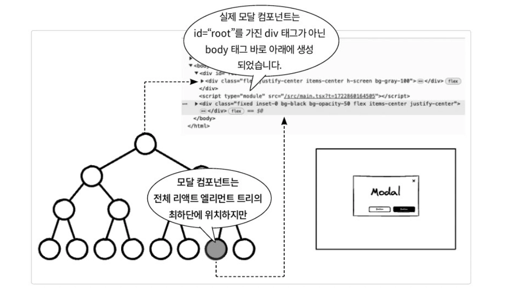

### 리액트 필수 훅을 돌아봐야 하는 이유

각 훅의 정확한 이해와 올바른 활용은 코드의 가독성, 유지보수성, 그리고 성능 최적화에 직접적인 영향을 미침

리액트의 필수 훅에 대한 완벽한 이해는 코드를 더욱 견고하고 효율적으로 만들어줌

</br>
</br>

### useState(): 리액트 상태 관리의 시작과 핵심

#### 상태 초기화와 지연 초기화

`useState()` 는 호출 시 현재 상태값과 그 값을 갱신하는 함수를 배열 형태로 반환함

```jsx
const initialTasks = [ /* 초기 태스크 배열 */ ];
const [tasks, setTasks] = useState(initialTasks);
```

</br>

컴포넌트는 리렌더링될 때마다 내부 코드가 다시 실행되므로, 단순한 값 대신 함수를 전달하는 지연 초기화 기법을 사용할 수 있음

```jsx
const [highScore, setHighScore] = useState(() => {
	const saved = localStorage.getItem('whackHighScore');
	return saved ? parseInt(saved) : 0;
});
```

`useState()` 에 함수를 전달하면, 이 함수는 오직 컴포넌트가 마운트될 때 한 번만 호출되므로 리렌더링 시 불필요한 초기화 비용을 피하고 성능을 최적화할 수 있음

→ `localStorage.getItem()` 과 같은 I/O 작업은 동기적으로 동작하여 메인 스레드를 차단할 수 있음

</br>
</br>

#### 상태 업데이트와 업데이트 함수

리액트는 배치 업데이트때문에 `setState()` 호출 직후에 상태를 읽으면 이전 값을 보게 됨

이러한 동작 방식 때문에, 이전 상태에 의존하여 다음 상태를 계산해야 할 때는 함수형 업데이트를 사용해야 함

```jsx
setTasks(prevTasks => [...prevTasks, task]);
```

첫 번째 인자 `prevTasks` 는 React가 호출할 때 현재 최신 상태를 넣어주는 매개변수임

화살표 함수가 반환한 그 값이 새로운 state가 됨

### useEffect(): 컴포넌트를 외부 세계와 동기화하기

리액트 컴포넌트의 주된 임무는 UI를 렌더링하는 것이지만, 실제 애플리케이션은 렌더링 외에도 수많은 작업을 필요로 함

서버에서 데이터 가져오기, 브라우저 이벤트 리스너 설정 등 이러한 부수 효과들을 `useEffect()` 가 컴포넌트 내부에서 하게 해줌

</br>
</br>

#### useEffect() 사용법과 의존성 배열 돌아보기

`useEffect()` 의 기본 형태는 첫 번째 인자로 실행할 함수를, 두 번째 인자로 의존성 배열을 받음

이때, 의존성 배열을 어떻게 제공하는지에 따라 `useEffect()` 의 동작이 달라지므로, 세 가지 핵심 패턴을 정확히 이해하는 것이 중요함

</br>

다음은 의존성 배열을 생략했을때임

```jsx
useEffect(() => {
	// 컴포넌트가 렌더링될 때마다 이 코드가 실행됨
});
```

의존성 배열 생략시 상태를 업데이트할 경우 무한 루프를 유발할 수 있어 항상 의존성 배열을 명시하는 것이 좋음

</br>

다음은 의존성 배열을 비웠을때임

```jsx
useEffect(() => {
	// 컴포넌트가 처음 마운트될 때 한 번만 실행
	return () => {
		// 컴포넌트가 언마운트될 때 한 번만 실행
	};
}, []);
```

빈 배열을 전달하면, 콜백 함수는 컴포넌트가 처음 화면에 마운트될 때 단 한 번만 실행됨

</br>

다음은 의존성 배열에 특정 값을 추가했을때임

```jsx
useEffect(() => {
	fetchData(userId);
}, [userId]);
```

특정 값을 넣으면, 마운트 시 한 번 실행되고, 이후 배열 안의 값이 변경될 때마다 다시 실행됨

</br>

하지만 다음 코드처럼 외부 스코프를 사용하게 되면 성능 저하를 유발할 수 있음

```jsx
function useEscapeKey(onClose: () => void) {
	useEffect(() => {
		const handleKeyDown = (e: KeyboardEvent) => {
			if (e.key === 'Escape') {
				onClose();
			}
		};
		
		document.addEvetListener('keydown', handleKeyDown);
		
		return () => {
			document.removeEventListener('keydown', handleKeyDown);
		};
	}, [onClose]);
}
```

부모 컴포넌트가 리렌더링될 때마다 onClose() 함수는 새로운 참조값으로 재생성될 수있음

하지만 `onClose()` 의 로직이 변하지 않았음에도 불필요하게 이벤트 리스너를 제거하고 다시 등록하게 되어 성능 저하를 유발할 수 있음

→ `useCallback()` 훅을 사용해 메모이제이션하여 해결할 수 있음

</br>
</br>

#### 부수 효과의 뒷정리: useEffect()의 클린업 함수

클린업 함수는 `useEffect()` 내부에서 외부 자원을 사용하거나 구독을 설정했을 때 이를 정리하는 용도로 사용됨

콜백 함수 내에서 또 다른 함수를 반환하여 사용할 수 있음

```jsx
useEffect(() => {
	let timerId: number | undefined;
	
	if (state.isGameRunning) {
		timerId = window.setInterval(() => {
			dispatch({ type: 'DECREMENT_TIME' });
		}, 1000);
	}
	
	return () => {
		if (timerId) {
			window.clearInterval(timerId);
		}
	};
}, [state.isGameRunning]);
```

`isGameRunning` 이 `true` → `false` 로 변경되면 `useEffect()` 가 다시 실행되어 클린업 함수가 먼저 호출되어 이전에 설정된 타이머가 즉시 정지됨

→ `isGameRunning` 이 `false` 이므로 새로운 `setInterval()` 은 호출되지 않음

</br>
</br>

#### 부수 효과 다루기: 외부 시스템과 동기화

리액트 컴포넌트는 순수하게 작성되어야 하기 때문에 데이터 가져오기나 수동 DOM 조작, 웹소켓과 같은 구독 작업은 `useEffect()` 내부에서 수행해야 함

`useEffect()` 는 기본적으로 비동기로 동작하며 브라우저 화면 업데이트를 막지 않기 위해 백그라운드에서 실행됨

```jsx
useEffect(() => {
	let ignore = false;
	
	async function fetchData() {
		const data = await fetchScoreBoard();
		if (!ignore) {
			setScores(data);
		}
	}

  fetchData();
  
  return () => {
	  ignore = true;
	};
}, []);
```

다음 코드의 시나리오는 2가지로 볼 수 있음

- **언마운트 상황이 없는 경우**
    - 마운트시 `fetchData()` 호출
    - 응답 도착, `ignore` 가 `false` 이기 때문에 `setScores(data)` 실행
- **응답이 오기 전에 언마운트되는 경우**
    - 마운트시 `fetchData()` 호출
    - 응답 오기전, 언마운트시 `cleanup` 함수가 실행되어 `ignore` 가 `true` 로 바뀜
    - 응답 도착, `ignore` 가 `true` 이기 때문에 `setScores(data)` 실행하지 않음

</br>

여기서 `ignore` 플래그의 역할은 다음과 같음

- **언마운트된 컴포넌트의 상태 업데이트 방지**
    - 위의 상황을 통해 알 수 있음
- **경쟁 상태 방지**
    - 의존성 배열에 특정 ID 값이 있고, 이 값이 짧은 시간 내에 자주 바뀌는 경우 여러 API 요청이 동시에 발생할 수 있음
    - 이때 나중에 요청한 응답보다 먼저 도착한 이전 응답이 상태를 덮어쓰는 문제가 생길 수 있음
    - `ignore` 플래그를 톨해 요청의 결과는 무시되도록 하여 경쟁 상태를 방지할 수 있음

</br>

또 다른 흔한 부수 효과는 리액트의 상태를 브라우저의 `localStorage` 와 같은 외부 스토리지와 동기화하는 것임

```jsx
useEffect(() => {
	localStorage.setItem('whackHighScore', state.highScore.toString());
}, [state.highScore]);
```

렌더링 → useEffect() 실행 → 상태 업데이트 → 리렌더링의 흐름을 이해하고, 의존성 배열과 클린업 함수를 올바르게 사용하면 예측 가능하고 안정적인 컴포넌트를 만들 수 있음

</br>
</br>

#### 엄격 모드에서의 useEffect()

리액트 18버전부터는 개발 모드에서 `<StrictMode>` 를 사용하면, 두 번 렌더링하여 부수 효과 코드가 얼마나 견고한지를 테스트할 수 있음

```jsx
import { StrictMode } from "react";
import { createRoot } from 'react-dom/client'

ReactDOM.createRoot(document.getElementById('root')!).render(
	<StrictMode>
		<App />
	</StrictMode>,
)
```

</br>
</br>

### useRef(): 렌더링을 넘어 값을 기억하는 법

함수형 컴포넌트는 렌더링될 때마다 내부의 변수가 초기화됨

하지만 떄로는 렌더링과 관계없이 특정 값을 컴포넌트의 전체 생명주기에 걸쳐 유지하고 싶을 때가 있음

이때, `useRef()` 를 사용함

</br>
</br>

#### 리렌더링을 발생시키지 않는 useRef()

다음은 `useRef()` 의 기본 문법임

```jsx
const refContainer = useRef(initialValue);
```

`initialValue` 는 `ref.current` 프로퍼티에 할당될 초깃값임

이 값은 초기 렌더링시에만 한 번 사용됨

`useRef()` 는 항상 `{current: initialValue}` 형태의 일반 자바스크립트 객체를 반환함

</br>

`ref.current` 프로퍼티를 변경해도 리액트가 리렌더링을 트리거하지 않음

이 성질 때문에 다음과 같은 상황에서 매우 유용함

- **렌더링과 무관한 값 저장**
    - UI에 직접 표시되지는 않지만, 컴포넌트 생명주기 내에서 계속 유지되어야 하는 값을 저장할 때
- `useEffect()` **클로저의 한계 극복**
    - 이벤트 핸들러나 비동기 콜백에서 최신 상태를 참조해야 할 때
    - 의존성 배열에 상태를 추가하여 이팩트를 불필요하게 재실행하는 것을 피하고 싶을 때

</br>

다음 예제 코드는 두 개의 `useEffect()` 를 사용하여 관심사를 명확히 분리하고 있음

```jsx
const [count, setCount] = useState<number>(0);
const latestCountRef = useRef<number>(count);

useEffect(() => {
	latestCountRef.current = count;
}, [count]);

useEffect(() => {
	const handleDocumentClick = () => {
		console.log(`클릭 시점의 count: ${latestCountRef.currnet}`);
	};
	
	document.addEventListener('click', handleDocumentClick);
	
	return () => {
		document.removeEventListener('click', handleDocumentClick);
	};
}, []);

const handleIncrement = () => {
	setCount(c => c + 1);
};
```

- **첫 번째** `useEffect()`
    - `count` 가 변경될 때마다 `latestCountRef.current` 값을 최신으로 유지
- **두 번째** `useEffect()`
    - 항상 동일한 `latestCountRef` 객체를 참조하므로 안정적임
    - 만약 `count` 를 직접 참조했다면, 의존성 배열에 `count` 를 추가해야함

즉, 첫 번째 `useEffect` 에서 `.current` 값은 항상 최신으로 유지되고 두 번째 `useEffect` 에서 해당 객체를 참조하는, 두 관심사를 분리하는 다리 역할을 함

</br>
</br>

#### useRef()를 사용한 DOM 요소 직접 접근

리액트에서 때로는 특정 DOM 노드에 직접 접근하여 메서드를 호출해야만 하는 상황이 있음

- 입력 필드에 자동으로 포커스 맞추기
- 스크롤 위치 제어하기
- DOM 요소의 크기나 위치 측정하기
- 리액트로 관리되지 않는 서드파티 DOM 라이브러리 연동하기

이처럼 리액트의 선언적 방식을 벗어나 DOM에 직접 명령을 내려야할 때, `useRef()` 는 실제 DOM을 잇는 다리 역할을 함

</br>

다음은 DOM 요소에 접근하는 예시 코드임

```jsx
function SearchInput() {
	const inputRef = useRef<HTMLInputElement>(null);
	
	useEffect(() => {
		inputRef.current?.focus();
	}, []);
	
	return <input ref={inputRef} type="text" placeholder="검색어 입력" />;
}
```

렌더링 과정 중에는 `ref.current` 가 아직 `null` 일 수 있기에 DOM 요소에 접근하는 로직은 반드시 `useEffet()` 내부에서 수행되어야 함

</br>
</br>

#### forwardRef(): 부모가 자식의 DOM에 접근하는 방법

`ref` 는 `key` 와 마찬가지로 리액트에서 특별하게 다루어지는 속성임

리액트 18버전까지는 일반적인 프롭스처럼 `ref` 를 컴포넌트에 직접 전달할 수 없었음

→ `forwardRef()` 를 통해 해결

훅은 아니지만, `useRef()` 와 함께 사용되어 부모 컴포넌트로부터 전달된 `ref` 를 받아 자식의 특정 JSX 요소에 연결해주는 매우 중요한 함수임

</br>

```jsx
const MyInput = forwardRef<HTMLInputElement, { label: string }>((props, ref) => {
	return (
		<div>
			<label>{props.label}</label>
			<input ref={ref} type="text" />
		</div>
	);
}):
```

컴포넌트 정의를 위해 `forwardRef()` 로 컴포넌트를 감싸면, 함수는 프롭스와  함께 두 번째 인자로 `ref` 를 받게 됨

</br>

다음은 좀 더 복잡합 상황에서의 코드임

GameBoard → Hole → Mole 순으로 중첩되는 구조임

```jsx
const GameBoard: React.FC<GameBoardProps> = ({ /* ... */ }) => {
	const moleRefs = useRef<(HTMLDivElement | null)[]>([]);
	
	return (
		<div className="grid ...">
			{Array.from({ length: 9 }).map((_, index) => (
				<Hole
					key={index}
					ref={(el) => (moleRefs.current[index] = el)}
					// ... other props
				/>
			))}
		</div>
	);
};
```

</br>

다음은 `ref` 를 프롭스로 전달받는 `Hole` 컴포넌트임

`forwardRef()` 를 통해 `ref` 를 받고, 그 `ref` 를 다시 자식인 `Mole` 컴포넌트로 그대로 전달함

```jsx
const Hole = forwardRef<HTMLDivElement, HoleProps>(({ isActive, ... }, ref) => {
	return (
		<div className="hole-container">
			<Mole ref={ref} isVisible={isActive} /* ... */ />
		</div>
	);
});
```

</br>

다음은 마지막으로 `ref` 를 프롭스로 전달받는 `Mole` 컴포넌트임

```jsx
const Mole = forwardRef<HTMLDivElement, MoleProps>(({ isVisible, ... }, ref) => {
	return (
		<>
			{isVisible && (
				<div ref={ref} className="mole">
					{/* ... */}
				</div>
			)}
		</>
	);
});
```

리액트 18버전까지 컴포넌트 간에 `ref` 를 전달하기 위해서는 `forwardRef()` 가 필수적이었음

</br>
</br>

#### 리액트 19버전에서의 forwardRef()

리액트 19버전부터는 `forwardRef()` 없이도 다른 프롭스와 마찬가지로 `ref` 프롭스를 전달할 수 있게 되었음

```jsx
const React19RefComponent = ({ ref, ...props }) => {
	return <div ref={ref}>React 19 Ref Component</div>;
};

const ParentComponent = () => {
	const myRef = useRef<HTMLDivElement | null>(null);
	return <React19RefComponent ref={myRef} />;
};
```

</br>
</br>

### useReducer()와 리액트 포탈

`useReducer()` 는 `useState()` 의 대체 훅으로, 복잡한 상태 로직을 관리하거나 상태 업데이트를 분기 로직을 통해 추상화할 때 유용함

`createPortal()` 은 컴포넌트 트리 외부에 UI를 렌더링해 모달을 구현하는 데 편리함

</br>
</br>

#### useReducer() 알아보기

`useReducer()` 는 리덕스와 유사한 패턴으로, 상태와 액션을 받아 새로운 상태를 반환하는 `reducer` 함수를 사용하며, 훅 호출 시 `[state, dispatch]` 튜플을 반환함

`reducer` 는 현재의 상태값과 상태를 업데이트하는 데 필요한 액션 객체를 인수로 받아 새로운 상태 객체를 반환하는 순수 함수임

</br>

다음은 `useReducer()` 의 기본 문법임

```jsx
const [state, dispatch] = React.useReducer(
	reducer,
	initialArg,
	init?
);
```

- `dispatch`
    - 액션 객체를 인자로 전달받음
    - `dispatch()` 가 호출되면 현재 상태와, 전달된 액션을 매개 변수로 하는 `reducer` 함수를 실행
    - 새로운 상태를 계산하고 리렌더링을 유발
- `reducer`
    - `(state, action) ⇒ newState`
    - 상태 변경 로직을 담은 함수
- `initialArg`
    - 초기 상태를 생성하는 데 사용될 인자
- `init`
    - 선택 사항인 초기 상태를 반환하는 함수

</br>

다음은 액션과 리듀서 함수의 관계에 대한 예제 코드임

```jsx
type CountAction =
	| { type: 'increment'; payload?: number }
	| { type: 'decrement'; payload?: number }
	| { type: 'reset' };

const countReducer = (state: CountState, action: CountAciton): CountState => {
	switch (action.type) {
		case 'increment':
			return { count: state.count + (action.payload || 1) };
		case 'decrement':
			return { count: state.count - (action.payload || 1) };
		default:
			throw new Error('Unhandled action type');
	}
};

const init = (initialState: CountState): CountState => {
	return { count: initialState.count };
};

cosnt [state, dispatch] = React.useReducer(countReducer, { count: 0 }, init)

dispatch({ type: "increment"});
```

이 패턴의 장점은 상태 변경 로직이 컴포넌트 렌더링을 담당하는 JSX 코드와 분리되어 깔끔하게 관리됨

</br>
</br>

#### createPortal()로 모달 컴포넌트 만들기

리액트 포탈은 부모 컴포넌트의 DOM 계층 구조 바깥에 있는 다른 DOM 노드에 자식 컴포넌트를 렌더링할 수 있게 해주는 기능임

기본 문법은 다음과 같음

```jsx
import { createPortal } from 'react-dom';

createPortal(
	child,
	container,
	key?
)
```

- `child`
    - 렌더링하고 싶은 모든 리액트 엘리먼트
- `container`
    - `child` 를 렌더링할 실제 DOM 노드
    - 직접 DOM 요소를 선택하여 전달해야함
- `key`
    - 선택 사항으로 포탈에 부여할 수 있는 고유한 키 문자열 또는 숫자

</br>

가장 중요한 특징은 DOM 트리상의 위치와 리액트 컴포넌트 트리상의 위치가 분리된다는 점임



리액트 포탈은 리액트 컴포넌트 계층은 그대로 유지하면서, 렌더링 결과물만 최상위 DOM 노드로 렌더링시킴

</br>

다음은 리액트 포탈로 구현한 예시 코드임

```jsx
return ReactDOM.createPortal(
	<div className="modal-overlay">
		<div className="modal-content">
			<button className="modal-close" onClick={onClose}>X</button>
			{renderGame()}
		</div>
	</div>,
	document.body
);
```

다음 컴포넌트는 어디서 렌더링되는 모달 내용은 body 바로 아래로 삽입되어 CSS 상으로 전역 위치에 놓이게 됨

</br>